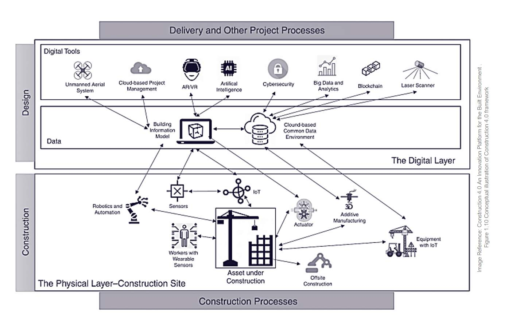
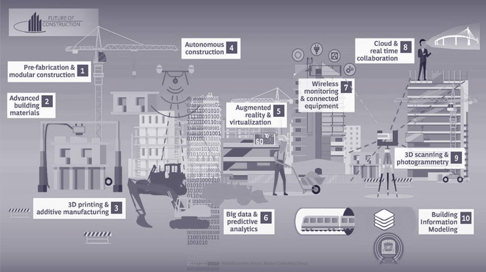
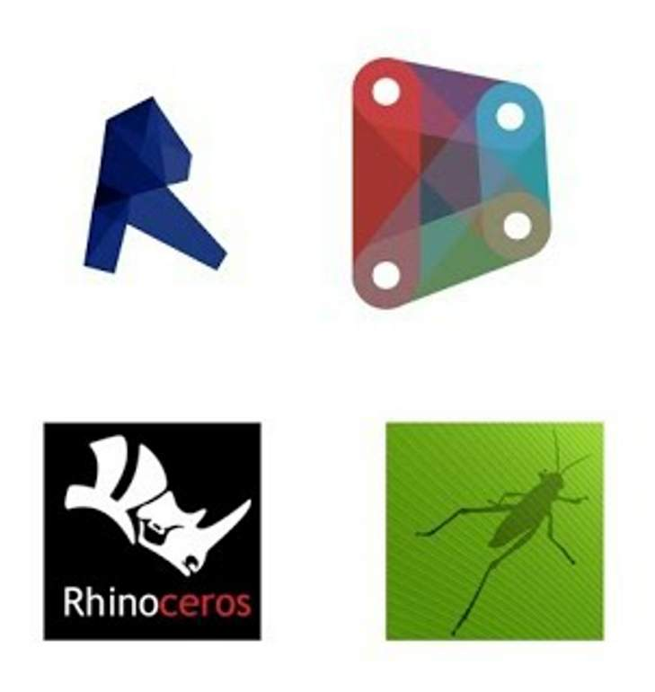
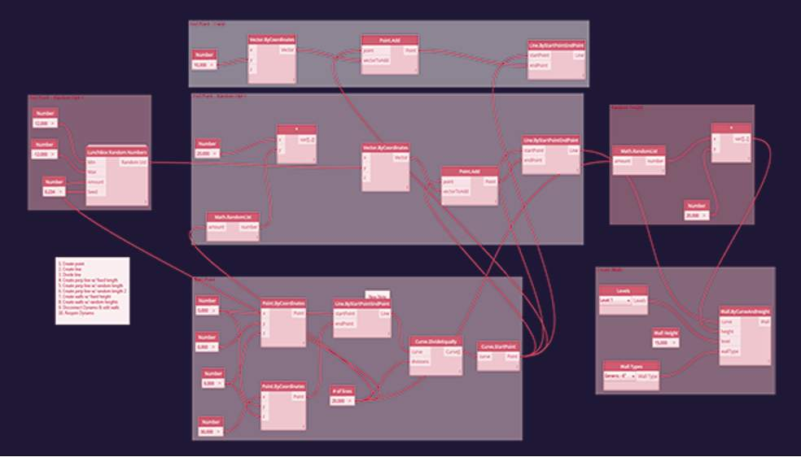
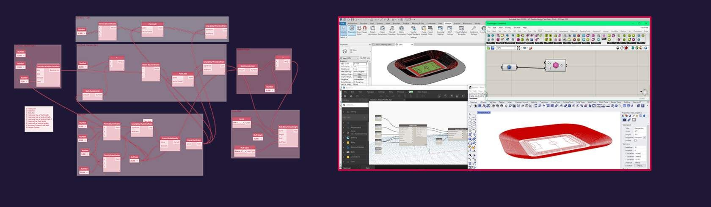

# Construction 4.0

*Lesson 6 of 6*

**Learning Objectives**

> [!warning] Missing audio (00:17)
> No local audio file matched this placeholder (referenced `assets/Xcurvp3vu1eefScA_transcoded-zq6MQ6WWLgiRrNQl-m1s103.mp3`).

*Image Reference: Book -  Construction 4.0 :An Innovation Platform for the Built Environment . 
Figure 1.10 Conceptual illustration of Construction 4.0 framework*

## Construction 4.0

Construction 4.0 is an evolving concept referring to various technologies, systems and industrial production methods, including:

Offsite / prefab manufacture

*Image reference: World Economic Forum, Boston Consulting Group*

> [!note] Audio transcript (00:25)
> The anticipated benefits of Construction 4.0 include saving time and money with improving decision-making and reduced waste, also better time and cost predictability, increased productivity using digital technologies, sustainability gains and targeted carbon emissions, improved safety and reduced risks through automated processes and use of VR, MR, etc., improving collaboration and communication.
>
> Source: [Construction 4.0 - BIM ISO 19650 12 Project Delivery Unit 1 - Ca (3).mp3](assets/Construction 4.0 - BIM ISO 19650 12 Project Delivery Unit 1 - Ca (3).mp3)

## Data

The importance and the management of data will be crucial., along with the tools or processes that tie into that data such as:

Big Data

Many people predict that the value of Data will be extremely high in the future as we become more connected as an industry, and the world generally.

> [!note] Audio transcript (00:46)
> We have artificial intelligence, machine learning and blockchain which are interrelated technologies. Machine learning is part of an artificial intelligence and is merely computers using algorithms to learn from data by themselves and AI then tries to mimic human intelligence. In combination these can be used to look at works programming, analysing safety on site and analysing sensor data collected in buildings. Blockchain is a wide-ranging database technology which can be used for many applications from CDE solutions to contract payment methods, alternative funding for social housing and even automated construction contracts. This is where structured data becomes very important because structured data is much more usable by machines to facilitate these technologies.
>
> Source: [Construction 4.0 - BIM ISO 19650 12 Project Delivery Unit 1 - Ca (1).mp3](assets/Construction 4.0 - BIM ISO 19650 12 Project Delivery Unit 1 - Ca (1).mp3)

> **Activity: Stop and consider for 5 minutes **what the future use of Data could be or could mean for your specific industry.

## Computational Design

> [!warning] Missing audio (00:00)
> No local audio file matched this placeholder (referenced `assets/UHgYSArbegIuMYo__transcoded-Y9A-VA4ZlmKgl0QE-m1s110.mp3`).

## Algorithm Aided Design 

> [!note] Audio transcript (00:40)
> See here how visual code and nodes are stringed together to perform algorithmic tasks much more efficiently than what you can undertake manually. These processes are fantastic for undertaking time-consuming tasks on the low end of the spectrum and geometrically complex structures on the higher end of the use spectrum. Revit users will understand that time-consuming tasks such as renaming all doors and windows or changing view names to upper-slash-lower case, for example, may take days on a large multi-story project. The type of tasks are completed within seconds using the algorithmic code that resides within the API of software such as Revit combined with Dynamo.
>
> Source: [Construction 4.0 - BIM ISO 19650 12 Project Delivery Unit 1 - Ca (4).mp3](assets/Construction 4.0 - BIM ISO 19650 12 Project Delivery Unit 1 - Ca (4).mp3)

> [!warning] Missing audio (00:22)
> No local audio file matched this placeholder (referenced `assets/A9oQEyJGcOUh0hbi_transcoded-SJm1VwI4mVD77-oo-m1s112.mp3`).

## Robotics

1 2 3

> [!note] Audio transcript (00:54)
> We also have robotics. There are already predictions on how this will affect people in the US. Nearly half of construction jobs could be replaced by robots by 2057, say researchers at the University of Illinois at Urbana-Champaign and Midwest Economic Policy Institute. Cobotics or collaborative robotics are robots that collaborate with humans in activities. Here we can see 3D printing robots working collaboratively, or in the same space which usually 3D printers cannot. Another example is tie-bot, a concrete reinforcement bar tying robot. This type of innovation is very valuable, particularly if we consider health and safety. With the tragic example of four men being killed working in a reinforcement bar cage in 2011 in Great Yarmouth in England. Automated bricklaying, which although doesn't replace the bricklayer, it helps with repetitive and strenuous nature of laying the bricks, ties and mortar.
>
> Source: [Construction 4.0 - BIM ISO 19650 12 Project Delivery Unit 1 - Ca (5).mp3](assets/Construction 4.0 - BIM ISO 19650 12 Project Delivery Unit 1 - Ca (5).mp3)

A Year with Spot

## VR XR AR 

New virtual reality tools will allow architects and designers to create buildings and products intuitively in 3D space around them, according to the director of visualisation studio VRtisan.

The technology, which couples VR software created for game designers with hand-held motion controllers, offers designers "a completely new tool,“

VRtisan has created a video demonstrating the design process, which shows an architect using VR game-developer software Unreal Engine in combination with the HTC Vive headset and motion controllers.

The movie shows the designer wearing a VR headset and using the hand-held controllers as an input device for Unreal Engine, allowing you to create walls, doors and furniture around him in 3D space.

Video below courtesy of Dezeen

Virtual Reality for Architects

"This is an example of  Revit model I produced, and live linked into Twinmotion, which can used with VR headsets for greater design engagement.

Better stakeholder engagement through models and virtual reality applications can deliver insights about complex builds and help to better understand the intent, reducing rework and delays. " - **Mike Tofton**

## Digital Twins

> [!warning] Missing audio (00:20)
> No local audio file matched this placeholder (referenced `assets/L7ydQN9zDSXDWdG1_transcoded-4f3GSd47E3Nt95LC-m1s118.mp3`).

The digital twin is the digital replica of the built thing where data from the real world is transmitted to the digital version.

At the BRE we are extensively researching and trialing these technologies. The building that you can see is a real building, at the entrance to our campus.

> [!note] Audio transcript (00:30)
> This digital twin is basically a smart home laboratory and has such things as connectivity, energy, lighting, air quality, smart metering, cybersecurity. It has two main uses, firstly as a backup of the physical asset and secondly for monitoring and diagnostics of the physical asset. This is where the data can be used with AI and machine learning to address things like more efficient maintenance and operation. Here you can see the real benefit that has been used from a completed BIM model of a physical building.
>
> Source: [Construction 4.0 - BIM ISO 19650 12 Project Delivery Unit 1 - Ca.mp3](assets/Construction 4.0 - BIM ISO 19650 12 Project Delivery Unit 1 - Ca.mp3)

##  Digital Twins in Transport Systems

Infrastructure and transport systems are also becoming increasingly involved in the digital twin concept.

Highways England plans digital twin of roads network as part of a new Digital Roads strategy. Drawings and static models will replaced with digital versions that use live data to predict maintenance issues, such as potholes.

> [!note] Audio transcript (01:27)
> And it does not just stop at buildings, we have several labelled smart cities around the world such as Songdo, Mazdar, Amsterdam, San Francisco, Brisbane and Singapore. Digital twin technology helps city planners understand and improve the efficiency of energy consumption as well as many applications that can improve life for its citizens. Infrastructure and transport systems are also becoming increasingly involved in the digital twin concept. For example, in the UK, Highways England plans digital twin of roads network as part of the new digital roads strategy. Building digital twins of road infrastructure has the potential to greatly assist asset management operations as well as enable new construction projects to be more efficient than ever before and even enable more sophisticated traffic modelling, saving time and money and lowering emissions across entire road networks. The digital twins will see drawings and static models replaced with digital versions that can predict maintenance issues such as potholes. The idea is to join all of the digital twins together as the data builds up to create one mega single source of data. We should strive to replace drawings and static 3D models with dynamic and data-rich digital twins, PDF documents with databases, file exchange with cloud permissions exchange, passive materials with smart materials able to sense and heal themselves and automate all manual routine maintenance, said Iwanis Brilakis from the University of Cambridge who is part of the implementation team.
>
> Source: [Construction 4.0 - BIM ISO 19650 12 Project Delivery Unit 1 - Ca (2).mp3](assets/Construction 4.0 - BIM ISO 19650 12 Project Delivery Unit 1 - Ca (2).mp3)

##  Digital Twins & IOT Data

## Digital Twins

Temperature

> [!warning] Missing audio (00:15)
> No local audio file matched this placeholder (referenced `assets/6D2ozp6ClrusKUCu_transcoded-2myj9J1HnCxOgDMp-m1s120.mp3`).

Here is a video demonstrating all of this data being displayed. Note: This video has no audio and is just for illustration purposes.

## Learning Summary

Lesson complete! You are now able to:

- Outline an overview of the future of digital innovation

**Unit 1 complete! **You are now able to:

- Define the term BIM and considering how it is used.
- Identify the drivers that have led to BIM
- Help you to Understand the value of a whole life approach rather than capital-led.
- Understand the historical changes In the construction industry that led to BIM standards and mandates.
- Highlight some of the negative effects caused.
- Summarize some of the events or reports that have driven change in our industryand understand what change they initiated
- Outline an overview of the future of digital innovation
End of Module

Close this pop-up window to go back to the course

---
*Extracted from `Construction 4.0 - BIM ISO 19650 1&2 Project Delivery_ Unit 1 - Catalyst for Change.html` via webpage-content-extractor.*
