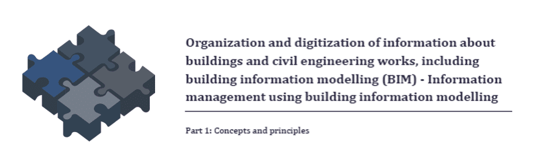
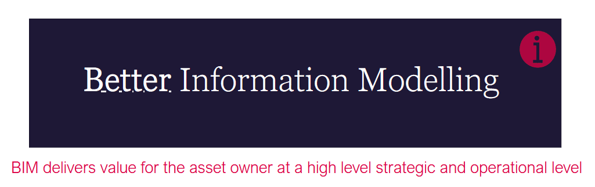
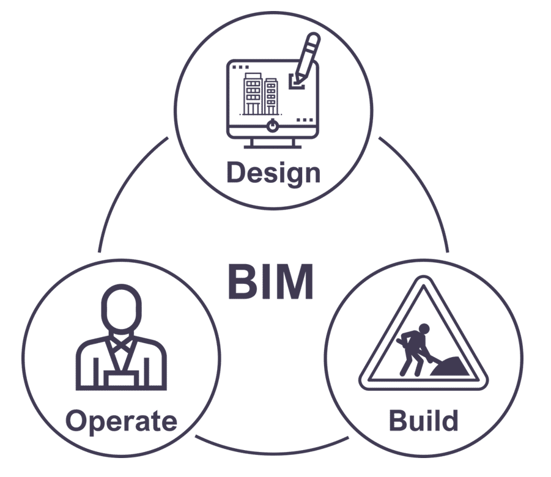
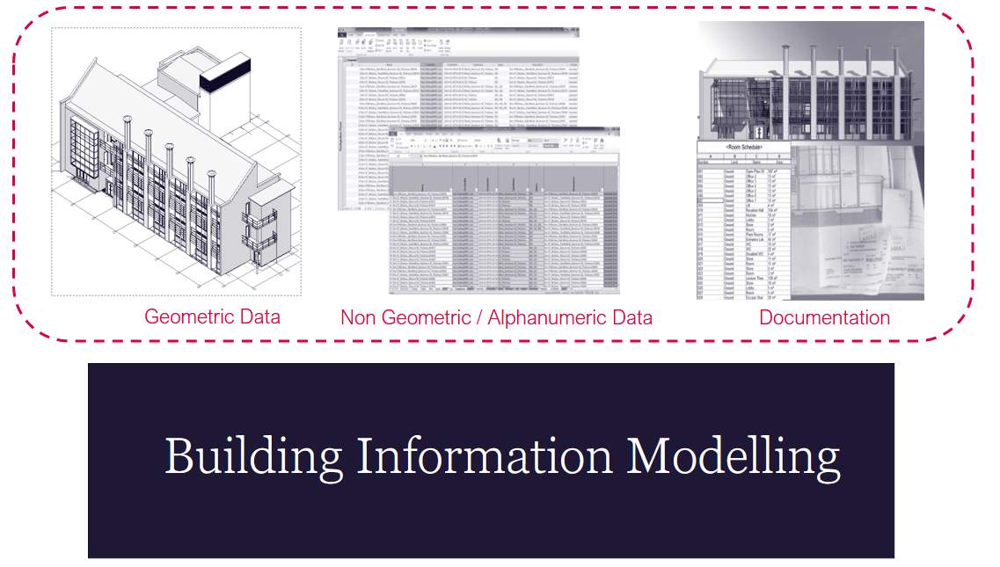
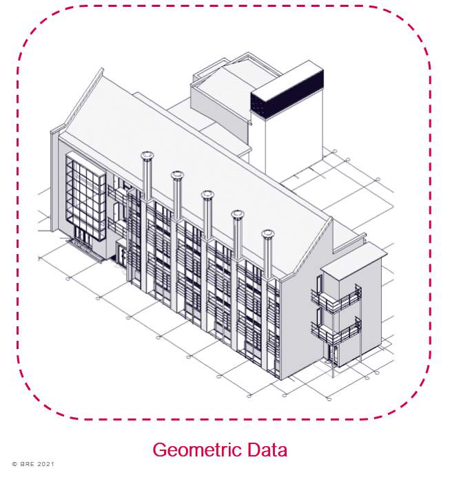
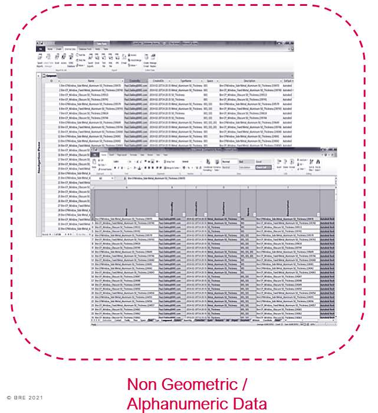
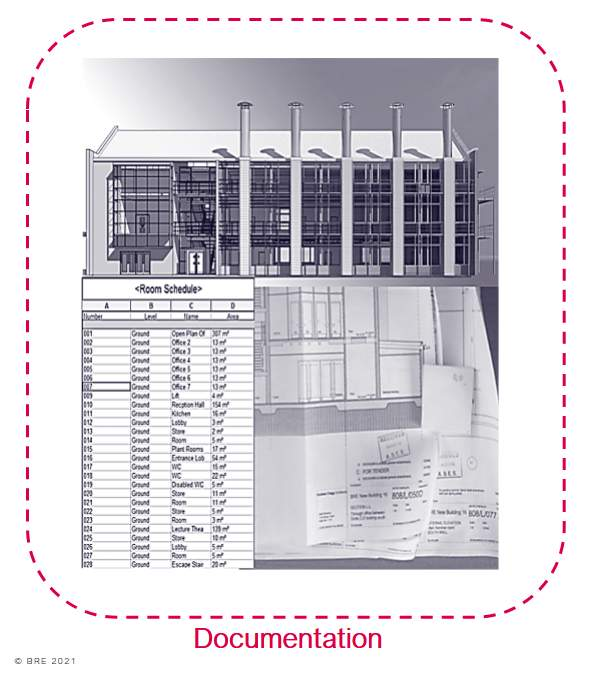
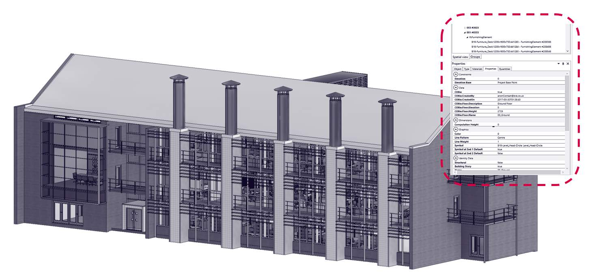

# Lesson 1 - BIM Defined

*Lesson 1 of 6*

> BIM is a combination of process, standards and technology through which it is possible to generate, visualise, exchange, assure and subsequently use and re-use information, including data, to form a trustworthy foundation for decision-making to the benefit of all those involved in any part of an asset’s lifecycle. This includes inception, capital phase procurement and delivery, asset and facility management, maintenance, refurbishment, and ultimately an asset’s disposal or re-use.

## Lesson Objectives

In this lesson we aim to:

Define the term BIM and considering how it is used.

## Building Information Modeling

BIM is essentially value creating collaboration through the entire life-cycle of an asset, underpinned by the creation, collation and exchange of shared 3D models and intelligent, structured data attached to them.

> [!note] Audio transcript (00:33)
> BIM is bringing about change in the global construction industry. To understand why, there is a need to have a common understanding of the key drivers, case studies and projects that have led to this point, and ensure future adoption. This unit will provide an understanding of the past, current and future drivers, plus key developments that have led to the adoption of BIM globally. It will also provide the context by identifying the effects of poor information management and the advantages that good information management can provide to a project.
>
> Source: [Lesson 1 - BIM Defined - BIM ISO 19650 12 Project Delivery Unit (2).mp3](assets/Lesson 1 - BIM Defined - BIM ISO 19650 12 Project Delivery Unit (2).mp3)

> [!warning] Missing audio (00:23)
> No local audio file matched this placeholder (referenced `assets/Z3IrLzK3HJq3iCux_transcoded-B83gpNy-KArQFr7y-m1s2.mp3`).

### Flashcards

**People**

- Defined Responsibilities
- Competency
- Software Skills
- Experience
**Process**

- Resource Management
- Standard Implementation
- Quality Assurance
**Policy**

- Standards
- Risks and insurance
- Procurement
- Legal & Contractual
**Technology**

- Hardware
- Software
- CDE

## We should also consider Data:

### Flashcards

**Data**

- Asset Data
- Operational Data
- Data Security
- Exchange Methods

## People - Process – Policy - Technology

> [!note] Audio transcript (00:41)
> As the ISO-19650 series relates to information management using building information modelling, a more appropriate meaning for the BIM acronym may be better information management. BIM delivers value for the asset owner at a high level strategic and operational level. Introducing processes as defined in ISO-19650 can help organisational implementation and introduce best practices generally. BIM Technologies harness the power of capturing and managing data related to assets and many now offer automation such as notification when a maintainable asset needs servicing for example.
>
> Source: [Lesson 1 - BIM Defined - BIM ISO 19650 12 Project Delivery Unit (3).mp3](assets/Lesson 1 - BIM Defined - BIM ISO 19650 12 Project Delivery Unit (3).mp3)

> [!note] Audio transcript (00:34)
> BIM brings real-time collaboration and efficiency to how we build. BIM allows creation of accurate virtual models of a building so construction professionals can simulate a multitude of parameters, such as calculating the thermal efficiency or carbon footprint of a building during conceptual stage, or mitigate risk by predicting possible errors or clashes of construction elements before construction starts. The story doesn't stop there. BIM can extend to the building's entire life cycle from maintenance after building completion all the way to eventual dismantling and demolition.
>
> Source: [Lesson 1 - BIM Defined - BIM ISO 19650 12 Project Delivery Unit.mp3](assets/Lesson 1 - BIM Defined - BIM ISO 19650 12 Project Delivery Unit.mp3)

> [!note] Audio transcript (00:40)
> The information model is referred to in ISO 9650. The thing that is produced is not a single item. The information model as it is known is a collection of different types of project outputs. It includes geometric models such as 2D CAD drawings, 3D models and survey data. Non-geometric or alphanumeric data such as schedules, databases and spreadsheets and documentation such as drawing specifications and visualizations. Note during the design and construction phases the information model is often referred to as the project information model PIM and during the operation and maintenance phase it is known as the asset information model AIM.
>
> Source: [Lesson 1 - BIM Defined - BIM ISO 19650 12 Project Delivery Unit (1).mp3](assets/Lesson 1 - BIM Defined - BIM ISO 19650 12 Project Delivery Unit (1).mp3)

### Geometric Data

Geometric data relates to information expressed using shape, size, dimension, detail,  location, appearance and parametric behaviour.

Objects in the model act as a container for meta-data, as well as being dimensionally accurate in order for performing spatial coordination and clash detection.

IS0 19650 used the term level of information need framework which defines the extent and granularity of information.

The level of detail would describe the Geometric representation of the object  or information model.

### Non Geometric / Alphanumeric Data

Non-Geometric information.

Files which do not include geometry such as databases, spreadsheets, and information from web services which are associated to the Geometric models; and

Non – Geometric, or alphanumeric data is the meta-data associated with an object within a BIM model., expressed via tokens, symbols characters or digits

this defines how much non-Geometric data is required to be provided at different stages of the project.

Non Geometric data can encompass COBie, IFC, Specification and Product data to name a few.

### Documentation

Documentation can be many things such as drawings, specifications, schedules, bills of quantities, product data sheets, warranties, appointments etc.

Documentation should support processes, decisions, approval and verification o information deliverables.

Documents or information containers should be named appropriately in a to a local appendix or project specific standard as defined in ISO 19650.

The Data within these documents will become important with the use and implementation of new technologies.

The most significant problem with static documentation such as PDF files is searching for data. Each document must be found, opened and reviewed.

## BRE BIM Model Example

*See typical examples of our Building 16 PIM.
Within each object is information relating to the assets that can later be used as part of BRE facilities management strategies.*

## Lesson Summary

Lesson complete! You are now able to:

Define the term BIM and considering how it is used.

---

**[CONTINUE]**

---
*Extracted from `Lesson 1 - BIM Defined - BIM ISO 19650 1&2 Project Delivery_ Unit 1 - Catalyst for Change.htm` via webpage-content-extractor.*
