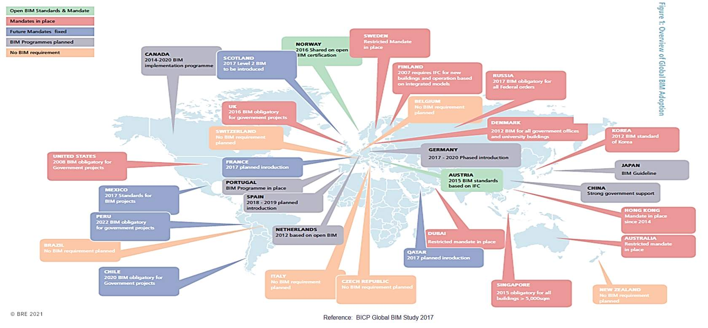
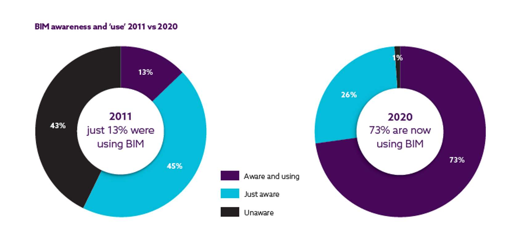
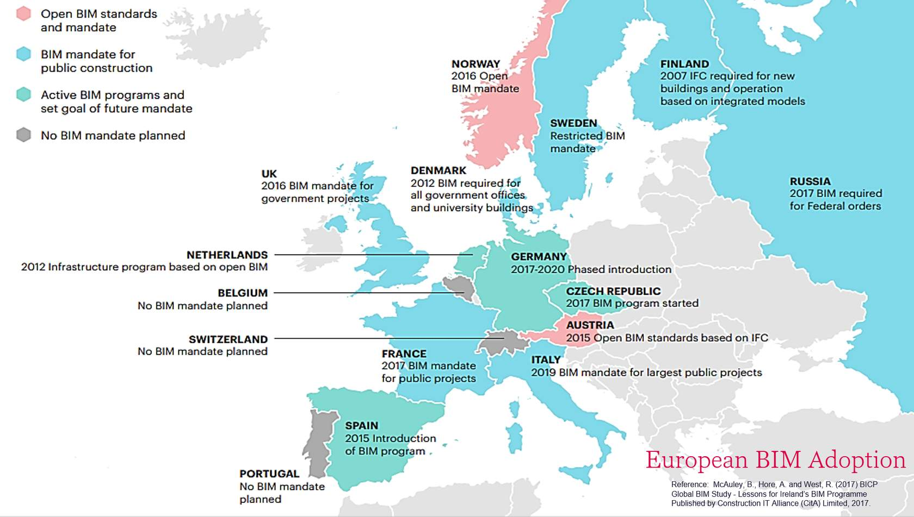
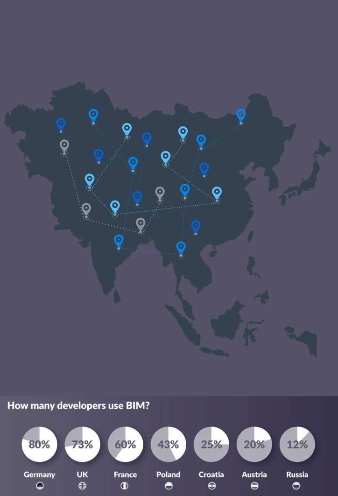
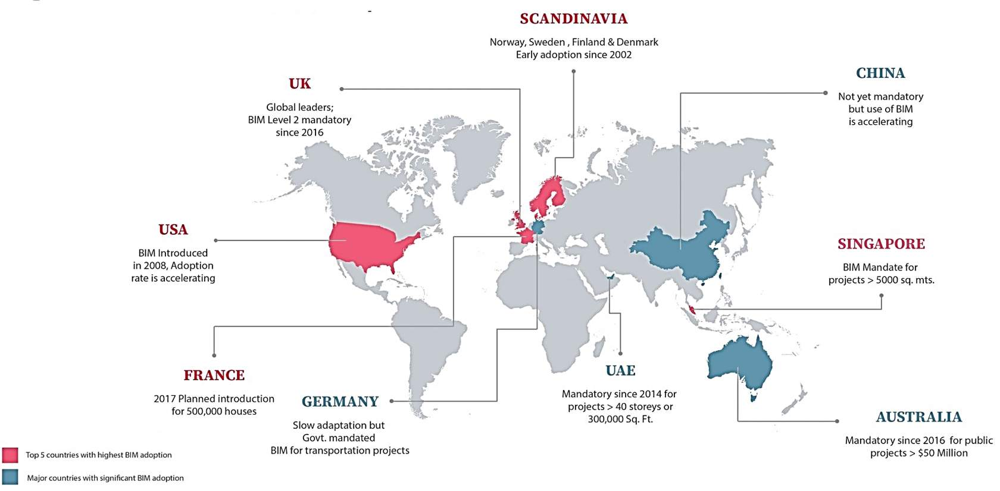

# Lesson 4 - Global BIM Adoption

*Lesson 4 of 4*

**Lesson Objectives**

## Global BIM Adoption

*
Reference:  BICP Global BIM Study 2017*

> [!note] Audio transcript (00:34)
> The adoption of BIM is happening globally but with varying levels of implementation. Everybody is recognising that construction needs to change. Some countries like the UK, Sweden, Dubai and Australia have types of government mandates in place for a top-down implementation. In the US, Russia, Chile, Peru and Singapore, BIM is obligatory for central government projects or projects over a certain size. Others have a lesser mandate such as Australia and many other have more informal programmes and a plan for BIM adoption.
>
> Source: [Lesson 4 - Global BIM Adoption - BIM ISO 19650 12 Project Delive (1).mp3](assets/Lesson 4 - Global BIM Adoption - BIM ISO 19650 12 Project Delive (1).mp3)

## NBS BIM Report

*
Key market insights for BIM awareness and adoption. Information Source: NBS 10th Annual BIM Report 2020‍*

> [!note] Audio transcript (00:36)
> In the 10th Annual BIM Report published by NBS, Richard Waterhouse Chief Strategy Officer, NBS writes that industry has made great strides over the last 10 years. We have gone from limited to almost universal awareness and use of BIM by 73% of professionals in 2020. It has required substantial change to workflows but has brought benefits, improved coordination of information, reduced risk, improved productivity, greater efficiency and operation and maintenance savings. These improvements are helping to create a more efficient, transparent industry that makes fewer mistakes.
>
> Source: [Lesson 4 - Global BIM Adoption - BIM ISO 19650 12 Project Delive.mp3](assets/Lesson 4 - Global BIM Adoption - BIM ISO 19650 12 Project Delive.mp3)

## European BIM Adoption

*See this image showing a map of European BIM Standards And Mandates.
Reference:  McAuley, B., Hore, A. and West, R. (2017) BICP Global BIM Study - Lessons for Ireland’s BIM Programme Published by Construction IT Alliance (CitA) Limited, 2017.
*

*According to research by Plan Radar, the UK, as of 2021, remains the leader in BIM implementation in construction when compared with other European nations.
You can see the percentage of contractors using BIM in the European countries shown here, using the same Plan Radar research.*

- France has a roadmap to digitalize construction and has developed BIM standards for infrastructure project works, with BIM mandated in 2017
- In Scandinavian countries the use of Open BIM standards such as IFC has been common since as early as 2007, with a mandate in Finland stipulating this. Sweden made BIM compulsory for all projects in 2015. Austria and Norway were the first countries to establish open BIM standards and an open BIM mandate.
- BIM has been mandatory for all infrastructure projects since 2020 in Germany, and there has been requirements officially put in place in the Netherlands, Russia, Austria, Spain and Italy.
- Countries, such as Portugal, Switzerland and Belgium have no BIM mandate planned, however this is not an indication of their BIM use.
## Global BIM Adoption

*www.united-bim.com/leading-countries-with-bim-adoption(opens in a new tab)
*

- BIM is not mandated in all states of the USA as of yet, however use is escalating
- The construction authority of Singapore implemented BIM on all the public projects from 2015
- In the UAE BIM is mandatory depending upon the project, if they are 40-stories plus, or 300,00 sq. ft. and larger.
- The adoption rate of BIM in China is generally low, based upon the most recent research.
## Learning Summary 

Lesson complete! You are now able to:

Understand the uptake of BIM globally, based on recent research

**Unit 2 Complete!
**

End of Module

Close this pop-up window to go back to the course

---
*Extracted from `Lesson 4 - Global BIM Adoption - BIM ISO 19650 1&2 Project Delivery_ Unit 2 - BIM Explained.html` via webpage-content-extractor.*
