# Lesson 5 - Making Change Happen

*Lesson 5 of 6*

## Lesson Objectives

At the end of this lesson, you will be able to:

Summarize some of the events or reports that have driven change in our industry

and;

Understand what change they initiated

## AEC Reports

**Notable Reports**

> [!note] Audio transcript (01:14)
> We have discussed the EGAN and Latham reports earlier, but there are also other reports such as Accelerating Change, Never Waste a Good Crisis, Modernize or Die that have happened. Rethinking construction was influential in mapping the efficiency improvements within the construction industry in the UK. The Latham report then identified inefficiencies and made recommendations for enhanced collaboration and coordination in the industry. Hock Farmer's Modernize or Die was released in 2016 and was very influential, and at this time we also had the UK government release the Construction 2025 strategy with a plan to invest £75 million in research and development. Now we have had the Hackett report following the terrible events at the Grenfell Tower disaster. This is having a massive impact on construction with it highlighting the changes that need to happen in the construction in the UK. The impact of this is also spreading globally. Other important reports in our industry include the 1994 Constructing the Team with a target of 30% real cost reduction, 1998 Rethinking Construction, 2002 Accelerating Change, 2009 Never Waste a Good Crisis and annual 10% time and cost reduction.
>
> Source: [Lesson 5 - Making Change Happen - BIM ISO 19650 12 Project Deliv.mp3](assets/Lesson 5 - Making Change Happen - BIM ISO 19650 12 Project Deliv.mp3)

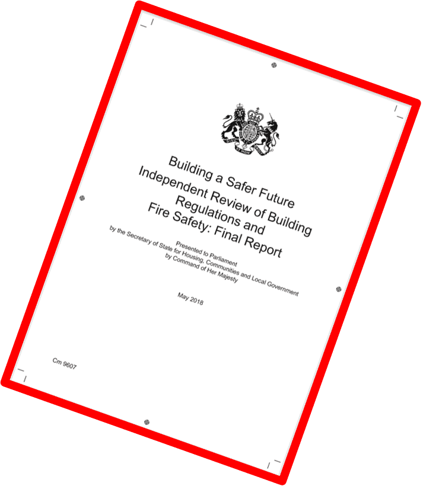

## The Farmer Review 

> In **2016** Mark Farmer produced the **Farmer Review** to highlight the symptoms of poor performanceSee the extract below highlighting the major symptoms.

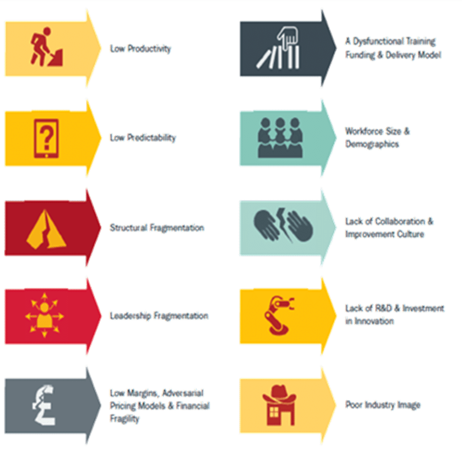

> [!note] Audio transcript (00:32)
> Only recently have we had the Pharma review. Mark Pharma talks a lot about the symptoms of poor performance in the industry, and these symptoms are low productivity, low predictability, strategic fragmentation, leadership fragmentation, a dysfunctional training funding and delivery model, workforce size and demographics, lack of collaboration and improvement culture, lack of R&D and investment in innovation, poor industry image and low margins adversarial pricing models and financial fragility.
>
> Source: [Lesson 5 - Making Change Happen - BIM ISO 19650 12 Project Deliv (1).mp3](assets/Lesson 5 - Making Change Happen - BIM ISO 19650 12 Project Deliv (1).mp3)

1 2 3

> [!warning] Missing audio (00:17)
> No local audio file matched this placeholder (referenced `assets/BqHicvWCHk2H5sDn_transcoded-qzGqyp59O8dzfjiA-m1s85.mp3`).

## Solving Constructions Productivity Puzzle

> In 2018 Plan Grid produced a report looking specifically at solving UK construction’s poor productivity.

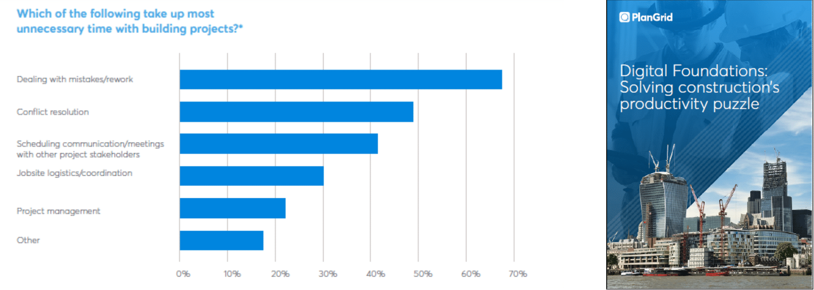

> [!note] Audio transcript (00:39)
> In 2018, PlanGrid produced a report looking specifically at solving UK construction's poor productivity. Again, the same waste-creating problems are still creating significant issues, dealing with mistakes and reworks being the largest, followed by resolving conflicts from the adversarial culture and poor value cost models, followed by poor communication, difficulties in building and on-site coordination problems. These are the things highlighted by the BRE report coordinating working drawings from 1976. The report concluded that adopting digital methodologies such as BIM was the best way to improve industry's performance.
>
> Source: [Lesson 5 - Making Change Happen - BIM ISO 19650 12 Project Deliv (2).mp3](assets/Lesson 5 - Making Change Happen - BIM ISO 19650 12 Project Deliv (2).mp3)

## Construction Disconnected

> Plan Grid also produced a survey in  2018 called Construction Disconnected mainly looking an the Western countries construction industries.The report broke down the time percentage spent performing activities.

> [!warning] Missing audio (00:14)
> No local audio file matched this placeholder (referenced `assets/dh6X85YAe2E31obg_transcoded-69veuiDQ2_jEfFTI-m1s87.mp3`).

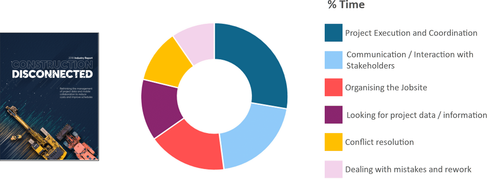

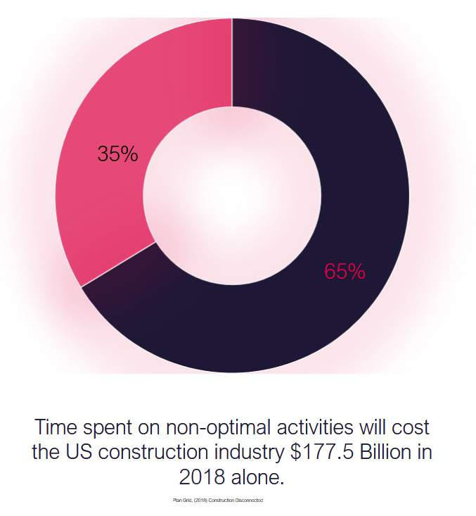

> [!warning] Missing audio (00:16)
> No local audio file matched this placeholder (referenced `assets/dAP4xcseiUaKSr2m_transcoded-baiwNzLzJ1o-cjn9-m1s88.mp3`).

## Construction 2025

> In 2013, the UK government also released Construction 2025 which included many aspirational targets in relation to: Whole life costingGreenhouse EmissionsReduction in timeReduction in trade gap between import/exports

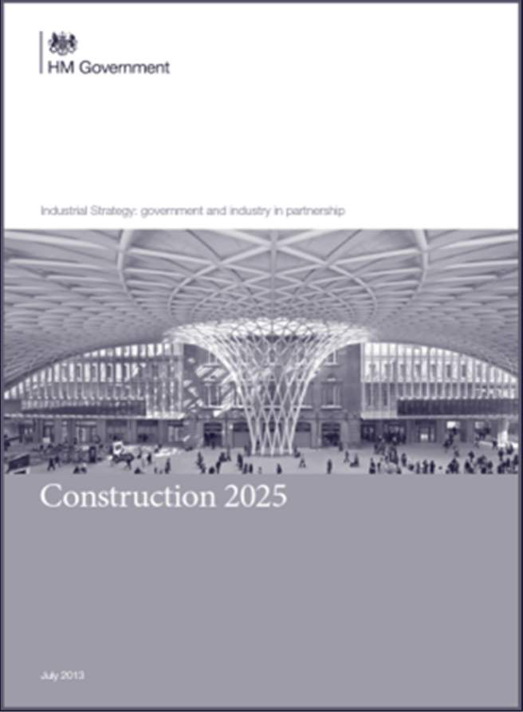

*BIM was cited as one of the processes  to assist in achieving those targets by the Construction Leadership Council 
*

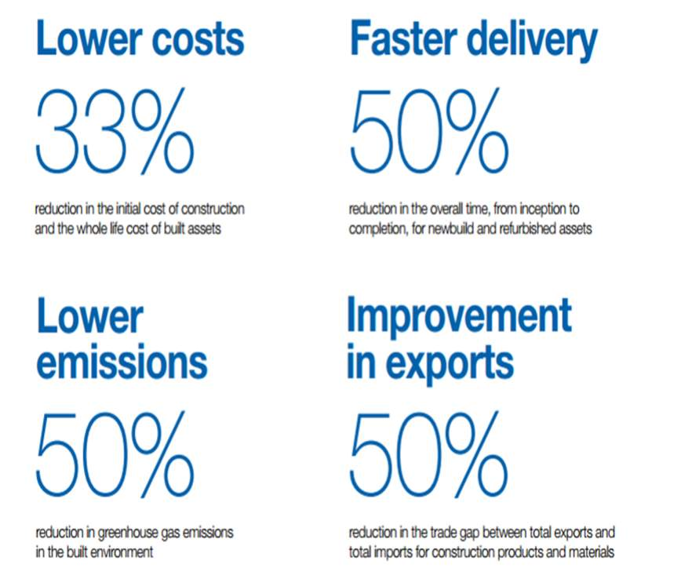

## National Infrastructure Strategy 

The National Infrastructure Strategy sets out plans to transform UK infrastructure in order to level up the country, strengthen the Union and achieve net zero emissions by 2050. [https://www.gov.uk/government/publications/national-infrastructure-strategy(opens in a new tab)](https://www.gov.uk/government/publications/national-infrastructure-strategy%E2%80%8B)

The NIS explain the governments vision to:

- Build faster, better, and greener
- Create thriving communities, cities, and regions
- Ensure the UK is a world leader in new technologies
- Encourage investment
- Deliver Net Zero
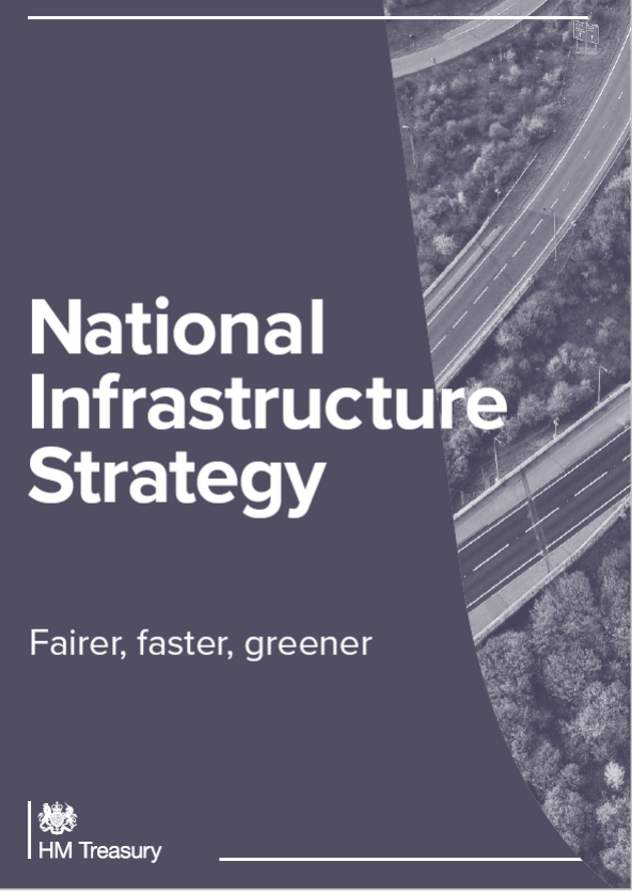

## The Construction Playbook

Published in **December 2020**, the **Construction Playbook** captures commercial best practices and outlines how contractors and their supply chain should engage and collaborate more efficiently.

There are 14 policies defined for how the government should assess, procure and deliver public works projects and programmes.

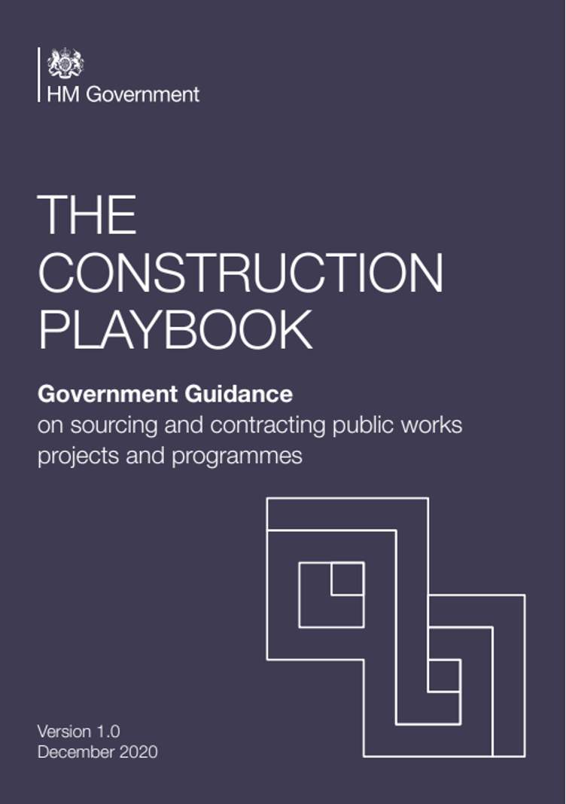

> [!note] Audio transcript (00:42)
> The 14 policies support setting clear outcome-based specifications, developing new commercial models with industry, driving innovation and modern methods of construction, and increasing the end-to-end speed of delivery. Implementation of the playbook is essential to enabling a more efficient and innovative industry, and to driving important improvements in client capability. It will create an environment where building and workplace safety is improved. Significant progress is made towards our net zero by 2050 commitment, and social value is maximized. This will be a key focus for the IPA and government over the coming years, and central to achieving the vision set out in the TIP roadmap.
>
> Source: [Lesson 5 - Making Change Happen - BIM ISO 19650 12 Project Deliv (3).mp3](assets/Lesson 5 - Making Change Happen - BIM ISO 19650 12 Project Deliv (3).mp3)

> **The 14 key policies are:**Commercial pipelinesMarket health and capability assessmentsPortfolios and longer term contractingHarmonise, digitise, and rationalise demandFurther embed digital technologiesEarly supply chain involvementOutcome-based approachBenchmarking and Should Cost ModelsDelivery Model AssessmentsEffective ContractingRisk allocationPayment mechanism and pricing approachAssess the economic standing of suppliersResolution planning

## Government Soft Landings

Brought in along with the UK BIM Level 2 Mandate, BS 8536-1:2015 describes Government Soft Landings (GSL) as:

***"A process for the graduated handover of a new or refurbished asset/facility, where a defined period of aftercare by the design and construction team is an owner’s requirement that is planned and developed from the outset of the project from "***

Soft landings help to break down the barriers between capital delivery and asset operations.

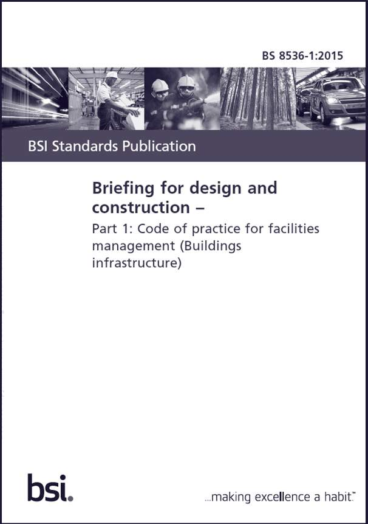

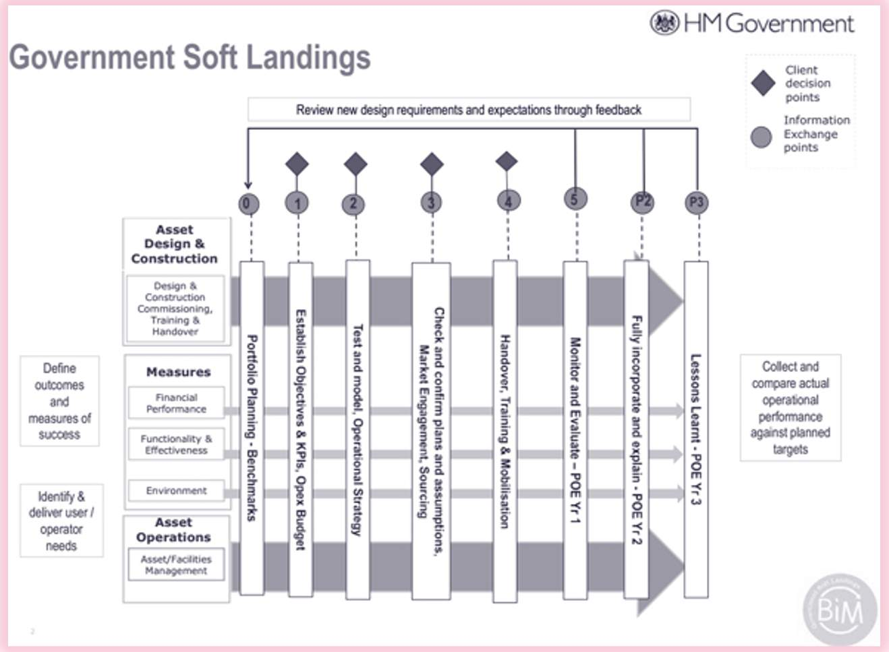

> [!warning] Missing audio (00:23)
> No local audio file matched this placeholder (referenced `assets/XlPDO5G-yMVFHRn5_transcoded-wbNM-GiFt9KWEz0q-m1s95.mp3`).

BS 8536 is now also incorporated into the UK BIM Framework. Embedding Government Soft Landings (GSL) and  ‘Golden Thread’ as part of a data centric approach to capital project delivery, will help to comply with new legislation, policy drivers and wider statutory obligations.

Tools such as the Construction Innovation Hub (GSL) Interactive Navigator will aid implementation.

[https://www.cdbb.cam.ac.uk/files/060521\_gsl\_navigator.pdf(opens in a new tab)](https://www.cdbb.cam.ac.uk/files/060521_gsl_navigator.pdf)

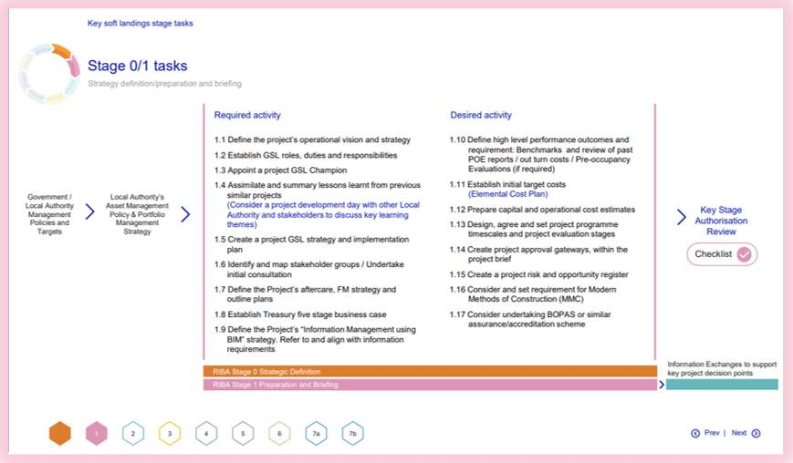

## The Golden Thread  

‘Dame Judith Hackitt, in her report, Building a safer future, recommended the introduction of a ‘golden thread’ to support duty holders in designing, constructing and managing their buildings as holistic systems, taking into account building safety at all stages in the lifecycle’

[www.gov.uk/government/publications/building-regulations-advisory-committee-golden-thread-report(opens in a new tab)](http://www.gov.uk/government/publications/building-regulations-advisory-committee-golden-thread-report)

A strict regulation regime is immediately coming into place in the U.K, relevant for buildings 18 metres plus tall, and/or 7 storeys high.

> [!warning] Missing audio (00:20)
> No local audio file matched this placeholder (referenced `assets/4x_9nYk39TBmweOD_transcoded-M5P-CCYkePTg9GV3-m1s97.mp3`).

- Information relating to a building, to enable the relevant persons to easily understand building safety requirements
- Information management process to ensure accurate, accessible, and consistent data in an understandable format
The Golden Thread refers to a form of structured digital record-keeping for construction projects, to be stored, managed, maintained and retained. It aims to centralise building data and provide greater transparency to the building operators  relating to asset information, and will enable risks to be identified, managed and mitigated.

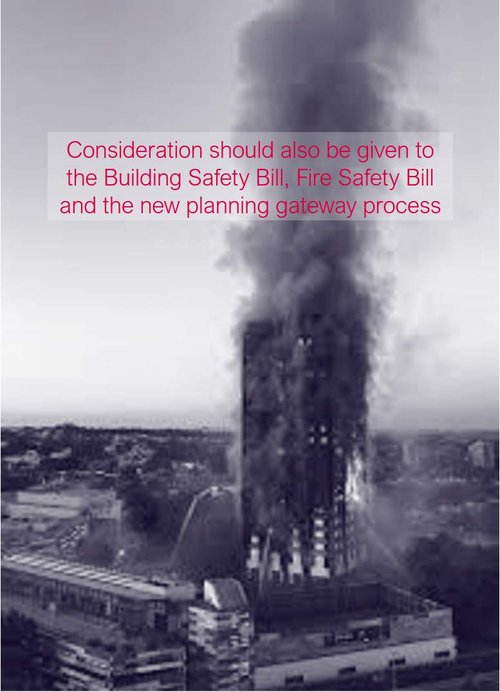

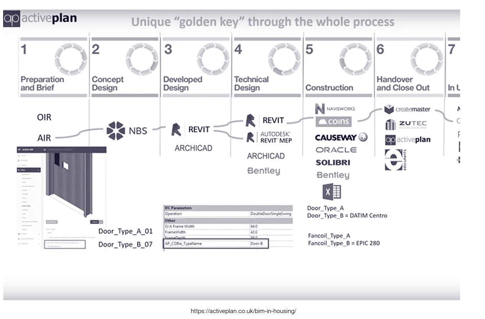

> [!warning] Missing audio (00:17)
> No local audio file matched this placeholder (referenced `assets/1VhMRcqcBdZGNRGP_transcoded-bzgMhIekjZmR7GlU-m1s100.mp3`).

## COP 26 – Climate Change Summit

> Serious climate action must be taken now to improve the health of our planet. Global CO2 emissions have risen 60 percent since 1990!

COP26 is the 2021 United Nations climate change conference. It had four main goals:

Secure global net zero by mid-century and keep 1.5 degrees within reach

> [!note] Audio transcript (01:46)
> Serious climate action must be taken now to improve the health of our planet. Global CO2 emissions have risen 60% since 1990, and this is having a serious effect. COP26 is the 2021 United Nations Climate Change Conference, where countries gather and plan how to tackle it. COP stands for Conference of the Parties. It has four main goals. Number one, to secure global net zero by mid-century and keep 1.5 degrees within reach. Countries are being asked to come forward with ambitious 2030 emissions reductions targets that align with reaching net zero by the middle of the century. To deliver on these stretching targets, countries will need to accelerate the phase-out of coal, curtail deforestation, speed up the switch to electric vehicles, and encourage investments in renewables. Number two is adapt to protect communities and natural habitats. The climate is already changing and it will continue to change even as we reduce emissions with devastating effects. At COP26 we need to work together to enable and encourage countries affected by climate change to protect and restore ecosystems, build defences, warning systems and resilient infrastructure and agriculture to avoid loss of homes, livelihoods and even lives. Number three is to mobilise finance. To deliver on our first two goals, developed countries must make good on their promise to mobilise at least $100 billion in climate finance per year by 2020. International financial institutions must play their part and we need to work towards unleashing the trillions in private and public sector finance required to secure global net zero. Number four is work together to deliver. We can only rise to the challenges of the climate crisis by working together.
>
> Source: [Lesson 5 - Making Change Happen - BIM ISO 19650 12 Project Deliv (4).mp3](assets/Lesson 5 - Making Change Happen - BIM ISO 19650 12 Project Deliv (4).mp3)

## UK BIM FRAMEWORK

The **UK BIM Framework** sets out the approach for implementing BIM in the UK using the framework for managing information provided by the **ISO 19650** series. It includes:

- **Published standards to help implement BIM in the UK**
- **The UK BIM Guidance Framework**
- **Useful links to other resources**
The **UK BIM Framework** will guide and support you in implementing BIM.

1 2

## Lesson Summary

Lesson complete! You are now able to:

- Summarize some of the events or reports that have driven change in our industry
and;

- Understand what change they initiated
**[CONTINUE]**

---
*Extracted from `Lesson 5 - Making Change Happen - BIM ISO 19650 1&2 Project Delivery_ Unit 1 - Catalyst for Change.html` via webpage-content-extractor.*
