# Unit 3 - Lesson 2 - Concepts & Principles

*Lesson 2 of 5*

## Lesson Objectives

In this lesson we aim to:

Highlight the key concepts and principles introduced by the first two parts of the standards, parts 1 and 2.

## BIM according to ISO 19650

A process of delivering right level of information at the correct information exchange point defined, relating to the design, construction, operational and maintenance of a building or asset, using appropriate open technology formats.

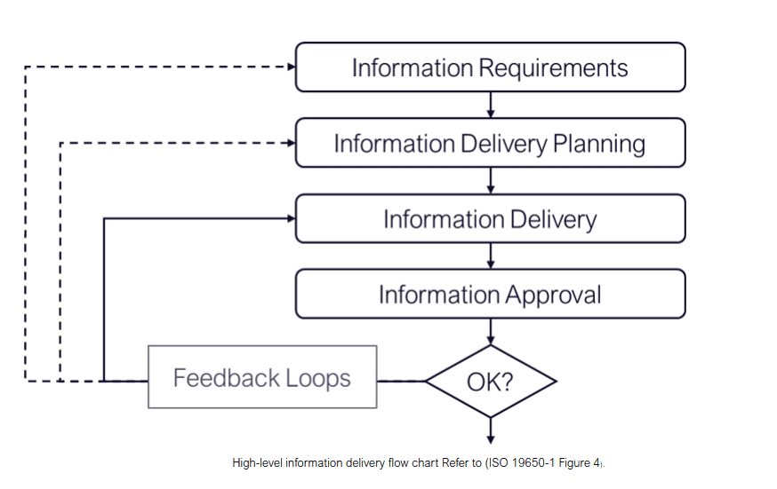

*A high level example of information delivery can be seen in this flowchart based on ISO 19650-1 Figure 4,encapsulating information requirements, planning, delivery, approval and also feedback loops.*

A successful project example,  adopting ‘BIM according to the ISO 19650 series’  processes, would have the following features:

Clear information requirements defined by an asset owner or appointing party.

The final result would be  efficiencies gained through reduction of waste/rework in the design, construction, operation and maintenance activities plus the reduction of risk.

## Purpose of Information

To support decision making, the purpose of information for each stakeholder needs to be considered

Video Player is loading.Loaded: 0%0:00Remaining Time -0:001x2x1.75x1.5x1.25x1x, selected0.75x0.5x0.25xcaptions off, selectedThis is a modal window.

Each stakeholder in the project wishes to use the information for a specific set of purposes: for example from a:

1. From a project delivery perspective it is used to plan and organize the work with supporting information which may come from a BIM execution plan;
1. From an asset user’s perspective it is used to make sure the asset has the right qualities and supporting information may come from an asset information model
1. From an asset owner’s perspective it is used to make strategic business decisions with supporting information that may come from a strategic asset portfolio review;
1. From a Health & Safety perspective the information ma be used to improve site safety, the safety of the public, and to establish and review risks via effective risk management
Other purposes of information include:

- Costings
- Sequencing
- Operations
- End of life / decommissioning
- Information Security
## Information Management Content

The information management process is a key concept  of ISO 19650 relating to the whole life cycle of an asset.

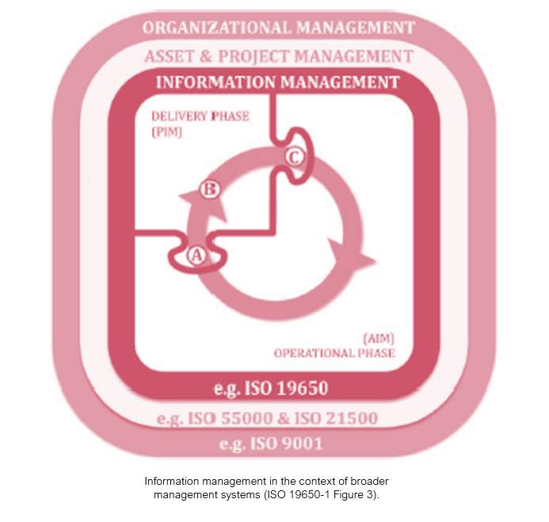

*The information management process is a key concept  of ISO 19650 relating to the whole life cycle of an asset *

*Figure 3 from ISO 19650 depicts the life cycle for delivery and operational phases of  an asset in the context of organisational management.Organizational management (ISO 9001) is supported by:Asset Management (ISO 55000)Project Management (ISO 21500) which in turn are supported by:Information Management (ISO 19650)*

> [!note] Audio transcript (00:51)
> This diagram shows the requirements for organisational management systems to be in place. Organisational management is supported by asset and project management, which in turn are supported by information management. Organisations implementing ISO 9650 should consider the use of appropriate ISO management system standards as listed, although this is not a prerequisite. It shows the split of an asset's life cycle in the delivery phase, where A is the start of the delivery phase where existing asset information comes into the project, B is the progressive development of information, namely the PIM, project information model, and C is the end of the delivery phase. It also shows the operational phase, with the circle indicating the changes, including modification and refurbishments to the asset that may occur during its operation.
>
> Source: [Lesson 2 - Concepts Principles - ISO 19650 12 Project Delivery U (2).mp3](assets/Lesson 2 - Concepts Principles - ISO 19650 12 Project Delivery U (2).mp3)

## Organisational Management

Understanding and implementing organizational management processes to  ISO 9001 Quality Management System, plays a crucial role in the high level implementation of ISO 19650

Having ISO 9001 processes in place such as complaints, resource, training, tools, skills, continuous improvement and risk assessments, along with quality assurance checking procedures will be very useful when implementing ISO 19650 and undertaking some of the tasks discussed as part of compliance with the standards discussed in this course.

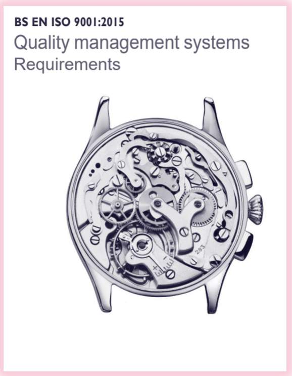

## Information Delivery Life Cycle

This whole process is supported by other relevant standards including:

1 2 3

> [!warning] Missing audio (00:15)
> No local audio file matched this placeholder (referenced `assets/aI2fvmwOaQFjRodN_transcoded-exorpX1WNIrBhWqd-m3s184.mp3`).

## Information Management Process

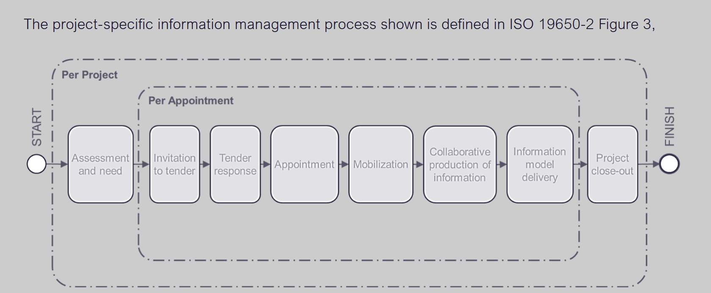

*The project-specific information management process shown is defined in ISO 19650-2 Figure 3*

## Assessment and Need

![The Project starts with Assessment and Need:OIRs: Basically what information do we need to make the organisation work better. For example, for a particular project an organisation may have specific requirements such as a zero carbon policy. So how it is verified that this requirement has been met. Therefore this OIR needs to fit into the AIR and PIR. This all then fits into the EIRThen there are the decision points. This is where key stake holders may needs a specific piece of information to make a decision, typically set these out in the EIR and PIR](assets/31udmHYc0jvHBdqm_pkxei5HoHVdZXu2K.jpg)

*The Project starts with Assessment and Need:
OIRs: Basically what information do we need to make the organisation work better. For example, for a particular project an organisation may have specific requirements such as a zero carbon policy. So how it is verified that this requirement has been met. Therefore this OIR needs to fit into the AIR and PIR. This all then fits into the EIRThen there are the decision points. This is where key stake holders may needs a specific piece of information to make a decision, typically set these out in the EIR and PIR
*

## Invitation to Tender

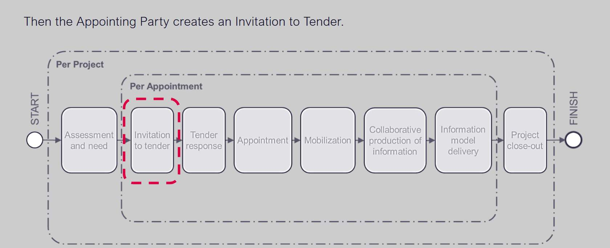

*
Then the Appointing Party creates an Invitation to Tender (ITT)*

## Tender Response

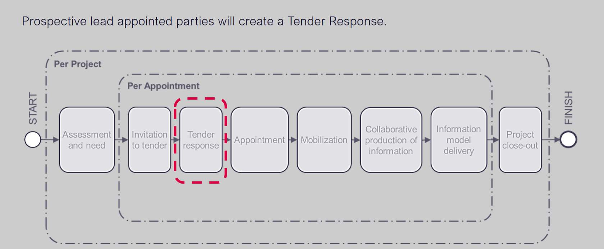

*
Prospective lead appointed parties will create a Tender Response including a Pre-contract BIM Execution Plan.The BEP provides a response to the information requirements in the EIRs
*

## Appointment

*There is then the Appointment stage. each task team needs to produce their TIDP which contains the Documents, models and outputs are and what their resources are and how long it is going to take to produce. They all get put together to form the MIDP and they become part of the Delivery teams BEP.*

## Mobilization

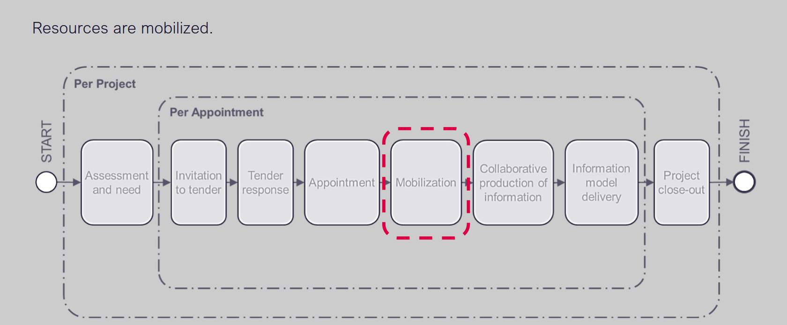

*Then there is the Mobilization phase, with mobilisation plans in place relating to the mobilisation of resources by the lead appointed party *

## Collaborative Production of Information

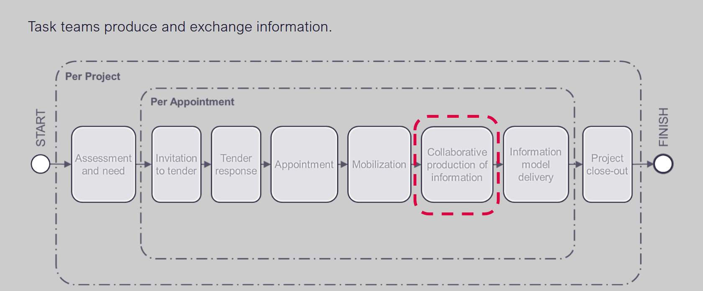

*Then there is the Collaborative Production of Information phase 
Task teams produce and exchange information. 
*

## Information Model Delivery

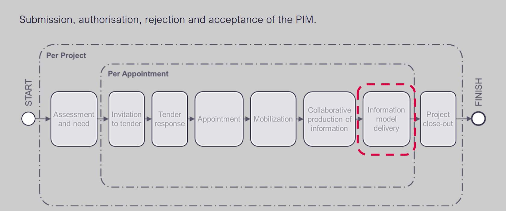

*During Information Model Delivery submission, authorisation, rejection and acceptance of the PIM takes place*

## Project Close Out

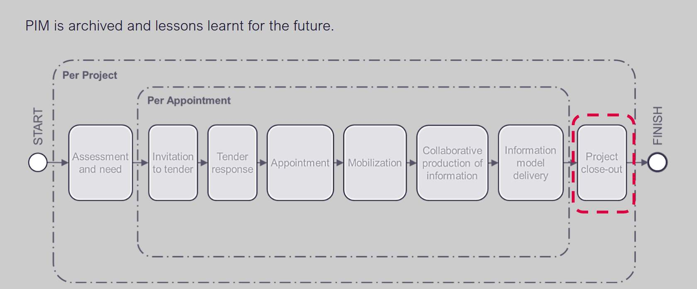

*During Project Close Out lessons are learnt for future projects and the PIM is archived*

## Information management & Appointments

The information Management process must be integrated into every appointment throughout the lifecycle of a project, these include:

Professional services appointments / agreements

## The Information Management Process

![At the back of the ISO there is A detailed information management process diagramIn the middle is the Project Information Model (PIM), there are a number of stages at the bottom. Internationally these may change with different project typesThen there is handover information and then the Asset Information Model (AIM)These models are made up of three types of information:DocumentationAlphanumerical information Geometrical informationYou can see the different decision points and  information exchanges that occur during the Lifecycle stages as discussed In the previous slides. ](assets/FLSki3Sh57A1fF4l_YVPbUBwJt1IxoHcb.jpg)

*At the back of the ISO there is A detailed information management process diagram
In the middle is the Project Information Model (PIM), there are a number of stages at the bottom. Internationally these may change with different project types
Then there is handover information and then the Asset Information Model (AIM)
These models are made up of three types of information:DocumentationAlphanumerical information Geometrical information
You can see the different decision points and  information exchanges that occur during the Lifecycle stages as discussed In the previous slides. 
*

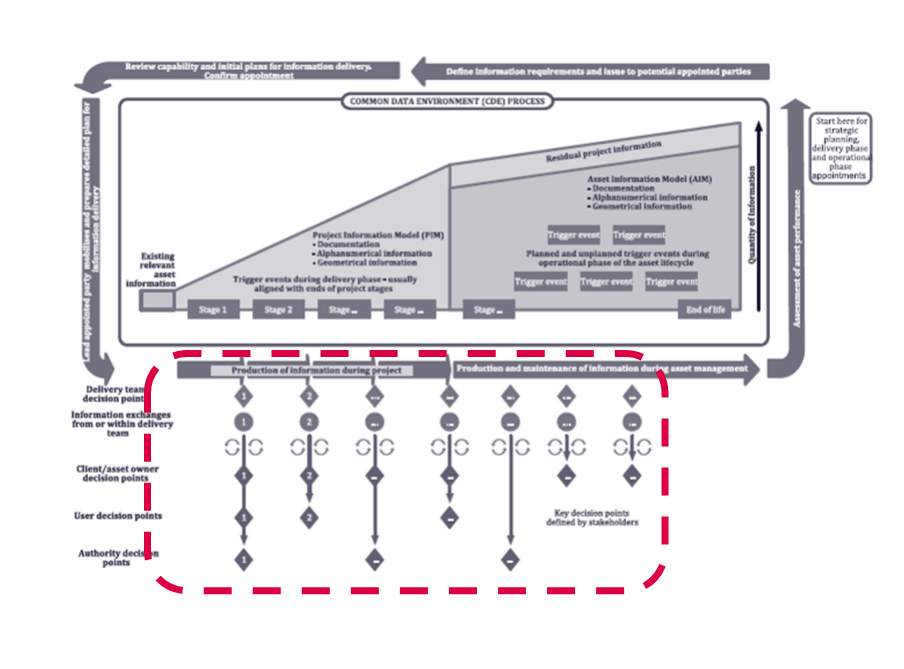

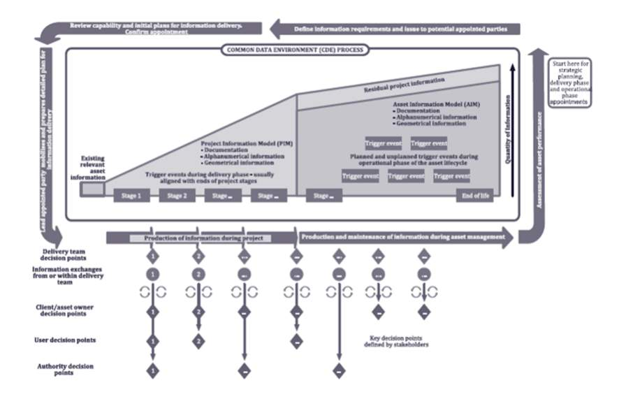

## Project's Information Protocol

An information management process is started each time a new appointment is made.

ISO 19650-2 requires an appointing party to establish the project’s information protocol, and included it within each appointment.

Lead appointed parties must also include the project’s information protocol within all delivery team sub-appointments.

> [!note] Audio transcript (01:09)
> An information management process is started each time a new appointment is made. ISO19650-2 requires an appointing party to establish the project's information protocol and include it within each appointment as part of the contract. This document is not standalone. Lead appointed parties must also include the project's information protocol within all delivery team sub-appointments. The protocol is a document required by ISO19650, which agrees the rights and responsibilities of the parties to comply with ISO19650-2. The CIC BIM protocol, second edition, was typically used as the starting point in the UK as part of the previous BIM Level 2 standards. However, there are issues in terms of the transition from BIM Level 2 to ISO19650 not being a direct like for like, raising legal implications. The terminology changes, process requirements and legal liabilities are not reflected and therefore it is not fully adapted to be used on ISO19650 as yet. The second edition was released in April 2018, so only aligned to the PAS 1992 suite.
>
> Source: [Lesson 2 - Concepts Principles - ISO 19650 12 Project Delivery U (5).mp3](assets/Lesson 2 - Concepts Principles - ISO 19650 12 Project Delivery U (5).mp3)

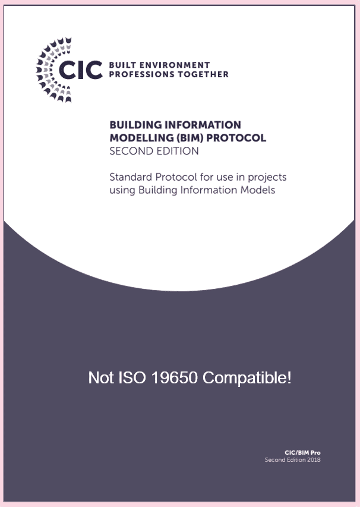

*https://www.cic.org.uk/admin/resources/bim-protocol-2nd-edition-2.pdf(opens in a new tab)*

## Appointor & Appointee

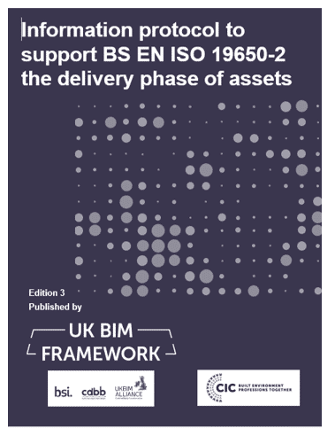

> [!warning] Missing audio (00:10)
> No local audio file matched this placeholder (referenced `assets/DdGjm-C2TQEP6bcG_transcoded-6uINx3aLe1dA4I7Q-m3s199.mp3`).

## Project's Information Protocol

A protocol answers who does, and also has access to  what, when and how, and should include:

Preparation of information requirement: This is irrespective of whether this appointment is formal or informal

A key feature of the Information Protocol is that all appointment and project-specific information, processes and documents is in one place, the Information Particulars.

---

Due to the legal issues relating to other protocols not fully aligning with ISO, in June 2020, the UK BIM Framework produced an Information protocol to support ISO19650-2,  the delivery phase of assets, and in November 2021, a protocol to support ISO19650-3,  the operational phase.

The UK BIM framework protocol outlines a contractual conduct to adhere to, which deals with risk allocation,, roles, responsibilities, and the legal rights of the parties involved. These protocols are contractually binding, and this protocol even incorporates a new incorporation clause.

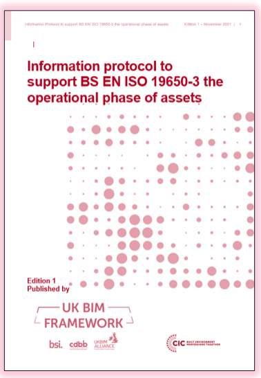

## Legal & Commercial Implications of ISO 19650 

An issue in terms of legal implications with the introduction of ISO 19650 is the new terminology and how this can map across contractually.

There are additional aspects to consider such as:

- **Intellectual Property & Copyright**
- **Liability**
- **Model & Data Ownership**
- **Collaboration**
- **Security of Information**
- **Risk Allocation**

> [!note] Audio transcript (00:38)
> It was discovered that the interviewees were split in their views, some liked the flexible approach of the JCT and the NEC, whereas others felt their provisions were too light a touch. This is despite the introduction of more extensive BIM provisions in the JCT 2016 and NEC4 compared to their previous iterations. The NEC4's introduction of universal terminology in their option X10, which is intended to cover the BIM process, drew concerns at the introduction of even more acronyms and terminology in an industry where, as a couple of interviewees put it, the jargon in BIM is horrific and lawyers are bamboozled by it.
>
> Source: [Lesson 2 - Concepts Principles - ISO 19650 12 Project Delivery U (1).mp3](assets/Lesson 2 - Concepts Principles - ISO 19650 12 Project Delivery U (1).mp3)

Since the release of the report, in **2019 JCT **produced a new practice note, BIM and JCT Contracts providing guidance on construction contracts using BIM.

**The aim of BIM and JCT Contracts is to:**

- Further the understanding of BIM related legal and contractual issues and suggest ways of approaching such issues in a collaborative and constructive way
- Provide practical, clear guidance to project participants and their professional advisers.
**BIM and JCT Contracts is structured as follows:**

- **Part A** - a commentary on BIM and the JCT Design and Build Contract 2016, pointing out provisions that may be most impacted by or relevant to a project using BIM. It provides suggestions on matters to bear in mind, including preparing and incorporating a BIM Protocol.
- **Part B** - sets out suggestions on the main topics that may sensibly be covered in a BIM Protocol.
- **Appendix 1** – a checklist of typical items to be considered by the Employer and the Employer’s professional advisers in formulating the Exchange Information Requirements at pre-tender stage.
- **Appendix 2** – Glossary of terms
- **Appendix 3** - The Design and Build Contract clauses referred to in Part A for ease of reference.
- Bibliography to enable readers to further their knowledge and understanding.
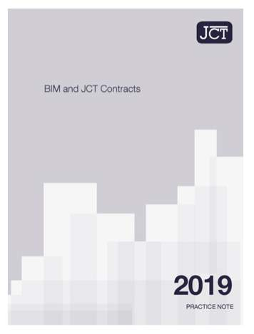

## High-level Principles

ISO 19650 series deals information requirements associated with project delivery, asset management and also security of information in addition.

There are typically three paths, with associated documents and deliverables that interrelate:

Project delivery with no asset management : PIR-EIR-PIM

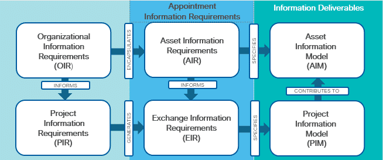

*Image based upon  Relationships between information requirements and information models (ISO 19650-1 Figure 2)*

## Non Project Documents: OIR

The Organizational information requirements (OIR)  are produced by the appointing party as one of the initial documents prior to AIR, PIR and EIR, providing a high level starting point.

They consider the information required for in the operation and maintenance of an asset or building, before the delivery aspect. The focus is on the whole lifecycle and how this information can inform the appointing party and the potential building operator.

It is key to Identify the purposes for which information is required.

The purposes could be to satisfy:

**• Objectives/outcomes**

**• Stakeholders **

**• Regulations**

**• Policies **

**• Business operations**

An example we see often at the BRE is compliance with BREEAM and how this is managed.

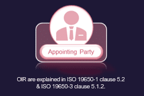

## Non Project Documents: AIR

The AIR is formed from the OIR as shown below, developing those high level requirements in relation to the required maintainable assets in the form of an AIR.

Typically the facilities management will drive the contents of the AIR, defining asset information required in order to undertake the ongoing maintenance of the building or asset.

Information delivery is typically required in an Open BIM format for interoperability with CAFM systems.

Typical examples could be data relating to COBie, classification, warranties, serial codes etc.

AIR are created by The appointing party, client, the asset owner or third party representative.

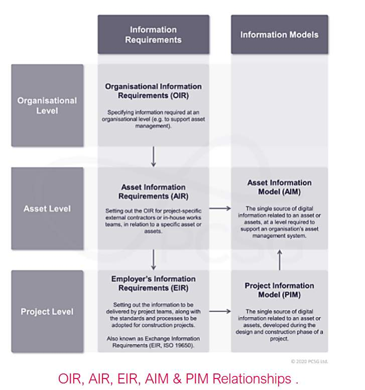

*https://www.designingbuildings.co.uk/wiki/Asset_information_requirements_AIR(opens in a new tab)*

> [!warning] Missing audio (00:10)
> No local audio file matched this placeholder (referenced `assets/GgmLGYPrUYNq0Aqv_transcoded-VPNq1H62B-jowsq6-m3s209.mp3`).

## AIR - COBie Deliverables Worksheet

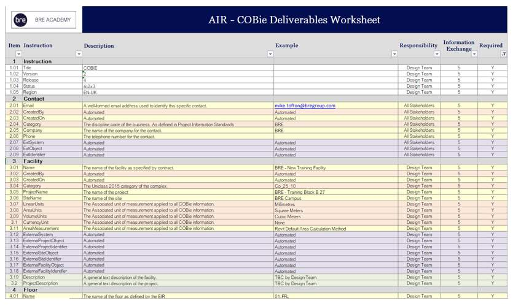

## AIM & PIM

- The Asset information model (AIM) supports the facilities and asset management processes established by the appointing party. These models are rich in meta-data as defined by the AIR, typically with a high level of information relating to the object data required for the operational phase of an asset
- Project information model (PIM) is used during the delivery phase, and will typically contain the required information to satisfy task team deliverables. The PIM may also include scheduling, costing, and health and  safety information. PIM contributes to the AIM
AIM and PIM are produced throughout the information life cycle.

> [!note] Audio transcript (00:36)
> You may have noticed the terms aim and PIM. These refer to an asset information model and a project information model. The asset information model, AIM, supports the facilities and asset management processes established by the appointing party. These models are rich in metadata, typically with a high level of information relating to object data. Project information model, PIM, is used during the delivery of the project phase and will typically contain the required information to satisfy task team deliverables. The PIM may also include scheduling, costing and health and safety information.
>
> Source: [Lesson 2 - Concepts Principles - ISO 19650 12 Project Delivery U (4).mp3](assets/Lesson 2 - Concepts Principles - ISO 19650 12 Project Delivery U (4).mp3)

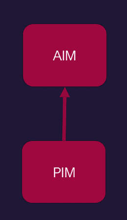

## BIM Lifecycle Value

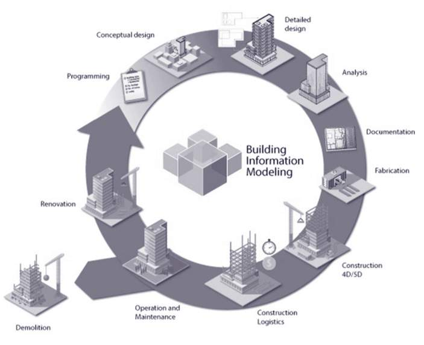

> [!note] Audio transcript (01:02)
> Asset information models managed and updated through a project's lifecycle provide huge value to organisations and enable the achievement of business objectives. Other BIM technologies can utilise the information in the AIM and help make smart decisions relating to built assets and automate processes. In many instances having more than less of something is often a good thing, however not so much with data, especially in relation to asset information management. It is important to provide just the right amount of relevant information. Better information management throughout the building whole lifecycle brings value through, reduced waste during construction, analysis data informs designs and decisions, information requirements are specific for the intended use, accessible and open. BIM tools improve build coordination and construction planning, and AIM improves a single source of structured asset data. AIM helps facilitate managers communicate needs with all stakeholders, efficiencies in maintaining assets and buildings.
>
> Source: [Lesson 2 - Concepts Principles - ISO 19650 12 Project Delivery U.mp3](assets/Lesson 2 - Concepts Principles - ISO 19650 12 Project Delivery U.mp3)

## AIM Value

Asset information models managed and updated through a projects lifecycle provide huge value to organizations and enable the achievement of business objectives.

Better information management brings value through:

- Considering people, process, technology and data
- Information requirements are specific for the intended use
- An AIM provides a single source of structured asset data, providing a record system
> [!note] Audio transcript (00:49)
> Asset information models managed and updated through a project's life cycle provide a huge value to organisations and enable the achievement of business objectives. Other BIM technologies can utilise the information in the AIM and help make smart decisions relating to built assets and automate processes. In many instances, having more than less of something is often a good thing. However, not so much with data, especially in relation to asset information management. It is important to provide just the right amount of relevant information. Better information management brings value through considering people, process, technology and data. Information requirements are specific for the intended use and AIM provides a single source of structured asset data. BIM helps facilities managers communicate needs with all stakeholders.
>
> Source: [Lesson 2 - Concepts Principles - ISO 19650 12 Project Delivery U (6).mp3](assets/Lesson 2 - Concepts Principles - ISO 19650 12 Project Delivery U (6).mp3)

## AIM & PIM

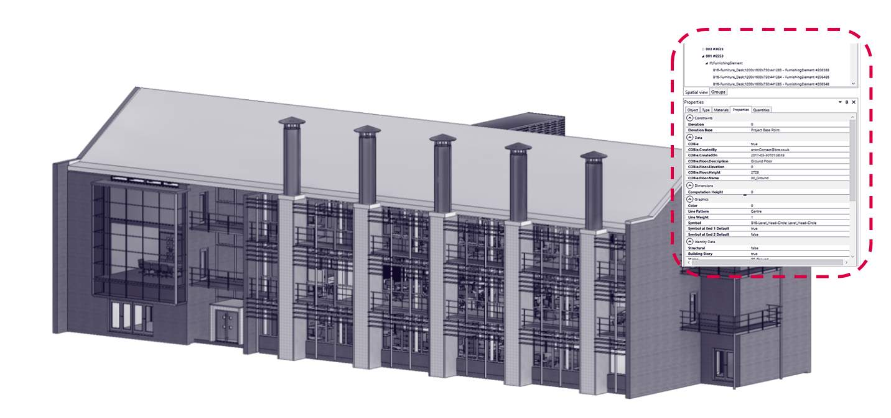

*
See typical examples of our Building 16 PIM.
Within each object is information relating to the assets that can later be used as part of BRE facilities management strategies.*

## Information Delivery Exchange

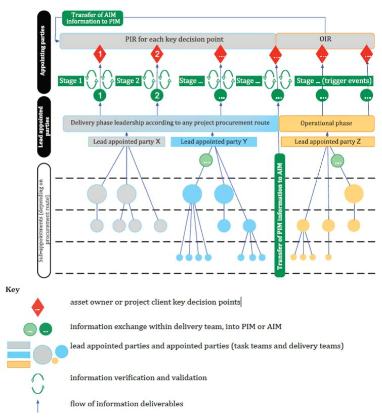

*ISO 19650-1: Figure 9 — Example of information delivery through information exchange to support key appointing party decisions.*

> [!warning] Missing audio (00:24)
> No local audio file matched this placeholder (referenced `assets/aedgtGHWdrJBC-2s_transcoded-3YTq_uTzrXIaQXJd-m3s213.mp3`).

## Information Management Stages of Maturity

*This is a simplified version of the original ISO 19650-1, figure 1 so that it is readable on a slide.
This is the new BIM maturity Wedge. The ISO now talks about Stages relating to BIM Maturity rather than levels and there are layers for the elements.
There are the 3 maturity stages and increasing benefits from collaboration and also processes.
There is a Standards layer, a Technology layer. an Information layer and a Business Layer. 
*

## Collaborative Production of Information

Many of the fundamental principles of Information container-based collaborative working in ISO 19650 are as defined by UK BIM level 2 and the overall definition is the same in the ISO as it was in PAS 1192-2.

To enable a collaborative working environment, information needs to be produced in line with ISO 19650-2 Section 5.6 in combined with the review processes defined in 5.7.

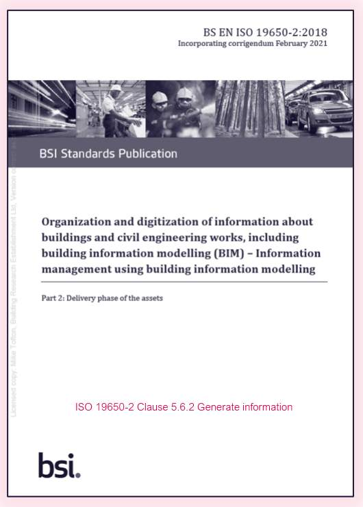

Key concepts of working collaboratively include:

Appointing Parties provide clearly defined information requirements

## Common Data Environment (CDE) 

> ‘Agreed source of information for any given project or asset, for collecting, managing and disseminating each information container through a managed process’  ISO 19650-1

A CDE workflow describes the processes to be used and a CDE solution can provide the technology.

## Collaborative Working using a CDE 

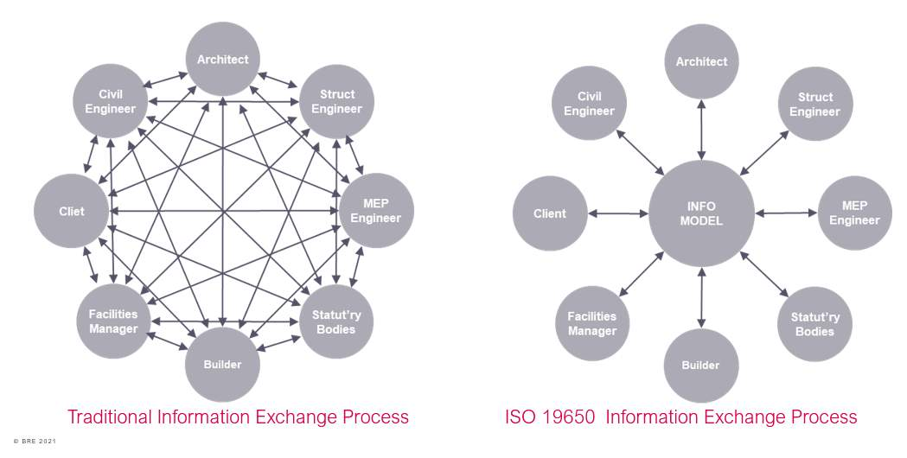

> [!note] Audio transcript (01:35)
> Traditionally, this information management process is as this diagram, and if any member of the team does not share their information to the right parties, then it becomes disjointed. Changes occur between project team members at different points in the project. This can result in different project team members having conflicting information. The process has historically not been well managed. Despite this, projects can still succeed following this process, but any poor information management leads to inefficiencies, increasing the necessary time and effort required to complete tasks. This diagram shows what we have with a single shared area or container that holds all the information that should be used at that current time for a particular purpose. Following the information management process, the exchange of information is shared through a managed location where files are held for anyone to access, CD Central Source of the Truth. This means that there is a single copy of each file which needs to be updated, a single location to find this file, a single source of the truth, drastically reducing the time and effort to complete tasks. Essentially, collaborative working means everyone benefits more than they would individually. Everyone reduces waste, generates more money and creates a better environment. Through improving data management and collaboration within projects, this will support the industry to deliver greater efficiencies through the design, construction and operational stages of a project. A CDE is a fundamental part to deliver BIM by providing a digital repository to store, manage and engage with project information.
>
> Source: [Lesson 2 - Concepts Principles - ISO 19650 12 Project Delivery U (3).mp3](assets/Lesson 2 - Concepts Principles - ISO 19650 12 Project Delivery U (3).mp3)

## Single Source of the Truth

![Why You Need a Common Data Environment/The Benefits of a CDEA CDE provides the concept of having a “single source of truth.” This typically includes:Data is available anytime, any place.Project information is is always current.Stakeholders have access to the latest, most up-to-date information. Access controls mean stakeholders e only the permitted informationEmail communications are virtually eliminated (or at least no longer something your team depends on.)Collaboration is simple and efficient across stakeholders and teams anywhere I the world (even between those using different software).Repetitive coordination checks are drastically reduced.Existing data is easily reused, facilitating future project planning, budgeting, management, and more.Asset data is readily available for handover after project closeout.](assets/khNyvV6zoGQVLnKi_Kyk_3803U1BTc6gC.png)

*Why You Need a Common Data Environment/The Benefits of a CDEA CDE provides the concept of having a “single source of truth.” This typically includes:Data is available anytime, any place.Project information is is always current.Stakeholders have access to the latest, most up-to-date information. Access controls mean stakeholders e only the permitted informationEmail communications are virtually eliminated (or at least no longer something your team depends on.)Collaboration is simple and efficient across stakeholders and teams anywhere I the world (even between those using different software).Repetitive coordination checks are drastically reduced.Existing data is easily reused, facilitating future project planning, budgeting, management, and more.Asset data is readily available for handover after project closeout.*

## Provision of a CDE

The common data environment is an agreed source of information consisting of several states as shown. As an information container develops, it transitions through the states.

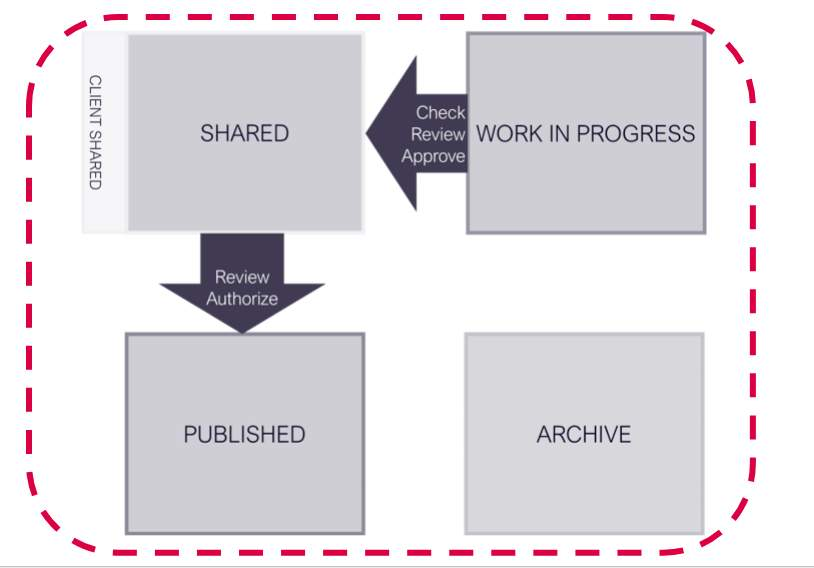

This is a process, not a software solution. There is a lot of confusion where organisations talk about buying a CDE as a software solution. There are software solutions that meet certain parts of its requirements but cannot meet all of them.

A common data environment solution and workflow should allow information containers, and the information itself, to be accessed by those who require it when undertaking their function.

So, the states or areas in broad terms are:

1. Work in Progress

## CDE Attributes

The term attributes (meta data) describes properties of an object or information container detailing aspects of performance information or classification.

**ISO 19650-1** recommends adding the following to an information container within a CDE solution:

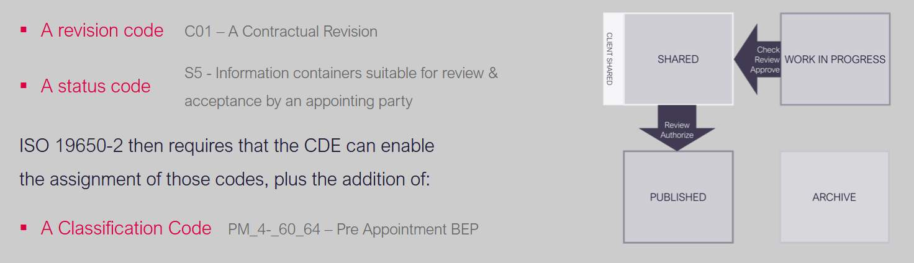

## Lesson Summary

Lesson complete! You are now able to:

Highlight the key concepts and principles introduced by the first two parts of the standards, parts 1 and 2.

**[CONTINUE]**

---
*Extracted from `Lesson 2 - Concepts & Principles - ISO 19650 1&2 Project Delivery_ Unit 3 - BIM According to ISO 19650_.html` via webpage-content-extractor.*
