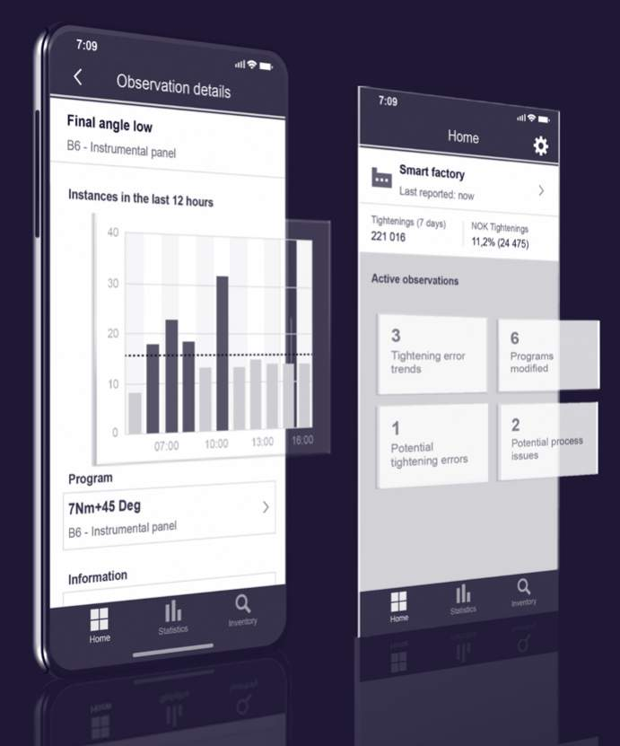

# Unit 3 - Lesson 3 - Part 3: Operational Phase

*Lesson 3 of 5*

## Lesson Objectives

In this lesson we aim to:

Understand ISO 19650 part 3, and the operational phase of an asset.

> [!warning] Missing audio (00:22)
> No local audio file matched this placeholder (referenced `assets/5IIJZr-z1PQHJR-a_transcoded-GzWLqYbfMUmrzcE9-m3s188.mp3`).

## Operational Phase

As you can see, a huge portion of information management in relation to an asset, and also the bulk of an assets life is during the operational phase.

> [!warning] Missing audio (00:23)
> No local audio file matched this placeholder (referenced `assets/WL_fAfr-pVmY50Cg_transcoded-WBhNojCGxzBET7j5-m3v2s189.mp3`).

## Asset Data

**ISO 19650-3** replaced **PAS 1192-3** in the UK which was published in 2014 and applicable until part 3 release in 2020.

> [!warning] Missing audio (00:22)
> No local audio file matched this placeholder (referenced `assets/eBEn5H26XBvtwcxz_transcoded-Rl4-RJ5H7LmzTVxc-m2v2s190.mp3`).

*Data is considered the new gold!*

## Principles

ISO 19650-3 is designed to sit alongside and compliment  part 2 and as such you will see many similar processes . This is so they can be utilised over the delivery and operational phase of an assets life.

There are however four key principles that are different:

Trigger Events:

Trigger events have carried over from the PAS standards. Those that can be foreseen and planned for, and those that cannot. an example of planned may be yearly maintenance.

## Information Management Flow Chart

*Click on the image to expand.*

![Activity groupingsA – encompasses all activities during operational phase B – activities per each appointment (before a trigger event)C - activities per each appointment (AFTER a trigger event)Step 1 leads to three different pathways, shown as shaded boxes labelled B, C and D depending o the trigger eventWithin the pathways B and C, the process isbroken into 3 sub-groups labelled E, F and G.Sub-group E is about procurement – of a tier 1 contractor or an in-house teamSub-group E is about procurement – of a tier 1 contractor or an in-house teamSub-group G is about production – when information is produced by appointed parties, reviewed by a lead appointed party and ultimately accepted by the asset owner/operatorThe process has feedback loops at points K and L.](assets/D8wnNij7T5IDVBu4_XKiV2GltWK3A3WOx.jpg)

*Activity groupingsA – encompasses all activities during operational phase B – activities per each appointment (before a trigger event)C - activities per each appointment (AFTER a trigger event)
Step 1 leads to three different pathways, shown as shaded boxes labelled B, C and D depending o the trigger eventWithin the pathways B and C, the process isbroken into 3 sub-groups labelled E, F and G.Sub-group E is about procurement – of a tier 1 contractor or an in-house teamSub-group E is about procurement – of a tier 1 contractor or an in-house teamSub-group G is about production – when information is produced by appointed parties, reviewed by a lead appointed party and ultimately accepted by the asset owner/operatorThe process has feedback loops at points K and L.*

## Lesson Summary

Lesson complete! You are now able to:

Understand ISO 19650 part 3, and the operational phase of an asset.

**[CONTINUE]**

---
*Extracted from `Lesson 3 - Part 3_ Operational Phase - ISO 19650 1&2 Project Delivery_ Unit 3 - BIM According to ISO 19650_.html` via webpage-content-extractor.*
