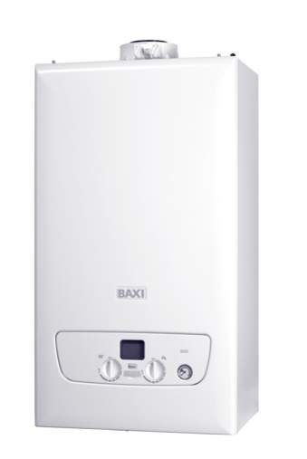
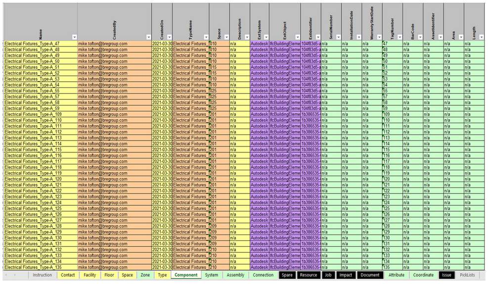

# Unit 3 - Lesson 4 - Part 4: Information Exchange

*Lesson 4 of 5*

## Lesson Objectives

At the end of this lesson, you will be able to:

Understand the soon to be released ISO 19650 part 4, and the transition from BS 1192-4.

Describe COBIe

## BS 1192-4 / ISO 19650:4 

BS 1192-4 is a code of best practise for the implementation of COBie that formed part of the BIM Level 2 suite of documents.

COBie is an internationally agreed information exchange schema for exchanging information relating to maintainable assets.  COBie is managed by the building SMART alliance.

**ISO 19650 Part 4: Information Exchange** is currently under development and out for public comments.

An information exchange is defined as: “act of satisfying an information requirement or part thereof”

'data drops’ as they were formally known, or information exchanges now are required at key milestones to enable the exchange, and checking of information for compliance with the project standards.

---

There should be a valid reason and in what context, to ask for COBie information In relation to an asset. BS 1192-4 requires that the Employer (Now referred to as Appointing Party states:

The aspects of the facility that are intended to be managed

## Uniclass 2015

Uniclass 2015 is a key component in the U.K, as all maintainable assets must be assigned an appropriate classification code.

The three levels of Uniclass that can be assigned to an object are:

EF - Elements/function

EF - Elements/function

[https://toolkit.thenbs.com(opens in a new tab)](https://toolkit.thenbs.com/)

many CAFM systems are using classification systems to structure documentation., and manage assets. This provides a single, international method of recognising items within buildings.

## COBIe Spreadsheet

COBie can be delivered as a spreadsheet or an xml file, and is software agnostic.

See below an example delivery, provided by Prairie Sky Consulting of a typical output.

The input method, contents, and delivery of COBie shall be covered under a separate course by the BRE.

*
https://www.prairieskyconsulting.com/resource.htm
*

*See here an example delivery, from our Building 16 model.*

## Learning Summary 

Lesson complete! You are now able to:

Understand the soon to be released ISO 19650 part 4, and the transition from BS 1192-4.

Describe COBIe

**[CONTINUE]**

---
*Extracted from `Lesson 4 - Part 4_ Information Exchange_ - ISO 19650 1&2 Project Delivery_ Unit 3 - BIM According to ISO 19650_.html` via webpage-content-extractor.*
