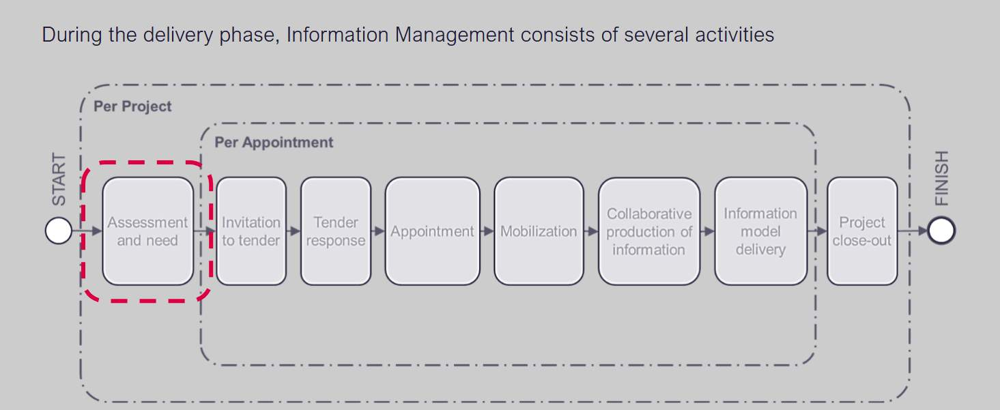
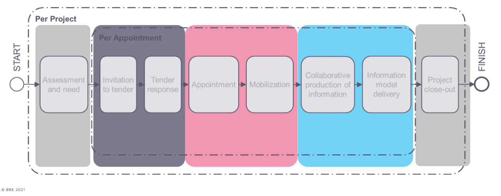
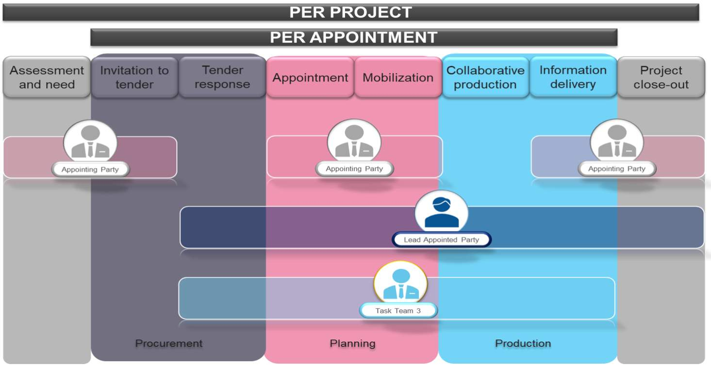
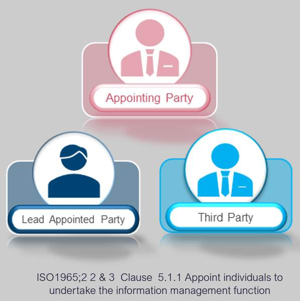
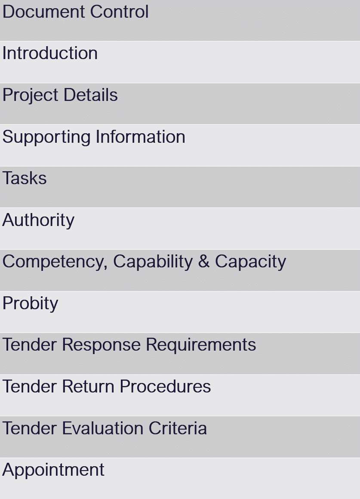
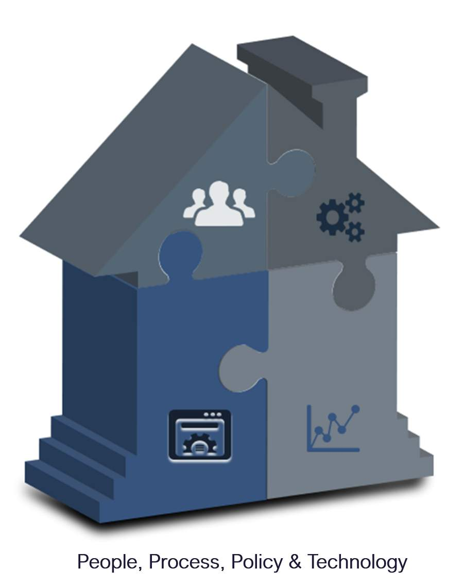
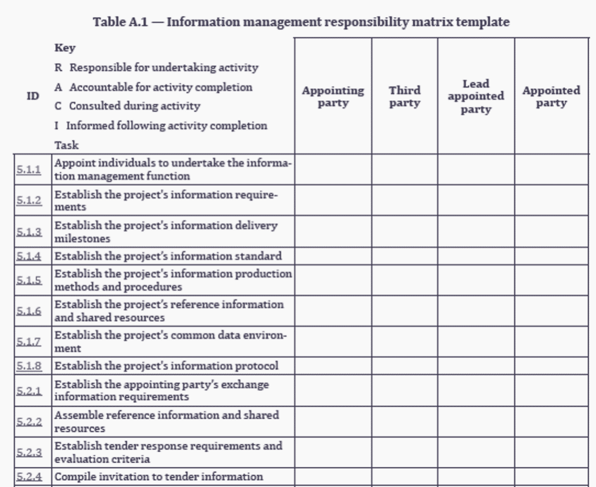
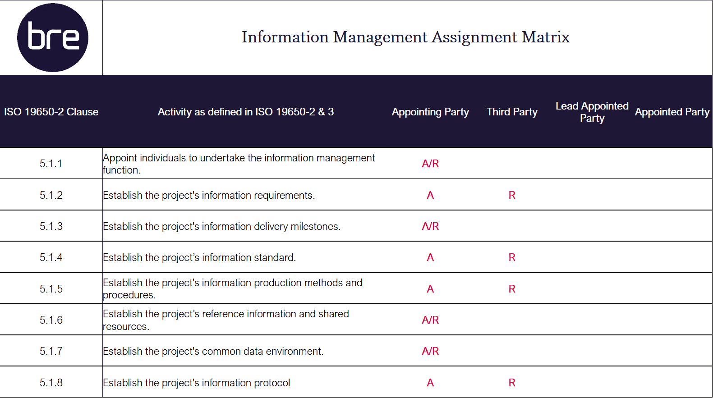
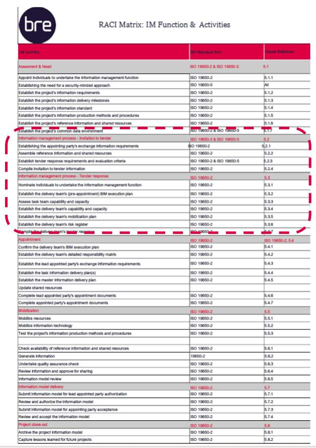
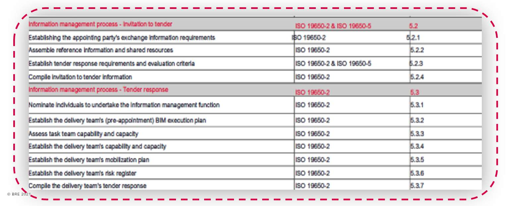

# Unit 4 - Lesson 1 - Undertake the Information Management Function

*Lesson 1 of 6*

## Lesson Objectives

At the end of this lesson, you will be able to:

- Understand the Information Management Function
> [!warning] Missing audio (00:21)
> No local audio file matched this placeholder (referenced `assets/II7KNNRLio5xi16C_transcoded-zNEdHgUcNVsWzQiU-m4s209.mp3`).

## Information Management

This is a simplified version of the original ISO 19650-2, figure 3. This image shows the Information management process during the delivery phase of assets.

> [!note] Audio transcript (01:16)
> This is a simplified version of the original ISO 9650 Part 2, Figure 3. This image shows the information management process during the delivery phase of assets. This activity sequence shows the process of information management through three main stages information procurement, information planning and information production with various parties involvement according to ISO 9650 Parts 1 and 2. Assessment and need and project closeout activities are coloured grey. Invitation to tender and the tender response activities are coloured dark blue. Appointment and mobilisation activities are coloured pink. And collaborative production of information and information model delivery activities are coloured light blue. When the information management process is started there is an assessment and need and project closeout activity per project. Then, per appointment, there is the information procurement stage which consists of the tasks within the invitation to tender and tender response activities, the information planning stage which consists of the tasks within appointment and mobilisation activities, then during the information production stage which consists of the tasks within collaborative production of information and information model delivery activities.
>
> Source: [Lesson 1 - Undertake the Information Management Function - ISO 1 (5).mp3](assets/Lesson 1 - Undertake the Information Management Function - ISO 1 (5).mp3)

> [!warning] Missing audio (00:23)
> No local audio file matched this placeholder (referenced `assets/lBCaxuyHD0A28AZy_transcoded-r8tbKTUYa9LeUjoU-m4s211.mp3`).

## Appoint Information Management Function

ISO 19650 describes the information management function as three distinct types of function:

> [!note] Audio transcript (01:04)
> A function is a set of tasks or activities to achieve an objective. There are three types of function and it is essential that these functions are formalised in some way. Asset information management function, including tasks in relation to operation of an asset. Project information management function, including tasks in relation to the delivery of an asset. Task information management function, including tasks in relation to the production of information. To support organisations that have not yet adopted information standards, ISO 9650 has simplified the information management process. The responsibility for information management is distributed across the whole team, with individual parties being given specific tasks. However, each party has flexibility in completing these tasks. For example, they could delegate it in their team or even employ a third party to complete it. Information management function must be assigned on behalf of the appointing party from the outset of the project. The appointing party information management function may be divided across multiple candidates. The individual must have the competency, capability and capacity to undertake the function.
>
> Source: [Lesson 1 - Undertake the Information Management Function - ISO 1.mp3](assets/Lesson 1 - Undertake the Information Management Function - ISO 1.mp3)

Project and Task Information management function consists of 40 tasks related to project delivery.

**Who should undertake them?**

The appointing party are responsible for the effective management of information throughout the project, however they can assign this to another party. They can nominate individuals from within their organisation, or an external 3rd party.

> [!note] Audio transcript (00:48)
> Project and task information management function consists of 40 tasks related to project delivery. The big issue that function are dealing with is that there is a general perception that BIM is done by BIM managers, however BIM is done by everybody. While it is important to ensure single-point accountability, everyone on a project should contribute to the completion of the information management function. The appointing party are responsible for the effective management of information throughout the project, however they assign this to another party. They can nominate individuals from within their organisation or the external third party. Some functions are defined as accountable to a particular party. In relation to each task, an individual, party or role may be nominated as responsible, accountable, consulted or informed. Tasks should only be assigned to individuals with sufficient competency and authority.
>
> Source: [Lesson 1 - Undertake the Information Management Function - ISO 1 (1).mp3](assets/Lesson 1 - Undertake the Information Management Function - ISO 1 (1).mp3)

If an appointing party nominates responsibility to an external 3rd party, or a prospective lead appointing party, the appointing party must consider the following points:

- What tasks will that person be responsible for?
- The capability and capacity of any individuals to undertake the information management function defined.
> [!note] Audio transcript (01:01)
> ISO 9650 Part 2 clause 5.1.1 and 5.3.1 permit the appointing party and or the lead appointed parties to delegate information management function responsibility to a third party or another appointed party, and this person will be deemed as an appointed party. The appointing party can appoint the prospective lead appointed party to undertake all or part of the information management function on their behalf. In this scenario, to avoid any potential conflict of interest, it's recommended that individuals undertake the information management function on behalf of either the appointing party or the prospective lead appointed party. The clause requires a scope of services to be drafted for tendering organisations. In doing this, the appointing party shall consider the following, and please note the term shall as previously discussed. What tasks will that person be responsible for? The capability and capacity of any individuals to undertake the information management function defined.
>
> Source: [Lesson 1 - Undertake the Information Management Function - ISO 1 (2).mp3](assets/Lesson 1 - Undertake the Information Management Function - ISO 1 (2).mp3)

## Information Management Scope of Services

*UK BIM Framework, Information management according to BS EN ISO 19650: Guidance Part A: The information management function & resources *

> [!note] Audio transcript (01:06)
> ISO 9650 Part 2 Clause 5.1.1 and 5.3.1 permit the appointing party and or the lead appointed parties to delegate information management function to a third party or another appointed party, and this person would be deemed as an appointed party. The clause requires a scope of services to be drafted for tendering organisations. The adjacent table shows a typical content slash structure that could be used to form the basis for an invitation to tender to undertake part or all of the information management function taken from the UK BIM framework. Information management according to BSEN ISO 9650 guidance part A, the information management function and resources. Document control, introduction, project details, supporting information, tasks, authority, competency, capability and capacity, probity, tender response requirements, tender return procedures, tender evaluation criteria, appointment. This scope of services should reflect the required third party capability using the information management function responsibility matrix RM1.
>
> Source: [Lesson 1 - Undertake the Information Management Function - ISO 1 (3).mp3](assets/Lesson 1 - Undertake the Information Management Function - ISO 1 (3).mp3)

## Information Management Function

To enable function to be successfully undertaken the following concepts are critical for the people and process part to be successful:

Authority

> [!note] Audio transcript (00:59)
> Earlier in the course we dealt with the notion of the sweet spot between people, process technology and data. One, authority is critical as a person needs to have the right within their organisation and the project to undertake the tasks or activities. If someone does not have this authority, they have not been assigned the responsibility within the project structure to undertake the function. Two, ownership is critical so people have control of the status of the activity. Three, responsibility is critical as although people can have ownership of an activity they need the ability and obligation to carry out the activities. Four, competency is critical as people need to have gained sufficient skills and knowledge but also need to be able to apply them to the sufficient level for a project standards. This enables them to carry out their activities to the requirements. Just because someone is capable does not mean they are competent. Five, capacity is critical. If the people do not have the time and resources to carry out their function, their ability to complete activities well is compromised.
>
> Source: [Lesson 1 - Undertake the Information Management Function - ISO 1 (4).mp3](assets/Lesson 1 - Undertake the Information Management Function - ISO 1 (4).mp3)

See below, ISO 19650-2 Table A.1 — Information management responsibility matrix template, for establishing the typical function and activities.

This can help when establishing a scope of services.

> [!note] Audio transcript (00:57)
> In terms of the project information management function, this may contain many activities such as 1. Establish the PIS including LOIN, Spatial Referencing Units and Measures 2. Including to assemble reference information and shared resources 3. Establish the master information delivery plan and 4. Establish the project's common data environment If the competencies are available, individuals could complete these tasks in-house otherwise another organisation may need to be appointed The ISO has an Information Management Responsibility Matrix Template and it lists all of the ISO clauses for responsibilities and the tasks associated with them Then it provides the ability to assign RACI to the Appointing Party, Third Party, Lead Appointed Party and Appointed Party However, this list is high level therefore it's not exhaustive and does not take into account the best practice developed in PAS 1192-2 2013 PAS 1192-2 2013
>
> Source: [Lesson 1 - Undertake the Information Management Function - ISO 1 (6).mp3](assets/Lesson 1 - Undertake the Information Management Function - ISO 1 (6).mp3)

## RACI Matrix

### Flashcards

**R**

Responsible
Those who do the work to achieve the task

**A**

Accountable
The one answerable for the correct completion of the task

**C**

Consulted
Those whose opinions are sought

**I**

Informed
Those who are kept up-to-date on progress and decision

Please note: An individual may undertake multiple functions

*This scope of services should reflect the required 3rd party capability using the Information Management function Responsibility Matrix
Shown here is a snippet of assignment relating to the assessment and need section.*

## Information Management Function & Activities

Shown below is a list of the information management activities that take place, in reference to the appropriate 1S0 19650 part number and clause reference

If you refer to ISO 19650-2 Figure 3, you will see that the majority of these activities are undertaken at an appointment level.

*Zoomed In for further detail: The information management process shall be applied throughout the delivery phase for each appointment, regardless of project stage.*

## Lesson Summary

Lesson complete! You are now able to:

Understand the Information Management Function

---

**[CONTINUE]**

---
*Extracted from `Lesson 1 - Undertake the Information Management Function - ISO 19650 1&2 Project Delivery_ Unit 4 - Assessment & Need.html` via webpage-content-extractor.*
