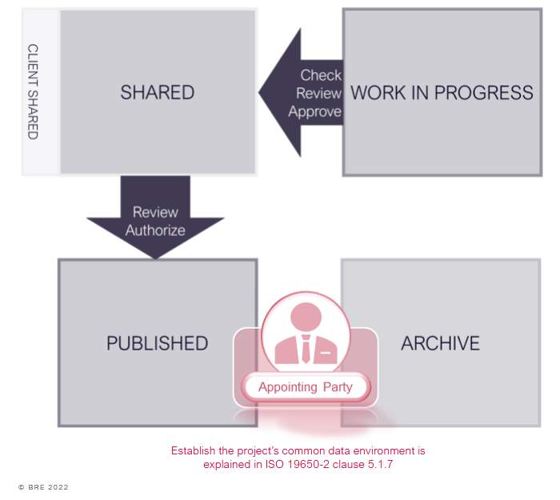
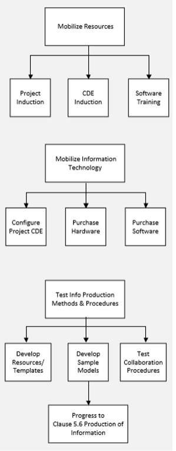

# Unit 4 - Lesson 5 - Establish Project’s Information Production Methods & Procedures

*Lesson 5 of 6*

**Lesson Objectives**

> [!warning] Missing audio (00:09)
> No local audio file matched this placeholder (referenced `assets/Y2LNQaN4Pyxir8wa_transcoded-lW9WoJf7DY4dhuxA-m4s244.mp3`).

## Project’s Information Production Methods & Procedures

This explains the ‘How’ of information production. A schedule of methods and procedures to be used on the project which support the following:

> [!note] Audio transcript (00:54)
> This explains the how of information production. The project's information productions methods and procedures can be incorporated into other documentation. They do not need to be standalone. These project information procedures should include 1. Existing information Methods and procedures related to how surveys will be undertaken and how information needs to be captured and who is accountable for their undertaking. 2. New information Methods and procedures related to whether templates need to be used and how approval and authorization procedures are undertaken. 3. Security The security of information how it's distributed. And 4. Delivery The methods and procedures related to configuring information for delivery for use by the appointing party. A common method is to produce diagrams or information delivery manuals mapping out the processes that tend to be very specific to the appointing party.
>
> Source: [Lesson 5 - Establish Projects Information Production Methods Pro.mp3](assets/Lesson 5 - Establish Projects Information Production Methods Pro.mp3)

As well as the production of information, the methods and procedures should also consider the following:

Checking

## Example: Establish the Project's CDE

## Example: Approval Workflows

*The process may have bespoke approvals, which need to be detailed within the methods and procedures .*

## Example: Exchanging Sensitive Information

*There will almost certainly be custom methods and procedures in relation to the sharing or exchange of information that is deemed as a Sensitive asset. The process may define access permissions, or the introduction of information insecurity codes for example. *

## Example: Project Mobilization

## Lesson Summary 

Lesson complete! You are now able to:

Understand how a Project's Information Production Methods and Procedures are Established

**[CONTINUE]**

---
*Extracted from `Lesson 5 - Establish Project’s Information Production Methods & Procedures_ - ISO 19650 1&2 Project Delivery_ Unit 4 - Assessment & Need.html` via webpage-content-extractor.*
