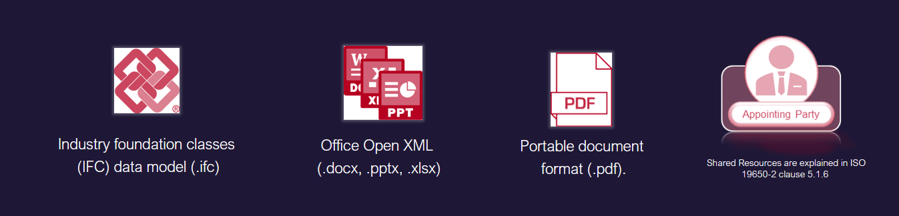
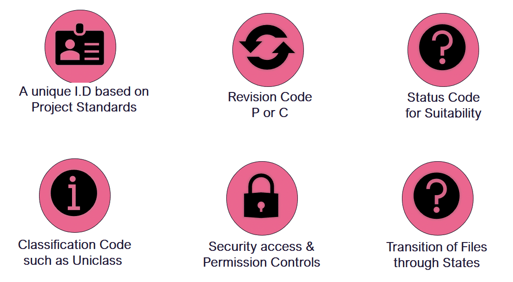
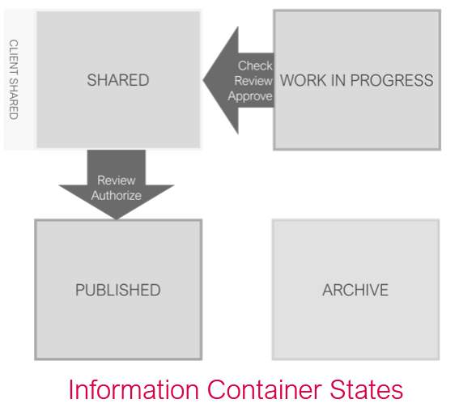
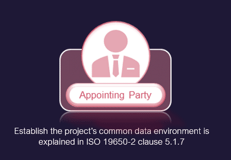
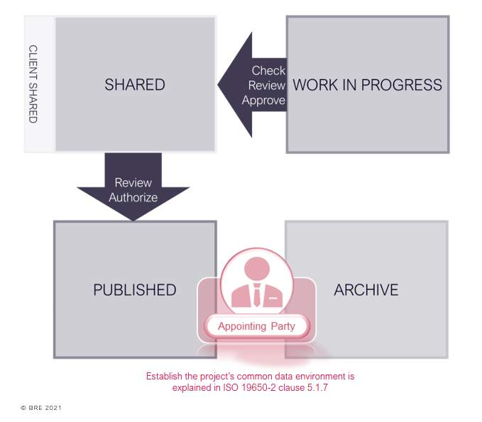
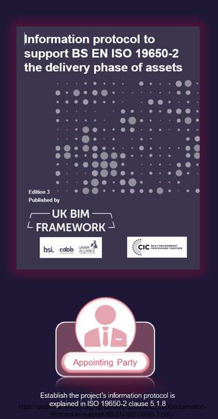
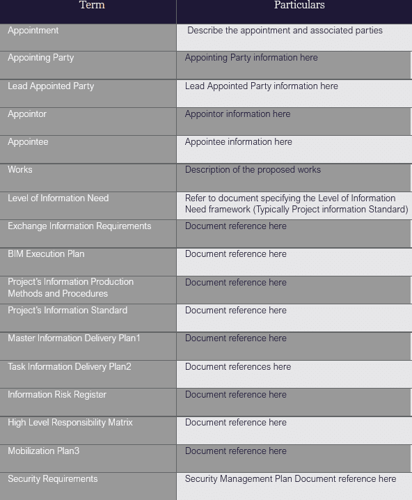
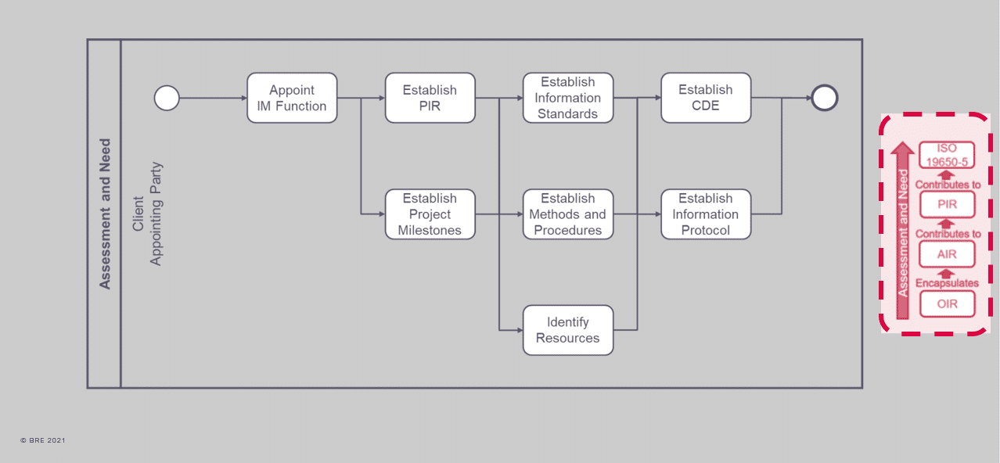
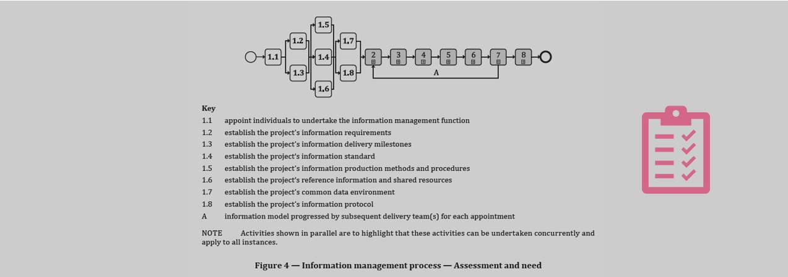

# Unit 4 - Lesson 6 - Establish Shared Resources, CDE & Protocol

*Lesson 6 of 6*

**Lesson Objectives**

> [!warning] Missing audio (00:09)
> No local audio file matched this placeholder (referenced `assets/iSbGHD-b7SYrzwqt_transcoded-sedwxts_oAPaKqDL-m4s249.mp3`).

## Establish the Projects Shared Resources

The appointing party should consider any information they have available that may benefit the prospective delivery teams.

These can vary project to project but typical examples may include:

- Existing asset data and specifications
- Existing building data such as point cloud surveys, site and other plans
- Document templates to be used for consistency
- Object libraries (Open Data standards preferred)
Using Open data standards can reduce interoperability issues for shared resources. Open formats  are publicly available specifications that define file formats, such as:

*
Part 5: Security-minded approach to information management*

> [!note] Audio transcript (00:54)
> The use of open standards reduces the likelihood of interoperability issues. However, although there is talk about open data, most templates are software specific and it is difficult to do this within IFC etc. The following data formats are publicly available specifications that can be used by anyone royalty free. These are known as open BIM standards. Industry Foundation Classes, IFC, which is a standard used for object-based models maintained by building SMART through ISO 16739. It is also available as a file format as IFC ZIP, IFC XML. Open Office XML, a format used for documentation maintained by Microsoft through ISO 29500. Portable Document Format, PDF, a format used for documentation maintained by Adobe through ISO 32000.
>
> Source: [Lesson 6 - Establish Shared Resources CDE Protocol - ISO 19650 1.mp3](assets/Lesson 6 - Establish Shared Resources CDE Protocol - ISO 19650 1.mp3)

## CDE Solution Requirements

**The CDE solution must enable the following:**

- A unique I.D based on the agreed standard for naming convention defined in the Projects Information Standard
- Each field to be to an agreed standard as above
- The ability to assign a Status, Revision & Classification code
- Ability to move the information containers through CDE states
- Secure access & permission controls
**A typical CDE configuration procedure may be:**

- Create a new project using the agreed folder structure, possibly using a company template
- Assign appropriate company and individual access permissions
- Test folder configuration
- Test information container transition between states
- Carry out CDE process inductions
- Invite users for the next stage
## Exercise

Which of the following file formats is not based on an open data standard?

## Establish the Projects CDE

The appointing party shall establish the project’s **common data environment (CDE), **bearing the responsibility for creating, configuring, and continuously supporting the collaborative production of information.

> The CDE is both a technical solution, and a workflow process, not a piece of software.

## Project's Information Protocol

As explained in Unit 3 Lesson 02, a Project’s Information Protocol must be established by the appointing party in accordance with  ISO 19650-2 clause 5.1.8. They may ask for advice from their legal team during this process.

Each appointment documentation must contain an information protocol. The Information Protocol is the legal agreement document for all appointments in the supply chain and should also be used for any suppliers where they are appointing their own subcontractors and suppliers.

> [!note] Audio transcript (00:40)
> The appointing party needs to apply the Projects Information Protocol to all appointments on the project. This was previously the CIC BIM protocol in the UK. However, the terminology did not align to ISO19650 and as such the UK BIM framework have provided a template. Internationally there would need to be a protocol that deals with the legal aspects of BIM. Depending on the form of contract the Projects Information Protocol may be integrated or a standalone document. For example, the NEC 2017 suite of contracts integrates the Projects Information Protocol with its Z clauses. However, care must be taken as the NEC has its own set of terminology for BIM.
>
> Source: [Lesson 6 - Establish Shared Resources CDE Protocol - ISO 19650 1 (1).mp3](assets/Lesson 6 - Establish Shared Resources CDE Protocol - ISO 19650 1 (1).mp3)

The project’s information protocol shall be established to capture:

Specific obligations

## Project's Information Protocol Particulars

The information protocol is reliant upon a complete set of particulars and appointment documents that comply to ISO 19650-2.

The Information Particulars are the project-specific details that need to be completed. These use the correct terminology of ISO 19650 and include basic details such as the Appointor and Appointee together with references to the technical documents such as the Exchange Information Requirements and the BIM Execution Plan.

See an example of Protocol Particulars based upon the Information protocol, edition 3 by the UK BIM framework.

## Assessment & Need Activities

> [!note] Audio transcript (01:44)
> At the Assessment and Need Activity, the Appointing Party shall have regard to the effective management of information throughout the project, as summarised here. The Appointing Party shall firstly nominate an individual or individuals to carry out information management function. This appointment can either be from or within the Appointing Party's organisation, or through a third party. Project information requirements, PIR, will also need to be produced in order to identify informational needs from both project management process and the asset management process. The Appointing Party will establish the project information requirements considering the project scope, the intended purpose for which the information will be used by the Appointing Party, the project plan of work, the intended procurement route, the number of key decision points throughout the project, the decisions that the Appointing Party needs to make at each key decision point, and the questions to which the Appointing Party needs answers to make informed decisions. The Appointing Party should then look at their organisational information requirements, OIR, such as strategic business operation, portfolio management and regulatory duties, to name a few. If management of security and surveillance are required for the project, the Appointing Party will then need to take into consideration ISO-19650 Part 5, Security-Minded Approach to Information Management. The Appointing Party will also need to engage with an asset management team who will be managing the asset or assets in order to understand information deliverables from which the asset information requirements, AIR. Finally, all of this will inform the Appointing Party's exchange information requirements, EIR, setting out managerial, commercial and technical of producing project information.
>
> Source: [Lesson 6 - Establish Shared Resources CDE Protocol - ISO 19650 1 (2).mp3](assets/Lesson 6 - Establish Shared Resources CDE Protocol - ISO 19650 1 (2).mp3)

Activities for assessment and need are shown in Figure 4 below.

*ISO 19650-2 clause 5.1.8*

## Learning Summary 

Lesson complete! You are now able to:

Understand an overview to ISO 19650 Part 2 clauses 5.1.6, 5.1.7 & 5.1.8

**Unit 4 Complete!
**

## Module Complete, you may now close this window to continue your course

---
*Extracted from `Lesson 6 - Establish Shared Resources, CDE & Protocol_ - ISO 19650 1&2 Project Delivery_ Unit 4 - Assessment & Need.html` via webpage-content-extractor.*
