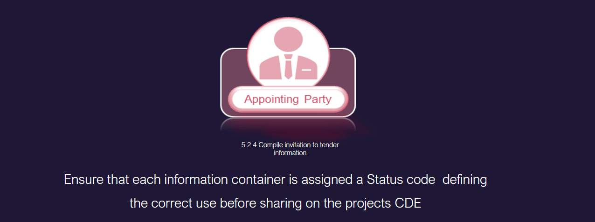

# Unit 5 - Lesson 3 - Tender Response & Evaluation Criteria

*Lesson 3 of 3*

## Lesson Objectives

At the end of this lesson, you will be able to:

Understand Tender Responses and Evaluation Criteria

> [!warning] Missing audio (00:12)
> No local audio file matched this placeholder (referenced `assets/Jgxs4kqhRFWjBsYO_transcoded-7mNgMGaU8my5ae3q-m5s278.mp3`).

## Evaluation Criteria

The systems to support this evaluation and acceptance processes are:

- Project procurement
- BIM execution plan
- I.M competency assessments
- Capability and capacity summary
- Information risk register
- Mobilization plan
> [!note] Audio transcript (01:13)
> The appointing party shall use a set of criteria typically defined in the EIR to either accept or reject the information. Typically evaluation considerations could be grouped under the following sections, price, understanding of the requirements, compliance with ITT requirements, technical skills, resource availability, management skills and systems, proposed methodology. Price is not part of the IM portion of the ISO as the information procurement appointment should be integrated into the project procurement and it is the project procurement that will consider price. The BIM execution plan can be used to consider whether the delivery team has understood the requirements. A completed tender return or checklist system will confirm compliance. The appointing party needs to evaluate the competency for the IM function. The delivery team capability and capacity summary can be used to consider whether the delivery team has the skills and resources available. The BIM execution plan and information delivery risk assessment can be used to consider whether the delivery team has acceptable management skills and systems in place. The mobilization plan is how you're going to test your proposals work. This can be used to consider whether the delivery team has provided an acceptable methodology.
>
> Source: [Lesson 3 - Tender Response Evaluation Criteria - BIM ISO 19650 1.mp3](assets/Lesson 3 - Tender Response Evaluation Criteria - BIM ISO 19650 1.mp3)

## Compile Invitation to Tender Information

The appointing party shall assemble the invitation to tender package.

> [!warning] Missing audio (00:15)
> No local audio file matched this placeholder (referenced `assets/Uh9BHYHyg1qvFJVQ_transcoded-vsRbe7QLKYRh4L_O-m5s281.mp3`).

## Invitation to Tender Activities

*Summary of ITT or invitation to tender activities 
The appointing party needs to:
Establish EIRAssemble Shared ResourcesEstablish Evaluation CriteriaAnd then compile  the ITT*

## Learning Summary 

Lesson complete! You are now able to:

Understand Tender Responses and Evaluation Criteria

**Unit 5 Complete!
**

Module Complete, you may now close the window and complete this module.

---
*Extracted from `Lesson 3 - Tender Response & Evaluation Criteria - BIM ISO 19650 1&2 Project Delivery_ Unit 5 - Invitation to Tender.html` via webpage-content-extractor.*
