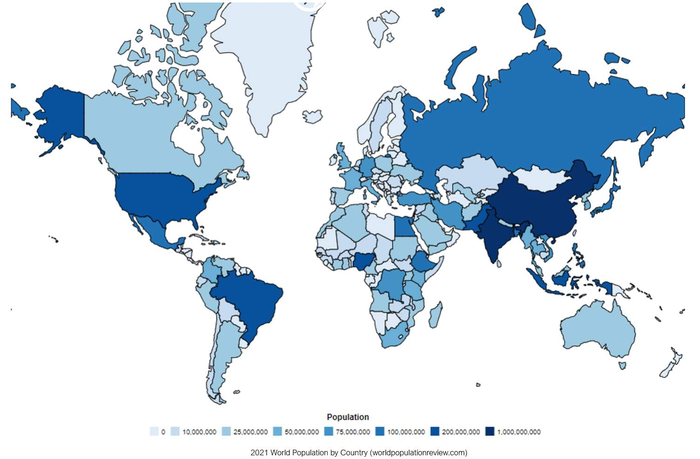
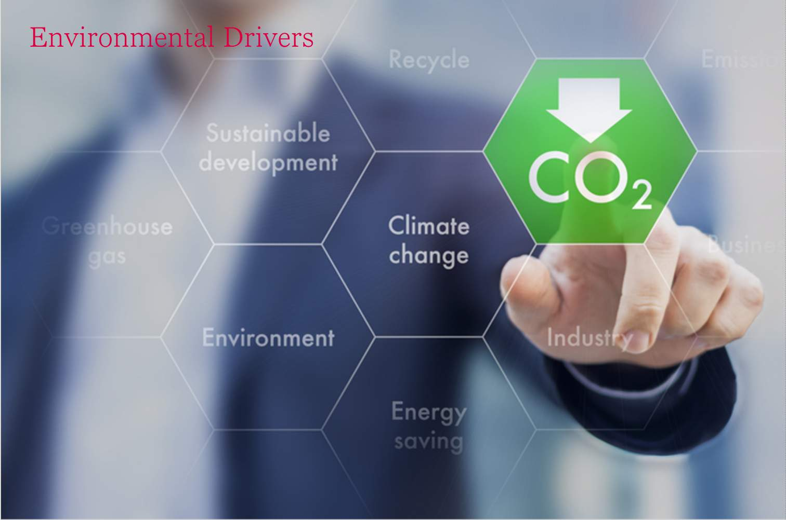
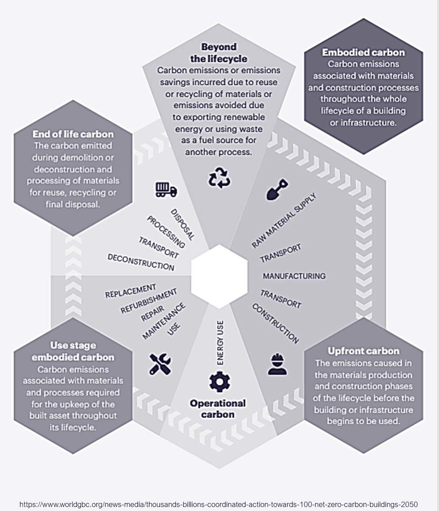
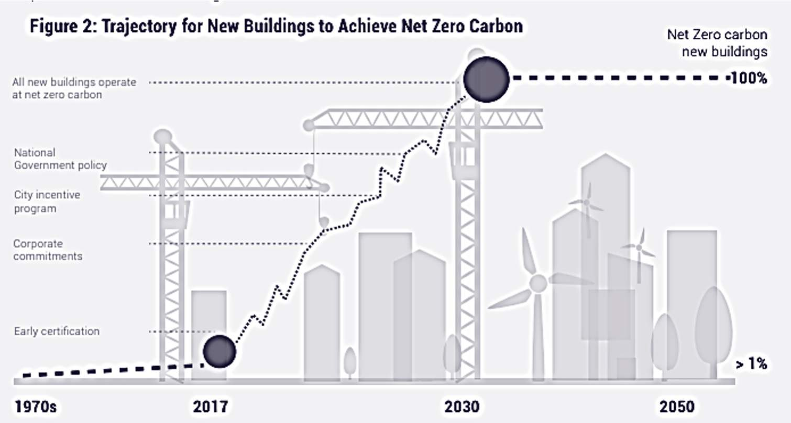

# Unit 1 - Lesson 2 - Global Drivers

*Lesson 2 of 6*

## Lesson Objectives

In this lesson we aim to:

Identify the drivers that have led to BIM; and

Help you to Understand the value of a whole life approach rather than capital-led.

## Global Drivers

> [!note] Audio transcript (00:54)
> Dealing with the demands of change is the biggest challenge facing every organisation today. In order to facilitate change there must be drivers. The benefits of using BIM have been established for decades. Although there have been recent improvements in technology, it is the pressure associated with the identified drivers which are pushing change. The current global drivers can be generally grouped under three main headings, which are also the three pillars of sustainability. These are social, climate and economic. Essentially how we construct needs to change, so that we can meet the needs of our new emerging digital age, meet the needs of a growing global population, minimise the impact on the environment, maximise the use and value of resources, and provide economical viability and sustainability. Typically these are factors that any disruptive innovation faces.
>
> Source: [Lesson 2 - Global Drivers - BIM ISO 19650 12 Project Delivery Un (6).mp3](unit-1-lesson-2-global-drivers/assets/Lesson 2 - Global Drivers - BIM ISO 19650 12 Project Delivery Un (6).mp3)

## Global Population

> [!note] Audio transcript (00:55)
> The global population is currently around 7.9 billion. In 2018 the world's population growth rate was 1.12%. Every five years since the 1970s the population growth rate has continued to fall. The world's population is expected to continue to grow larger but at a much slower pace. By 2030 it is estimated to be 8.6 billion and by 2050 the estimate is 9.8 billion. If the estimate for the year 2050 holds true that means by 2050 there will be an extra 2 billion people on this planet. This equates to another 7 United States worth of people who all need hospitals to be born in, homes to live in, schools to learn in and offices to work in. While this provides an incredible economic opportunity, in order to achieve such a goal there is a need to ensure that how we construct these assets is as efficient as possible.
>
> Source: [Lesson 2 - Global Drivers - BIM ISO 19650 12 Project Delivery Un (7).mp3](unit-1-lesson-2-global-drivers/assets/Lesson 2 - Global Drivers - BIM ISO 19650 12 Project Delivery Un (7).mp3)

## The global population currently is around 7.9 billion 

8.6 Billion

> If the estimate for the year **2050** holds true, that means by **2050** there will be an extra **2 billion** people on this planet.

## Environmental Drivers

> [!note] Audio transcript (01:01)
> It is a fact that global temperatures are rising. Data collected by the National Oceanic and Atmospheric Administration has shown that we have experienced 16 of the 17 hottest years on record since the year 2000. In addition, despite global initiatives, there has been a steady rise in global carbon dioxide emissions. As a result of extreme climates, there has been an increase in both the number of and cost of global disaster events. The National Centers for Environmental Information have reduced data showing an increase in the number of global disaster events, which have cost over a billion dollars after being corrected for inflation over the last 30 years. Due to the increase of global disasters, there is a need to increase the resilience of our built assets, as well as allocate further financial resources to rebuild and repair existing assets. In order to do this, we need better information relating to our built assets and their performance. BIM, therefore, provides an opportunity to aid with this.
>
> Source: [Lesson 2 - Global Drivers - BIM ISO 19650 12 Project Delivery Un (8).mp3](unit-1-lesson-2-global-drivers/assets/Lesson 2 - Global Drivers - BIM ISO 19650 12 Project Delivery Un (8).mp3)

> **2030 Climate Challenge:** How can we reduce embodied carbon by at least** 50-70%? **

> **BREEAM is the world’s leading sustainability assessment method for master planning projects, infrastructure and buildings. It recognises and reflects the value in higher performing assets across the built environment lifecycle.. **

> [!note] Audio transcript (00:28)
> BRE prides itself on remaining beyond reproach and embraces a partnership with you as we build a better world together. Our cutting-edge research brings positive change in the built environment through over 2,250,000 projects registered with Bream and over 560,000 certifications awarded worldwide. That's a lot of data. That's why Bream is the most widely used green building rating system in the world. It's the science behind it.
>
> Source: [Lesson 2 - Global Drivers - BIM ISO 19650 12 Project Delivery Un (4).mp3](unit-1-lesson-2-global-drivers/assets/Lesson 2 - Global Drivers - BIM ISO 19650 12 Project Delivery Un (4).mp3)

[https://www.breeam.com(opens in a new tab)](https://www.breeam.com/)

## Carbon Reduction

The UK is Committed to 80% Net Zero Carbon by 2050

> [!note] Audio transcript (00:29)
> National legislation also has an impact on environmental drivers. For example, the UK has committed to an 80% carbon reduction by 2050. This is an ambitious target as around 70% of the existing buildings within the UK will still be in use by 2050. As shown here, a proportion of this cost is associated to unused material. Therefore, initiatives such as BIM to improve efficiency will not only satisfy economic drivers but environmental drivers too.
>
> Source: [Lesson 2 - Global Drivers - BIM ISO 19650 12 Project Delivery Un (9).mp3](unit-1-lesson-2-global-drivers/assets/Lesson 2 - Global Drivers - BIM ISO 19650 12 Project Delivery Un (9).mp3)

## World Green Building Cycle

*Click the image to zoom in!*

> [!note] Audio transcript (00:22)
> From 2030, all new buildings globally must be built to net zero carbon standards, ensuring that no new carbon emissions are emitted from built operations. Between now and 2050, existing buildings must be renovated as an accelerated rate and to net zero carbon standards so that all buildings operate at net 0 carbon by 2050.

## Trajectory for New Buildings to Achieve Net Zero Carbon

2030 is not far off, and therefore efforts must be ramped up immediately.

*https://www.worldgbc.org/news-media/thousands-billions-coordinated-action-towards-100-net-zero-carbon-buildings-2050*

## UK AEC GDP 

> [!note] Audio transcript (00:54)
> Reducing inefficiencies will have a radical impact on economic drivers. For example, UK construction outputs contribute around 7% to the UK's GDP, being worth around £110 billion. However, following research by both the Construction Industry Institute and the Building Smart Alliance, potentially over half of a project's cost can be attributed to non-value-adding effort or waste in resource and materials. The UK exists within a global market. As such, the UK Construction Industry cannot afford such inefficiency if it aims to compete at the global scale. Beginning with the BIM Level 2 mandate, the UK government took its first step towards reducing this inefficiency. The UK government targeted a 20% reduction in the capital cost of assets and a targeted 33% reduction in the whole-life cost by the year 2025.
>
> Source: [Lesson 2 - Global Drivers - BIM ISO 19650 12 Project Delivery Un (10).mp3](unit-1-lesson-2-global-drivers/assets/Lesson 2 - Global Drivers - BIM ISO 19650 12 Project Delivery Un (10).mp3)

> UK Construction output contributes = **7% **of UK’s GDP The UK AEC sector is worth about **£110 billion** over 3 Main areas:

**Commercial & Social: £49 billionResidential: £42 billion Infrastructure: £19 billion **

## Cost of Poor Data

> A recent study from ‘**Transparency Market Research**’ projected that global construction waste will reach **2.2 billion tons** by **2025**!

> ‘**Construction Disconnected**’ report shared that poor project data and miscommunication on projects is responsible for **48%** of all rework in construction in the U.S, accounting for a total of **$31.3 billion** in rework in the U.S. alone in **2018**

> [!note] Audio transcript (00:17)
> In order for us to harness data to make it usable in the future, it must be accessible, consistent, clean, connective and usable. Making this information available to project decision makers will help improve design, management, planning and quality.

> [!note] Audio transcript (00:53)
> The benefits of using BIM for design and construction are generally well understood and documented. The production of clear, correct and unambiguous information is central to BIM adoption, but so is meeting the global social, environmental and economic drivers. Previously highlighted the intention for extending building
information modeling to BIM as information management will facilitate informed decision making. The 2011 UK mandate for BIM Level 2 recognized that for designing construction the advantages of those informed decisions. Could add a 20% reduction in capital expenditure, which was a massive driver for BIM adoption. The BIM Level 2 mandate focused primarily on improving information management in the design and construction phases. ISO 19650 focuses on information management throughout the whole life cycle of an asset or project.

> [!note] Audio transcript (01:24)
> That massive design and construction opportunity is tiny when taking into account the enormous opportunity that does exist over an asset's life cycle and the real benefits this could bring. Whilst design and construction is insignificant when compared to the size of operations and maintenance, the business costs and business outcomes are significantly larger and are where the ultimate value is for informed decisions based on accurate information. ISO19650 Parts 3 deals specifically with operational phase of the assets. A typical example can be asking the designers and constructors to provide the information in the appropriate formats to support not only the operations and maintenance requirements but also the business costs and outcomes requirements. If these requirements are not provided, it is unlikely that the information will be provided to meet those long term aims and support the decision making process. 70-80% of a building's life cycle costs occur after construction. Economically BIM has two benefits, cost savings and cost avoidance such as improving the cooperation and maintenance of an asset. Efficient planning and tracking and optimization of systems through automation may reduce potential downtime costs. This stage represents a significant opportunity for cost efficiencies.
>
> Source: [Lesson 2 - Global Drivers - BIM ISO 19650 12 Project Delivery Un (5).mp3](unit-1-lesson-2-global-drivers/assets/Lesson 2 - Global Drivers - BIM ISO 19650 12 Project Delivery Un (5).mp3)

> Economically, BIM has two benefits - Cost Savings & Cost Avoidance

## Lesson Summary

Lesson complete! You are now able to:

Identify the drivers that have led to BIM; and

Help you to Understand the value of a whole life approach rather than capital-led.

**[CONTINUE]**

---

## Ten-Question Analysis Framework

### 1. Problem
Why must the construction industry transform from fragmented, capital-cost-driven delivery to lifecycle-oriented information management?

### 2. Applicability
- **Scope**: Macro-economic, environmental, and demographic industry drivers.
- **Drivers**: Population growth (+2 billion by 2050), Climate challenge (50-70% embodied carbon reduction by 2030), Whole-life cost optimization (70-80% of costs occur in operation).

### 3. Process
1. Align organizational objectives (OIR) with societal and environmental pressures.
2. Mandate digital information deliverables during design and construction that serve operational efficiency.
3. Quantify cost savings (direct reduction) and cost avoidance (reduced downtime, fewer clashes).

### 4. Evidence
- Whole-life carbon assessments and energy model benchmarks.
- Life-cycle costing reports and post-occupancy evaluation data.

### 5. Principles
- **Whole-Life Value over CapEx**: The real economic prize of BIM is in asset operations and business outcomes, not merely capital delivery.
- **Cost Savings vs Cost Avoidance**: BIM delivers both direct production savings and long-term risk avoidance.

### 6. Risks & Anti-patterns
- Procuring BIM solely for design-stage clash detection without capturing operational asset data.

### 7. Operationalization
- Whole-Life Cost & Carbon EIR requirement template.

### 8. Skill Test
Can this become a Skill?
No (strategic context).

### 9. Skill Design
- **Supported Role**: Asset Owner / Portfolio Director.

### 10. Validation Plan
Audit business case justifications against whole-life cost outcomes.

---

## Knowledge Space Links
- **Entities**: [[iso-19650-1]], [[iso-19650-3]]
- **Concepts**: [[information-model]]

---
*Extracted from `Lesson 2 - Global Drivers - BIM ISO 19650 1&2 Project Delivery_ Unit 1 - Catalyst for Change.html` via webpage-content-extractor.*
