# Unit 1 - Lesson 3 - A History of BIM

*Lesson 3 of 6*

## Lesson Objectives

In this lesson we aim to:

Understand the historical changes In the construction industry that led to BIM standards and mandates.

## A History of BIM

> [!note] Audio transcript (02:31)
> In 1976, BRE published Coordinating Working Drawings. This publication surveyed the effect of poorly coordinated working drawings from 25 different construction projects. In 1987, in an attempt to aid the industry, the Building Project Information Committee, BPIC, was formed under joint sponsorship from a number of industry bodies, such as the RIBA, RICS and CITA in 1987. The committee is now known as Construction Project Information Committee, CPIC. In 1994, the Latham Report was published, which was one of many publications which was quite critical of the UK construction industry. Key issues identified in the Latham Report were issues such as lack of client involvement, as well as poor client satisfaction. A number of negative terms were associated with the industry, including ineffective and adversarial. As such, the report recommended the use of teamwork to improve the industry's performance and achieve better value for money. Rethinking Construction. Four years later, in 1998, the Egan Report was published. This report was to look at the progress UK construction has made since Latham. The results were not positive. There was a deep concern that the industry was underachieving. It suggested that the industry had low profitability and did not invest in research, development and training. The report also recommended further client involvement, noting that projects with client-led initiatives had seen dramatic improvements. Concluding the report, new targets were set, including an annual capital cost reduction of 10%, as well as a reduction in post-construction defects by 20%. Accelerating Change. In 2002, Egan's second report, Accelerating Change, was published. This was a much more positive report than the first, commenting on the need to further improve based on the positive reaction that industry has had since Rethinking Construction. Continuing on from previous reports, Accelerating Change suggests that clients should lead the process and facilitate the creation of integrated teams. The report set out a target that, by the end of 2004, 20% of construction projects by value should be undertaken by integrated teams and supply chains. And, by the end of 2007, both of these figures should rise to 50%.
>
> Source: [Lesson 3 - A History of BIM - BIM ISO 19650 12 Project Delivery (9).mp3](unit-1-lesson-3-a-history-of-bim/assets/Lesson 3 - A History of BIM - BIM ISO 19650 12 Project Delivery (9).mp3)

> [!note] Audio transcript (00:55)
> As we move to more recent times, and specifically in relation to BIM implementation and standards, the first document relating to the collaborative production of information was BS 1192 2007. We will discuss these in more detail shortly. The Government Construction Strategy was published in May 2011 to support the growth of the construction sector and aim to help reduce costs by up to 20% by 2016. This is where the term BIM Level 2 was created, based on the BS PAS 1192 standards. BIM is currently defined by the ISO 19650 standards, which are a suite of standards created to replace the previous BS PAS 1192 suite. BIM levels were removed and we now work to stages, or BIM according to ISO 19650.
>
> Source: [Lesson 3 - A History of BIM - BIM ISO 19650 12 Project Delivery (8).mp3](unit-1-lesson-3-a-history-of-bim/assets/Lesson 3 - A History of BIM - BIM ISO 19650 12 Project Delivery (8).mp3)

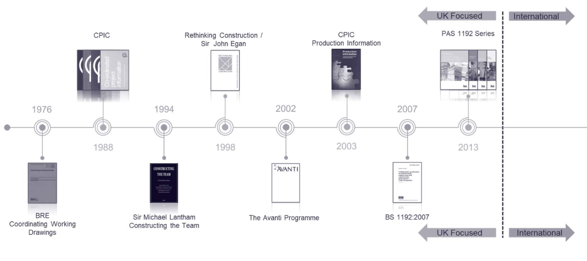

> [!note] Audio transcript (00:32)
> Shown here is a timeline of key publications highlighting the need for better information management and standards produced as a result of industry findings. You will see from this slide that up to 2013 these have been focused on the UK market. Publicly available specification, PAS, were produced as a fast-track standard specifications codes of practice or guidelines developed by sponsoring organisations to meet an immediate market need. We shall discuss in further detail in the following slides.
>
> Source: [Lesson 3 - A History of BIM - BIM ISO 19650 12 Project Delivery.mp3](unit-1-lesson-3-a-history-of-bim/assets/Lesson 3 - A History of BIM - BIM ISO 19650 12 Project Delivery.mp3)

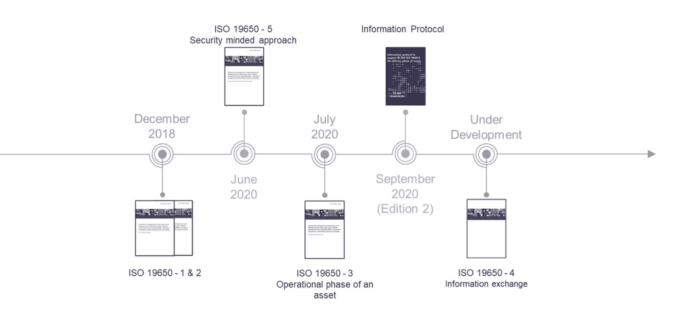

> [!note] Audio transcript (01:17)
> In December 2018, ISO19650 Parts 1 and 2 were published. ISO19650 Part 1 concerns the concepts and principles of information management, using building information modelling, covering both project delivery and asset operation parts of an asset lifecycle. ISO19650 Part 2 supports Part 1 with detailed requirements during the delivery phase of an asset. In June 2020, ISO19650 Part 5 was published and outlines and assists in reducing the risk of the loss, misuse or modification of sensitive information. In July 2020, ISO19650 Part 3 was also published and incorporates UK Publicly Available Specification 1192 Part 3 dealing with OPEX, Operational Phase of an Asset. In September 2020 and as part of the UK BIM framework, the second edition of the information protocol was published to support contracts involving ISO19650 Part 2. Also currently under development and out for public comments at the time of writing this course is ISO19650 Part 4 which concerns exchanges of information when working within the ISO19650 series.
>
> Source: [Lesson 3 - A History of BIM - BIM ISO 19650 12 Project Delivery (1).mp3](unit-1-lesson-3-a-history-of-bim/assets/Lesson 3 - A History of BIM - BIM ISO 19650 12 Project Delivery (1).mp3)

## BS1192:2007

Common Data Environment
File container classification
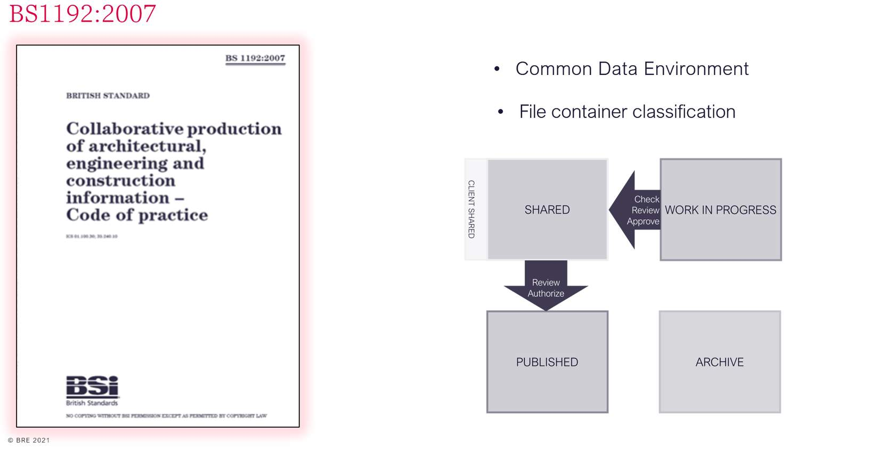

> [!note] Audio transcript (00:44)
> BS 1192 2007 Collaborative Production of Architectural Engineering and Construction Information Based on the success of the case studies and effort by Avanti and CPI, work began on developing key elements into a British standard. This standard would be a code of practice meaning that this way of working is seen as best practice and should be adopted. It covered the production and use of information throughout design, construction, operation and decommissioning. BS 1192 2007 Content introduces and covers methods for producing information, methods for managing information, the common data environment and file container classification.
>
> Source: [Lesson 3 - A History of BIM - BIM ISO 19650 12 Project Delivery (2).mp3](unit-1-lesson-3-a-history-of-bim/assets/Lesson 3 - A History of BIM - BIM ISO 19650 12 Project Delivery (2).mp3)

Naming Conventions
Suitability & Revision Codes
> [!note] Audio transcript (00:19)
> Also naming conventions, suitability codes, revision codes in 2007 BS 1192 2007 was published. However, unfortunately, even with the publication of the British standard, these coordinated standards, methods and procedures were not widely adopted by the industry.

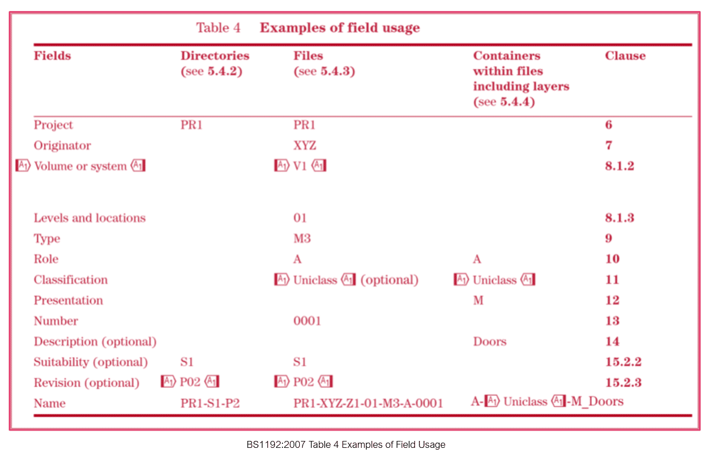

## Government Construction Strategy

**BIM Level 2**

> **BIM level 2** defined what, when and how information should be created, shared and managed.

This meant fully federated models and the exchange of project and asset information through a common data environment (CDE).

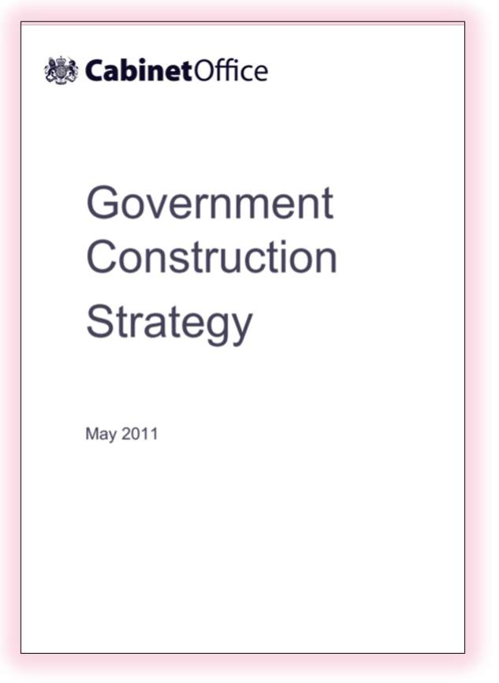

**BIM Level 2
**

> **PAS** stands for **P**ublicly **A**vailable **S**pecification.

> [!note] Audio transcript (00:41)
> The key elements of BIM Level 2 were the introduction of, Employers Information Requirement, Collaborative Working, BIM Models Per Discipline or Author, Classification, Methods for Information Exchange, a Federated Model, Asset Lifecycle Considerations and a Digital Plan of Work. PAS stands for Publicly Available Specification. They are typically fast-track standard specifications, codes of practice or guidelines developed in order to address an immediate need in the industry. Within two years they are reviewed to access whether they should be revised, withdrawn or become formal British standards or international standards.
>
> Source: [Lesson 3 - A History of BIM - BIM ISO 19650 12 Project Delivery (3).mp3](unit-1-lesson-3-a-history-of-bim/assets/Lesson 3 - A History of BIM - BIM ISO 19650 12 Project Delivery (3).mp3)

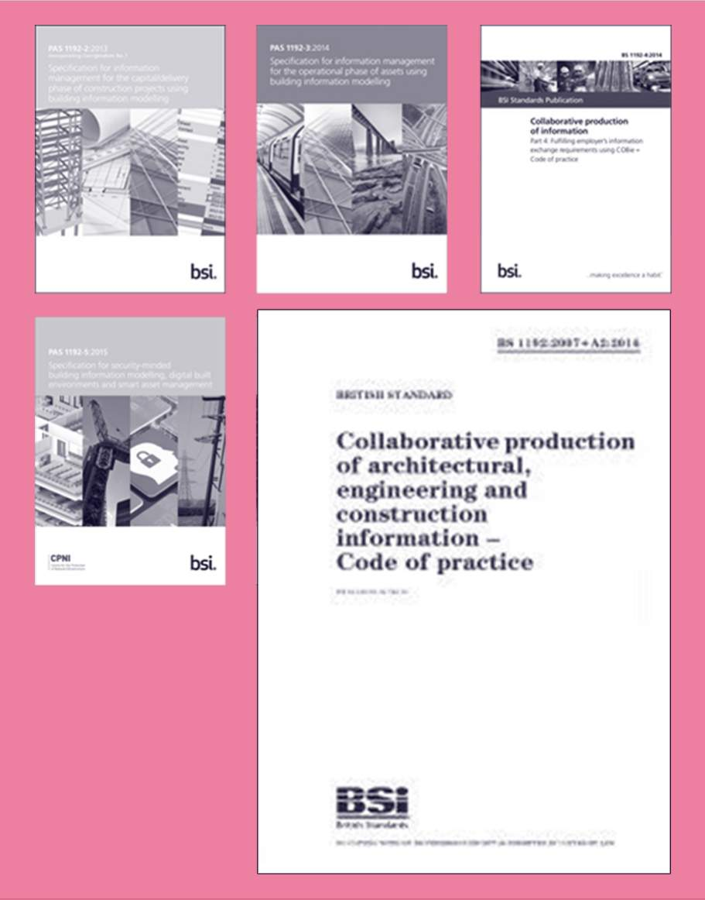

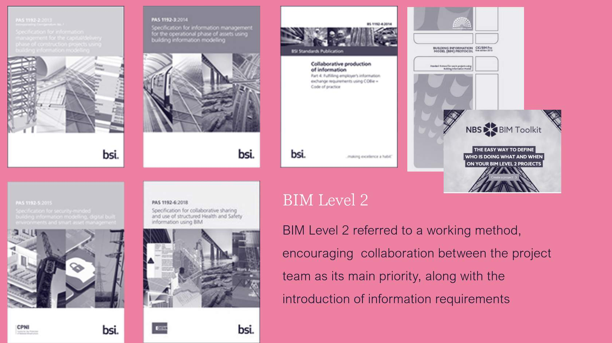

*Beginning with the end in mind was the strategy for considering information in relation to a projects whole lifecycle.
*

PAS 1192-2:2013

Specification for information management for the capital/delivery phase of construction projects using building information modelling

## Government Soft Landings

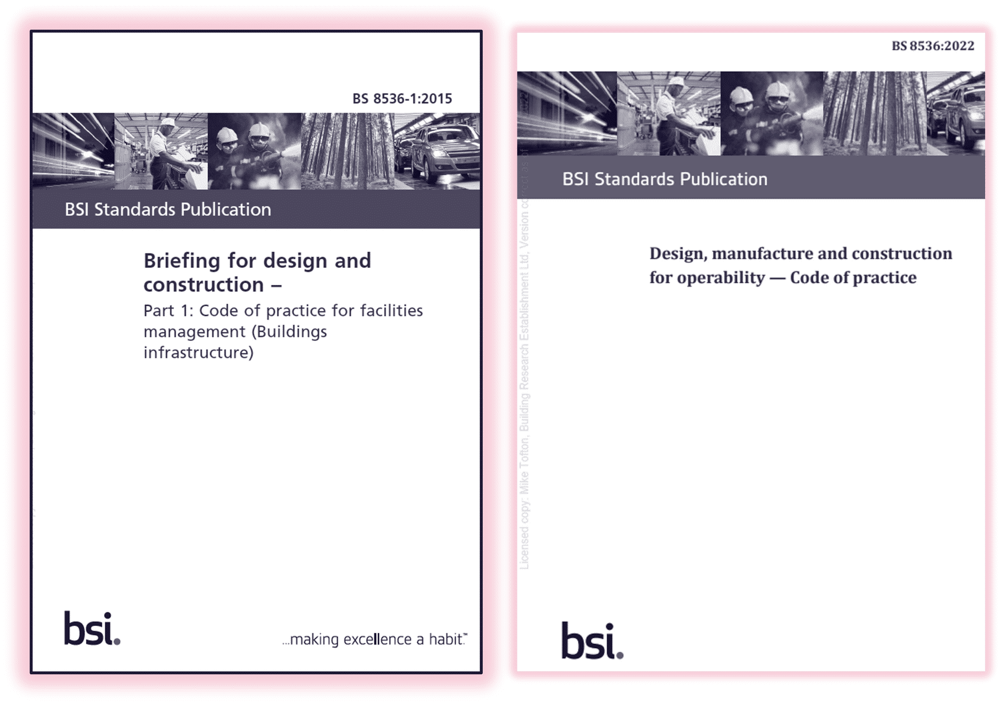

**The image below shows the Government Soft Landings activities for each stage of the project. **

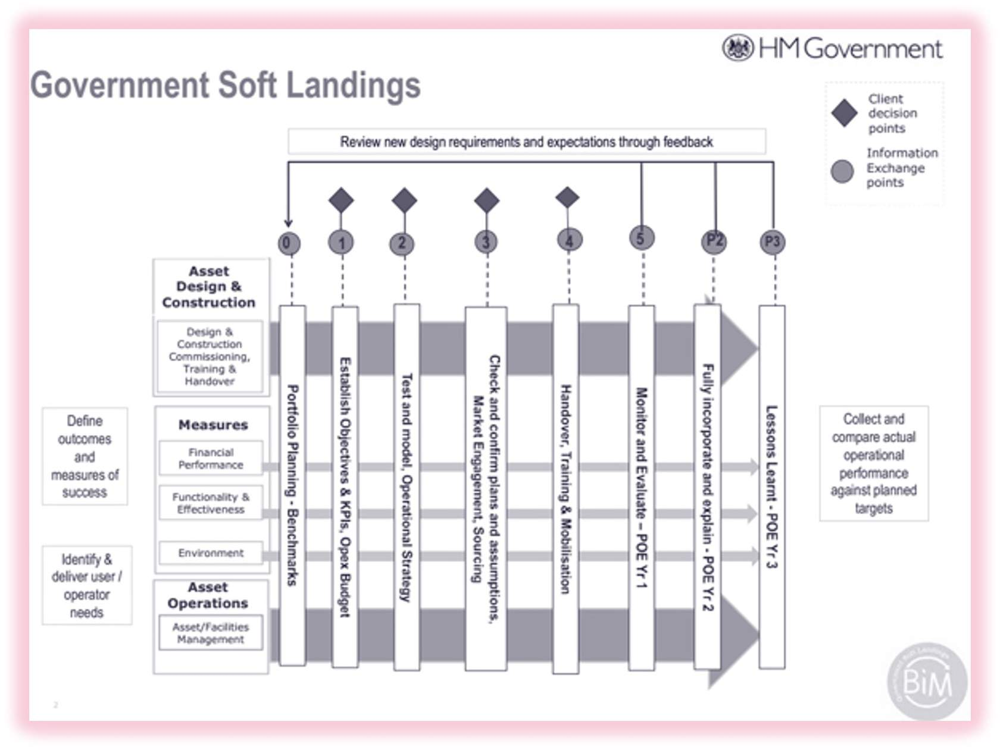

BS 8536 is now also incorporated into the UK BIM Framework. Embedding Government Soft Landings (GSL) and  ‘Golden Thread’ as part of a data centric approach

This highlights the overall approach highlighting the importance of performance reviews and feedback loops with lessons learnt captured and fed into future projects.

The approach provides a clear line of sight from inception right through to handover and operations, enabling the management and safeguarding of the projects stated outcomes.

## ISO 19650 1 & 2

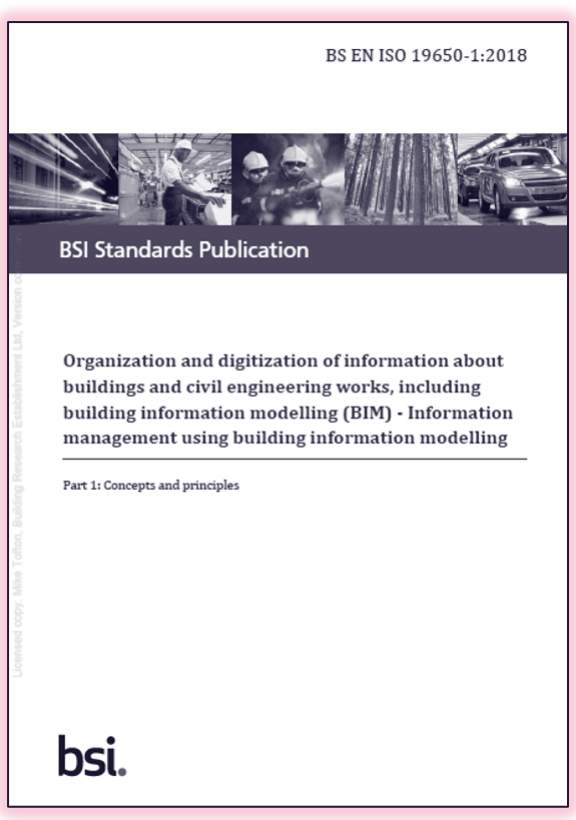

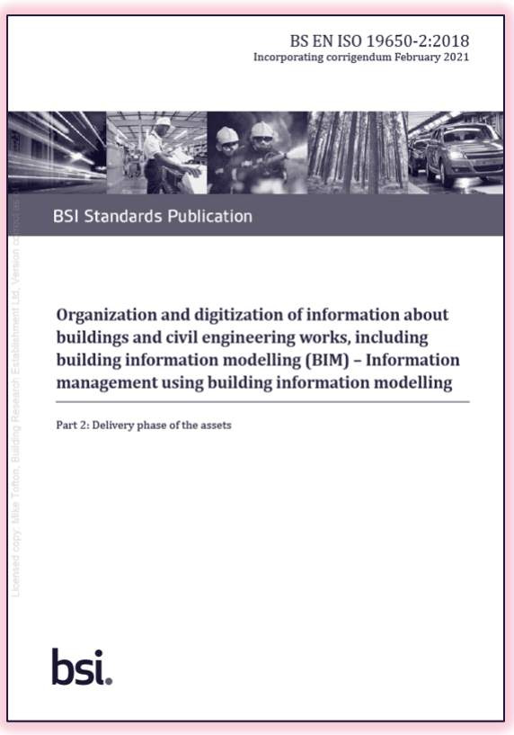

> [!note] Audio transcript (01:00)
> The ISO-19650 standards relating to the organisation and digitisation information management using Building Information Modelling is divided into five parts. The first of the documents to be released were Parts 1 and 2 in 2018, BSEN ISO-19650-1 2018 Part 1, Concepts and Principles, defines the concepts and principles for processes for defining information requirements and a framework in support of management and production of information during the life cycle of the bill assets. This is referred to as Information Management, BSEN ISO-19650-2, 2018 Part 2, Delivery Phase of the Assets defines additional processes and information exchange principles relating to the planning, management, exchange and delivery of information. These superseded the BIM Level 2 standards and this set of standards became known as BIM according to ISO-19650.
>
> Source: [Lesson 3 - A History of BIM - BIM ISO 19650 12 Project Delivery (4).mp3](unit-1-lesson-3-a-history-of-bim/assets/Lesson 3 - A History of BIM - BIM ISO 19650 12 Project Delivery (4).mp3)

## ISO 19650 Standards

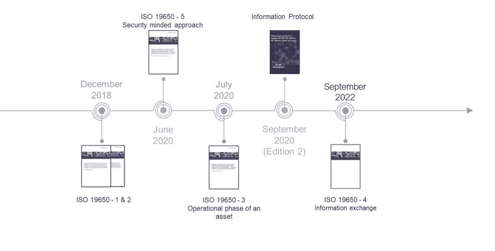

> [!note] Audio transcript (01:17)
> Following on from Parts 1 and 2, the additional documents within the suite were developed. ISO19653, published on August 2020. BSENISO19654 is currently under development and out for public comments. And ISO19655 was published in July 2020. BSEN19653, published August 2020. Part 3 relates to the operational phase of assets. It defines an information management process that enables asset owners or facility managers or operators to establish information requirements relating to the operational phase of an asset through to the end of life. BSENISO19654 is currently under development and out for public comments. And Part 4 relates to the information exchange, or more specifically Kobi, which is a subset of IFC, Industry Foundation class, which itself is already an international standard. BSENISO19655, published in July 2020. Part 5 relates to a security-minded approach to information management. It defines principles for security-minded management of sensitive data and information in relation to a project, asset, product or service.
>
> Source: [Lesson 3 - A History of BIM - BIM ISO 19650 12 Project Delivery (5).mp3](unit-1-lesson-3-a-history-of-bim/assets/Lesson 3 - A History of BIM - BIM ISO 19650 12 Project Delivery (5).mp3)

## ISO 19650 Parts 3 - 5

BS EN ISO 19650-3: Published August 2020

Part 3 relates to the Operational phase of assets.

Defines a information management process that enables asset owners or facility managers / operators to establish information requirements relating to the operational phase of an asset, through to the end of life

## PAS 1192-6 

> The UK Construction sector is obliged to manage and protect the occupational health and safety of its workers and the public affected by its activitiesPAS 1192-6 is a specification for collaborative sharing and use of structured health and safety information using BIM.

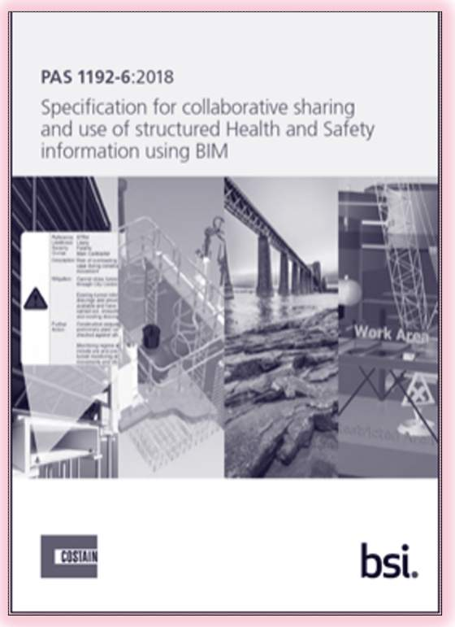

> [!note] Audio transcript (00:33)
> The UK construction sector is obliged to manage and protect the occupational health and safety of its workers and the public affected by its activities. PAS 1192-6 is a specification for collaborative sharing and use of structured health and safety information using BIM, released later in 2018 as part of the BIM Level 2 documents. ISO slash AWI-19656 Information Management using Building Information Modelling, Part 6, Health and Safety is under development.
>
> Source: [Lesson 3 - A History of BIM - BIM ISO 19650 12 Project Delivery (6).mp3](unit-1-lesson-3-a-history-of-bim/assets/Lesson 3 - A History of BIM - BIM ISO 19650 12 Project Delivery (6).mp3)

> Section 5.2, risk identification & 4.3.3 use of entities and annotation in models explains the need for 3D hazard identification in BIM models.

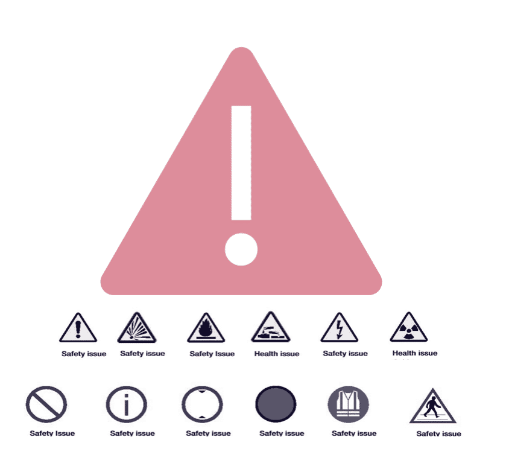

*3D Hazard markers in Revit *

> [!note] Audio transcript (00:23)
> PAS 1190 26 A key part of the document is Section 52 Risk Identification and also 4.3 Use of Entities and Annotation in Models and Documents. In response to this section, BIM models should utilize a 3D hazard marker for the clear communication of hazards or risks within a live information model.

## PAS 1192-6 & CDM Duties 

> When undertaken properly, BIM processes can greatly aid CDM duty holders fulfilling their responsibilities and identifying foreseeable risks. The Health and Safety Executive identify the following benefits:

Models help identify and reduce risks in planning

> **Using BIM effectively can help building and asset owners mitigate risk**

## A History of BIM

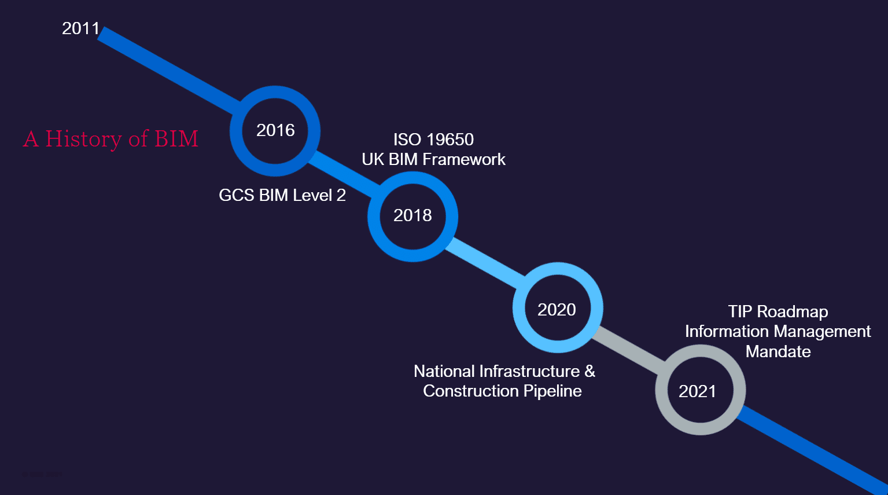

> [!note] Audio transcript (01:01)
> Things have then progressed again, more recently in 2020 and at the end of 2021. The Infrastructure and Projects Authority, IPA, has published the National Infrastructure and Construction Pipeline 2021 and Transforming Infrastructure Performance, Roadmap 2030, the TIP Roadmap. Together they outline projected investment of nearly £650 billion in the UK's infrastructure over the rest of the decade and articulate a consistent shared vision for the future of the built environment. The TIP Roadmap succeeds the Government Construction Strategy and sits alongside the Construction Playbook and the National Infrastructure Strategy. For the next decade, these three documents will influence the direction of change within the built environment. The TIP Roadmap affects all central government departments built environment procurement activities, creating an updated information management mandate delivered through the application of UK BIM framework.
>
> Source: [Lesson 3 - A History of BIM - BIM ISO 19650 12 Project Delivery (7).mp3](unit-1-lesson-3-a-history-of-bim/assets/Lesson 3 - A History of BIM - BIM ISO 19650 12 Project Delivery (7).mp3)

## National Infrastructure 
& Construction Pipeline (U.K) 

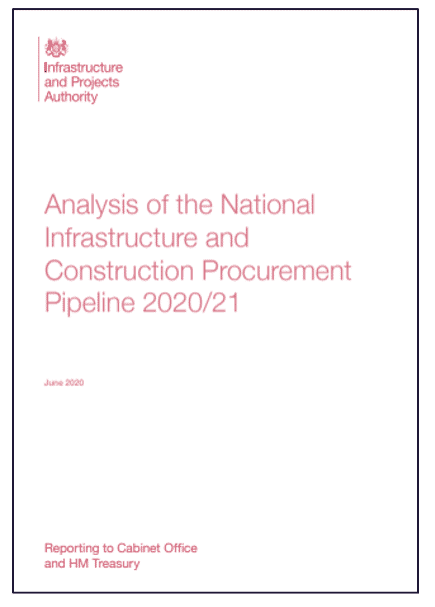

The Pipeline sets out details of planned public and private infrastructure investment over the next 10 years, as shown below.

The strategic tool provides a single source of data to enable the planning of future requirements, in order to address skill shortages for example and gives a degree of certainty to the supply chain or potential investors.

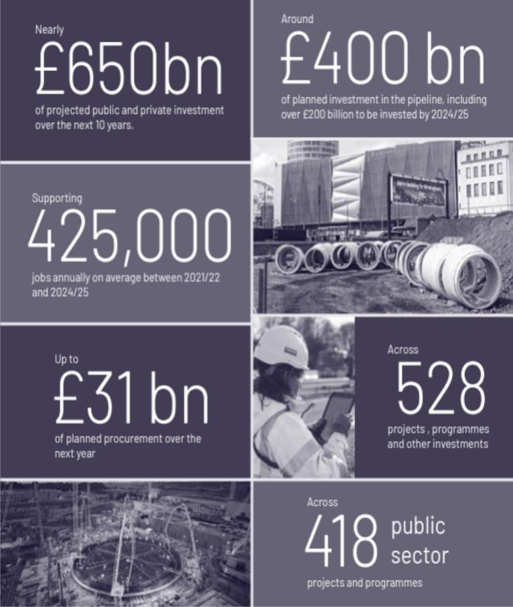

*https://www.gov.uk/government/publications/national-infrastructure-and-construction-pipeline-2021*

## National Infrastructure & Construction Pipeline 

The Pipeline can be downloaded and viewed yourself, see here the National Infrastructure and Construction Pipeline 2021 (xls)

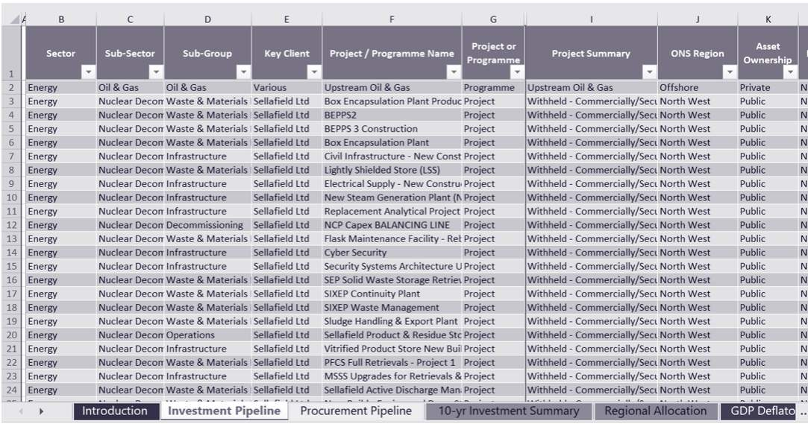

This lists the proposed projects, and key metrics or information related to them.

Link: [https://www.gov.uk/government/publications/national-infrastructure-and-construction-pipeline-2021(opens in a new tab)](https://www.gov.uk/government/publications/national-infrastructure-and-construction-pipeline-2021)

## Transforming Infrastructure Performance: Roadmap to 2030

The **TIP Roadmap to 2030** provides a reform for the delivery of infrastructure. Its purpose is to drive a change in infrastructure performance and its affect on the environment using digital technologies and processes on the road to **Net zero carbon**

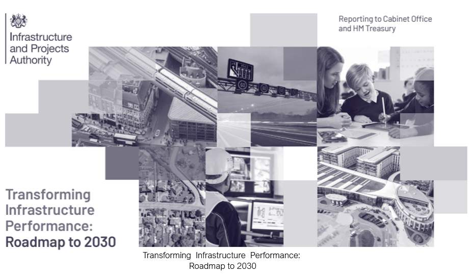

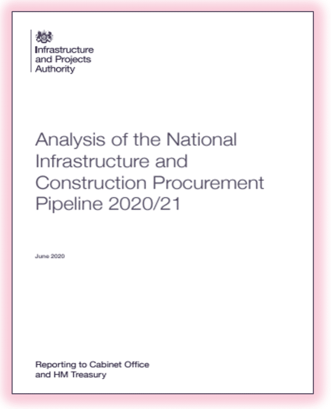

Data will be key to informing decision making, from improved information management in delivery to the creation of digital twins for asset maintenance and optimisation.

Successful delivery requires new collaborative ways of working and embracing of technologies to deliver better performance across the asset lifecycle.

*The TIP Roadmap  succeeds the GCS and will sit alongside the Construction Playbook and the National Infrastructure Strategy.*

The new Project Outcome Profile will be a key tool in supporting outcomes relating to the built environment and the provision of services, changing the ways we plan, design, manufacture, construct and operate.

**The TIP Action Plan sets out 5 focus areas for the changes that are required:**

Delivering new economic infrastructure

Optimise built environment performance

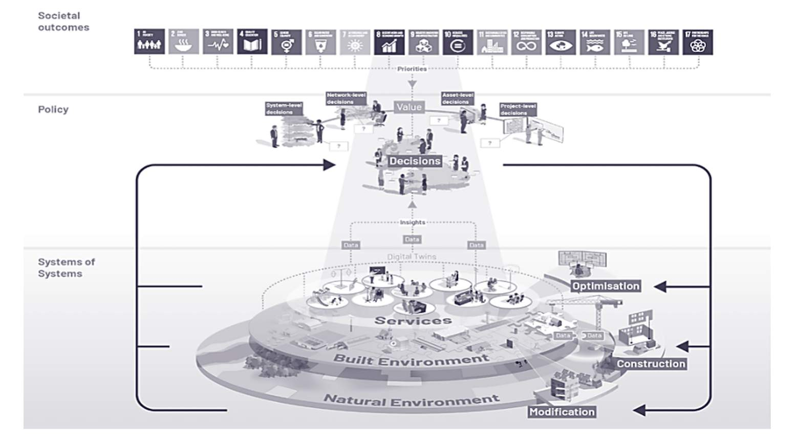

*This Built Environment Model envisages a new approach to decision making that is founded on an understanding of the interlinked nature of our infrastructure systems.*

![TIP Use Case StudyHS2: Improving cost management using 5D BIM The problem: Industry is seeking to improve cost management by incorporating information on carbon, materials and cost into engineering models. The action: The Skanska, Costain, Strabag (SCS) team have developed engineering models for 5D estimating reducing the time taken to calculate quantities and prices. The first-of-its kind approach, named 5D Plus, combines a cost estimating programme with a carbon estimating tool.The structured information requires no manipulation, with all stakeholders collaborating to ensure consistency and transparency. The material quantities and costs change as the design is modified, enabling the team to assess the impacts on cost and carbon. With structured data aligned to industry standards, HS2 focuses on the areas most impacted by carbon, further optimizing materials and costs. The result: The implementation of 5D BIM on HS2 resulted in 80% less resources than planned, which was proven to save £600,000 during an initial 5D trial. In terms of carbon management, the carbon footprint was calculated 80% faster while reducing waste. TIP: Roadmap to 2030 Figure 1 - The Built Environment Model  ](unit-1-lesson-3-a-history-of-bim/assets/ot6RaKkcDqRDC679_Dg14roEYm_iLZBMk.jpg)

*TIP Use Case Study
HS2: Improving cost management using 5D BIM 
The problem: Industry is seeking to improve cost management by incorporating information on carbon, materials and cost into engineering models. 
The action: The Skanska, Costain, Strabag (SCS) team have developed engineering models for 5D estimating reducing the time taken to calculate quantities and prices. The first-of-its kind approach, named 5D Plus, combines a cost estimating programme with a carbon estimating tool.The structured information requires no manipulation, with all stakeholders collaborating to ensure consistency and transparency. The material quantities and costs change as the design is modified, enabling the team to assess the impacts on cost and carbon. With structured data aligned to industry standards, HS2 focuses on the areas most impacted by carbon, further optimizing materials and costs. 
The result: The implementation of 5D BIM on HS2 resulted in 80% less resources than planned, which was proven to save £600,000 during an initial 5D trial. In terms of carbon management, the carbon footprint was calculated 80% faster while reducing waste. 
TIP: Roadmap to 2030 Figure 1 - The Built Environment Model  *

## Information Management Mandate

The TIP Roadmap redefines the original BIM Level 2 mandate as the Information Management Mandate, delivered through the application of the UK BIM Framework.

As mentioned, there are three key documents listed below that interrelate, and by following them you are meeting the new mandate:

TIP Roadmap

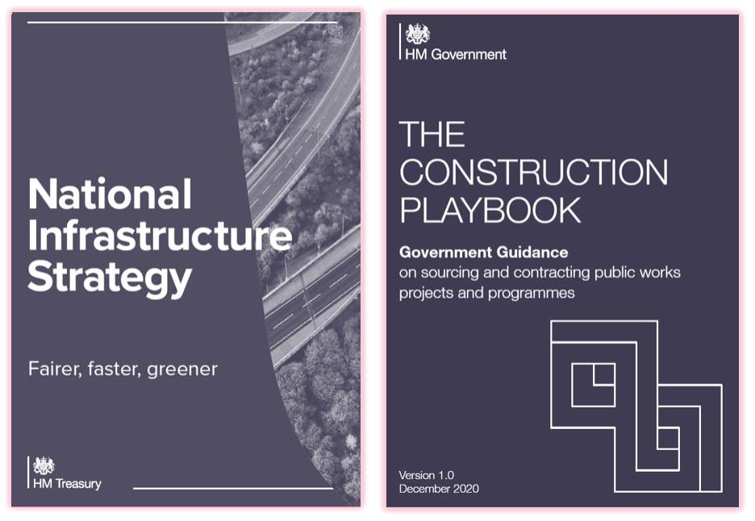

TIP Roadmap: Appendix B refers to the new information management mandate

The mandate applies for the 10 year duration of the transforming infrastructure performance roadmap plan until 2030 and requires the following:

Contracts and procurement to be compliant with UK BIM Framework

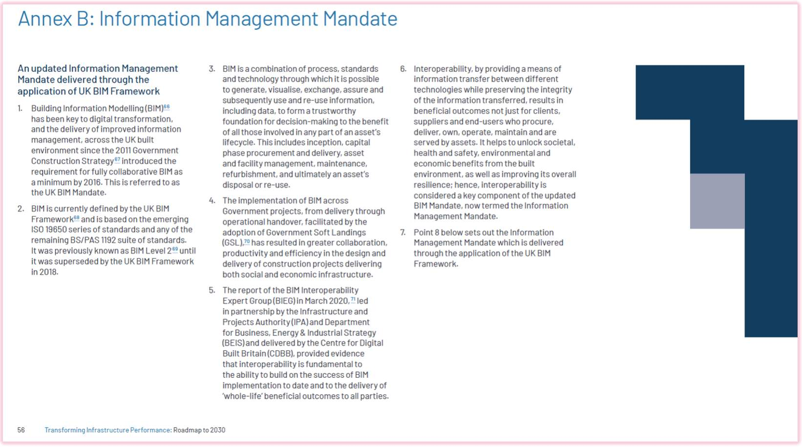

*Appendix B refers to the new information management mandate*

## Lesson Summary

Lesson complete! You are now able to:

Understand the historical changes In the construction industry that led to BIM standards and mandates.

**[CONTINUE]**

---

## Ten-Question Analysis Framework

### 1. Problem
What historical inefficiencies, adversarial contract relations, and uncoordinated documentation drove the construction industry to standardize information management?

### 2. Applicability
- **Timeline**: 1976 (BRE Working Drawings) through 1994 (Latham), 1998 (Egan), 2007 (BS 1192), 2011 (UK Government Construction Strategy), to 2018-2022 (ISO 19650 series).

### 3. Process
1. Industry reports expose systemic flaws (Latham: adversarial culture; Egan: lack of investment, high defect rates).
2. Development of technical codes of practice (BS 1192:2007 CDE workflow).
3. Government client mandates (UK 2016 Level 2 mandate) drive market tipping point.
4. Internationalization via ISO 19650 series replacing domestic British Standards.

### 4. Evidence
- Seminal publications: Latham Report (Constructing the Team), Egan Report (Rethinking Construction), BS 1192:2007, PAS 1192-2/3/4/5.

### 5. Principles
- **Client Leadership**: Lasting improvement requires clients/appointing parties to mandate structured information from the outset.
- **Collaborative Production**: Transition from isolated discipline drafting to federated, coordinated environments.

### 6. Risks & Anti-patterns
- Reverting to adversarial, fragmented silo working despite adopting 3D software tools.

### 7. Operationalization
- Standardized supply chain collaboration protocols and integrated project insurance models.

### 8. Skill Test
Can this become a Skill?
No (historical & context analysis).

### 9. Skill Design
- **Supported Role**: Educational / Policy / Industry Leadership.

### 10. Validation Plan
Trace modern ISO 19650 clauses back to the original industry defects identified in Latham and Egan.

---

## Knowledge Space Links
- **Entities**: [[iso-19650-1]], [[iso-19650-2]]

---
*Extracted from `Lesson 3 - A History of BIM - BIM ISO 19650 1&2 Project Delivery_ Unit 1 - Catalyst for Change.html` via webpage-content-extractor.*
