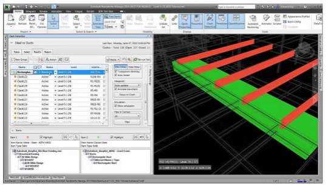
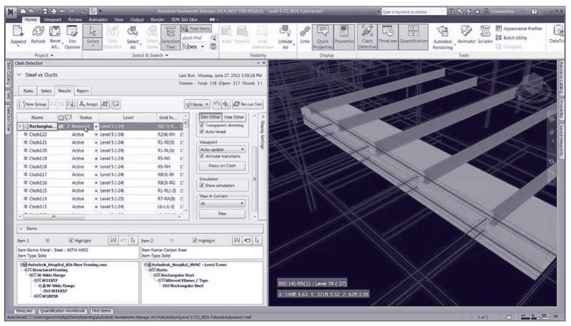
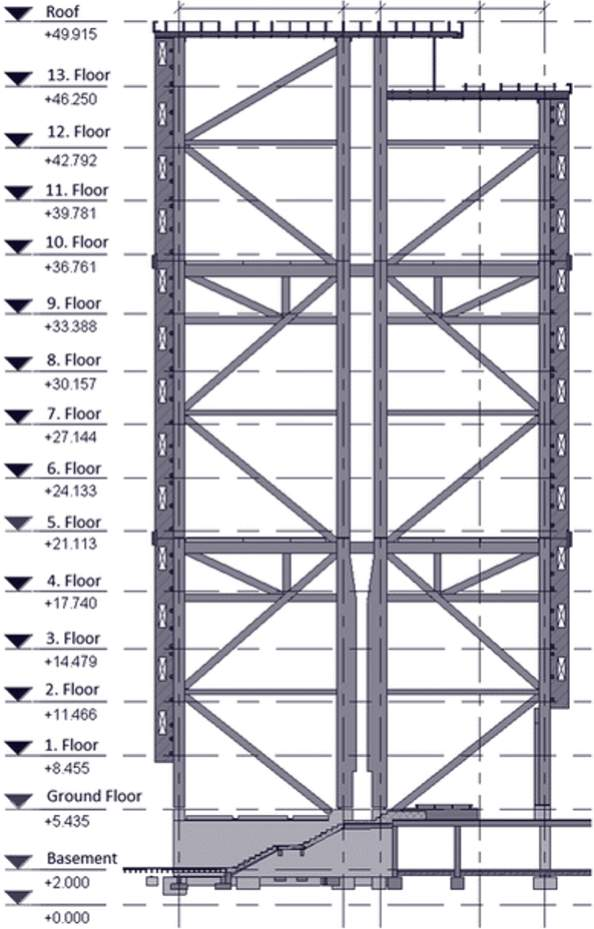
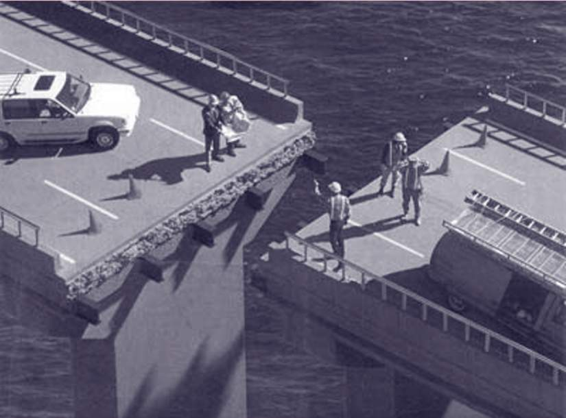
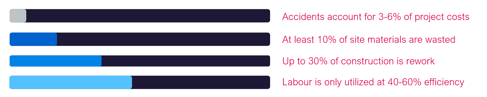

# Lesson 4 - The Effect of Poor Information

*Lesson 4 of 6*

**Lesson Objectives**

Poor Information and a lack of or bad data is the cause of many delays and additional costs in the construction sector.

This lesson will highlights some of the negative effects caused.

*
Image courtesy of Autodesk Construction Solutions*

> [!note] Audio transcript (00:26)
> The perception is that uncoordinated information is a result of working within a 2D environment. The reality is that just because elements are modelled in a 3D environment does not mean that errors will not occur. As well as undertaking 3D modelling, an information management process is required to ensure that coordination issues are resolved as part of the process and not left to resolve on site.
>
> Source: [Lesson 4 - The Effect of Poor Information - BIM ISO 19650 12 Pro.mp3](unit-1-lesson-4-the-effect-of-poor-information/assets/Lesson 4 - The Effect of Poor Information - BIM ISO 19650 12 Pro.mp3)

## The Effect of Poor Information

Modelling in 3D does not mean there will be no errors!

It is important that we spatially coordinate via federated models, and  agree information standards, requirements, and production methods and procedures

**Managing the collaborative production and exchange of information is a key process defined in ISO 19650.**

> [!note] Audio transcript (00:27)
> Errors might not always be identified when reviewing drawings in 2D and can result in having to make compromises on-site, including post-installation modifications such as rework that costs additional time to modify the existing installation or inefficient layouts which need more materials and more complex details as a result increases the risk of failure, affects overall build quality and reduces building performance.
>
> Source: [Lesson 4 - The Effect of Poor Information - BIM ISO 19650 12 Pro (1).mp3](unit-1-lesson-4-the-effect-of-poor-information/assets/Lesson 4 - The Effect of Poor Information - BIM ISO 19650 12 Pro (1).mp3)

Resolving errors on site and the resulting rework has huge impacts on a project. Additional time required to think, design and resolve the problem. Rework results in unforeseen costs and can impact build quality and performance.

The ISO 19650 Standards aims to remove the major causes of poor information exchange. These are typically recognised as the following:

## Collaboration is Key

> [!warning] Missing audio (00:10)
> No local audio file matched this placeholder (referenced `assets/2HOAlIaSorQnrfg3_transcoded-HyLzEG8uyUX6yCMR-m1s74.mp3`).

> [!note] Audio transcript (00:52)
> When a design is geospatially incorrect, its impact can be significant, shown here is an image representing the Laufenberg Bridge. This bridge which crosses the river Rhine between Germany and Switzerland was being worked on by two local firms. Throughout the design, sea level was used as the project datum. However, this decision should have been given more thought. Although both teams did use sea level, the German team used the North Sea, while the Swiss team used the Mediterranean, and both seas differ in height by around 30 centimetres or 12 inches. The German team became aware of this and tried to compensate, but did so incorrectly. This resulted in doubling the difference in height between both sides of the bridge. This illustrated how not resolving and documenting basic requirements, such as the project datum and orientation, can have a major impact on a project.
>
> Source: [Lesson 4 - The Effect of Poor Information - BIM ISO 19650 12 Pro (2).mp3](unit-1-lesson-4-the-effect-of-poor-information/assets/Lesson 4 - The Effect of Poor Information - BIM ISO 19650 12 Pro (2).mp3)

## Information Accessibility

> [!note] Audio transcript (00:36)
> This type of issue was a regular occurrence in many large retailers and supermarkets, where records were poorly kept and often were stored away in a central location, miles away from where the issue may be. To find the required information would historically take days or weeks, and often the decision was made to replace the item instead. Imagine the downtime in a supermarket, for example, with a fridge or oven malfunctioned. With a modern aim approach, the facilities management team could see that an item is within warranty, and this could be addressed immediately. Improved prediction and reduction of the whole lifecycle cost is achieved.
>
> Source: [Lesson 4 - The Effect of Poor Information - BIM ISO 19650 12 Pro (3).mp3](unit-1-lesson-4-the-effect-of-poor-information/assets/Lesson 4 - The Effect of Poor Information - BIM ISO 19650 12 Pro (3).mp3)

## Knowledge Check

**Read the following sentences and fill in the gaps with the average percentage costs of poor information based upon UK figures:**

Question 1: Up to \_\_% of construction is rework

Question 2: Labour is only utilized at \_\_-\_\_% efficiency

Question 3: At least \_\_% of site materials are wasted

Question 4: Accidents account for \_-\_% of project costs

Alternatively, drag and drop the answers to correct sentence.

10

> The financial effect of poor information exchange and management based on studies in the UK, USA & Scandinavia suggest that…

> [!note] Audio transcript (01:20)
> Studies from the USA, Scandinavia and the UK suggest that accidents account for 3-6% of project costs. Through disruption of work damaged to plant and material or expensive HSC investigations, accidents can account for a significant value of a project. At least 10% of site materials are wasted, either through offcuts and unstandardised designs such as when brick dimensions are not used for masonry walls, or through the removal of material due to rework. Much of the material brought to site is not used in the final asset. Up to 30% of construction is rework, meaning that almost a third of a project's cost and resources are associated with amending work already completed. Labour is only utilised at 40-60% efficiency, either through waiting for material to arrive on site, instances where work is incorrectly programmed out of sequence, or even weather issues can hinder the efficiency of the labour force. Put this together, this adds up to, on average, of over 50% of the cost of a project being put against non-value-adding work, meaning that poor information results in projects that have difficult to build designs, being built by an underutilised labour force who have a higher risk of injury resulting in wasted resources and materials that project costing double what they should.
>
> Source: [Lesson 4 - The Effect of Poor Information - BIM ISO 19650 12 Pro (4).mp3](unit-1-lesson-4-the-effect-of-poor-information/assets/Lesson 4 - The Effect of Poor Information - BIM ISO 19650 12 Pro (4).mp3)

## Learning Summary 

Lesson complete! You are now able to:

Highlight some of the negative effects caused by poor information.

**[CONTINUE]**

---
*Extracted from `Lesson 4 - The Effect of Poor Information - BIM ISO 19650 1&2 Project Delivery_ Unit 1 - Catalyst for Change.html` via webpage-content-extractor.*
