# Unit 10 - Lesson 1 - Information Model Delivery

*Lesson 1 of 1*

> [!note] Audio transcript (00:28)
> This unit is about the process of delivery of the information model to the lead appointed party, architect-project manager-contractor, and ultimately to the appointing party via the client-shared and published areas, through an iterative process defined in ISO 9650 Part 2. The authorization and acceptance or rejection of the information containers and information model process is described here, as well as the responsibilities of the parties involved for each step.
>
> Source: [Lesson 1 - Information Model Delivery - ISO 19650 12 Project Del (1).mp3](unit-10-lesson-1-information-model-delivery/assets/Lesson 1 - Information Model Delivery - ISO 19650 12 Project Del (1).mp3)

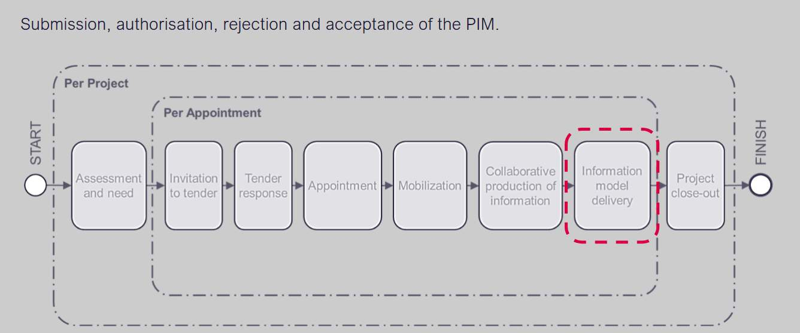

> [!note] Audio transcript (00:17)
> Now we are going to look at information model delivery. All of the project team have responsibilities at this stage. Prior to the delivery of the information model to the appointing party, each task team shall submit their information to the lead appointed party for authorization within the project's Commend Data environment.

## Lesson Objectives

At the end of this lesson, you will be able to:

Understand the process of delivery of the information model to the Client shared and Published states of the CDE.

> [!note] Audio transcript (00:25)
> Lesson is about the process of delivery of the information model to the client shared and published states of the CDE. This starts with the previously submitted information model to the shared state of the CDE during collaborative production to the lead appointed party. This lead appointed party, usually an architect, project manager or contractor, needs to verify that the information model is ready to submit the appointing party for acceptance.

## Delivery to the Appointing Party 

Information model delivery concerned the process between shared, client shared and published states.

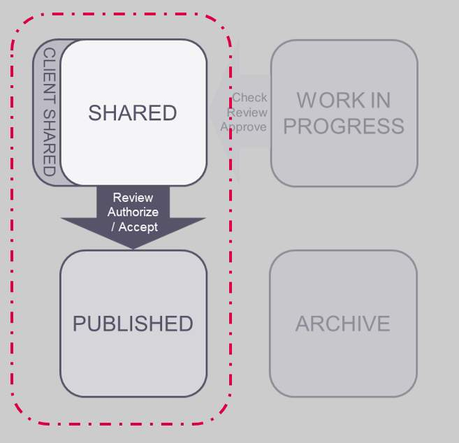

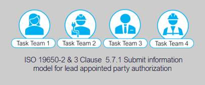

## Submit for Lead Appointed Party Authorization

Following successful review by the Delivery team the Task Team party shall submit the information model to be published for the Lead appointed party’s authorization process.

**The Information being submitted for authorization shall have been:**

- **Checked, reviewed approved by the Task Team**
- **Reviewed by the Delivery team.**
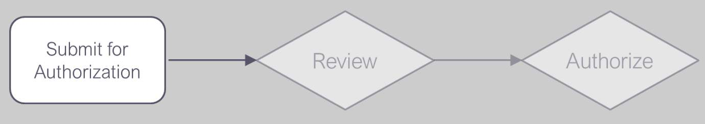

Once the task teams have Carried out internal quality assurance checks to ensure the appropriate information is ready for Submission, then Submit to the Lead appointed party with code S4.

It is important to allow adequate time to prepare information in advance of the delivery milestone date as per the review and revision dates set out in the EIR.

## Review & Authorize the Information Model

The L.A.P shall undertake a review of the information model in accordance with the project’s information production methods and procedures, and consideration of the following:

- **Deliverables listed in MIDP**
- **Appointing Party EIR**
- **Lead appointed party EIR**
- **The acceptance criteria**
- **Level of Information need**
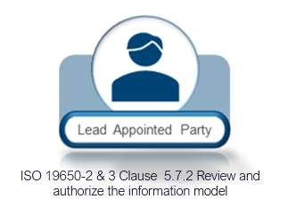

Typical activities during this process that the lead appointed party will undertake are:

- **Review the information exchanges for COBie and IFC completeness **
- **Review the information received against the Appointing Party’s EIR, Level of Information Need, and Detailed Responsibility Matrix.**
- ** Carry out visual clash checks on the model geometry **
- **Review documentation to ensure items listed in the T/MIDP. are present.**
> [!note] Audio transcript (00:59)
> Typical activities during this process that the lead appointed party will undertake are review the information exchanges for COBIE and IFC completeness, if specified as a requirement. This can be automated with BIM software such as Celebre Model Checker or BIM CoLab using smart searches. Review the information received against the appointing party's EIR, level of information need and detailed responsibility matrix. Visual checks of the production packages or drawings may be required to ensure the level of detail defined as being achieved. The level of information is easier to check using software as mentioned previously. Carry out visual clash checks on the model geometry. This process should be undertaken regularly within the federated model. Resolve issues with documentation and objects associated with views, being sure to integrate with the QMS. Review received documentation to ensure all items listed in the TIDP or MIDP are present. Ensure that all task team deliverables are accounted for.
>
> Source: [Lesson 1 - Information Model Delivery - ISO 19650 12 Project Del (2).mp3](unit-10-lesson-1-information-model-delivery/assets/Lesson 1 - Information Model Delivery - ISO 19650 12 Project Del (2).mp3)

Video courtesy of Solibri.

## Model Checking & Compliance

*
Checking models with Solibri is very efficient with smart searches detecting non compliance with data requirements or for highlighted objects missing meta data as defined within the appointing party information requirements.
These checks assist In the information management function. 
Image courtesy of AEC Magazine & Solibri.
*

## Review & Authorize the Information Model

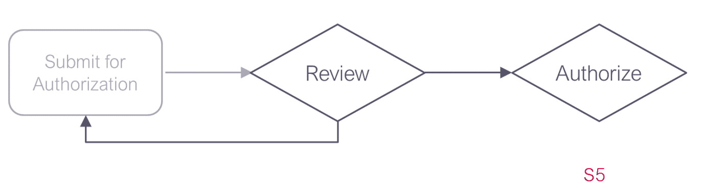

> [!note] Audio transcript (00:33)
> Now the lead appointed party must decide whether or not to authorize the information model. Reject if unsuccessful. Instruct the task team to amend and resubmit within the timeframes agreed within the lead appointed party's EIR. Or alternatively, authorize the review if successful and instruct the task team to submit for appointing party acceptance in line with the procedure using status code S5. Partial acceptance of the information model should be avoided. This is to prevent potential disputes arising within the delivery team or other delivery teams.
>
> Source: [Lesson 1 - Information Model Delivery - ISO 19650 12 Project Del.mp3](unit-10-lesson-1-information-model-delivery/assets/Lesson 1 - Information Model Delivery - ISO 19650 12 Project Del.mp3)

## Submit for Appointing Party Acceptance

Following authorization, each Task Team shall submit their information for Appointing Party review and acceptance within the project’s CDE.

Update the Status Codes to S5 – suitable for review and acceptance by an appointing party.

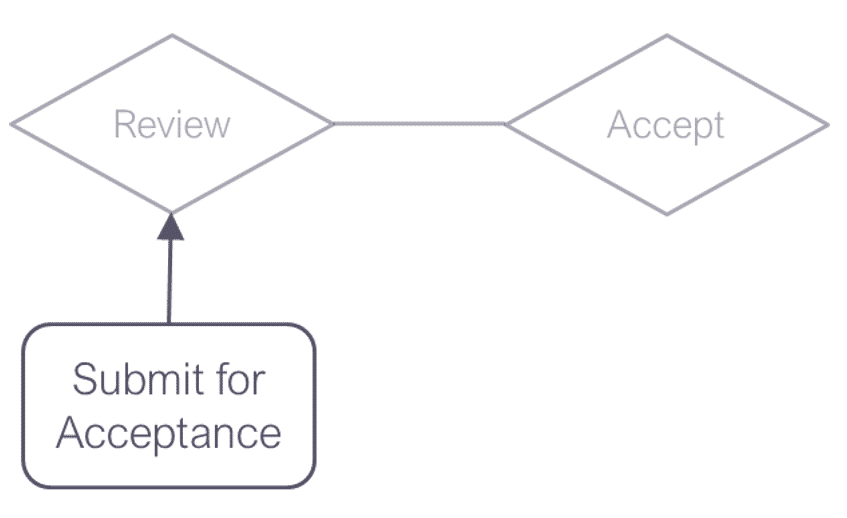

> [!note] Audio transcript (00:58)
> Following authorization, each task team shall submit their information for appointing party review and acceptance within the project's common data environment. If the appointing party's CDE is separate to the delivery team's CDE, each task team shall follow the procedures associated with the respective CDE system. Review and check the lead-in times and decision timeframes for the appointing party to review the information. Ensure you are provisioning adequate time complying with the agreed dates. Update the status codes to S5, suitable for review and acceptance by an appointing party. To avoid coordination issues, ISO 9650 recommends that appointing parties should only authorize the information model as a whole prior to acceptance into the client's shared state. Care should be taken that this does not become a blocker or contractual issue as some contracts used within the UK may find this issue difficult to deal with.
>
> Source: [Lesson 1 - Information Model Delivery - ISO 19650 12 Project Del (4).mp3](unit-10-lesson-1-information-model-delivery/assets/Lesson 1 - Information Model Delivery - ISO 19650 12 Project Del (4).mp3)

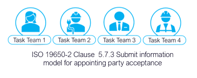

## Review & Authorize the Information Model

The Appointing party will then authorize and accept or reject.

If accepted the task teams will move the information through to the Published area of the CDE with a C revision, and an A status code.

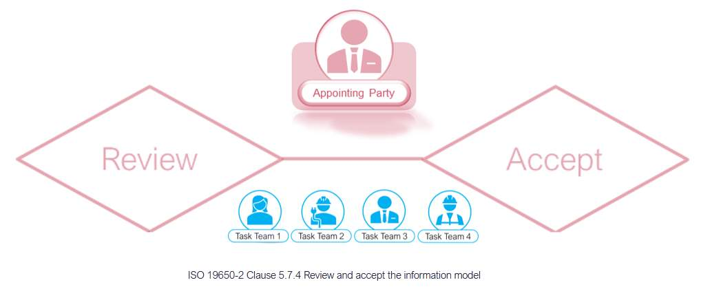

> [!note] Audio transcript (00:22)
> The appointing party, their 3rd party or lead appointed party undertaking the IAM function will then review and accept or reject the information model. The review at intermediate stages is for PM, project information model acceptance. The review for the final work stage takes place on the AIM asset information model.

## Authorize the Information Model

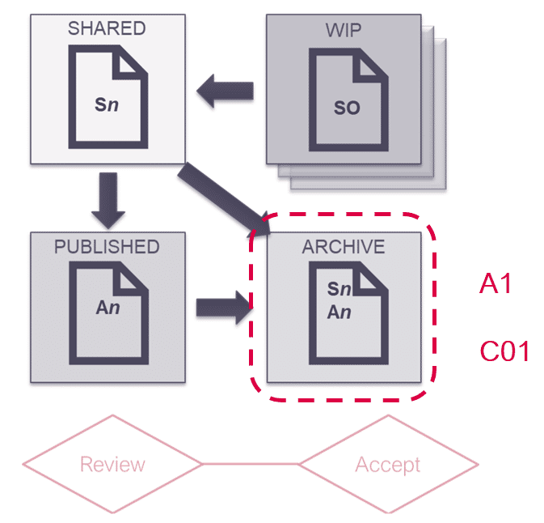

> [!note] Audio transcript (00:12)
> The appointing party will then authorize an accept or reject. If accepted, the task teams will move the information through to the published area of the CDE with AC, revision and an A status code.

## Information Model Delivery Activities 

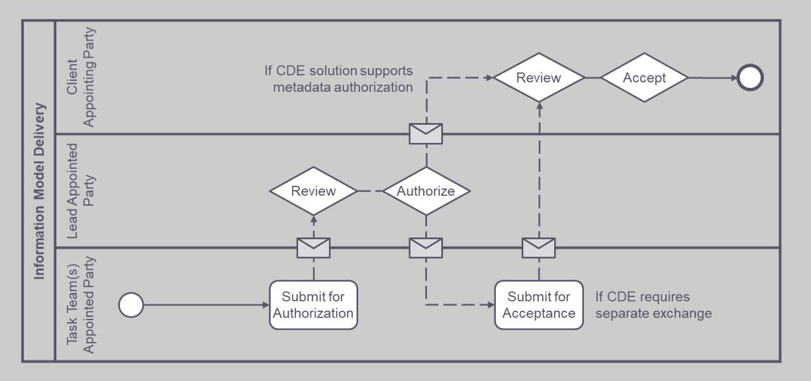

> [!note] Audio transcript (00:56)
> The difference in this process is that before you have been collaborating within the design team, but here you are going through an authorization process to share the work with the client or a pointing party. This can be via the client shared area or published for a specific use. The task teams go through their check review approved process. The task teams go through their check review approved process, then review with the delivery team, then they submit for authorization. The lead appointed party receives this and may communicate with the employer's representative. They then tell the task team it is authorized to submit for acceptance. The model then gets submitted for acceptance by the appointing party. There also may be slightly different variations of the authorization processes if the deliverables are contractual. The ISO has added authorization and acceptance in addition to the original term approval within the review process.
>
> Source: [Lesson 1 - Information Model Delivery - ISO 19650 12 Project Del (3).mp3](unit-10-lesson-1-information-model-delivery/assets/Lesson 1 - Information Model Delivery - ISO 19650 12 Project Del (3).mp3)

## Learning Summary 

Lesson complete! You are now able to:

Understand the process of delivery of the information model to the Client shared and Published states of the CDE.

**Unit 10 Complete!
**

You may now close the window and complete this module.

---
*Extracted from `Lesson 1 - Information Model Delivery - ISO 19650 1&2 Project Delivery_ Unit 10 - Information Model Delivery.html` via webpage-content-extractor.*
## Ten-Question Analysis Framework

### 1. Problem
How does the delivery team formally deliver the completed Project Information Model (PIM) to the appointing party for milestone acceptance without defects, omissions, or unverified claims?

### 2. Applicability
- **Stage**: `information-model-delivery` (ISO 19650-2 §5.7).
- **Roles**: [[lead-appointed-party]], [[appointing-party]], Task Teams.
- **Key Documents**: [[project-information-model]] (PIM), MIDP, EIR, Acceptance Notice.

### 3. Process
1. Collate all approved information containers from task teams fulfilling a specific delivery milestone.
2. Conduct comprehensive Lead Appointed Party review: check federated model integrity, spatial coordination, and MIDP deliverables.
3. Validate alphanumeric datasets (COBie compliance, asset classifications, parameter completeness).
4. Lead Appointed Party authorizes the Information Model and submits it to the Appointing Party in the CDE.
5. Appointing party (or client IM representative) evaluates submission against EIR acceptance criteria and Project Information Standard.
6. Issue formal Acceptance Notice or detailed Non-Conformance / Rejection Notice within the agreed review window.

### 4. Evidence
- Consolidated Project Information Model (PIM) submission package in CDE (§5.7).
- Completed Lead Appointed Party Authorization record.
- Appointing Party Formal Acceptance / Rejection Certificate.

### 5. Principles
- **Formal Delivery Gate**: Delivery to the client is a contractual gateway that requires explicit lead party authorization.
- **Verification Against Agreed Criteria**: Acceptance must be evaluated strictly against criteria defined in the EIR and Project Information Standard (§5.1.4, §5.2.1), not ad-hoc opinions.
- **Timely Review**: The appointing party must respect the review timescales established in the MIDP.

### 6. Risks & Anti-patterns
- Submitting an uncoordinated collection of loose files rather than a verified, federated information model.
- Appointing party rejecting models based on subjective preferences not documented in the EIR.
- Appointing party exceeding review periods, creating delays and liability disputes.

### 7. Operationalization
- Information Model Delivery Gateway checklist covering geometric, alphanumeric, and documentation criteria.
- Automated client acceptance audit dashboard.

### 8. Skill Test
Can this become a Skill?
**Yes** — Candidate: `information-model-delivery-auditor`. Verifies that a delivery package meets all MIDP milestone requirements before client submission.

### 9. Skill Design
- **Supported Role**: Lead Appointed Party Information Manager / Client Representative.
- **Trigger**: Information Delivery Milestone gateway.
- **Output**: Milestone Delivery Compliance Audit Report.

### 10. Validation Plan
Execute validation checks on sample milestone models against client EIR acceptance rules.

---

## Knowledge Space Links
- **Entities**: [[project-information-model]], [[master-information-delivery-plan]], [[appointing-party]], [[lead-appointed-party]]
- **Concepts**: [[information-model-review-and-acceptance]], [[cde-solution-architecture]]
- **Methodologies**: [[deliver-information-model-method]]
