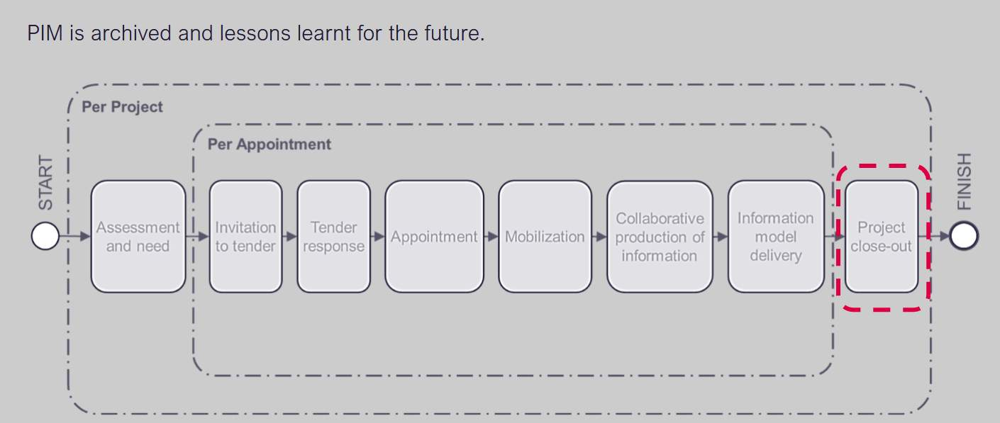
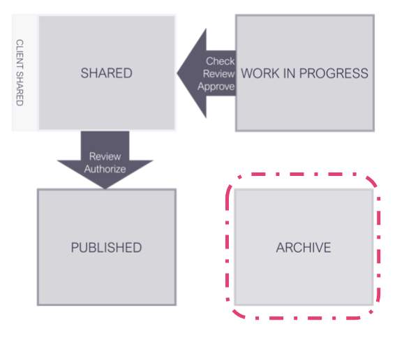
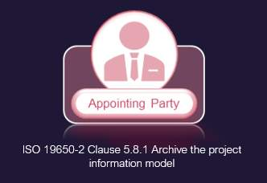
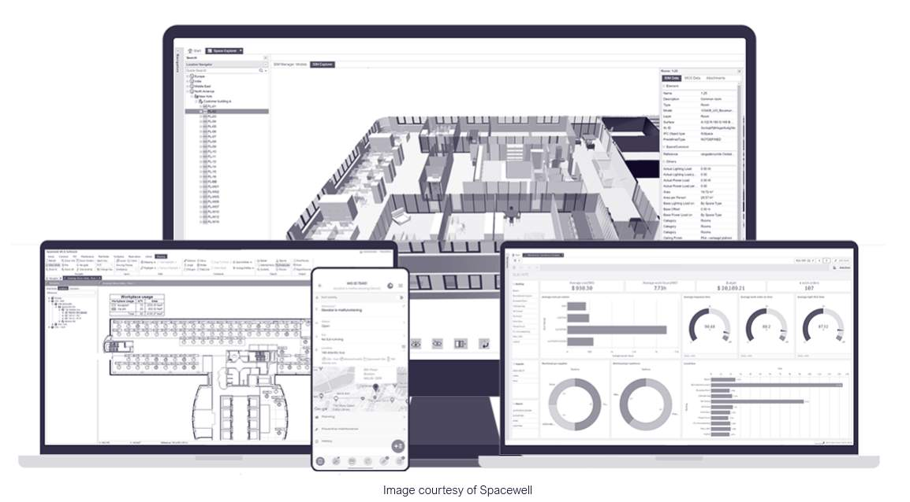
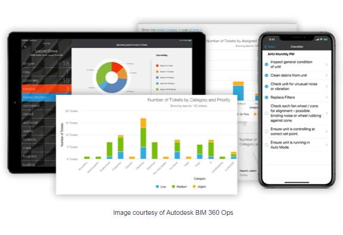
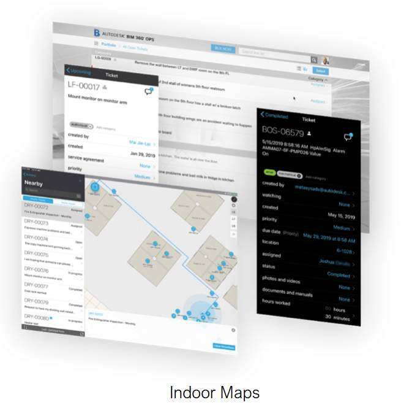
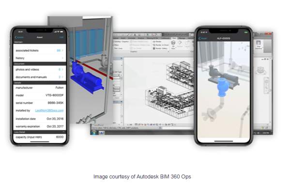
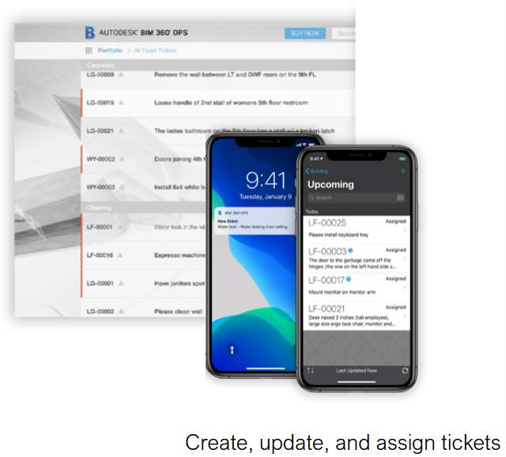

# Unit 11 - Lesson 1 - Archive the PIM

*Lesson 1 of 2*

> [!note] Audio transcript (00:22)
> Once the final information model has been accepted by the appointing party, the final stage is called Project closeout and is led by the appointing party. This is an important transition from a project information model to an asset information model for operational and maintenance use, and incorporates a review process of the good and bad aspects of the project that may be taken into the future.

> [!note] Audio transcript (00:21)
> What is the most important thing that needs to happen when information moves from APIM to an AIM? The asset needs to have been built, information containers needed as part of and the Project Information Model PIM including all drawings, documents, correspondence and audit trail shall be frozen during project closeout stage and then archived.

## Lesson Objectives

At the end of this lesson, you will be able to:

Understand Archiving the PIM

> [!note] Audio transcript (00:12)
> Project information model may contain project geometry, performance requirements, method of construction, other details related to asset management. At this stage it will move into the archive state within the CDE.

## Archive the PIM

Following completion & acceptance of the PIM the appointing party shall:

- Archive the information containers within the CDE
- Archive the Project Information Model (PIM)

> [!note] Audio transcript (01:24)
> Following completion and acceptance of the PIM, the appointing party shall archive the information containers within the CDE. Archive the project information model PIM. Both of these activities should be carried out in accordance with the processes defined in the project information production methods and procedures. The project information model should be stored to provide a long-term archive of the project and for auditing purposes. The EIR should set out the requirements in terms of how the client wants a copy of the archive delivered to them. Considerations should be given too. Which information is needed for the asset information model? Identify future access requirements and reuse. Relevant retention policies to be applied. This is to guarantee that there is a final version of the project information model should it be needed for future reference. It is also recommended that each part of the project keeps their own archive as they work through the project. So they retain a copy of the information without having to go to the CDE, shared or published area, slash state. There is both project information and asset information, but not all information that is used on a project. It is needed to be taken forward for use in its operation and maintenance. For example, the specific detail of how components are put together may not be useful as they will be oblivious to whoever is maintaining the building. So the client needs to consider what is appropriate to be moved over.
>
> Source: [Lesson 1 - Archive the PIM - BIM ISO 19650 12 Project Delivery U (2).mp3](unit-11-lesson-1-archive-the-pim/assets/Lesson 1 - Archive the PIM - BIM ISO 19650 12 Project Delivery U (2).mp3)

## Asset Information Model (AIM)

The asset information model supports the strategic and day-to-day asset management processes.

> [!note] Audio transcript (01:37)
> Asset information model AIM. It is an information model that provides all the data required to carry out the operation phase of an asset, in contrast to PIM which provides data for delivery phase. At the end of the project some elements of the project information model are transferred into the asset information model and unnecessary data residual project information is archived. AIM comprises graphical models, non-graphical data and all necessary maintenance, operation and management documentation for objects in the model. A pointing party, end users and facility managers create and use asset information models during the operational phase of an asset. Creation and structure of data in an AIM should enable transfer to computer-aided facility management systems, CAFM, COBIE or another format for later management of the building. The requirements to the format of the deliverable should be agreed beforehand in exchange information requirements. In practice AIM comprises all files and data that the delivery team gives to the appointing party during the handover after completion of the project. Building owners use that information to set up a facility management system and operate the building. The asset information model may contain equipment registers, records of installation property ownership details and other details related to asset management. The AIM should comprise two parts, file store containing published files such as documents, reports, surveys, drawings and data store comprising non-geometrical structure data such as COBIE or IFC asset databases.
>
> Source: [Lesson 1 - Archive the PIM - BIM ISO 19650 12 Project Delivery U.mp3](unit-11-lesson-1-archive-the-pim/assets/Lesson 1 - Archive the PIM - BIM ISO 19650 12 Project Delivery U.mp3)

The **AIM **contains data from design and construction phases and is then  enhanced with ongoing data during operations, maintenance  including changes to the buildings or assets over the life-cycle. The data is a mix of geometry, structured alphanumeric data relating to GIS, objects, components, sensor data etc and documentation including O&M manuals, installation, product data sheets, contracts, spare parts etc.

![A good AIM is crucial for the correct operation and cost control of an asset.If components are not maintained their service life is reduced, warranties and guarantees are not valid, there may be safety hazards etc etc.The core of the AIM will will be:Original brief, specification, design intent3d object based models (BIM) as federated discipline modelsStructured data and documents required to operate and maintain the facilityOwnership, rights and covenantsInfo obtained from maintenance and surveyInfo obtained from monitoring the operation and condition](unit-11-lesson-1-archive-the-pim/assets/ato4h2QOZnhalqPz_IdLRGUC58BziDM-I.jpg)

*
A good AIM is crucial for the correct operation and cost control of an asset.
If components are not maintained their service life is reduced, warranties and guarantees are not valid, there may be safety hazards etc etc.
The core of the AIM will will be:Original brief, specification, design intent3d object based models (BIM) as federated discipline modelsStructured data and documents required to operate and maintain the facilityOwnership, rights and covenantsInfo obtained from maintenance and surveyInfo obtained from monitoring the operation and condition*

Video courtesy of Spacewell.

Spacewell achieves vision of BIM-enabled FM.

Spacewell, a leading provider of building management software that is part of the listed Nemetschek Group.

## Asset Information Model (AIM)

**Manage reactive and scheduled maintenance.**

> [!note] Audio transcript (00:47)
> But there are also lots of other possible uses for BIM data into asset management that are not often used. BIM 360 Ops enables your facilities team to assess critical building information via phones and tablets at any time from anywhere. Manage reactive and scheduled maintenance. Building dashboards display tickets in both graph and list views, providing your team with focused and relevant data specific to their roles. Indoor maps. With BIM 360 Ops you can turn your Revit floor plan into a map with indoor mapping data format IMDF. Enable wayfinding for technicians and vendors, track mobile assets, manage new tickets using a heat map, analyse closed tickets and track inspection progress on floor plans.
>
> Source: [Lesson 1 - Archive the PIM - BIM ISO 19650 12 Project Delivery U (1).mp3](unit-11-lesson-1-archive-the-pim/assets/Lesson 1 - Archive the PIM - BIM ISO 19650 12 Project Delivery U (1).mp3)

**Import building assets.**

> [!note] Audio transcript (00:30)
> Import building assets. Simply import your building's assets and associated data from Revit, BIM 360 build or even a spreadsheet, and you'll be able to give your team the ability to update asset information on their mobile devices. Create, update and assign tickets. Create and update tickets directly from your phone or tablet and attach photos and videos. Speed up data entry with voice to text conversion and receive notifications whenever a ticket is assigned or updated.
>
> Source: [Lesson 1 - Archive the PIM - BIM ISO 19650 12 Project Delivery U (3).mp3](unit-11-lesson-1-archive-the-pim/assets/Lesson 1 - Archive the PIM - BIM ISO 19650 12 Project Delivery U (3).mp3)

## Project Information Model vs Asset Information Model

Notice the flow of information through PIM > AIM > A.M System

![The project information model includes superfluous information such as the initial concept design and previous iterations of conformation containersWhile the whole project information model should be archived, only a portion is used to form to the asset information modelThe asset information model only includes the information containers relevant to asset managementThe information in the asset information model is superseded following a trigger-related event such as a change of ownership, minor works such as maintenance and repair, or major works such as a new projectThere are many systems that do the Facilities management process and they all require information in different formats depending on what they are dealing withThis process is dealt in the ISO 19650-3 Part 3: Operational phase of the assetsFacilities management is the ‘...integration of processes within an organisation to maintain and develop the agreed services which support and improve the effectiveness of its primary activities’. Ref EN15221-1: 2006 Facility Management – Part 1: Terms and definitions. It is concerned with the management of facilities at both a strategic and a day-to day level to deliver operational objectives and to maintain a safe and efficient environment.Asset management is'...The process of developing, operating, maintaining, upgrading and disposing of an asset using the most efficient and effective means.' Ref RIBA Plan of Work 2020.](unit-11-lesson-1-archive-the-pim/assets/Yg3LsxVH2tMK2vzL_oXsTMK-IqPF_HF7z.png)

*The project information model includes superfluous information such as the initial concept design and previous iterations of conformation containers
While the whole project information model should be archived, only a portion is used to form to the asset information model
The asset information model only includes the information containers relevant to asset management
The information in the asset information model is superseded following a trigger-related event such as a change of ownership, minor works such as maintenance and repair, or major works such as a new project
There are many systems that do the Facilities management process and they all require information in different formats depending on what they are dealing with
This process is dealt in the ISO 19650-3 Part 3: Operational phase of the assetsFacilities management is the ‘...integration of processes within an organisation to maintain and develop the agreed services which support and improve the effectiveness of its primary activities’. Ref EN15221-1: 2006 Facility Management – Part 1: Terms and definitions. It is concerned with the management of facilities at both a strategic and a day-to day level to deliver operational objectives and to maintain a safe and efficient environment.
Asset management is'...The process of developing, operating, maintaining, upgrading and disposing of an asset using the most efficient and effective means.' Ref RIBA Plan of Work 2020.*

## BIM or Facilities Management

> If you plan to implement BIM for Facilities or asset Management now or in the future it is important to get this process right.Think with the end in mind

BIM authoring tools and processes make it easier for in design and construction teams to collaborate on a single model and the introduction of ISO 19650 defines a common approach that makes it easier to capture, classify and transfer information in a common data language format for handover to FM teams, reducing the huge information divide that previously happened at handover.

Best practice for Appointing Parties, building owners, or FM teams is to Think with the end in mind and begin your considerations as early as possible, and Utilise industry standards such as ISO 19650 for a common approach that will make sense internationally. Classified, consistent, clean and useable data is key.

**There is a long road ahead, possibly making the decision to change tools, software, workflows, assets data and classification for example, but the rewards will be reaped in the future.**

## Learning Summary 

Lesson complete! You are now able to:

Understand Archiving the PIM

**[CONTINUE]**

---
*Extracted from `Lesson 1 - Archive the PIM - BIM ISO 19650 1&2 Project Delivery_ Unit 11 - Project Close Out.html` via webpage-content-extractor.*
## Ten-Question Analysis Framework

### 1. Problem
How is the Project Information Model (PIM) preserved at project close-out to maintain an immutable audit trail and provide the foundational baseline for the Asset Information Model (AIM)?

### 2. Applicability
- **Stage**: `close-out-archiving` (ISO 19650-2 §5.8.1).
- **Roles**: [[appointing-party]], [[lead-appointed-party]], Facility Managers, CDE Hosts.
- **Key Documents**: [[project-information-model]] (PIM), Asset Information Model (AIM), CDE Archive, Asset Handover Protocol.

### 3. Process
1. Finalize all as-built and verified as-constructed information containers in the CDE Published state.
2. Filter and extract maintainable asset data required for facilities management (AIR compliance) to form the **Asset Information Model (AIM)**.
3. Transition all project information containers, decision records, and audit logs to the CDE **Archive** state.
4. Establish read-only permissions and ensure secure long-term digital preservation and retrieval.
5. Provide archiving access or transfer container packages to the Appointing Party.

### 4. Evidence
- Immutable, timestamped CDE Archive repository containing all project container revisions (§5.8.1).
- Validated Asset Information Model (AIM) deliverable handover package.
- Project Archiving Handover Protocol sign-off.

### 5. Principles
- **Golden Thread & Legal Audit**: The archived PIM serves as the definitive legal and technical record for dispute resolution, warranty claims, and building safety compliance.
- **PIM to AIM Transition**: Not all delivery data is relevant for operations; the AIM extracts verified maintainable asset data while the PIM preserves the full delivery history.
- **Immutability in Archive**: Containers in the Archive state are permanently read-only and cannot be altered or overwritten.

### 6. Risks & Anti-patterns
- Decommissioning or abandoning the CDE immediately after handover, losing project decision history.
- Dumping the entire raw PIM onto operations teams without structuring it into a usable AIM.
- Storing archives in proprietary formats without OpenBIM (IFC, COBie, PDF/A) backups that survive software obsolescence.

### 7. Operationalization
- CDE Archiving Protocol defining retention schedules, export formats, and access governance.
- Handover data bridge translating PIM parameters into Computerized Maintenance Management Systems (CMMS/CAFM).

### 8. Skill Test
Can this become a Skill?
**Yes** — Candidate: `pim-to-aim-handover-validator`. Filters PIM containers and validates asset data handover against AIR requirements.

### 9. Skill Design
- **Supported Role**: Asset Information Manager / Facilities Management Lead.
- **Trigger**: Practical completion and building handover.
- **Output**: Handover Compliance Certificate and AIM Transition Audit.

### 10. Validation Plan
Audit sample archived container sets for completeness, read-only permissions, and IFC/COBie readability.

---

## Knowledge Space Links
- **Entities**: [[project-information-model]], [[common-data-environment-protocol]], [[appointing-party]], [[iso-19650-3]]
- **Concepts**: [[pim-archiving-protocol]], [[cde-sharing-approval-workflow]]
- **Methodologies**: [[archive-pim-method]]
