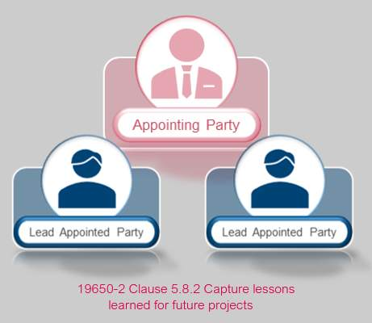
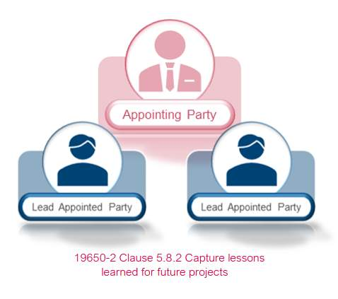
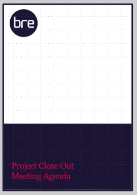
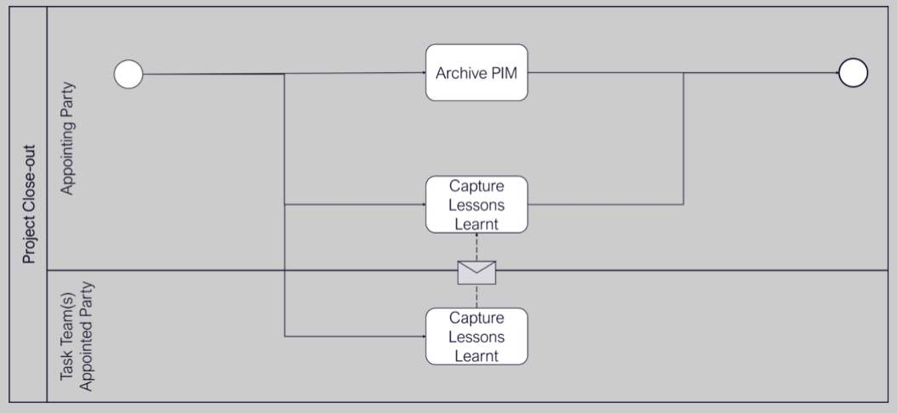

# Unit 11 - Lesson 2 - Capture Lessons Learned

*Lesson 2 of 2*

## Lesson Objectives

At the end of this lesson, you will be able to:

Understand the Capturing of Lessons Learned

> [!note] Audio transcript (00:11)
> The closeout process. During the closeout process, issues should be reviewed and lessons learned captured to enable the improvement in the processes of future projects.

## Capture Lessons Learnt

The appointing party, in collaboration with each lead appointed party shall capture lessons learned throughout the entire project.

Capture of lessons learned is also an activity referenced in the **BS 8536 series** as part of soft landings.

> [!note] Audio transcript (00:57)
> The appointing party in collaboration with the lead appointed party shall capture lessons learned throughout the entire project. Adequate time should be set aside to identify, record and understand the lessons learned in order to improve future processes. A structure and consistent format is recommended, typically using a lessons learned tracker that can be configured throughout the project phases. Lessons learned shall be reviewed with the lead appointed party to feedback into the OIR, AIR and other associated briefing documents for future projects and reuse. Capture of lessons learned is also an activity referenced in the BS 8536 series, which remains within the UK BIM framework, as part of soft landings. Soft landings provide a structured methodology whereby lessons can be captured. Post occupancy evaluation is a core part of the soft landings framework, a joint initiative by BS RIA in the Usable Buildings Trust.
>
> Source: [Lesson 2 - Capture Lessons Learned - BIM ISO 19650 12 Project De.mp3](unit-11-lesson-2-capture-lessons-learned/assets/Lesson 2 - Capture Lessons Learned - BIM ISO 19650 12 Project De.mp3)

The UK BIM Framework Information management according to BS EN ISO 19650 Guidance Part 2 lists some example criteria to use during a lessons learned exercise:

**• Performance Metrics**

**• Budget & Programme**

**• Procurement Process **

**• Information Management Process **

**• Final Costs **

**• Operational Asset Performance**

**• Social Benefits**

**• Carbon Impact**

> [!note] Audio transcript (01:33)
> The Lessons Learned close-out meeting is a requirement of ISO 9650. The UK BIM Framework Information Management, according to BSEN ISO 9650 Guidance Part 2, lists some example criteria to use during a Lessons Learned exercise. Assess any pre-determined performance metrics. Did the project delivery meet required budget and programme? Did the procurement process satisfy all parties? Did the information management process deliver its required outcomes? What are the final commercial costs for the project for benchmark purposes? Does the operational asset perform as designed? What were the social benefits or values delivered by the project? What was the carbon impact of the investment? Following the construction playbook to drive better, faster and greener delivery in future projects and programmes, we need to collect robust data to understand what went well and where we can improve in relation to the as-built carbon footprint, for example. Identifying project management processes that not only failed but were also a success on this project. Perhaps you implemented a new workflow, we learned from failures as well as successes. Verify if the lesson is unique to this project or whether it can be used for future projects also. It is advisable to use software which can extract data for future use, such as keywords, etc. Consider AI, machine learning, etc. And distribute key learnings to relevant people for future use and efficiency of planning, design, build and operation.
>
> Source: [Lesson 2 - Capture Lessons Learned - BIM ISO 19650 12 Project De (2).mp3](unit-11-lesson-2-capture-lessons-learned/assets/Lesson 2 - Capture Lessons Learned - BIM ISO 19650 12 Project De (2).mp3)

The lessons learned close-out meeting is a requirement of ISO 19650.  A meeting agenda will aid in this process, with a typical structure being:

- **Close Out**
- **Project Information**
- **Gather Lessons Learned**
- **Lesson Confirmation**
- **Lesson Capture**
- **Distribute Findings  **
> [!note] Audio transcript (00:58)
> The Lessons Learned close-out meeting is a requirement of ISO 9650, a meeting agenda will typically aid in this process with a typical structure being close-out, complete PIM archive, project information, list project team names and contacts, define the project type, sector and purpose, gather lessons learned, identifying project management processes, success and failures, information to be gathered throughout the project lifecycle, not just at close-out. Lesson confirmation, verify if the lesson is unique to this project or whether it can be used for future projects also. Lesson capture, use software which can extract for future use such as AI, machine learning etc. Distribute findings, send findings to relevant people and use data storage processes for future big data harvesting. Distribute key learnings to relevant people for future use and efficiency of planning, design, build and operation. Harness data sorting.
>
> Source: [Lesson 2 - Capture Lessons Learned - BIM ISO 19650 12 Project De (1).mp3](unit-11-lesson-2-capture-lessons-learned/assets/Lesson 2 - Capture Lessons Learned - BIM ISO 19650 12 Project De (1).mp3)

## Project Close Out Activities

*Reference:  ISO 19650-2, 5.8 
*

> [!note] Audio transcript (00:52)
> Normally when we're talking about archiving, it is describing an information model passing through a gateway, and therefore each time an archive should be made of the information model. The PIM may need to be moved to a particular location as the project portion of the CDE may no longer be appropriate. The ISO picks up on the Government soft landings approach of capturing lessons learned. These lessons can be from how the building is being operated, but also down to the processes methodologies, standards etc that were used on the project. Advantages and disadvantages of using particular software solutions. All these lessons can then be fed back into the process to make the next project better. Lessons learned shall be reviewed with the lead appointed party to feedback into the OIR, AIR and other associated briefing documents for future projects and reuse in line with procedure.
>
> Source: [Lesson 2 - Capture Lessons Learned - BIM ISO 19650 12 Project De (3).mp3](unit-11-lesson-2-capture-lessons-learned/assets/Lesson 2 - Capture Lessons Learned - BIM ISO 19650 12 Project De (3).mp3)

## Learning Summary 

Lesson complete! You are now able to:

Understand the Capturing of Lessons Learned

**Unit 11 Complete!
**

You may now close the window and complete this module.

---
*Extracted from `Lesson 2 - Capture Lessons Learned - BIM ISO 19650 1&2 Project Delivery_ Unit 11 - Project Close Out.html` via webpage-content-extractor.*
## Ten-Question Analysis Framework

### 1. Problem
How do project stakeholders capture, document, and disseminate technical and operational lessons learned at project close-out to improve future ISO 19650 delivery performance?

### 2. Applicability
- **Stage**: `close-out-lessons-learned` (ISO 19650-2 §5.8.2).
- **Roles**: [[appointing-party]], [[lead-appointed-party]], [[appointed-party]].
- **Key Documents**: [[lessons-learned-register]], Project Close-out Report, IM Performance Review.

### 3. Process
1. Convene a cross-party project close-out lessons learned workshop involving client, designers, and contractors.
2. Review project performance against original EIR, BEP milestones, and Information Risk Register.
3. Identify successes, unexpected friction, CDE bottlenecks, and software interoperability issues.
4. Document concrete recommendations, revised template standards, and procedural improvements.
5. Publish the consolidated Lessons Learned Report and update corporate organizational information standards.
6. Feed insights into future pre-appointment tenders and client EIR formulations.

### 4. Evidence
- Formatted Project Lessons Learned Report / Register (§5.8.2).
- Minutes and attendance from close-out evaluation workshops.
- Documented updates made to corporate templates, libraries, and standard methods.

### 5. Principles
- **Continuous Improvement Loop**: ISO 19650 delivery is an evolving organizational capability; unrecorded mistakes are doomed to recur.
- **Blame-Free Collaboration**: Candid feedback requires an open environment focused on system improvements rather than commercial liability.
- **Standard Updating**: Lessons must be institutionalized into updated corporate templates, not filed away and forgotten.

### 6. Risks & Anti-patterns
- Disbanding project teams immediately at handover without capturing lessons learned.
- Focusing solely on negative failures without documenting successful innovations that should be repeated.
- Treating lessons learned as a static PDF report rather than updating actual execution templates.

### 7. Operationalization
- Standard ISO 19650 Lessons Learned Survey & Matrix categorizing findings by People, Process, Technology, and Data.
- Post-project debrief workshop facilitator agenda.

### 8. Skill Test
Can this become a Skill?
**Yes** — Candidate: `lessons-learned-synthesizer`. Analyzes post-project surveys and generates actionable corporate guideline updates.

### 9. Skill Design
- **Supported Role**: Corporate Head of BIM / Continuous Improvement Lead.
- **Trigger**: Project completion and handover sign-off.
- **Output**: Categorized Lessons Learned Summary with template action items.

### 10. Validation Plan
Review subsequent project tender returns to verify adoption of recorded lessons.

---

## Knowledge Space Links
- **Entities**: [[lessons-learned-register]], [[appointing-party]], [[lead-appointed-party]], [[delivery-team]]
- **Concepts**: [[lessons-learned-capture]], [[bim-change-management]]
- **Methodologies**: [[capture-lessons-learned-method]]
