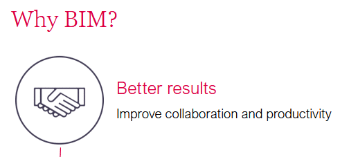
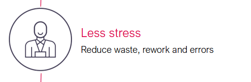
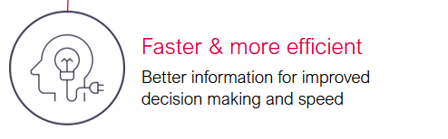
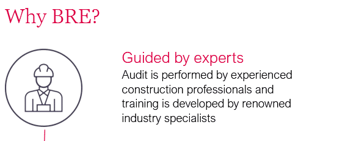
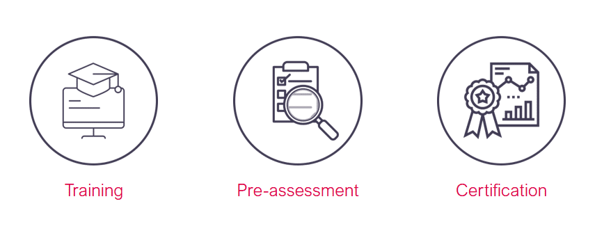
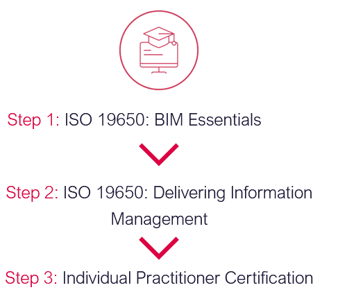

# Unit 12 - Lesson 1 - BRE Individual & Business Certification

*Lesson 1 of 1*

## Lesson Objectives

At the end of this lesson, you will be able to:

Explain the processes and benefits of BIM Certification

---

**BRE offers both individual and business certification.**

## BRE,  BIM & Information Management

## Training with BRE Academy

- **Expert-led **
World-class training and education programs led by BIM experts

- **International **
Training delivered in over 40 countries

- **The whole supply chain **
Suitable for the whole supply chain

- **CPD**
All course provide Continuous Professional Development (CPD) hours

## Certification for Individuals

We offer two types of certification for individuals:

> [!note] Audio transcript (01:03)
> We offer two types of certification for individuals. BIM-Informed Professional, ideal for policymakers, advisors, educationalists and construction professionals who are implementing the BIM process. Assessment, demonstration of detailed knowledge and understanding of information management using BIM. BIM Practitioner Certificate, ideal for a project-based construction professional applying an implemented information management process. We offer task information management, TIM and project information management PIM certification routes. You are able to apply for both routes if you wish. Assessment, certification assessment covers the detailed knowledge and understanding of information management using BIM. Applicants are also encouraged to provide project-based evidence where relevant. Experience and evidence are not mandatory for applying to these certification routes but are beneficial. If you do not have experience of working within a BIM environment or cannot provide project-based evidence, you will be required to include explanations and or self-produce workflows instead.
>
> Source: [Lesson 1 - BRE Individual Business Certification - BIM ISO 19650.mp3](unit-12-lesson-1-bre-individual-business-certification/assets/Lesson 1 - BRE Individual Business Certification - BIM ISO 19650.mp3)

## Pre-assessment: for Businesses

> [!note] Audio transcript (00:28)
> Pre-assessment is a gap analysis of BIM processes against the requirements of ISO 9650 Part 2 2018 and the BRE Global Scheme. Having a BRE pre-assessment before applying to BRE Global ISO 9650 Part 2 2018 saves time longer term. It will pinpoint how to prepare better for ISO 9650 Part 2 2018. Please note that pre-assessment is not consultancy.
>
> Source: [Lesson 1 - BRE Individual Business Certification - BIM ISO 19650 (2).mp3](unit-12-lesson-1-bre-individual-business-certification/assets/Lesson 1 - BRE Individual Business Certification - BIM ISO 19650 (2).mp3)

## Businesses BIM Certification Scheme

> [!note] Audio transcript (00:34)
> ISO 9650 Part 2 2018 BIM Certification for Businesses Differentiate from the competition, demonstrating business-wide excellence. Give confidence that products and services perform as expected and are monitored by a program of regular audits. Reduce resources needed to align disparate systems and improve collaboration. Remove the requirement for clients to carry out BIM capability assessments and also increase building opportunities. Ensure clients stay focused and that quality is maintained throughout annual audits from experienced BRE BIM experts.
>
> Source: [Lesson 1 - BRE Individual Business Certification - BIM ISO 19650 (1).mp3](unit-12-lesson-1-bre-individual-business-certification/assets/Lesson 1 - BRE Individual Business Certification - BIM ISO 19650 (1).mp3)

## Client Success Stories

![Pathway to ISO 19650 AccreditationJohn Sisk &amp; Son – Ireland’s leading builder and contractor - https://www.johnsiskandson.com/ Currently with BRE for: BIM ISO19650 Certification across Ireland and UK officesBIM ISO19650 Essentials and Information Management trainingOther services:Smart Waste (Enterprise), BREEAM, SSM, MMC, TestingBIM ISO19650 Essentials and Information Management trainingRPS Group – leading global professional services – www.rpsgroup.comCurrently with BRE for: BIM ISO19650 Individual and Company CertificationBIM ISO19650 Essentials and Information Management trainingOther services: BREEAM, CEEQUALMAC Group – Construction, interior and modular – www.mac-group.comCurrently with BRE for: BIM ISO19650 Certification across Ireland and UKBIM ISO19650 Individual CertificationBIM ISO19650 Essentials and Information Management trainingOther services:BREEAM, MMC, District Heat MappingMercury Engineering – European contractor – www.mercuryeng.comCurrently with BRE for: BIM ISO19650 Essentials trainingOther services currently in discussions with: BREEAM, MMC, BIM ISO19650 Company Certification, TestingTODD Architects – www.toddarch.comCurrently with BRE for: BIM ISO19650 Certification across Ireland and UKBIM ISO19650 Individual CertificationBIM ISO19650 Essentials and Information Management trainingOther services currently in discussions with:BREEAM, Smart WasteConstruction Industry Federation – www.cif.ieCurrently with BRE for: BIM ISO19650 Essentials and Information Management trainingOther services: MMCJACOBS – www.jacobs.comCurrently with BRE for: BIM ISO19650 Certification across UK, India and Poland for Highways, extending scope each year, currently progressing extension across all UK Business Units.B BIM ISO19650 Individual CertificationBIM ISO19650 Essentials and Information Management trainingTilbury Douglas - https://tilburydouglas.co.uk Building, Infrastructure, Engineering and fit out company (formerly Interserve)Currently with BRE for: BIM ISO19650 Certification across UK for Construction &amp; EngineeringBIM ISO19650 Individual CertificationBIM ISO19650 Essentials and Information Management training](unit-12-lesson-1-bre-individual-business-certification/assets/CecunAET8c68hMvs_ix-WmkGw3OQ_yrh-.png)

*Pathway to ISO 19650 AccreditationJohn Sisk & Son – Ireland’s leading builder and contractor - https://www.johnsiskandson.com/(opens in a new tab) Currently with BRE for: BIM ISO19650 Certification across Ireland and UK officesBIM ISO19650 Essentials and Information Management training
Other services:Smart Waste (Enterprise), BREEAM, SSM, MMC, TestingBIM ISO19650 Essentials and Information Management trainingRPS Group – leading global professional services – www.rpsgroup.com(opens in a new tab)Currently with BRE for: BIM ISO19650 Individual and Company CertificationBIM ISO19650 Essentials and Information Management trainingOther services: BREEAM, CEEQUALMAC Group – Construction, interior and modular – www.mac-group.com(opens in a new tab)Currently with BRE for: BIM ISO19650 Certification across Ireland and UKBIM ISO19650 Individual CertificationBIM ISO19650 Essentials and Information Management training
Other services:BREEAM, MMC, District Heat MappingMercury Engineering – European contractor – www.mercuryeng.com(opens in a new tab)Currently with BRE for: BIM ISO19650 Essentials trainingOther services currently in discussions with: BREEAM, MMC, BIM ISO19650 Company Certification, TestingTODD Architects – www.toddarch.com(opens in a new tab)Currently with BRE for: BIM ISO19650 Certification across Ireland and UKBIM ISO19650 Individual CertificationBIM ISO19650 Essentials and Information Management training

Other services currently in discussions with:BREEAM, Smart WasteConstruction Industry Federation – www.cif.ie(opens in a new tab)Currently with BRE for: BIM ISO19650 Essentials and Information Management trainingOther services: MMCJACOBS – www.jacobs.com(opens in a new tab)Currently with BRE for: BIM ISO19650 Certification across UK, India and Poland for Highways, extending scope each year, currently progressing extension across all UK Business Units.B BIM ISO19650 Individual CertificationBIM ISO19650 Essentials and Information Management trainingTilbury Douglas - https://tilburydouglas.co.uk (opens in a new tab)
Building, Infrastructure, Engineering and fit out company (formerly Interserve)Currently with BRE for: BIM ISO19650 Certification across UK for Construction & EngineeringBIM ISO19650 Individual CertificationBIM ISO19650 Essentials and Information Management training*

## Learning Summary 

Lesson complete! You are now able to:

Explain the processes and benefits of BIM Certification

**Unit 12 Complete!
**

Well done! You have completed the

BIM ISO 19650 1&2 Project Delivery Course.

---

You may now close the window and complete this course.

---
*Extracted from `Lesson 1 - BRE Individual & Business Certification - BIM ISO 19650 1&2 Project Delivery_ Unit 12 - BIM Certification.html` via webpage-content-extractor.*
## Ten-Question Analysis Framework

### 1. Problem
How do individuals and businesses objectively demonstrate and verify their professional competence and compliance with ISO 19650 standards to clients and procurement bodies?

### 2. Applicability
- **Stage**: Industry Accreditation, Professional Development, and Procurement Prequalification.
- **Roles**: All BIM Practitioners, Information Managers, Design Consultants, Contractors, BRE Academy.
- **Key Documents**: BRE BIM Certification Scheme documents, PAS 91 / Common Assessment Standard returns, Training Diplomas.

### 3. Process
1. Complete structured professional training aligned with ISO 19650 learning outcomes (e.g. BRE Academy BIM courses).
2. For individuals: undergo formal examination, submit project evidence portfolios, and achieve BRE BIM Certified Practitioner status.
3. For businesses: undergo third-party desktop audits of corporate policies, BEP templates, and CDE workflows.
4. Undergo live project audits assessing actual information deliverables against ISO 19650 requirements.
5. Attain Business Certification (BIM Level 2 / ISO 19650 compliant scheme) with annual surveillance audits.
6. Leverage independent certification to prove capability during public and private tender evaluations.

### 4. Evidence
- Accredited Certificate of Individual Competence (BRE BIM Certified Practitioner / Professional).
- Third-party Business Certification Certificate listing assessed scopes.
- Documented audit reports verifying corporate and project-level ISO 19650 compliance.

### 5. Principles
- **Third-Party Verification**: Independent certification eliminates self-declared, unverified claims of "BIM compliance".
- **Dual Verification (Individual & Corporate)**: Corporate processes are ineffective without competent staff, and competent staff are hamstrung without corporate systems.
- **Ongoing Surveillance**: Annual audits ensure processes evolve in line with standards updates.

### 6. Risks & Anti-patterns
- Treating certification as a one-off marketing badge without embedding compliant methods in daily operations.
- Relying on outdated PAS 1192 credentials rather than up-to-date ISO 19650 certifications.
- Submitting generic corporate policy documents during audits while project teams practice ad-hoc workflows.

### 7. Operationalization
- Corporate ISO 19650 Pre-assessment Gap Analysis checklist.
- Staff training roadmap linking role responsibilities to accredited certification modules.

### 8. Skill Test
Can this become a Skill?
**Yes** — Candidate: `bre-certification-gap-auditor`. Audits an organization's documentation and project artifacts against BRE certification criteria.

### 9. Skill Design
- **Supported Role**: Corporate BIM Director / Quality Assurance Manager.
- **Trigger**: Preparing for corporate ISO 19650 certification or prequalification tender submissions.
- **Output**: Certification Readiness Audit Report with corrective actions.

### 10. Validation Plan
Mock assessment of corporate BEPs, TIDPs, and CDE protocols against BRE audit criteria prior to official external audit.

---

## Knowledge Space Links
- **Entities**: [[bre-bim-certification]], [[information-management-function]], [[lead-appointed-party]]
- **Concepts**: [[capability-and-capacity-assessment]], [[tender-evaluation-criteria]]
- **Methodologies**: [[assess-capability-capacity-method]]
