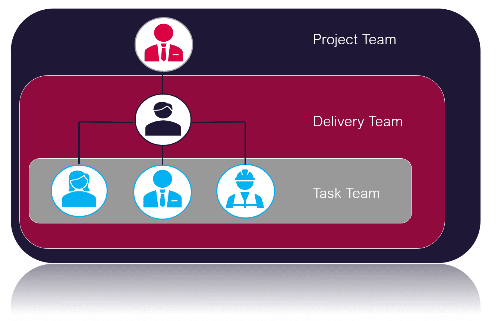
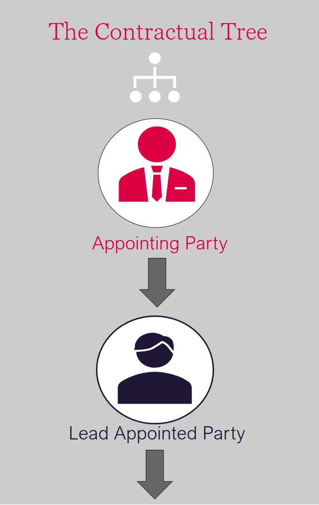
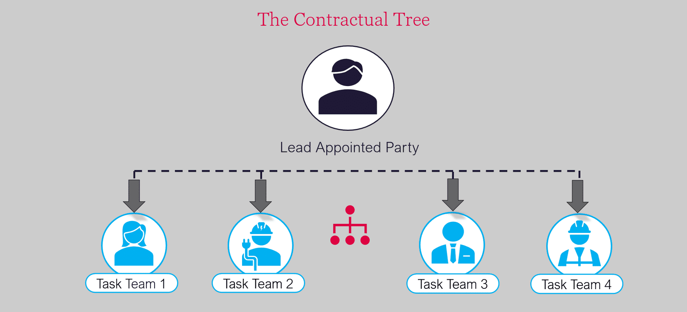
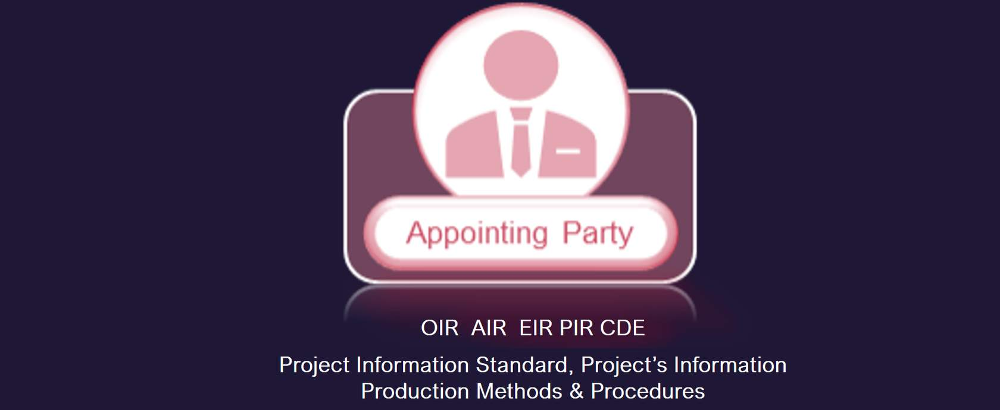
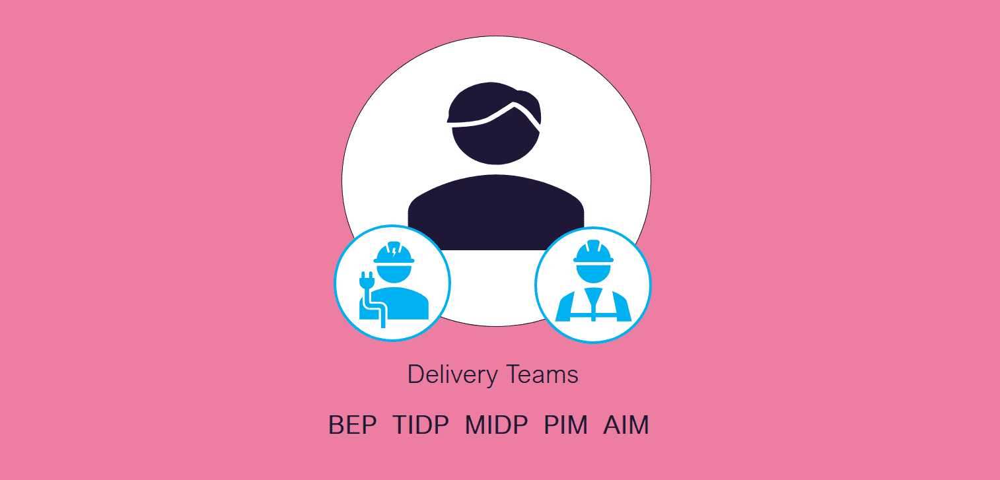

# Unit 2 - Lesson 1 - BIM Terminology & Acronyms

*Lesson 1 of 4*

## Lesson Objectives

In this lesson we aim to:

Introduce BIM by defining the term and considering how it is used.

Understand how the term BIM is used in many different ways by many different people.

> [!note] Audio transcript (00:08)
> This unit introduces BIM by defining the term and considering how itis used. The term BIM is used in many different ways by many different people.

## What is Building Information Modeling (BIM)?

> **"Use of a shared digital representation of a built object to facilitate design, construction and operation processes to form a reliable basis for decisions."(This is the definition from the IS0 19650-1)**

## BIM Terminology and Acronyms

**In the BIM world there are many acronyms!
**

## The Contractual Tree

> [!note] Audio transcript (00:51)
> There is different terminology in ISO 9650 in relation to certain types of teams. This relates to a kind of contractual or project organisational tree as shown here. Here you will see the three parties according to ISO 9650 and how they're structured within project delivery and task teams. At the top of the tree we can see the client who is referred to as the appointing party. Below this are the lead designer or contractor who are referred to as the lead appointed party. There can be more than one lead appointed party it is worth noting and lastly below this are the appointed parties of which there is typically several. Appointing party, lead appointed party and appointed party will form the project team. The lead appointed party and appointed party should be the delivery team and the appointed parties will form the task team.
>
> Source: [Lesson 1 - BIM Terminology Acronyms - BIM ISO 19650 12 Project D.mp3](unit-2-lesson-1-bim-terminology-acronyms/assets/Lesson 1 - BIM Terminology Acronyms - BIM ISO 19650 12 Project D.mp3)

*You may be wondering what or who an appointing party may be and how this differs from what you may have traditionally referred to as a client or an employer…*

## Client V Employer

### Flashcards

**Client**

The person or organization responsible for:

- Initiating and financing a project
- Approving the brief
This person may be the building owner

**Employer**

The person or organization entering into the contract for:

- Goods
- Services or
- Engineering / Construction works

The Appointing Party encompasses both of these, Client and Employer.

> [!note] Audio transcript (00:25)
> The appointing party must firstly appoint the lead supplier and they shall be labeled as the lead appointed party. In doing so, the appointing party has become an employer. It is important that the appointing party have clearly set out their information requirements. The lead appointed party will provide a plan for how and when to deliver the information. In response to these, we shall discuss in further detail during the course.

> [!note] Audio transcript (00:57)
> The lead appointed party then appoints a series of subcontractors known as appointed parties and so forming the delivery team or teams. The lead supplier, having now appointed the task teams, has also become an employer. The appointing party appoints a delivery team which is led by a lead appointed party. The lead appointed party will then have a number of task teams producing deliverables. The need is communicated down through the appointments, including the EIRs. Then the required deliverables are communicated up. Further terminology includes appointments, these are agreed instructions for the provision of information concerning works, goods or services. Appointing party, this is the receiver of information concerning works, goods or services from a lead appointed party. Lead appointed party and task teams, these are the providers of information concerning works, goods or services.
>
> Source: [Lesson 1 - BIM Terminology Acronyms - BIM ISO 19650 12 Project D (1).mp3](unit-2-lesson-1-bim-terminology-acronyms/assets/Lesson 1 - BIM Terminology Acronyms - BIM ISO 19650 12 Project D (1).mp3)

## BIM Terminology: Teams

During the course we reference the different team and stakeholder  terminologies. There are three team categories that exist:

- **Project Team **
All parties involved in the delivery of information process. The appointing party, lead appointed party and all appointed parties.
- **Delivery Team **
The multiple stakeholders responsible for creating the information, typically the lead appointed party and their appointed parties
- **Task Team**
The person or team contained within the delivery team that are deemed responsible for a specific task or information requirement, such as an Architect providing a drawing package.
## BIM Terminology: Appointing Party

*Shown here are the most common BIM terms , abbreviations  and documents used in relation to Appointing Party Responsibilities:
OIR  AIR  EIR  PIR  PIS  PIPMP  CDE  COBIe
We shall discuss what these mean next...*

### Flashcards

**Card 1**

**OIR**: Organizational Information Requirements.

What information the Employer’s Organization needs.

**Card 2**

**AIR**: Asset Information Requirements.

What information the asset management team needs manage the asset.

**Card 3**

**EIR**: Exchange Information Requirements.

What information an Employer needs and its acceptance criteria.

**Card 4**

**PIR**: Project’s Information Requirements.

These are expressions of the high-level information needed by the client to make key decisions concerning the project. This can use the Plain language Questions technique, a technique to produce non-technical questions which can be used as information requirements.

**Card 5**

Project’s Information Standard

The structure, classification and standards relating to the exchange of information.

**Card 6**

Project’s Information Production Methods & Procedures

Establish the procedures for the generation, review, approval and distribution of new information to the Appointing Party.

**Card 7**

**CDE**: Common Data Environment.

A process to manage and exchange files in a collaborative environment.

**COBIe**

Construction Operations Buildings information exchange.

A defined schema to exchange asset information.

## BIM Terminology: Delivery Teams

*Shown here are the most common BIM terms used in relation to delivery team responsibilities:
BEP  TIDP  MIDP  PIM  AIM
We shall discuss what these mean next...*

### Flashcards

**Card 1**

**BEP,** BIM Execution Plan.  A collaborative plan of how information should be produced, exchanged and managed on a project.

**Card 2**

**TIDP**, Task Information Delivery Plan.  A schedule of deliverables to be produced by a particular task team on a project.

**Card 3**

**MIDP**, Master Information Delivery Plan.  A schedule of deliverables to be produced on a project.

**Card 4**

**PIM**, Project Information Model.  The information model used during a project’s delivery phase.

**Card 5**

**AIM**, Asset Information Model.  The information model used during an asset’s operational phase.

## Lesson Summary

Lesson complete! You are now able to:

Introduce BIM by defining the term and considering how it is used.

Understand how the term BIM is used in many different ways by many different people.

---

**[CONTINUE]**

---

## Ten-Question Analysis Framework

### 1. Problem
How do project participants align on consistent contractual terminology and team structures across international projects?

### 2. Applicability
- **Scope**: Contractual arrangements and team definitions across all ISO 19650 projects.
- **Roles**: Appointing Party, Lead Appointed Party, Appointed Party, Project Team, Delivery Team, Task Team.

### 3. Process
1. Replace legacy terms (Employer -> Appointing Party; Main Contractor / Lead Designer -> Lead Appointed Party; Subcontractor / Subconsultant -> Appointed Party).
2. Group parties into clear functional clusters:
   - **Project Team**: Appointing Party + all Lead Appointed Parties + Appointed Parties.
   - **Delivery Team**: Lead Appointed Party + Appointed Parties working under them.
   - **Task Team**: Appointed Parties executing specific information production tasks.

### 4. Evidence
- Contract organization charts and appointment documentation using ISO 19650 party titles.

### 5. Principles
- **Clarity of Relationships**: Distinct hierarchy separating client governance from supplier delivery clusters.

### 6. Risks & Anti-patterns
- Mixing outdated PAS 1192 terminology with ISO 19650 terms in legal contracts.

### 7. Operationalization
- ISO 19650 Glossary & Role Alignment Table for appointment drafting.

### 8. Skill Test
Can this become a Skill?
**Yes** — Candidate: `terminology-alignment-auditor`.

### 9. Skill Design
- **Supported Role**: Legal / Procurement / BIM Manager.

### 10. Validation Plan
Verify that contractual appointment documents use standardized ISO 19650 party definitions.

---

## Knowledge Space Links
- **Entities**: [[appointing-party]], [[lead-appointed-party]]
- **Concepts**: [[project-team-structure]]

---
*Extracted from `Lesson 1 - BIM Terminology & Acronyms - BIM ISO 19650 1&2 Project Delivery_ Unit 2 - BIM Explained.html` via webpage-content-extractor.*
