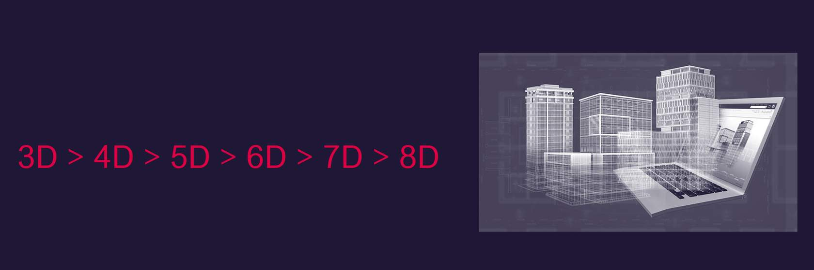
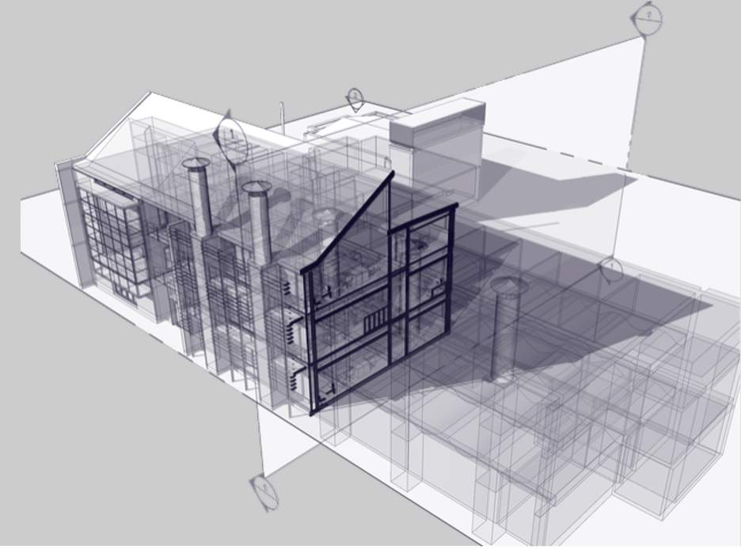
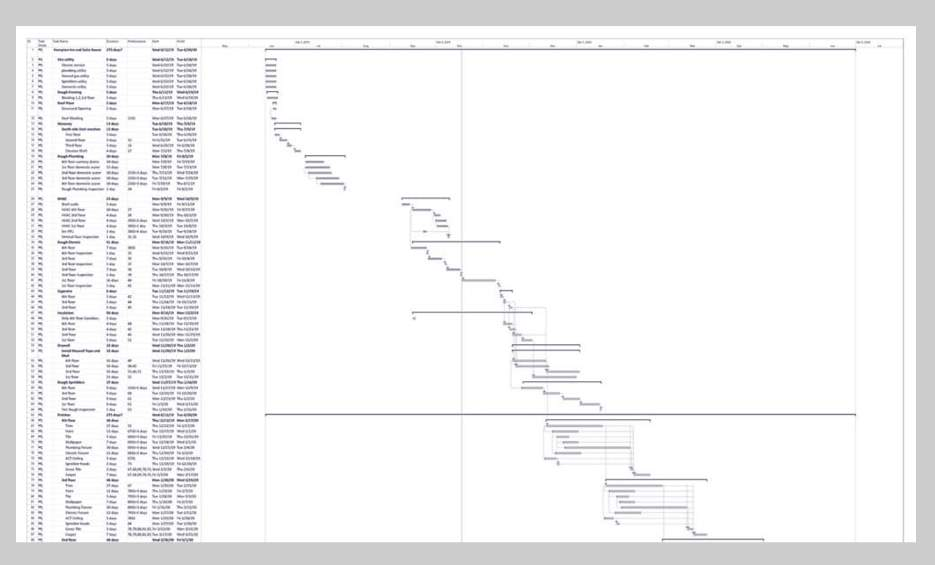
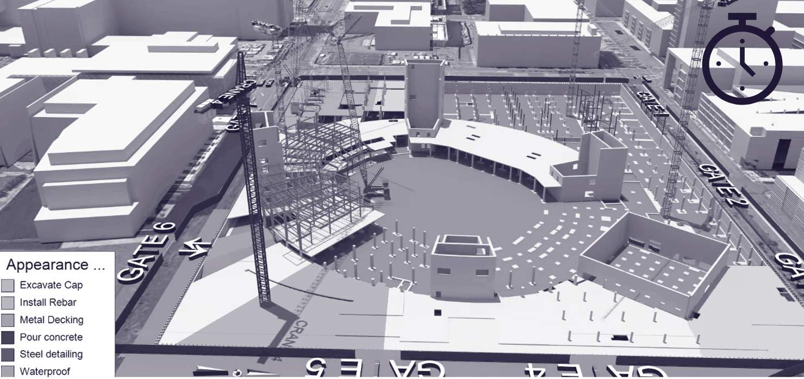
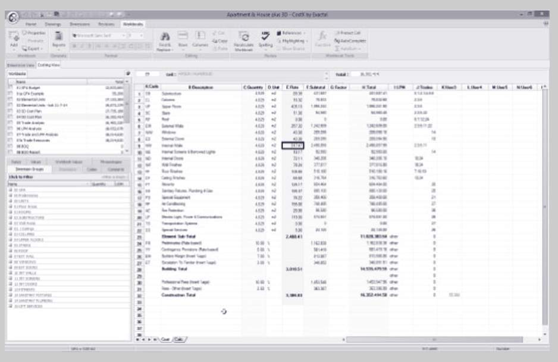
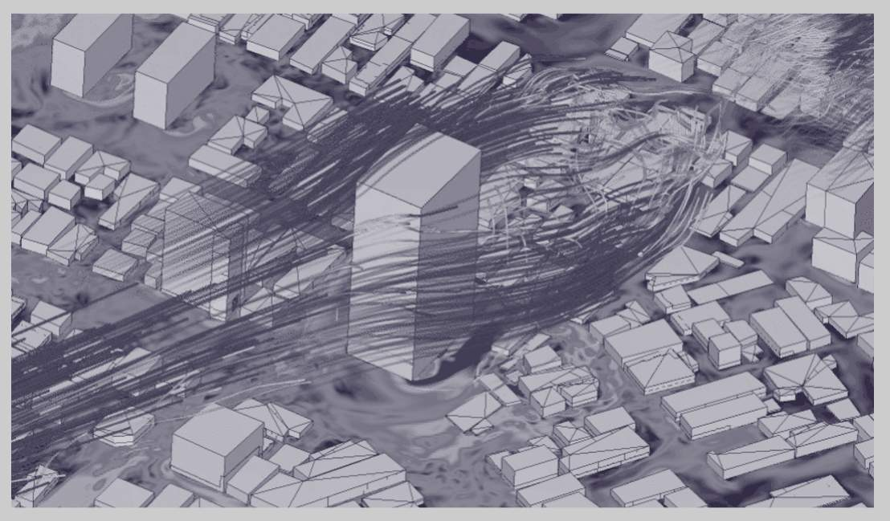

# Unit 2 - Lesson 2 - BIM Dimensions

*Lesson 2 of 4*

## Lesson Objectives

In this lesson we aim to:

Explain the ever expanding BIM dimensions and their uses

## BIM Dimensions

*Here we explore 3D, 4D, 5D,6D, 7D and even 8D building information modelling (BIM), and show how adding extra information can make for more timely decisions – and ultimately better buildings.*

## 3D BIM

> [!note] Audio transcript (00:38)
> Three-dimensional drawings in their simplest form can just be a series of lines, like 2D, used to create some perspective on the item being drawn, for example adding width to height and length. Alternatively, they can be 3D solids representing the geometry. This is no different to a 2D drawing though. It is still done. To allow building elements, like walls, to hold information, there was a need to create something to associate this information to. This is typically done through object-based modelling. The power of BIM modelling tools, such as Revit, is that they are a database containing data and information.
>
> Source: [Lesson 2 - BIM Dimensions - BIM ISO 19650 12 Project Delivery Un.mp3](unit-2-lesson-2-bim-dimensions/assets/Lesson 2 - BIM Dimensions - BIM ISO 19650 12 Project Delivery Un.mp3)

*Here we have a image of our Building 16 Revit model, and you can see that the properties panel contains important meta-data In relation to specific assets.
We can see that COBie parameters are making an appearance, and this is something you will become familiar with as it is an international method for exchanging building and asset related data in an Open BIM format. *

## 4D BIM

4D refers to the process of assigning time related data to objects within the model, often to aid construction programming and sequencing.

> [!note] Audio transcript (00:38)
> In addition to the information described, other information can also be associated to the object. One example is time. 4D is the process of assigning time-related data to objects within the model, often to aid construction programming and sequencing. Objects with associated information such as date of construction or date of demolition can be used to determine what plant and materials are needed on site, as well as to assess labour resourcing, resource clashing and highlight any program issues. In addition, if there are changes to the program, this information can be used to assess the knock-on effect these changes have on other site activities.
>
> Source: [Lesson 2 - BIM Dimensions - BIM ISO 19650 12 Project Delivery Un (1).mp3](unit-2-lesson-2-bim-dimensions/assets/Lesson 2 - BIM Dimensions - BIM ISO 19650 12 Project Delivery Un (1).mp3)

* Synchro software 4D simulation - https://www.synchroltd.com/(opens in a new tab)*

## 5D BIM

5D refers to the process of assigning cost related data to objects within the model, often to aid cost estimation, based on quantification and model scheduling.

> [!note] Audio transcript (00:38)
> In addition to the information described, other information can also be associated to the object, and one example is cost. 5D refers to the process of assigning cost-related data to objects within the model, often to aid cost estimation based on quantification and model scheduling. For example, by extracting the height, width and length of the wall, information about the cost of the brick along with current labour rates can be used to determine the construction costs. This process reduces the chance of human error by directly extracting the information required, reducing the time required to gather data to form documentation such as bills of quantities and estimates.
>
> Source: [Lesson 2 - BIM Dimensions - BIM ISO 19650 12 Project Delivery Un (2).mp3](unit-2-lesson-2-bim-dimensions/assets/Lesson 2 - BIM Dimensions - BIM ISO 19650 12 Project Delivery Un (2).mp3)

## 6, 7, 8D BIM & Beyond

> [!note] Audio transcript (01:54)
> In addition to the five dimensions discussed, there exist others within the construction industry. However, care should be taken when using them as there is no formal consensus on which dimensions deal with that information. 6D is considered to be relating to the operational and facilities management. This type of bin modelling allows stakeholders to track important asset data like status, warranty information, technical specifications and maintenance and operation manuals. 7D is considered as sustainability and building analyses. It uses modelling software to assess solar heating, building performance and orientation, day lighting etc. It is also called project life cycle. 8D is considered to be regarding health and safety and uses accident prevention or tracking. While other Ds such as health and safety and sustainability analyses have also been used without any industry consensus. From a technical point of view each dimension adds a new value to the object. 1D is length, 2D plus width, 3D plus height, 4D plus time, 5D plus cost, 6D plus facilities management maintenance, 7D plus sustainability life cycle, 8D plus occupational safety and health. For a lesson like sustainability there isn't a common attribute that could be used as simply as cost or height. The same can be said of facility management as well as health and safety. For this reason we do not present above 5D. Note is not important what they are called. What matters is understanding what information is needed to complete the task at hand. 6D BIM is focused on the sustainability of an asset. 7D BIM facilities management improves operations and facility management by building owners and managers. 8D BIM modelling tool for accident prevention through design, occupational health and safety.
>
> Source: [Lesson 2 - BIM Dimensions - BIM ISO 19650 12 Project Delivery Un (3).mp3](unit-2-lesson-2-bim-dimensions/assets/Lesson 2 - BIM Dimensions - BIM ISO 19650 12 Project Delivery Un (3).mp3)

## 7D BIM

7D BIM is focused on the sustainability of an asset, and is known as the ‘project life cycle information’ or sometimes referred to as Facilities Management.

BIM models can be used to store data to aid in the sustainable design of buildings, and assist in processes such as BREEAM.

![Screenshot of H\B:ERT being used in Revit, showing the mixed-use project Tiger Way as an example. Credit: Hawkins\BrownReliable embodied carbon measurement depends on consistency. The Whole Life Carbon Network (WLCN) with RICS is doing great work in this area, but it will take time for the industry to upskill and there is no national funding for the required establishment of a national Environmental Performance Declaration (EPD) database. H\B:ERT was developed to help architects make WLC evidence-based design approaches at the earliest design stages. Architects must now take the lead for a Net Zero future. ](unit-2-lesson-2-bim-dimensions/assets/1xqFpfmxvseDKj23_brCaEbCzl4TclO6-.jpg)

*Screenshot of H\B:ERT being used in Revit, showing the mixed-use project Tiger Way as an example. Credit: Hawkins\Brown
Reliable embodied carbon measurement depends on consistency. The Whole Life Carbon Network (WLCN) with RICS is doing great work in this area, but it will take time for the industry to upskill and there is no national funding for the required establishment of a national Environmental Performance Declaration (EPD) database. 
H\B:ERT was developed to help architects make WLC evidence-based design approaches at the earliest design stages. Architects must now take the lead for a Net Zero future. *

*Screenshot of  Wind analysis using SimScale software - https://www.simscale.com/(opens in a new tab)
The simulation of wind and other environmental aspects helps to  inform early design decisions.
*

## Lesson Summary

Lesson complete! You are now able to:

Explain the ever expanding BIM dimensions and their uses

**[CONTINUE]**

---

## Ten-Question Analysis Framework

### 1. Problem
How do project teams categorize and coordinate multidisciplinary BIM use cases (scheduling, cost, sustainability, operations) beyond basic 3D geometric visualization?

### 2. Applicability
- **Scope**: Project lifecycle uses from concept simulation to operation.
- **Dimensions**: 3D (Geometry & Data), 4D (Time/Sequencing), 5D (Cost/Estimating), 6D (Sustainability/Carbon), 7D (Facility Management/AIM), 8D (Health & Safety).

### 3. Process
1. Appointing party identifies desired BIM use cases in the EIR.
2. Delivery teams link relevant attributes and parameters to 3D model elements:
   - 4D: construction/demolition start/end dates linked to Synchro/Navisworks schedules.
   - 5D: cost codes, quantities (QTO), and unit rates linked to cost databases.
   - 6D: embodied carbon coefficients (EPD) and energy analysis properties.
   - 7D: COBie equipment schedules, warranty dates, and maintenance cycles.

### 4. Evidence
- Time-simulated 4D federated models.
- Automated 5D bill of quantities extractions.
- Embodied carbon simulation reports (e.g. H\B:ERT).
- COBie asset data drops for CAFM integration.

### 5. Principles
- **Object as Data Container**: 3D geometric objects act as anchors for alphanumeric metadata throughout the asset life.

### 6. Risks & Anti-patterns
- Advertising "7D BIM" as marketing buzzwords without clear data deliverables in the EIR.
- Overloading models with unstructured, unverified parameters.

### 7. Operationalization
- BIM Use Case Matrix mapped to LOIN requirements in the EIR.

### 8. Skill Test
Can this become a Skill?
**Yes** — Candidate: `bim-use-case-definer`.

### 9. Skill Design
- **Supported Role**: Lead Appointed Party BIM Coordinator / Information Manager.

### 10. Validation Plan
Verify that models contain necessary parameters for required dimensions (e.g., verifying 4D task IDs or 5D UniFormat/Uniclass codes).

---

## Knowledge Space Links
- **Concepts**: [[bim-dimensions]], [[information-model]]

---
*Extracted from `Lesson 2 - BIM Dimensions - BIM ISO 19650 1&2 Project Delivery_ Unit 2 - BIM Explained.html` via webpage-content-extractor.*
