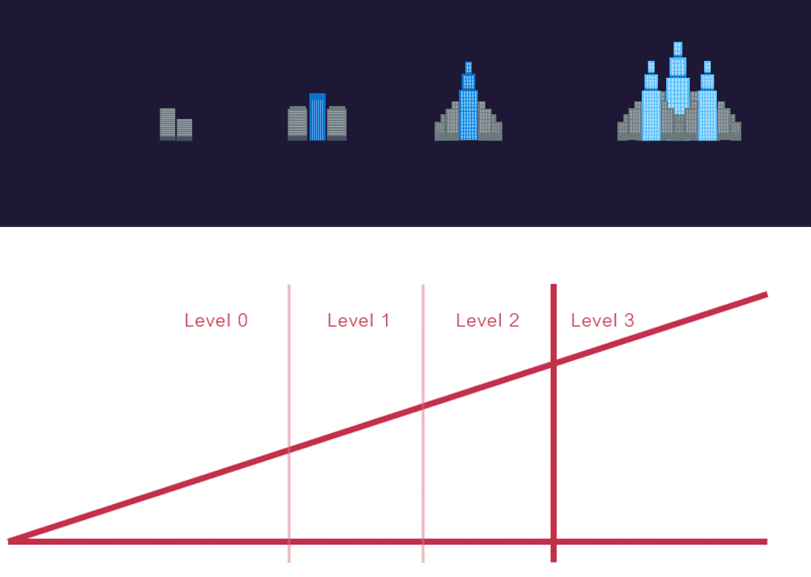
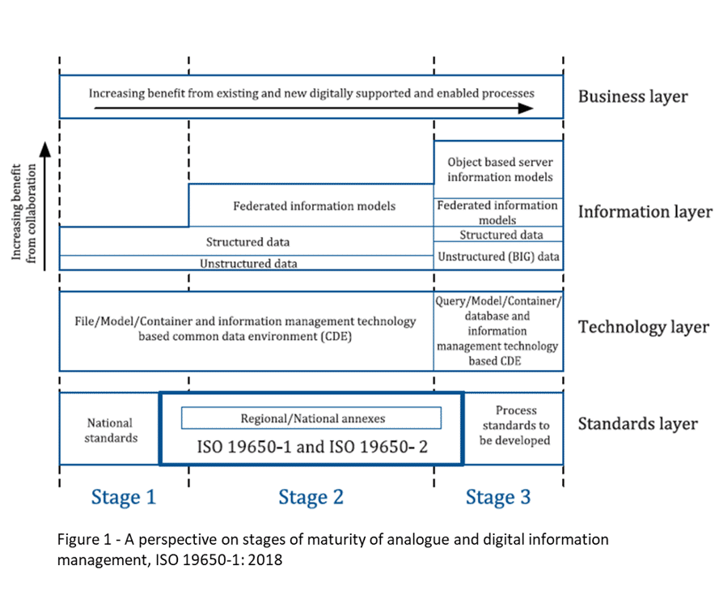

# Unit 2 - Lesson 3 - UK BIM Maturity

*Lesson 3 of 4*

## Lesson Objectives

In this lesson we aim to:

Explain further terminology in the form of the ‘BIM maturity levels’.

## UK BIM Maturity

> [!note] Audio transcript (00:41)
> Knowing that it would not be possible for the industry to fully adopt full information management processes immediately, a maturity model was developed and then used to form a roadmap for BIM adoption within the UK construction industry. The maturity model was drawn as a ramp to demonstrate that this is a journey of improvement, with the first hard target being set at having all centrally procured government projects to follow BIM Level 2, requiring information management from April 2016. As you can see, the ramp extends beyond this target, demonstrating that BIM is not a quick fix, but a long-term strategy to improve the UK construction industry for the better.
>
> Source: [Lesson 3 - UK BIM Maturity - BIM ISO 19650 12 Project Delivery U.mp3](unit-2-lesson-3-uk-bim-maturity/assets/Lesson 3 - UK BIM Maturity - BIM ISO 19650 12 Project Delivery U.mp3)

*With the introduction of ISO 19650, we saw BIM levels removed and replaced with BIM stages of maturity in relation not information management.
BIM Stages are defined by their minimum requirements. 
This eradicates instances where appointing parties during the early stages of BIM implementation were asking for BIM on a project, without understanding what or why. *

## BIM Level 0

> [!note] Audio transcript (00:25)
> BIM Level 0 is where uncoordinated information consisting of geometric models and data is generally being delivered in paper-based formats. Consequently, this type of information exchange can lead to errors and omissions. Note that even if an organisation is using 3D modelling software, producing a building information model, if the exchange of information is through an unstructured format, it will still only be Level 0.
>
> Source: [Lesson 3 - UK BIM Maturity - BIM ISO 19650 12 Project Delivery U (1).mp3](unit-2-lesson-3-uk-bim-maturity/assets/Lesson 3 - UK BIM Maturity - BIM ISO 19650 12 Project Delivery U (1).mp3)

## BIM Stage 1

> [!note] Audio transcript (00:48)
> BIM Stage 1 is object-based modelling through software such as Revit or ArchiCAD. Manage CAD in 2D or 3D format using a common data environment and possibly some standard data structures and formats. If an organisation produces their information following agreed standards, methods and procedures to produce information in structured formats and exchanges these files with their project team using a common data environment, this is referred to as Level 1. Without a common data environment and structured data information such as agreed file formats and naming conventions, an organisation cannot achieve BIM Level 1. National standards as discussed at the start of the course are used for drawing production and object creation, for example.
>
> Source: [Lesson 3 - UK BIM Maturity - BIM ISO 19650 12 Project Delivery U (2).mp3](unit-2-lesson-3-uk-bim-maturity/assets/Lesson 3 - UK BIM Maturity - BIM ISO 19650 12 Project Delivery U (2).mp3)

## BIM Stage 2

> [!note] Audio transcript (01:15)
> Model-based federation and collaboration is the biggest change moving into Stage 2. Managed CAD in a 3D environment held in separate discipline BIM tools with attached data. Stage 2 is regulated, structured, consistent and collaborative. The approach may utilise 4D program data and 5D cost elements. BIM Stage 2 builds upon BIM Stage 1 with organisations following an agreed BIM execution plan to produce separate geometric models which are then combined to produce a single source of truth. In addition, there are other requirements on the project such as client-based responsibilities and clearly defined documentation to be produced. The intention of BIM Stage 2 is that it can be delivered with existing procurement methodology, legal and technological systems as well as the current industry skill base without changes to professional indemnity, PI, as it keeps existing ownership and liability clearly defined. The ISO international suite of standards must be adhered to with variations allowed for different national annexes. Stage 2 maturity is also identified as BIM according to the ISO19650 series rather than the old BIM Level 2 phrase.
>
> Source: [Lesson 3 - UK BIM Maturity - BIM ISO 19650 12 Project Delivery U (3).mp3](unit-2-lesson-3-uk-bim-maturity/assets/Lesson 3 - UK BIM Maturity - BIM ISO 19650 12 Project Delivery U (3).mp3)

## BIM Stage 3

> [!note] Audio transcript (00:40)
> BIM Stage 3 is still under development, however its purpose is for the whole lifecycle management of the assets and server-based models represent a change in how we share information. It will require integrated network servers to host an integrated model for all disciplines. This potentially brings big legal and security issues, which are in the process of exploration at the moment. Ownership and permitted use of information and related issues of intellectual property and copyright, insurances and potential liabilities need to be considered and addressed. Models will continue to be maintained across the project and asset lifecycle and may incorporate additional metadata such as lifecycle costing for example.
>
> Source: [Lesson 3 - UK BIM Maturity - BIM ISO 19650 12 Project Delivery U (4).mp3](unit-2-lesson-3-uk-bim-maturity/assets/Lesson 3 - UK BIM Maturity - BIM ISO 19650 12 Project Delivery U (4).mp3)

## Lesson Summary

Lesson complete! You are now able to:

Explain further terminology in the form of the ‘BIM maturity levels’.

**[CONTINUE]**

---

## Ten-Question Analysis Framework

### 1. Problem
How do clients and supply chain organizations assess digital information maturity and plan progressive adoption steps from paper-based delivery to full cloud integration?

### 2. Applicability
- **Scope**: Organizational and project digital maturity assessment.
- **Frameworks**: Bew-Richards Maturity Wedge (Levels 0, 1, 2, 3), ISO 19650 Stages of Maturity (Stage 1, Stage 2, Stage 3).

### 3. Process
1. Assess current capability against minimum requirements:
   - **Stage 1**: 2D/3D CAD & object models with basic CDE and standard file naming.
   - **Stage 2**: Collaborative BIM according to ISO 19650 with federated models, OpenBIM (IFC/COBie), structured EIR/BEP.
   - **Stage 3**: Integrated cloud/server-based models, digital twins, real-time lifecycle query across disciplines.
2. Establish baseline capability and set realistic project procurement targets.

### 4. Evidence
- Organizational BIM Capability Assessment scorecards.
- Audit evidence of CDE compliance and structured container exchanges.

### 5. Principles
- **Maturity Journey**: Digital transformation is a continuous roadmapped journey rather than an instant switch.
- **Information over Geometry**: High 3D graphical detail does not equal Stage 2 maturity without structured data and CDE governance.

### 6. Risks & Anti-patterns
- Clients mandating "Level 3" or advanced stages without knowing the legal, security, and contractual requirements.
- Claiming Stage 2 compliance while relying on unmanaged email file attachments.

### 7. Operationalization
- BIM Maturity Self-Assessment Rubric.

### 8. Skill Test
Can this become a Skill?
**Yes** — Candidate: `bim-maturity-evaluator`.

### 9. Skill Design
- **Supported Role**: Lead Information Manager / Client Advisor.

### 10. Validation Plan
Evaluate supply chain partners against Stage 2 minimum criteria prior to tender shortlisting.

---

## Knowledge Space Links
- **Concepts**: [[uk-bim-maturity-stages]], [[cde-solution-architecture]]

---
*Extracted from `Lesson 3 - UK BIM Maturity - BIM ISO 19650 1&2 Project Delivery_ Unit 2 - BIM Explained.html` via webpage-content-extractor.*
