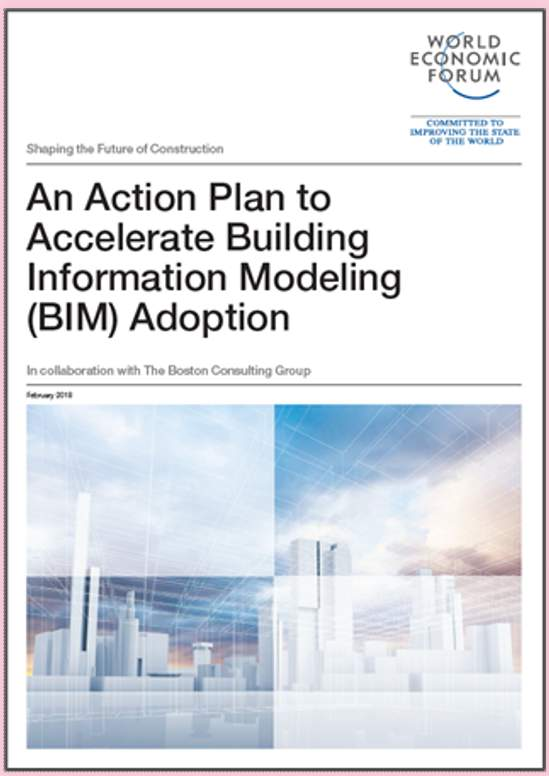
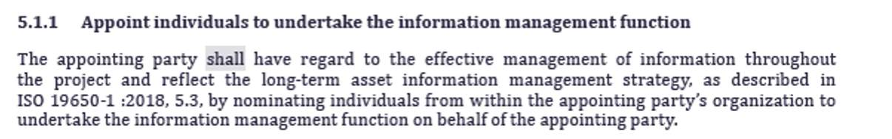

# Unit 3 - Lesson 1 - ISO 19650 Overview

*Lesson 1 of 5*

## Lesson Objectives

In this lesson we aim to:

Introduce ISO 19650

## Accelerating BIM Adoption

To support the adoption of building information modelling (BIM), the World Economic Forum published several recommendations which included the need to:

- To articulate BIM’s benefit across the entire lifecycle
- For globally consistent standards and specifications
> “A global convention for the production and management of information is required”**(This is the definition from the IS0 19650-1)**

> [!note] Audio transcript (00:58)
> In order to improve outcomes for everybody, the World Economic Forum has said that we need global conventions to improve performance. To achieve this, an international standard for BIM has been developed. In order to accelerate the adoption of this standard, they recommend articulating BIM's benefits across the entire life cycle. Considering BIM as a value creator, not as a cost factor, approaching BIM as the essential first step to digitisation, using integrated construction and redefining risk return mechanisms, setting up early collaboration and communication among stakeholders, establishing data sharing standards and open systems, supporting the development of BIM skills along the full value chain, changing behaviours and processes, not just technology, making a long-term commitment and support innovative financing. Please note there is flexibility within ISO 9650 for each country to write their own annex to the standard.
>
> Source: [Lesson 1 - ISO 19650 Overview - ISO 19650 12 Project Delivery Un (1).mp3](unit-3-lesson-1-iso-19650-overview/assets/Lesson 1 - ISO 19650 Overview - ISO 19650 12 Project Delivery Un (1).mp3)

*An Action Plan to Accelerate Building Information Modelling (BIM) Adoption World Economic Forum 2018*

## What is a Standard?

**There are several types of Standards, including specifications, code of practice and guides 
**

> [!note] Audio transcript (01:41)
> A standard is a set of working methods that is accepted as being the best to use. A method or technique that has consistently shown results are superior to any alternatives because it has become a standard way of doing an activity used to maintain quality control and consistency for information exchanges. There are several types of standards including specifications, absolute requirements, code of practice, recommended current good practice, guide, information guidance insufficient to support compliance, and vocabulary, compendium of terms and definitions. These standards can be published as publicly available specifications, PASs, to speed up standard development anyone can commission and sponsor a PAS subject to national standards body approval. For example, the previous bin standard, PAS1192-2, specification for information management for the capital-slash-delivery phase of construction projects using building information modelling. National standard, standards formally adopted and maintained by national standards body such as the American National Standards Institute, Australian Standards, German Institute for Standardization and British Standards, European Standards, the European Committee for Standardization, ISO Standards, the International Standards Organization. There are all sorts of issues relating to hierarchies of standards. For example, within the EU, CENs almost become mandatory. There is something called the Vienna Agreement where a CEN can automatically be adopted to ISO and vice versa, which increases the status of them and therefore the requirement to meet them.
>
> Source: [Lesson 1 - ISO 19650 Overview - ISO 19650 12 Project Delivery Un.mp3](unit-3-lesson-1-iso-19650-overview/assets/Lesson 1 - ISO 19650 Overview - ISO 19650 12 Project Delivery Un.mp3)

## International Organization for Standardization (ISO)

Formed in 1946 representing 35 counties, there are now more than 165 member countries.

ISO is an international organisation which was formed with a vision to facilitate the international coordination and unification of industrial standards.

*ISO isn’t an abbreviation. It is derived from the Greek isos, meaning equal. Whatever the country, whatever the language, ISO is always used as the abbreviated form.
ISO is an international organisation which was formed with a vision “to facilitate the international coordination and unification of industrial standards”
It was formed in 1946 to achieve this vision. Today it has 165 countries as members.*

## (ISO) Use of Language

The ISO 19650 standards use specific verbal forms :

‘Shall’ and the past tense ‘Should’:

- Shall indicates a requirement; it must be done.
- Should indicates a recommendation.
> [!note] Audio transcript (00:27)
> The ISO standards have very specific terms to set out specific requirements. One of the things ISO 9650 does talk about is the suitability of the use of standards dependent on the size and complexity of the project and that in some instances, for example, a very small project, the use of all their requirements may be too much. This is to support primary requirement for a clause and is generally where the term shall consider is used.
>
> Source: [Lesson 1 - ISO 19650 Overview - ISO 19650 12 Project Delivery Un (2).mp3](unit-3-lesson-1-iso-19650-overview/assets/Lesson 1 - ISO 19650 Overview - ISO 19650 12 Project Delivery Un (2).mp3)

*See ISO 19650-2 Clause 5.1.1 as one of many instances for the use of ‘shall’*

## Lesson Summary

Lesson complete! You are now able to:

Understand an overview of ISO 19650

---

**[CONTINUE]**

---

## Ten-Question Analysis Framework

### 1. Problem
Why do we need an international standard for information management in construction, and how are mandatory requirements distinguished from recommendations?

### 2. Applicability
- **Scope**: Global built environment projects across all lifecycle phases.
- **Standards**: ISO 19650 series (Parts 1 to 5), national annexes, Vienna Agreement.

### 3. Process
1. International harmonization replaces fragmented national standards (e.g. PAS 1192 transition to ISO 19650).
2. Standard terminology establishes legal precision: "shall" (mandatory requirement) vs. "should" (recommendation) vs. "shall consider" (mandatory evaluation).
3. Adaptation through National Annexes to account for local industry practices.

### 4. Evidence
- Contractual clause references to ISO 19650.
- Traceability matrices linking deliverables to "shall" clauses.

### 5. Principles
- **Global Consistency**: A unified framework for digital information management across international supply chains.
- **Proportionality**: Standards application must be proportionate to project scale and risk.

### 6. Risks & Anti-patterns
- Treating recommendations ("should") as mandatory, or ignoring mandatory requirements ("shall").
- Claiming compliance without citing specific clause criteria.

### 7. Operationalization
- Clause-by-clause compliance register for contracts.

### 8. Skill Test
Can this become a Skill?
**Yes** — Candidate: `iso-verbal-form-linter` (verifying contract language).

### 9. Skill Design
- **Supported Role**: Legal Counsel / Information Manager.
- **Trigger**: Contract drafting.

### 10. Validation Plan
Audit appointment documentation for correct usage of "shall" vs "should".

---

## Knowledge Space Links
- **Entities**: [[iso-19650-1]], [[iso-19650-2]]

---
*Extracted from `Lesson 1 - ISO 19650 Overview - ISO 19650 1&2 Project Delivery_ Unit 3 - BIM According to ISO 19650_.htm` via webpage-content-extractor.*
