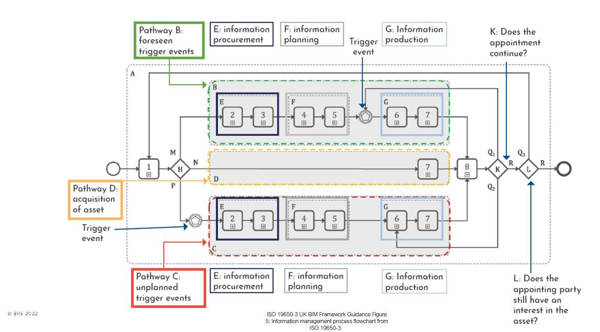

# Unit 3 - Lesson 3 - Part 3: Operational Phase

*Lesson 3 of 5*

## Lesson Objectives

In this lesson we aim to:

Understand ISO 19650 part 3, and the operational phase of an asset.

> [!note] Audio transcript (00:22)
> Organization and digitization of information about buildings and civil engineering works, including Building Information Modeling, BIM, Information Management using Building Information Modeling Part 3. Operational Phase of the assets. The meaning of an operational phase is the period of time that the building or asset is in operation after construction and commissioning is complete.

## Operational Phase

As you can see, a huge portion of information management in relation to an asset, and also the bulk of an assets life is during the operational phase.

> [!note] Audio transcript (00:23)
> As you can see, a huge portion of information management in relation to an asset and also the bulk of an assetls life is during the operational phase. This management process has been specifically addressed with ISO 19650 Part three relating to the operational phase of assets. ISO 19650 part three is designed to be a companion to ISO 19650 Part two.

## Asset Data

**ISO 19650-3** replaced **PAS 1192-3** in the UK which was published in 2014 and applicable until part 3 release in 2020.

> [!note] Audio transcript (00:22)
> ISO 19650 Part 3 replaced Paz 1192 Part Three in the UK which was published in 2014 and applicable until Part three release in 2020. For building operators and facility managers, the data embedded in BIM models relating to assets is extremely valuable and must be managed effectively. Data is considered as the new gold.

*Data is considered the new gold!*

## Principles

ISO 19650-3 is designed to sit alongside and compliment  part 2 and as such you will see many similar processes . This is so they can be utilised over the delivery and operational phase of an assets life.

There are however four key principles that are different:

Trigger Events:

Trigger events have carried over from the PAS standards. Those that can be foreseen and planned for, and those that cannot. an example of planned may be yearly maintenance.

## Information Management Flow Chart

*Click on the image to expand.*

![Activity groupingsA – encompasses all activities during operational phase B – activities per each appointment (before a trigger event)C - activities per each appointment (AFTER a trigger event)Step 1 leads to three different pathways, shown as shaded boxes labelled B, C and D depending o the trigger eventWithin the pathways B and C, the process isbroken into 3 sub-groups labelled E, F and G.Sub-group E is about procurement – of a tier 1 contractor or an in-house teamSub-group E is about procurement – of a tier 1 contractor or an in-house teamSub-group G is about production – when information is produced by appointed parties, reviewed by a lead appointed party and ultimately accepted by the asset owner/operatorThe process has feedback loops at points K and L.](unit-3-lesson-3-part-3-operational-phase/assets/D8wnNij7T5IDVBu4_XKiV2GltWK3A3WOx.jpg)

*Activity groupingsA – encompasses all activities during operational phase B – activities per each appointment (before a trigger event)C - activities per each appointment (AFTER a trigger event)
Step 1 leads to three different pathways, shown as shaded boxes labelled B, C and D depending o the trigger eventWithin the pathways B and C, the process isbroken into 3 sub-groups labelled E, F and G.Sub-group E is about procurement – of a tier 1 contractor or an in-house teamSub-group E is about procurement – of a tier 1 contractor or an in-house teamSub-group G is about production – when information is produced by appointed parties, reviewed by a lead appointed party and ultimately accepted by the asset owner/operatorThe process has feedback loops at points K and L.*

## Lesson Summary

Lesson complete! You are now able to:

Understand ISO 19650 part 3, and the operational phase of an asset.

**[CONTINUE]**

## Ten-Question Analysis Framework

### 1. Problem
How do asset owners maintain, update, and leverage asset data across the multi-decade operational phase of an asset when maintenance, refurbishment, or unexpected incidents occur?

### 2. Applicability
- **Stage**: `operational` (ISO 19650-3).
- **Roles**: Asset Owner, Facility Manager, Maintenance Contractors.
- **Key Concepts**: Asset Information Model (AIM), Asset Information Requirements (AIR), Trigger Events.

### 3. Process
1. Establish organizational information requirements (OIR) and asset information requirements (AIR).
2. Maintain the Asset Information Model (AIM) as a living repository.
3. Manage information exchanges via **Trigger Events**:
   - Planned trigger events (e.g. routine scheduled maintenance, regular regulatory inspections).
   - Unforeseen trigger events (e.g. equipment breakdown, fire, major emergency).
4. Procure FM teams or contractors to produce updated information containers following trigger events.
5. Ingest updated containers back into the AIM via structured feedback loops.

### 4. Evidence
- Asset Information Model (AIM) database / CAFM / IWMS.
- Maintenance event logs and trigger event work orders.
- Updated asset registers and O&M documentation.

### 5. Principles
- **Bulk of Lifecycle Value**: The operational phase accounts for ~80% of an asset's total lifecycle cost and value.
- **Trigger Event Paradigm**: Operational information management is event-driven rather than linear stage-driven.

### 6. Risks & Anti-patterns
- Allowing the AIM to become obsolete post-handover due to unrecorded maintenance modifications.
- Treating BIM as purely a design/construction tool and ignoring facility management systems.

### 7. Operationalization
- Trigger Event Response Matrix linking event types to required AIM update procedures.

### 8. Skill Test
Can this become a Skill?
**Yes** — Candidate: `aim-trigger-event-handler`.

### 9. Skill Design
- **Supported Role**: Facility Manager / Asset Information Manager.
- **Trigger**: Occurrence of maintenance, refit, or decommissioning trigger event.

### 10. Validation Plan
Verify that maintenance work orders automatically generate required AIM container update requests.

---

## Knowledge Space Links
- **Entities**: [[iso-19650-3]], [[appointing-party]]
- **Concepts**: [[information-model]]

---
*Extracted from `Lesson 3 - Part 3: Operational Phase - ISO 19650 1&2 Project Delivery_ Unit 3 - BIM According to ISO 19650_.html` via webpage-content-extractor.*
