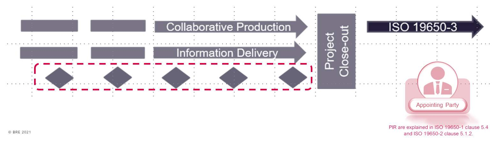
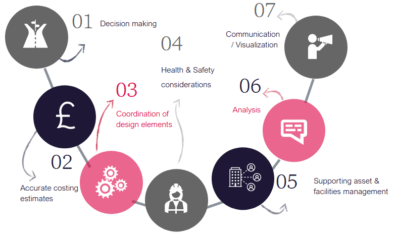
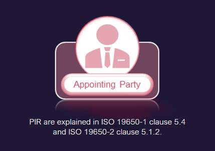

# Unit 4 - Lesson 2 - Establish the PIR

*Lesson 2 of 6*

## Lesson Objectives

In this lesson we aim to:

Understand PIR's

## Project information requirements (PIR)

> [!note] Audio transcript (00:09)
> Project Information Requirements Pirs. They identify the information required at key decision points in order to satisfy strategic objectives.

PIR is a set of high-level information requirements needed to answer or inform objectives defined by the Appointing Party.

Key decisions such as whether to proceed to the next work stage or not will be made based upon the answers provided.

A key decision point takes place when the appointing party makes a decision based on information provided by the delivery team.

Key decision points define the information delivery milestones and also the information exchanges that take place, typically aligning with the project stages.

The PIR’s should consider the following:

The project scope & plan of work

## Information Purpose

The purpose which the Appointing Party shall use the information, and the reasons why that information is required. Typical purposes include:

Decision making

## PIR Questions

The questions needed in order for the appointing party to make informed decisions.

Shown here are some typical examples of questions relating to typical project stages in order to satisfy a decision to move to the next stage.

Stage 3 - Does the design meet the federation strategy?
Does the asset comply with relevant regulations?
Does the design information comply with information security management plans?

## Lesson Summary

Lesson complete! You are now able to:

Understand PIR's

**[CONTINUE]**

---

## Ten-Question Analysis Framework

### 1. Problem
What information does the appointing party need to make informed strategic gate decisions (e.g. stage sign-off, budget approval, proceed to tender) during asset delivery?

### 2. Applicability
- **Stage**: `assessment-need` (ISO 19650-2 §5.1.2).
- **Roles**: [[appointing-party]].
- **Document**: [[project-information-requirements]] (PIR).

### 3. Process
1. Appointing party reviews strategic business objectives and project scope.
2. Identifies key decision points throughout the delivery stages.
3. Formulates non-technical, high-level questions for each decision point (e.g., regulatory compliance, cost, security).
4. Uses PIR to inform subsequent Exchange Information Requirements (EIR).

### 4. Evidence
- Approved Project Information Requirements (PIR) document.
- Defined list of key decision points mapped to work stages.

### 5. Principles
- **Decision-Driven**: Information is required solely to answer a strategic question or support a decision.
- **Hierarchical Derivation**: PIR derives from OIR and feeds directly into project EIR.

### 6. Risks & Anti-patterns
- Confusing PIR (high-level client decision questions) with detailed technical EIR.
- Failing to align PIR questions with realistic work stages.

### 7. Operationalization
- Stage-by-stage PIR Decision Matrix template.

### 8. Skill Test
Can this become a Skill?
**Yes** — Candidate: `pir-generator`.

### 9. Skill Design
- **Supported Role**: Client Advisory / Information Manager.
- **Trigger**: Strategic definition stage.

### 10. Validation Plan
Verify that PIR questions can be answered by the deliverables specified in the EIR.

---

## Knowledge Space Links
- **Entities**: [[project-information-requirements]], [[appointing-party]]
- **Methodologies**: [[establish-pir-method]]

---
*Extracted from `Lesson 2 - Establish the PIR - ISO 19650 1&2 Project Delivery_ Unit 4 - Assessment & Need.html` via webpage-content-extractor.*
