# Unit 4 - Lesson 4 - Establish Project Information Standard

*Lesson 4 of 6*

**Lesson Objectives**

## Project's Information Standard

> [!note] Audio transcript (00:09)
> The appointing party shall establish any specific information standards required by the Appointing parties organization within the project's information standard.

A schedule of industry standards to be used on the project which detail the following:

Information Exchanges (Between all parties)

Whole life information requirements

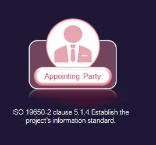

*As the name suggests, the project information standards are set out at a project level, rather than appointment level. *

These standards can be international, national, or organizational.

![There are three main categories of standards: International; National; and, OrganizationalEmployers within their Exchange Information Requirements need to define where they want compliance with standards on the project, for example Room, door and window numbering, as there are Standards for these.International.  Standards like ISO 9001, quality management, are controlled by the international organization for standardization.  Often International standards are adopted by other standards bodies such as the European Committee for Standardization (CEN), International Electrotechnical Commission (IEC) and national standards bodies.National.  Standards like BS 8541, Library objects for architecture,  engineering and construction, is controlled by the British Standards Institute (BSI), a national standards body.  Most countries shave their own national standards bodies such as Chile’s Instituto Nacional de Normalización (INN) and Chinas Standardization Administration of the People's Republic of China (SAC).Organizational.  Standards like BREEAM, maintained by BRE, are controlled by an organization as opposed to a standards body.  Another example of organizational standards would be your own organizations policies and procedures.](unit-4-lesson-4-establish-project-information-standard/assets/UlR4pU5Z3bnWmk7__xHxiNuoaXtJh6Rv1.jpg)

*There are three main categories of standards: International; National; and, Organizational
Employers within their Exchange Information Requirements need to define where they want compliance with standards on the project, for example Room, door and window numbering, as there are Standards for these.
International.  Standards like ISO 9001, quality management, are controlled by the international organization for standardization.  Often International standards are adopted by other standards bodies such as the European Committee for Standardization (CEN), International Electrotechnical Commission (IEC) and national standards bodies.
National.  Standards like BS 8541, Library objects for architecture,  engineering and construction, is controlled by the British Standards Institute (BSI), a national standards body.  Most countries shave their own national standards bodies such as Chile’s Instituto Nacional de Normalización (INN) and Chinas Standardization Administration of the People's Republic of China (SAC).
Organizational.  Standards like BREEAM, maintained by BRE, are controlled by an organization as opposed to a standards body.  Another example of organizational standards would be your own organizations policies and procedures.*

## Library Object Naming

BS 8541-1 object files should follow the naming convention described below:

*For object naming the Reference is typically  BS 8541, 4.3.2
BS 8541-1 identifies three fields that make up the object name:
The first one is Source,The second one is the high level types,the Third is sub-type Hyphens are recognised as the divider.*

## Information Container Naming

File naming standards should be clarified within the Projects Information Standard. In the U.K we typically use the national annex as the basis . Refer to NA.2.2 Information containers

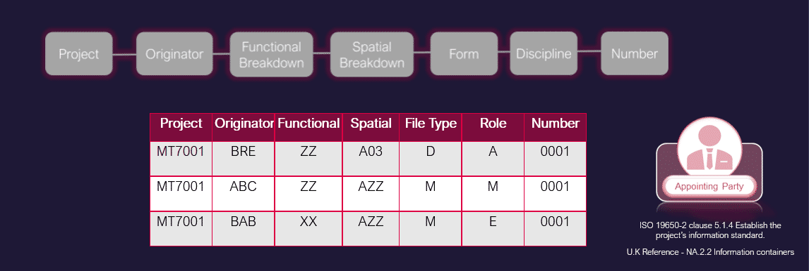

> [!note] Audio transcript (02:56)
> There are no recommendations for field length and overall string length in the National Annex, but each field and the overall string should be kept as short as possible. You can use the provided list of form and discipline codes, however, where required. Field codes can be extended to accommodate project specific requirements, such as a large project with multiple types of engineers, for example extending the rollcode to two characters. Project What project does this information container relate to? A unique project reference number should be defined by the appointing party and used by all the project team. The project can also be subdivided using the project coder. Originator Which party is responsible for producing this information container, as defined in the detailed responsibility matrix? Assign a unique code to each organisation on the project. Functional Breakdown Which functional aspect of the project does this information container relate to, for example system, work package, design topic? This can be based on physical or notional subdivision, or a particular package of work that may span across multiple spaces. ZZ equals multiple subdivisions applied to this information container. XX equals no subdivision is applicable to this information container. CI slash SFB and Uniclass have been used traditionally to denote work packages, and the functional breakdown allows this to be incorporated. Therefore the option to use a functional breakdown allows us to use work packages to define the function. XXV series, for example. Spatial Breakdown Which spatial aspect of the project does this information container relate to? For example region, location, floor level. A unique identifier could be defined for each spatial subdivision and fixed with the project's information standard. The spatial breakdown offers the chance to split up larger projects into smaller sections as the previous volume code did, in combination with the previous level code. For example, building A floor level 03 could be defined as A03. The following standard codes should apply. ZZ equals multiple spatial subdivisions are applicable. XX equals no spatial subdivision is applicable. Form, CNA.3.6 form for standard codes, based on BS ISO 29845. M equals model, D equals drawing, for example. This can be expanded. Which technical branch of the industry is responsible for producing this information container? A unique identifier should be defined for each discipline. A equals architect, for example. Number A sequential number, typically within a defined grouping system. The length should be agreed and adhered to. The field codes should use a hyphen delimiter. File naming standards should be clarified within the project's information standard. In the UK we typically use the national annex as the basis. Refer to NA 2.2 information containers.
>
> Source: [Lesson 4 - Establish Project Information Standard - ISO 19650 12 (1).mp3](unit-4-lesson-4-establish-project-information-standard/assets/Lesson 4 - Establish Project Information Standard - ISO 19650 12 (1).mp3)

## Form Codes

There are no recommendations for field length and overall string length in the National Annex, but each field and the overall string should be kept as short as possible. You can use the provided list of form and discipline codes, however, where required, field codes can be extended to accommodate project-specific requirements, such as a large project with multiple types of Engineers, for example, extending the Role code, to two characters.

The field codes should use a Hyphen delimiter

**MT7001-BRE-ZZ-A03-D-A-0001**

## Level of Information Need

Defines the quality, quantity and granularity of information, which can be in the form of Geometric information (LOD) or non –Geometric (LOI)

The Appointing Party should consider the method of assignment for level of information need and what is expected for each information requirement.

The level of information framework to be used on UK projects is typically NBS BIM Toolkit -The NBS Definitions Library.

The required Level of Information Need will be assigned for each Information Requirement in the High-Level Responsibility Matrix.

There is an appropriate Level of Detail and corresponding Level of Information for each of the RIBA work stage.

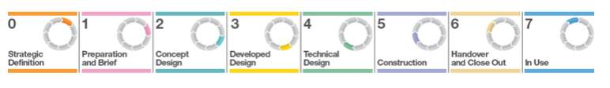

*For further detail refer to BS EN ISO 17412-1:2020*

This table below demonstrates The method of assigning the Level of Information Need , following ISO 19650-2: 2018 5.1.4 c).

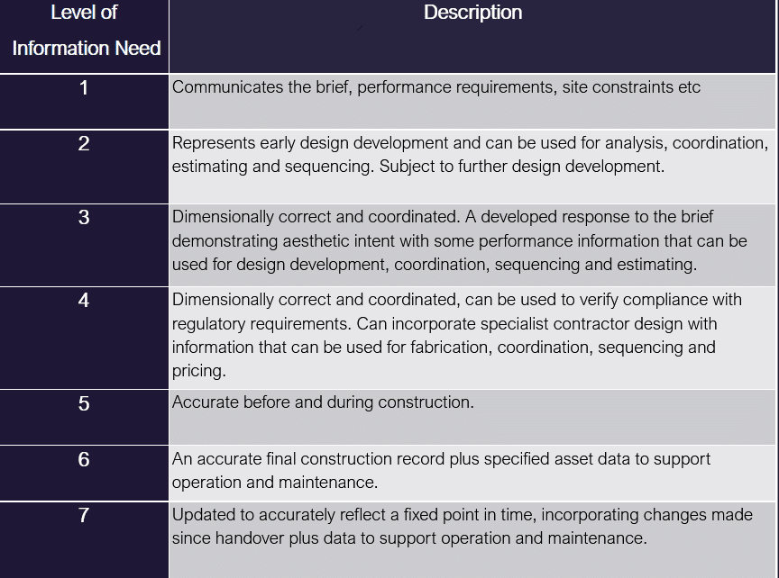

The NBS BIM Tool kit provides a great resource for visualizing examples of level of detail, and describing the non-Geometric information associated with BIM objects, typically expected at each project stage.

Go to: [https://toolkit.thenbs.com/definitions(opens in a new tab)](https://toolkit.thenbs.com/definitions)

You can search the database for activities, spaces/locations, elements/function, systems and products.

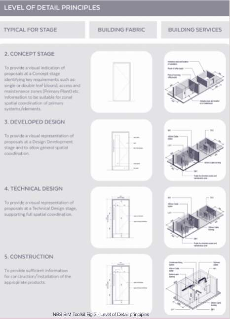

Elements should be sufficiently detailed to suit their scale, and sufficiently detailed to suit their purpose.

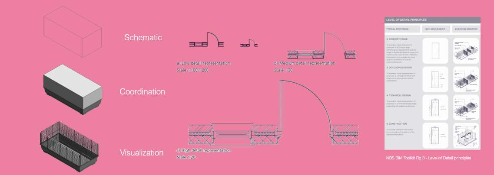

## Classification

Classification allows information to be structured consistently.

The classification system chosen should be:

- Used consistently by all project team members
- Aligned to ISO 12006-2 (Building construction — Organization of information about construction works — Part 2: Framework for classification. It identifies a set of recommended classification table titles for a range of information object classes according to particular views, e.g. by form or function, supported by definitions. It shows how the object classes classified in each table are related, as a series of systems and sub-systems, e.g. in a building information model.)
- The UK Implementation of ISO 12006-2 is Uniclass 2015.
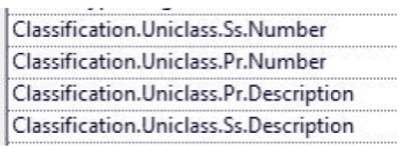

> [!note] Audio transcript (00:14)
> Shown here are the three levels of uniclass classification typically expected to be defined within a BIM project. These are typically assigned using Revit plugins such as the BIM Inoperability Tools Classification Manager.

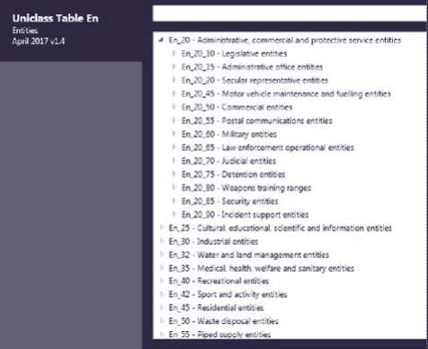

BIM Interoperability Tools:  Classification Manager.

The most efficient way to embed a classifications to objects within models is to use the Autodesk classification manager shown here.

Video Player is loading.Loaded: 0%Remaining Time -0:001x2x1.75x1.5x1.25x1x, selected0.75x0.5x0.25xcaptions off, selectedThis is a modal window.

## Classification - ADMM 

**Asset Data Management Manual (ADMM)**

The ADMM contains the company’s asset data requirements to ensure the company collects and maintains the asset data it needs to operate safely and efficiently. It is for use by anyone creating, maintaining or using data on behalf of or within National Highways

The ADMM currently covers infrastructure assets and therefore includes asset data requirements for the following main classes of asset:

- **Pavement**
- **Structures**
- **Drainage**
- **Geotechnical**
- **Roadside Operational Technology**
The ADMM also includes asset data requirements for the other classes of asset, namely:

- **Ancillary**
- **Carriageway Control**
- **Environmental**
- **Lighting**
- **Road Restraint Systems**
See here the ADMM Codes > Uniclass Codes & MCHW Series number

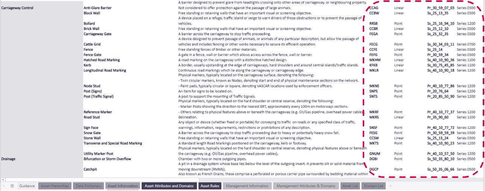

## Units & Precision

Project units and precision should be agreed and clearly documented.

Where possible, international system of units (SI units) should be used:

- To prevent large or small values, sub-multiples can be used e.g. millimetre (mm)
- Unit precision should take into account construction tolerances
- Commas should not be used to separate large numbers, for example we have three numbers which are the same but expressed differently.
- Different countries use decimal points and commas differently.
![Most BIM models are set out from CAD Data. However, most CAD software have no definition of what standardised Units are. Therefore it is also good practice to define them in project templates to avoid coordination errors. CAD tools deal with a scaling factor when inserting one file into another. To aid this process CAD files should be defined with the appropriate drawing units to aid the federated model approach and ensure that files work with one another.For example in CAD, errors may occur when inserting references, with an Ordinance Datum Newlyn base point where the building is far away in the if the precision is different in each file.](unit-4-lesson-4-establish-project-information-standard/assets/XPuwcWYizKdrMnOQ__VWOGLawNa_8Bfkv.png)

*Most BIM models are set out from CAD Data. However, most CAD software have no definition of what standardised Units are. Therefore it is also good practice to define them in project templates to avoid coordination errors. 
CAD tools deal with a scaling factor when inserting one file into another. To aid this process CAD files should be defined with the appropriate drawing units to aid the federated model approach and ensure that files work with one another.
For example in CAD, errors may occur when inserting references, with an Ordinance Datum Newlyn base point where the building is far away in the if the precision is different in each file.*

## Annotation & Symbols

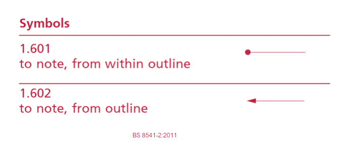

> [!note] Audio transcript (00:50)
> Despite the use of symbols, due to the advent of CAD, their original use has been on the decline. For example, take the annotation shown. It appears fairly straightforward. There is a revision to this drawing where the designer wanted the team on site to remove the circular item in the middle. Unfortunately, there was some confusion on site. Which one is technically correct? According to Drafting Convention, which is now captured in BS8541-2, a circle pointer identifies the space within an outline. This means that the team on site followed the national standard and that it was the author who was mistaken. Deliverables need to contain clear information to ensure that work is carried out correctly. You can avoid mistakes like this from occurring if compliance to standards such as these are included in the BIM execution plan and the appropriate training and checking of deliverables is carried out.
>
> Source: [Lesson 4 - Establish Project Information Standard - ISO 19650 12.mp3](unit-4-lesson-4-establish-project-information-standard/assets/Lesson 4 - Establish Project Information Standard - ISO 19650 12.mp3)

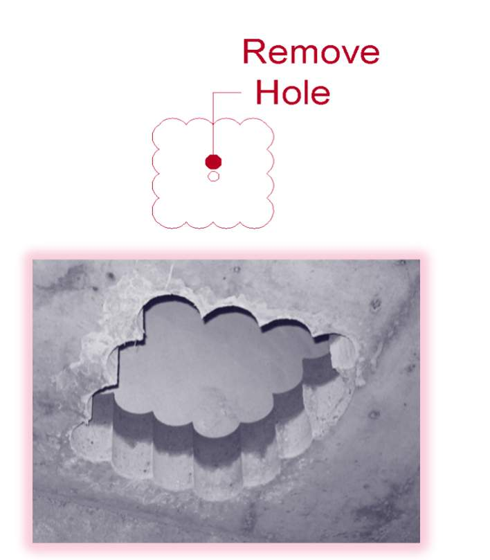

## Knowledge Check

Based on the symbol shown is this window top hung or bottom hung?

## Annotation & Symbols

*Shown is Jefferson County Hospital in Washington, when constructed this hospital had every window on the top floor installed upside down.  This issue was resolved through a $1.86 million dollar settlement.  
Clear symbols used correctly can be an effective way to communicate with the rest of the Project Team.
It is the authors responsibility to ensure that the Information produced and exchanged is clear, complete, and unambiguous.*

## PIS Example

Click on each button to view the answers - see if you can guess each one correctly!

01

## Lesson Summary 

Lesson complete! You are now able to:

Understand the Establishment of Project's Information Standard

**[CONTINUE]**

---

## Ten-Question Analysis Framework

### 1. Problem
How do project participants from diverse disciplines exchange information without format incompatibility, inconsistent object naming, conflicting classification, or misinterpretation of symbols?

### 2. Applicability
- **Stage**: `assessment-need` (ISO 19650-2 §5.1.4).
- **Scope**: Applied project-wide across all appointments.
- **Document**: [[project-information-standard]].

### 3. Process
1. Appointing party determines required exchange formats (e.g., IFC, COBie, DWG, PDF).
2. Establishes information container naming convention (e.g. National Annex NA.2.2: Project-Originator-Volume-Level-Type-Role-Number).
3. Defines object naming convention (BS 8541-1: Source-Type-Subtype).
4. Adopts standard classification system (e.g. Uniclass 2015 tables).
5. Defines Level of Information Need framework and standard annotation/symbology.

### 4. Evidence
- Published Project Information Standard document.
- Sample naming templates and container validation logs.

### 5. Principles
- **Project-Level, Not Appointment-Level**: The information standard must be common across all delivery teams on the project.
- **Open Standards First**: Prioritizing open schemas (ISO 16739 / IFC) protects whole-life asset data longevity.

### 6. Risks & Anti-patterns
- Each discipline using their own internal naming system, causing container collisions or CDE rejection.
- Ambiguous drawing symbols causing multi-million dollar construction errors (e.g., upside-down windows case).

### 7. Operationalization
- Automated regex naming validator for CDE containers and Revit/IFC objects.

### 8. Skill Test
Can this become a Skill?
**Yes** — Candidate: `naming-convention-checker` / `information-standard-auditor`.

### 9. Skill Design
- **Supported Role**: CDE Administrator / Information Manager.
- **Trigger**: Upload of information containers to CDE.

### 10. Validation Plan
Run automated naming and classification linter against sample project container rosters.

---

## Knowledge Space Links
- **Entities**: [[project-information-standard]], [[appointing-party]]
- **Methodologies**: [[establish-information-standard-method]]

---
*Extracted from `Lesson 4 - Establish Project Information Standard - ISO 19650 1&2 Project Delivery_ Unit 4 - Assessment & Need.html` via webpage-content-extractor.*
