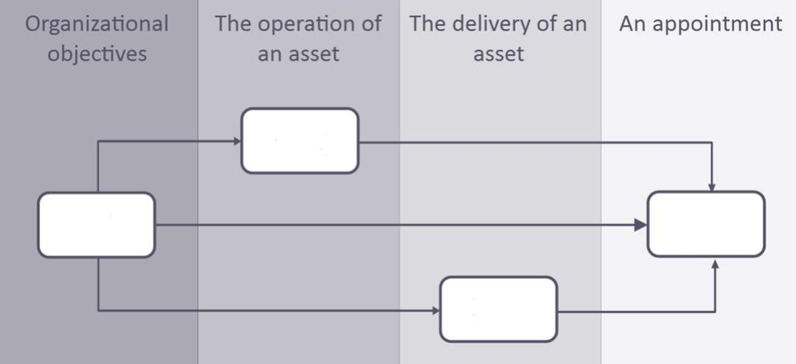
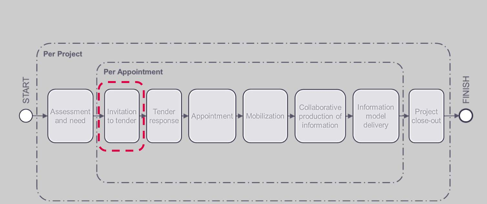
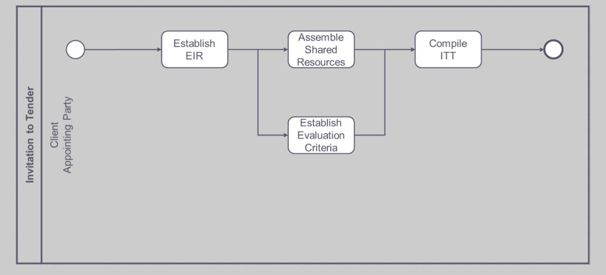
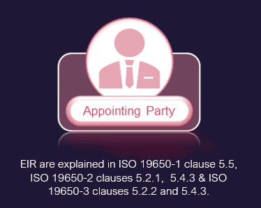
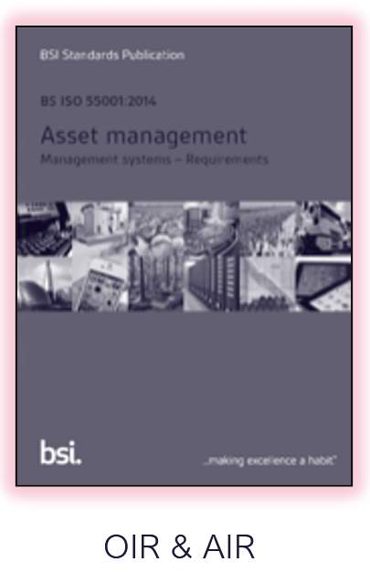
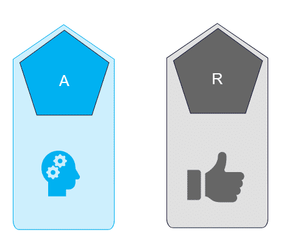
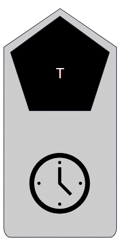
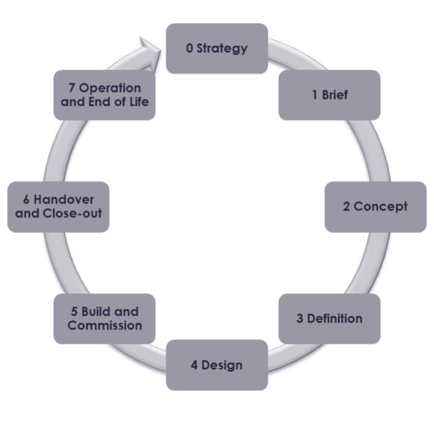
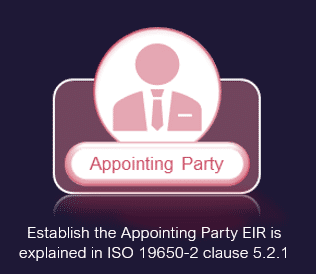

# Unit 5 - Lesson 1 - Establish the Appointing Party EIR

*Lesson 1 of 3*

## Lesson Objectives

At the end of this lesson, you will be able to:

- Understand the Establishment of the Appointing Party EIR
## Information Requirements

This diagram shows the relationship between the different types of information requirements on a project and how they feed into the Exchange Information Requirements.

Can you match the Acronyms with their intended location on the above diagram?

## Invitation to Tender

*the Appointing Party creates an Invitation to Tender (ITT).*

Considering the OIR, AIR and PIR, the Appointing Party shall develop the Exchange Information Requirements (EIR) which contains details of the information which the lead appointed party is expected to review and tender against.

## Invitation to Tender Activities

ITT or invitation to tender activities.

The appointing party needs to:

1. **Establish EIR**
1. **Assemble Shared Resources**
1. **Establish Evaluation Criteria**
1. **And then compile  the ITT**
## Information Procurement

Typically, the first appointment for Information procurement will be between the Appointing Party and the Lead Appointed Party.

The Appointing Party must compile the Invitation to tender.

**Across a project, there will be multiple appointments.  Each appointment should include exchange information requirements.**

> [!note] Audio transcript (01:06)
> 1. Appointing party, the receiver of information concerning works, goods or services from a lead appointed party. Typically the appointing party will have initiated the project, funded the project or approved the brief. 2. Lead appointed party, the lead organisation providing information concerning works, goods or services. Typically the lead appointed party will also be responsible for the lead design or lead constructor function. When undertaking an invitation to tender, establishing the exchange information requirements is critical. Across the project there will be multiple appointments. Each appointment should include exchange information requirements. The ISO does not define or offer any guidance on what a project is, however the preceding standards are aimed at construction projects. The question is what is the hierarchy or breakdown of the delivery of the asset into projects? Is there a design project, a technical design project, a construction project and operations project? It does not define the scope of the project in timescales or scale of project and subproject etc. This needs to be clarified by the appointing party.
>
> Source: [Lesson 1 - Establish the Appointing Party EIR - BIM ISO 19650 12 (2).mp3](unit-5-lesson-1-establish-the-appointing-party-eir/assets/Lesson 1 - Establish the Appointing Party EIR - BIM ISO 19650 12 (2).mp3)

## Exchange Information Requirements

Each information requirements should be produced in consideration of SMART.

**Please note this is not a BIM acronym.**

When defining any requirements, tasks and deliverables need to be clearly defined, a useful acronym, SMART. We should be assessing each requirement against SMART.

1. SPECIFIC: What information is needed to meet this requirement?  Knowing what purpose this information serves would allow a level of information need to be established.
Also applying SMART is also useful when receiving EIRs to ensure that the requirements received are complete.

*SpecificTwo key elements of this EIR which aid in being SPECIFIC are the OIR & AIR.*

> [!note] Audio transcript (00:44)
> Specific. To facilitate the requirements of beginning with the end in mind, the appointing party needs to be specific and clearly define their exchange information requirements, EIR. Two key elements of this EIR, which aid in being specific, are the asset information requirements, AIR, and the organisation information requirements, OIR. The asset information requirements define what specific attributes and data requirements need to be associated with each asset. The organisational information requirements will address specific data identified for a business to facilitate better decision making. Consideration should be given in the EIR to the specific information purposes such as for ongoing maintenance and repair.
>
> Source: [Lesson 1 - Establish the Appointing Party EIR - BIM ISO 19650 12.mp3](unit-5-lesson-1-establish-the-appointing-party-eir/assets/Lesson 1 - Establish the Appointing Party EIR - BIM ISO 19650 12.mp3)

*MeasurableProject Information Requirements will provide the measurable questions.*

> [!note] Audio transcript (00:50)
> Measurable. Within the exchange information requirements are the project's information requirements. This provides an opportunity for the appointing party to provide a non-technical question to those being appointed to meet business needs of the organisation. It is important when identifying the project's information requirements to ensure these are measurable and the deliverables facilitate the measurement in the correct format. PIR example. Does the asset, as delivered, appear to meet the brief? Information to answer this question may include geometric models, testing and commission information, room schedules and whole life cost assessments. Other example questions include how will security requirements be met? Can the appointing party's dream objectives be met? Does the design meet other aspects of statutory standards, specifications and brief?
>
> Source: [Lesson 1 - Establish the Appointing Party EIR - BIM ISO 19650 12 (3).mp3](unit-5-lesson-1-establish-the-appointing-party-eir/assets/Lesson 1 - Establish the Appointing Party EIR - BIM ISO 19650 12 (3).mp3)

*Achievable & Realistic It is also Important to insure information requirements are achievable and realistic.*

> [!note] Audio transcript (00:20)
> And realistic. It is also important to ensure that exchange information requirements are achievable and realistic. Too often we see the appointing party ask for all Kobe data fields, for example. This is not necessarily required by them or achievable and realistic in terms of the amount of data to input into the AIM.

*TimelyTo ensure information is delivered on time, parties must identify:TimescalesMilestonesWork stagesDecision Points*

> [!note] Audio transcript (00:40)
> Timely, another aspect of providing clear information requirements is to identify the time scales against which information is needed whilst identifying project milestones and identified work stages. ISO19650-2 requires the lead appointed party or client to define the milestones that the delivery team should be working. Many countries have a standard set of work stages. An example is the UK's Unified Work Stages, which align the various professional bodies and institutions definitions of work stages. It is also important to identify intermediate dates for deliverables, including time scales for the acceptance and approval process.
>
> Source: [Lesson 1 - Establish the Appointing Party EIR - BIM ISO 19650 12 (4).mp3](unit-5-lesson-1-establish-the-appointing-party-eir/assets/Lesson 1 - Establish the Appointing Party EIR - BIM ISO 19650 12 (4).mp3)

## EIR Content

The Appointing Party create their specific exchange information requirements to be met by the prospective Lead Appointed Party.

The content of this document will consider the following key areas:

- **Define the OIR, AIR & PIR documents**
Reviewing the high level, strategic organizational, asset, and project information requirements is a crucial first step in informing and creating the EIR.

- **Level of Information Need framework **
A framework for defining the granular quality and quantity of information required that progressively increases through each information exchange.

- **Acceptance criteria governed by Project Information Standard, Project Information Production Methods & Procedures, and reference information or shared resources**
These documents define a reference point for the acceptance criteria, ensuring information is acceptable for sharing and use.

- **Key milestones dates &  information exchanges**
These are defined considering information purposes, key decision points and review timescales.

- **Consider also technology, naming requirements, industry standards, and classification**
> [!note] Audio transcript (02:26)
> The appointing party shall establish their EIR to be met with the prospective lead appointed party, specifying the information needed at each information exchange, and considering the following. A. Define and consider OIR, AIR and PIR to satisfy 19650-2 clause 5.2.1A. Reviewing the high-level organisational asset and project information requirements is a crucial first step in informing and creating the EIR. B. Establish the level of information need framework to be used. A framework for defining the granular quality and quantity level of information required against maintainable assets that progressively increases as the project transitions through each information exchange or milestone date. In the UK, we typically use NBS Uniclass 2015. The over-specifying or under-definition of information requirements are both considered risky and also inefficient. C. Establish acceptance criteria. There are four resources that provide project-wide or asset-wide rules to govern how the information requirements are defined, delivered and checked. Number one, the project's information standard or asset information standard. Two, the project's information production methods and procedures or asset information production methods and procedures. Three, reference information and four, shared resources. These documents define a reference point for the acceptance criteria, ensuring information is acceptable for sharing and use. D. Establish supporting information and shared resources. Supporting information should be provided to aid understanding of the contents of the EIR and the acceptance criteria. Document or BIM templates ensure consistency and delivery. Existing asset information such as surveys or BIM models should be provided. E. Establish key milestone dates for information exchange. Consider milestones, information exchanges, information purposes, key decision points and also the time needed by the appointing party to review and accept information and the appointing party's internal assurance processes. Consider also naming, industry standards, schemers, classification, metadata. This process will be further expanded upon in the second part of this training series, Information Management.
>
> Source: [Lesson 1 - Establish the Appointing Party EIR - BIM ISO 19650 12 (1).mp3](unit-5-lesson-1-establish-the-appointing-party-eir/assets/Lesson 1 - Establish the Appointing Party EIR - BIM ISO 19650 12 (1).mp3)

## Exercise

> **Why do we need an EIR? **

**Take a moment to consider: **

- What is the purpose of an EIR?
- What are the Benefits?
- What should we do if one doesn’t exist?
---

**What is the purpose of an EIR?**

- To express the needs of the Appointing Party
- To confirm project details
- To specify what information is required at each information exchange
- To establish coordination and collaboration principles
- To support information checking procedures
- To express what information an Appointing Party  needs and its acceptance criteria.
- To define the Work Stages and key decision points
- To detail industry standards
- To define how information is communicated
**Benefits of an EIR
**

- Reduction in the capital expenditure phase of the project
- Increased value benefits for a business’s outcomes
- Errors are reduced due to accurate and efficient collaboration
- Ensure  quality, consistent information as they are cascaded down the supply chain
- Project Information Standards ensure related compliance
- Communications between the delivery team is mapped out
- The right information is shared at the right time for the whole of the project team so the best decisions can be made.
- They consider the lifecycle requirements of the building or asset and benefit facilities management
- They consider information security of the organisation
## Lesson Summary

Lesson complete! You are now able to:

Understand the Establishment of the Appointing Party EIR

---

**[CONTINUE]**

---

## Ten-Question Analysis Framework

### 1. Problem
How does an [[appointing-party]] communicate its precise information needs for a tender without ambiguous, overly generic, or unachievable requirements?

### 2. Applicability
- **Stage**: `invitation-tender` (ISO 19650-2 §5.2.1).
- **Roles**: [[appointing-party]], prospective [[lead-appointed-party]].
- **Key Documents**: [[exchange-information-requirements]] (EIR), OIR, AIR, PIR.

### 3. Process
1. Appointing party reviews OIR, AIR, and PIR to determine high-level organizational and asset drivers.
2. Formulates the EIR using the SMART criteria (Specific, Measurable, Achievable, Realistic, Timely).
3. Establishes the [[level-of-information-need]] (LOIN) framework (e.g. Uniclass 2015).
4. Defines acceptance criteria governed by Project Information Standard, Production Methods & Procedures, and Reference Information.
5. Establishes key delivery milestones and review timescales.

### 4. Evidence
- Formatted, approved Exchange Information Requirements (EIR) document.
- Defined information exchange schedule with milestone dates.
- Documented acceptance criteria and quality rules.

### 5. Principles
- **Begin with the end in mind**: EIR must capture both capital delivery and operational maintenance requirements (AIR).
- **SMART Requirements**: Information requirements must avoid vague blanket requests (e.g., "provide all COBie fields").
- **Cascading EIR**: Across a project there are multiple appointments; each appointment must include relevant EIR.

### 6. Risks & Anti-patterns
- Over-specifying data (asking for unnecessary data fields), creating excessive cost and friction.
- Under-defining requirements, leading to incomplete or non-interoperable deliverables.
- Failing to allow review time for the appointing party within milestones.

### 7. Operationalization
- Standard EIR Template with LOIN tables and milestone schedules.
- SMART verification checklist for appointing parties drafting EIR.

### 8. Skill Test
Can this become a Skill?
**Yes** — Candidate: `eir-requirement-analyzer` / `eir-generator`. Evaluates whether an EIR satisfies ISO 19650-2 §5.2.1 criteria.

### 9. Skill Design
- **Supported Role**: Appointing Party Information Manager.
- **Trigger**: Initiation of tender documentation preparation.
- **Output**: Validated, structured EIR register.

### 10. Validation Plan
Audit sample client EIRs against SMART criteria and clause 5.2.1 requirements.

---

## Knowledge Space Links
- **Entities**: [[appointing-party]], [[exchange-information-requirements]], [[invitation-to-tender]]
- **Concepts**: [[smart-information-requirements]], [[level-of-information-need]]
- **Methodologies**: [[establish-appointing-party-eir-method]]

---
*Extracted from `Lesson 1 - Establish the Appointing Party EIR - BIM ISO 19650 1&2 Project Delivery_ Unit 5 - Invitation to Tender.html` via webpage-content-extractor.*
