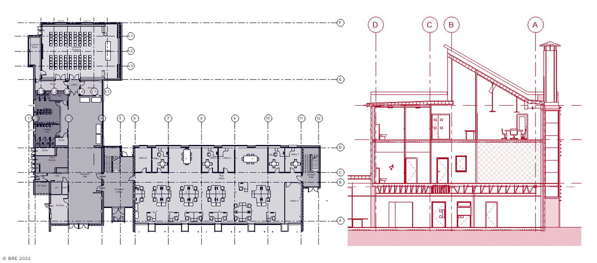

# Unit 5 - Lesson 2 - Assemble Shared Resources

*Lesson 2 of 3*

## Lesson Objectives

In this lesson we aim to:

Understand ISO 19650-2 Clause 5.2.2 Assemble reference information and shared resources

> [!note] Audio transcript (00:09)
> This lesson relates to ISO 19650, Dash Two Clause 5.2.2 assemble reference information and shared resources.

## Assemble Shared Resources

To facilitate consistent delivery the provision of templates will aid this delivery team. This could be the following:

- BIM Execution Plan Templates
- Responsibility matrix Templates
> [!note] Audio transcript (00:27)
> To facilitate consistent delivery, the provision of templates will aid this process. If an appointing party can provide a BIM execution plan template that maps to its exchange information requirements, then a direct correlation between question and answers can be provided. This also facilitates comparison between responses from multiple suppliers and can aid in applying automation. Similarly, the provision of other templates can reduce waste from the process and facilitate better outcomes.
>
> Source: [Lesson 2 - Assemble Shared Resources - BIM ISO 19650 12 Project.mp3](unit-5-lesson-2-assemble-shared-resources/assets/Lesson 2 - Assemble Shared Resources - BIM ISO 19650 12 Project.mp3)

*Existing Building model examples*

## Lesson Summary

Lesson complete! You are now able to:

Understand ISO 19650-2 Clause 5.2.2 Assemble reference information and shared resources

**[CONTINUE]**

---

## Ten-Question Analysis Framework

### 1. Problem
How can the [[appointing-party]] ensure consistency across tender responses and reduce waste in the tendering process?

### 2. Applicability
- **Stage**: `invitation-tender` (ISO 19650-2 §5.2.2).
- **Roles**: [[appointing-party]], tendering delivery teams.
- **Artifacts**: [[shared-resources]], BEP templates, responsibility matrix templates, existing condition models.

### 3. Process
1. Appointing party collates existing asset data and reference information (surveys, historical models).
2. Assembles standardized templates (BEP template mapped to EIR, responsibility matrix template).
3. Packages shared resources into the [[invitation-to-tender]] (ITT) package.
4. Shares via CDE with assigned status codes.

### 4. Evidence
- Standardized BEP template directly mapped to EIR questions.
- Responsibility matrix template.
- Verified reference model containers shared on CDE.

### 5. Principles
- **Direct Correlation**: Providing a BEP template mapped to the EIR provides a 1-to-1 correlation between questions and answers.
- **Waste Reduction & Comparability**: Eliminates tenderer guesswork and allows automated side-by-side comparison of bids.

### 6. Risks & Anti-patterns
- Leaving BEP format open to tenderers, resulting in incompatible submissions that are difficult to evaluate.
- Failing to clarify legal reliance and status codes of existing survey models.

### 7. Operationalization
- Project Template Pack (BEP template + RACI matrix template) issued with ITT.

### 8. Skill Test
Can this become a Skill?
**Yes** — Candidate: `shared-resources-packager`.

### 9. Skill Design
- **Supported Role**: Information Manager.
- **Output**: Validated shared resources package ready for ITT integration.

### 10. Validation Plan
Verify that tenderers use the provided template and that comparison turnaround time is reduced.

---

## Knowledge Space Links
- **Entities**: [[appointing-party]], [[shared-resources]], [[invitation-to-tender]]
- **Concepts**: [[tender-evaluation-criteria]], [[tender-response-requirements]]
- **Methodologies**: [[assemble-shared-resources-method]]

---
*Extracted from `Lesson 2 - Assemble Shared Resources - BIM ISO 19650 1&2 Project Delivery_ Unit 5 - Invitation to Tender.html` via webpage-content-extractor.*
