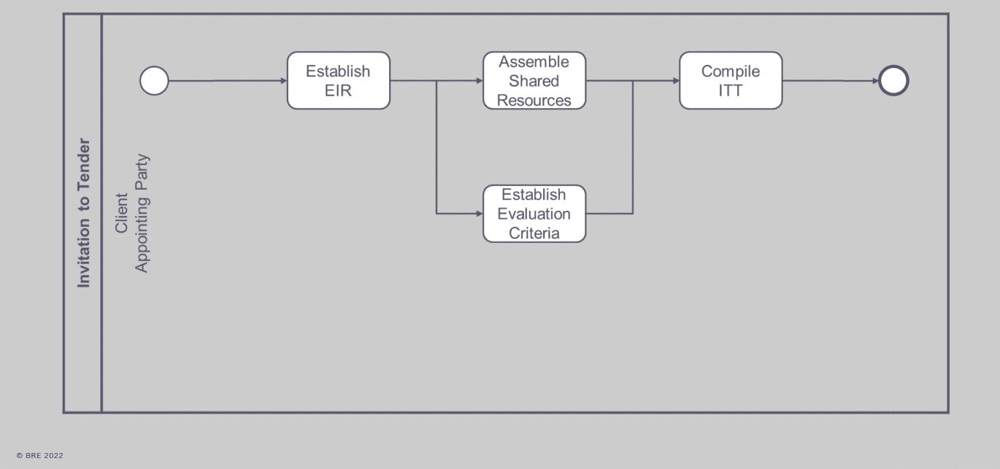

# Unit 5 - Lesson 3 - Tender Response & Evaluation Criteria

*Lesson 3 of 3*

## Lesson Objectives

At the end of this lesson, you will be able to:

Understand Tender Responses and Evaluation Criteria

> [!note] Audio transcript (00:12)
> Understand Tender Responses and Evaluation Criteria The appointing party shall establish the requirements that tendering organizations shall meet within their tender response. Acceptance criteria is explained in ISO 19650, dash Two clause 5.2.3.

## Evaluation Criteria

The systems to support this evaluation and acceptance processes are:

- Project procurement
- BIM execution plan
- I.M competency assessments
- Capability and capacity summary
- Information risk register
- Mobilization plan
> [!note] Audio transcript (01:13)
> The appointing party shall use a set of criteria typically defined in the EIR to either accept or reject the information. Typically evaluation considerations could be grouped under the following sections, price, understanding of the requirements, compliance with ITT requirements, technical skills, resource availability, management skills and systems, proposed methodology. Price is not part of the IM portion of the ISO as the information procurement appointment should be integrated into the project procurement and it is the project procurement that will consider price. The BIM execution plan can be used to consider whether the delivery team has understood the requirements. A completed tender return or checklist system will confirm compliance. The appointing party needs to evaluate the competency for the IM function. The delivery team capability and capacity summary can be used to consider whether the delivery team has the skills and resources available. The BIM execution plan and information delivery risk assessment can be used to consider whether the delivery team has acceptable management skills and systems in place. The mobilization plan is how you're going to test your proposals work. This can be used to consider whether the delivery team has provided an acceptable methodology.
>
> Source: [Lesson 3 - Tender Response Evaluation Criteria - BIM ISO 19650 1.mp3](unit-5-lesson-3-tender-response-evaluation-criteria/assets/Lesson 3 - Tender Response Evaluation Criteria - BIM ISO 19650 1.mp3)

## Compile Invitation to Tender Information

The appointing party shall assemble the invitation to tender package.

> [!note] Audio transcript (00:15)
> 524 Compile invitation to tender information. The appointing party should assemble the invitation to tender package. Ensure that each information container is assigned a status code defining the correct use before sharing on the project. CDE.

## Invitation to Tender Activities

*Summary of ITT or invitation to tender activities 
The appointing party needs to:
Establish EIRAssemble Shared ResourcesEstablish Evaluation CriteriaAnd then compile  the ITT*

## Learning Summary 

Lesson complete! You are now able to:

Understand Tender Responses and Evaluation Criteria

**Unit 5 Complete!
**

Module Complete, you may now close the window and complete this module.

---

## Ten-Question Analysis Framework

### 1. Problem
How can the [[appointing-party]] systematically and objectively evaluate prospective delivery teams' capabilities, management systems, and proposed methods to ensure they can deliver against the EIR, rather than relying solely on lowest commercial tender price?

### 2. Applicability
- **Stage**: `invitation-tender` (ISO 19650-2 §5.2)
- **Roles**: [[appointing-party]], prospective [[lead-appointed-party]], tendering organizations.
- **Documents**: [[invitation-to-tender]] (ITT), EIR, [[pre-appointment-bep]], Mobilization plan, Information risk register, Competency assessments.

### 3. Process
1. [[appointing-party]] establishes tender response requirements and evaluation criteria based on EIR and acceptance criteria (ISO 19650-2 §5.2.3).
2. Tendering organizations prepare responses covering 6 core areas: procurement details, [[pre-appointment-bep]], IM competency assessment, capability/capacity summary, information risk register, and mobilization plan.
3. [[appointing-party]] assembles the ITT package, assigns appropriate [[cde-status-codes]] defining correct use, and shares it via the project CDE (ISO 19650-2 §5.2.4).
4. Detailed evaluation is conducted against predefined evaluation criteria (see [[tender-response-evaluation-method]]).

### 4. Evidence
- Completed tender return or checklist confirming compliance with ITT.
- Evaluated and scored [[pre-appointment-bep]].
- Completed Information Management competency matrices.
- Delivery team capability and capacity summary sheets.
- Project-specific Information delivery risk assessment.
- Tested proposal verification in the Mobilization plan.
- ITT information containers with verified metadata and status codes on the CDE.

### 5. Principles
- **Separation of IM and Price**: Commercial pricing is handled via project procurement; ISO 19650 focuses strictly on technical capability, capacity, management systems, and proposed methodology.
- **Verification over Assumption**: Proposals must be demonstrable and testable (e.g., via mobilization plan and competency records).
- **Progressive Assurance**: Pre-appointment evaluation ensures readiness before formal contractual appointment.

### 6. Risks & Anti-patterns
- Awarding tenders purely on price without validating IM capacity and competency.
- Accepting generic or boilerplate BEPs that do not directly address the project-specific EIR.
- Overlooking the mobilization plan, leading to untested workflows and software exchange failures during project startup.
- Publishing ITT containers to the CDE without clear status codes or usage rights.

### 7. Operationalization
- Standardized Tender Evaluation Matrix mapping evaluation criteria to the 6 submission artifacts.
- Pass/fail gatekeeper checklist for Pre-appointment BEP compliance.
- Structured CDE metadata rule for ITT package containers.

### 8. Skill Test
Can this be converted into a reusable Claude Skill?
**Yes** — Candidate: `bep-review-skill` and `tender-evaluation-checker`. Triggered when receiving tender submissions or drafting ITT packages, with defined scoring rubric and acceptance criteria.

### 9. Skill Design
- **Supported Role**: Appointing Party BIM Information Manager / Project Manager.
- **Trigger**: Receipt of tender response package from prospective Lead Appointed Parties.
- **Output**: Tender IM Compliance Audit Report with section-by-section scoring and risk assessment.

### 10. Validation Plan
Test the evaluation rubric on simulated or past project tender returns (e.g., comparing BEP submissions against an ISO 19650-aligned EIR) to assess whether risks and non-compliances are consistently identified.

---

## Knowledge Space Links
- **Entities**: [[appointing-party]], [[invitation-to-tender]], [[pre-appointment-bep]]
- **Concepts**: [[tender-evaluation-criteria]], [[tender-response-requirements]]
- **Methodologies**: [[tender-response-evaluation-method]], [[compile-itt-package-method]]

---
*Extracted from `Lesson 3 - Tender Response & Evaluation Criteria - BIM ISO 19650 1&2 Project Delivery_ Unit 5 - Invitation to Tender.html` via webpage-content-extractor.*
