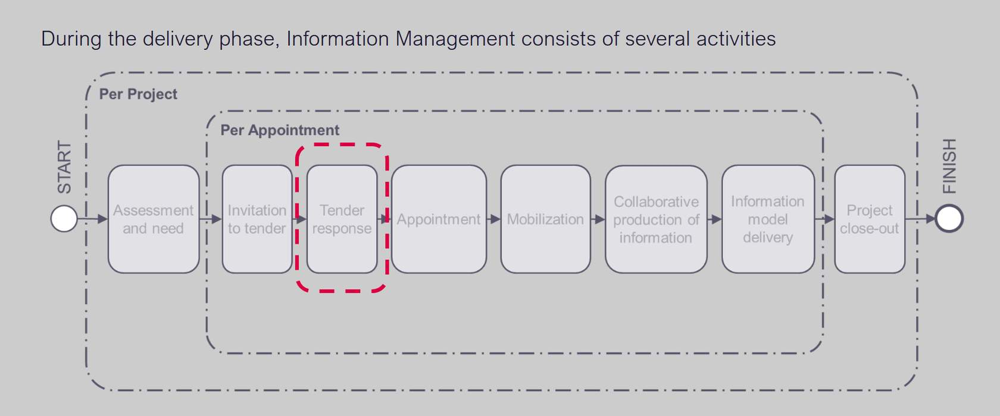
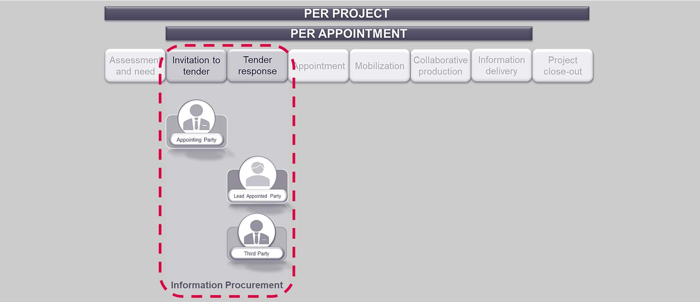
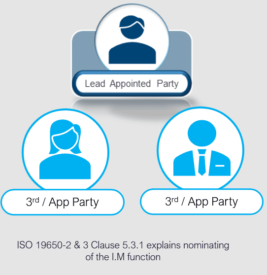

# Unit 6 - Lesson 1 - Nominate Information Management Function

*Lesson 1 of 5*

## Lesson Objectives

At the end of this lesson, you will be able to:

- Understand the key tasks in the tender response, including nominating the competent person undertaking the information management function.
## Information Management

*Now that the Appointing Party has produced their Exchange Information Requirements (EIRs) the next step shall be Invitation to Tender and the Tender response activities. *

> [!note] Audio transcript (00:29)
> As you can see, this is where the appointing party will issue their invitation to Tender, which will include the EIR relating to the information requirements, according to ISO 19650 Parts 1 and Parts 2. This will be a plan that explains how the information management aspects of the appointment will be carried out by the delivery team. This will then be responded to in the Tender Response Activity by potential lead appointed parties and the potential appointed parties within the pre-contract BIM Execution Plan, BEP.
>
> Source: [Lesson 1 - Nominate Information Management Function - BIM ISO 19 (3).mp3](unit-6-lesson-1-nominate-information-management-function/assets/Lesson 1 - Nominate Information Management Function - BIM ISO 19 (3).mp3)

## Nominate individuals to undertake the Information Management Function

The prospective lead appointed party shall nominate individuals to undertake the information management function.

The Appointing Party and Lead Appointed Party(s) can delegate I.M function to a third party or another appointed party.

**The clause requires a scope of services to be drafted for tendering organizations.**

> [!note] Audio transcript (00:59)
> ISO19650 Part 2 and also in Part 3 clause 5.1.1 and 5.3.1 permit the appointing party and or the lead appointed parties to delegate information management function to a third party or another appointed party. We show the plural as it is often the case on a project there will be more than one lead appointed party. Lead appointed party functions exist at an appointment level so each appointed party must provide the documents as listed as part of the ISO19650 Part 2 section 5.3 tender response. The clause requires a scope of services to be drafted for tendering organizations. The appointing party can appoint the prospective lead appointed party to undertake all or part of the information management function on their behalf. In this scenario to avoid any potential conflict of interest it is recommended that individuals undertake the information management function on behalf of either the appointing party or the prospective lead appointed party.
>
> Source: [Lesson 1 - Nominate Information Management Function - BIM ISO 19.mp3](unit-6-lesson-1-nominate-information-management-function/assets/Lesson 1 - Nominate Information Management Function - BIM ISO 19.mp3)

## Nominate the Information Management Function

As discussed in Unit 4, Lesson 01, there are several considerations in relating to nominating the I.M function.

The prospective lead appointed  party must consider the following:

- **The EIR contents**
- **What tasks will that person and parties will be responsible for?**
- **What authority will the LAP grant to a 3rd party**
- **The capability and capacity of any individuals**
- ** Potential conflict of interest & probity **
> [!note] Audio transcript (00:46)
> Probity is the quality of having strong moral principles, honesty and decency. Definition from Oxford English Dictionary. Essentially, probity arrangements mean ensuring that any potential conflicts of interest are identified and managed. The appointing party will have determined at least a high level at the assessment and need stage, whether someone in its own organisation is to undertake all or part of it. The lead appointed party must then determine who within it and who within other appointed parties will carry out the remainder of the activities. 1. It is likely that tasks related to project information management will be completed within the lead appointed party. 2. It is likely that tasks related to task information management will be completed within other organisations appointed by the lead appointed party.
>
> Source: [Lesson 1 - Nominate Information Management Function - BIM ISO 19 (1).mp3](unit-6-lesson-1-nominate-information-management-function/assets/Lesson 1 - Nominate Information Management Function - BIM ISO 19 (1).mp3)

## Nominate the I.M function

Ensure the individual is competent, and has sufficient resource as discussed earlier in the course.

> [!note] Audio transcript (00:35)
> The typical preference is for the nomination to be within the lead-appointed party's organisation, even if this means that training is required. The allocation of sufficient time and resource is also an important factor, as the ISO series does not assign roles as we had with PAS 1192. The assumption of function without assigning a named role can sometimes lead to overloading of work. For example, the nominated individual may be overloaded in terms of resource capacity, delivering their usual day-to-day job. However, as we discussed, the third party deemed as an appointed party can be used if there is scope for services set and agreed.
>
> Source: [Lesson 1 - Nominate Information Management Function - BIM ISO 19 (2).mp3](unit-6-lesson-1-nominate-information-management-function/assets/Lesson 1 - Nominate Information Management Function - BIM ISO 19 (2).mp3)

## Lesson Summary

Lesson complete! You are now able to:

Understand the key tasks in the tender response, including nominating the competent person undertaking the information management function.

---

**[CONTINUE]**

---
*Extracted from `Lesson 1 -_ Nominate Information Management Function - BIM ISO 19650 1&2 Project Delivery_ Unit 6 - Tender Response.html` via webpage-content-extractor.*
## Ten-Question Analysis Framework

### 1. Problem
How does a prospective [[lead-appointed-party]] ensure that information management responsibilities are clearly allocated, resourced, and free from conflicts of interest during tender response?

### 2. Applicability
- **Stage**: `tender-response` (ISO 19650-2 §5.3.1).
- **Roles**: Prospective [[lead-appointed-party]], [[appointed-party]], [[appointing-party]].
- **Key Documents**: Scope of Services, Pre-appointment BEP, Tender Return.

### 3. Process
1. Review Appointing Party Exchange Information Requirements (EIR) and determine required IM tasks.
2. Establish authority boundaries and identify whether IM tasks will be handled in-house or delegated to a 3rd party.
3. Assess candidate competencies, skills, software proficiency, and allocated time capacity.
4. Establish probity arrangements and mitigate conflicts of interest (especially if appointed by client for client-side IM).
5. Formalize nominations into the tender submission and scope of services.

### 4. Evidence
- Documented IM Scope of Services schedule.
- Nominated individuals' competency CVs and capacity statements.
- Signed probity / conflict-of-interest declaration.

### 5. Principles
- **Function over Job Title**: ISO 19650 defines information management functions rather than prescribed job titles (unlike PAS 1192).
- **Sufficient Resource Allocation**: Nominated individuals must have allocated time and authority, not merely added duties on top of existing workloads.
- **Probity & Conflict Management**: Clear demarcation between client-side advisory and delivery-team execution functions.

### 6. Risks & Anti-patterns
- Overloading existing project managers or design leads with IM duties without adequate time allocation.
- Appointing third-party consultants without defined scope or contractual authority.
- Conflicts of interest when an organization represents both client-side assurance and delivery supply chain.

### 7. Operationalization
- IM Function Allocation Matrix mapping ISO 19650-2 §5.3 activities to named roles.
- Probity evaluation checklist for dual appointments.

### 8. Skill Test
Can this become a Skill?
**Yes** — Candidate: `nominate-lead-im-function-skill`. Verifies prospective LAP nominations against §5.3.1 compliance criteria.

### 9. Skill Design
- **Supported Role**: Bid Director / Prospective Lead Appointed Party IM Lead.
- **Trigger**: Receipt of ITT documentation and tender response kickoff.
- **Output**: Nominated IM Team Sheet and Scope of Services Schedule.

### 10. Validation Plan
Audit tender bid rosters against actual project time allocation and delivery capability during mobilization.

---

## Knowledge Space Links
- **Entities**: [[lead-appointed-party]], [[information-management-function]], [[delivery-team]]
- **Concepts**: [[capability-and-capacity-assessment]], [[tender-response-requirements]]
- **Methodologies**: [[nominate-lead-im-function-method]]
