# Unit 6 - Lesson 2 - Establish the Pre-Appointment BEP

*Lesson 2 of 5*

## Lesson Objectives

In this lesson we aim to:

Understand the contents and purpose of the pre-appointment BEP, produced by each prospective lead appointed party.

> **So what is a BIM execution Plan?**It is a plan that explains how the information management aspects of the appointment will be carried out by the delivery team.The prospective lead appointed party shall establish the delivery team’s pre-appointment BIM execution plan, which forms a crucial part of the tender documents, in response to the EIR.

> [!note] Audio transcript (00:27)
> This lesson will explain the contents and purpose of the pre appointment be produced by each prospective Lead appointed Party. So what is a BIM execution plan? It's a plan that explains how the information management aspects of the appointment will be carried out by the delivery team. The prospective lead Appointed party shall establish the Delivery Teamls Pre Appointment BIM execution plan, which forms a crucial part of the tender documents in response to the EIR.

## Establish Delivery Team's pre-appointment BEP

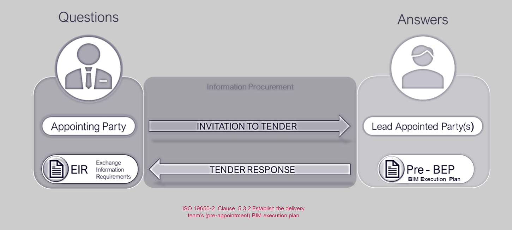

> [!note] Audio transcript (00:40)
> Need for clearly defined information requirements goes back to the Egan Latham reports we noted earlier in this course in Catalyst for Change. These highlighted all the issues with the appointing parties not sufficiently defining what is needed. The prospective lead appointed party shown should provide a response to each requirement for review by the appointing party in response to the exchange information requirements. The lead appointed party establishes a pre appointment BIM execution plan as part of their overall tender response, which is a plan to achieve the answers in response to the EIR. Across the project, there will be multiple appointments. Each appointment should refer back to a single BIM execution plan.

## Establish the Pre-BEP

The prospective lead appointed party shall consider and include the following in the Pre Appointment BEP:

- C.V’s of people undertaking the I.M function on behalf of the delivery team
- Information Delivery Strategy, containing the following:The approach to meeting the Appointing Party EIRBIM uses, objectives and goals Delivery Teams Organizational structure & commercial relationshipsDelivery Teams composition & hierarchy which form the Task Teams.
  - The approach to meeting the Appointing Party EIR
  - BIM uses, objectives and goals
  - Delivery Teams Organizational structure & commercial relationships
  - Delivery Teams composition & hierarchy which form the Task Teams.
> [!note] Audio transcript (00:53)
> C-section ISO 9650-2 5.3.2 for BEP content considerations such as the BEP is responsible to the EIR and may include names and resumes of those undertaking the tasks and activities of the information management function on behalf of the delivery team. It should also include an information delivery strategy containing the following as ISO 9650-2 clause 5.3.2B, the approach to meeting the appointing party EIR, BIM uses, objectives and goals for the collaborative production of information, delivery teams, organisational structure and commercial relationships, delivery teams, composition and hierarchy which form the task team. It should be remembered that the strategy should be relative to the size, type and stage of project and may inherit requirements from previous work stages.
>
> Source: [Lesson 2 - Establish the Pre-Appointment BEP - BIM ISO 19650 12 (4).mp3](unit-6-lesson-2-establish-the-pre-appointment-bep/assets/Lesson 2 - Establish the Pre-Appointment BEP - BIM ISO 19650 12 (4).mp3)

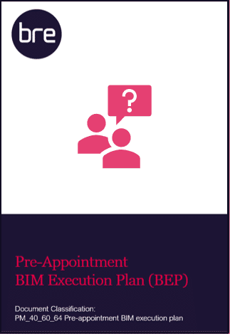

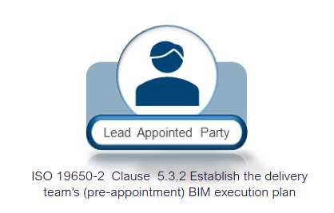

In addition, the following shall also be included within the Delivery Team’s Pre-Appointment BIM Execution Plan contents:

- Proposed Federation Strategy
- High-Level responsibility matrix
- Any proposed amendments
- Software, hardware & I.T
- Security of Information
- Best practice considerations
> [!note] Audio transcript (00:49)
> In addition, the following shall be included within the Delivery Team's pre-appointment BIM Execution Plan contents. Proposed Federation Strategy High-Level Responsibility Matrix This matrix will list all appropriate elements within the information model and stipulate the responsible party and the expected deliverable for each element. Any proposed amendments to information requirements, standards or production methods and procedures. This is the opportunity for the Delivery Team to propose any additional methods and procedures that they require or would recommend. A Schedule of Software, Hardware and IT. This is a fundamental consideration for wider interoperability. Consideration of the security and distribution of information. Best practice considerations such as project coordinates and geospatial location. These will be discussed further in the next slide.
>
> Source: [Lesson 2 - Establish the Pre-Appointment BEP - BIM ISO 19650 12 (2).mp3](unit-6-lesson-2-establish-the-pre-appointment-bep/assets/Lesson 2 - Establish the Pre-Appointment BEP - BIM ISO 19650 12 (2).mp3)

## Delivery Team’s Organizational Structure & Task Team’s

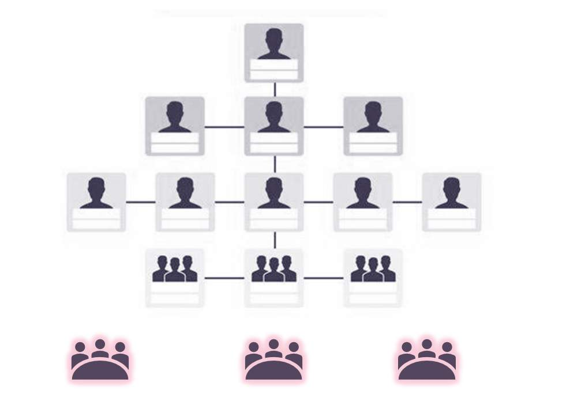

> [!note] Audio transcript (00:31)
> The BIM execution plan contents should include delivery team's organisational structure and commercial relationships, disciplines and prospective companies forming the project delivery team identified including the proposed project work stages. Delivery team's composition and how they split to form the separate task teams. An organisational tree, as shown, is typically used to show direct appointments between the appointing party and the MEP architecture slash main contractor for example work and the relationships
>
> Source: [Lesson 2 - Establish the Pre-Appointment BEP - BIM ISO 19650 12 (3).mp3](unit-6-lesson-2-establish-the-pre-appointment-bep/assets/Lesson 2 - Establish the Pre-Appointment BEP - BIM ISO 19650 12 (3).mp3)

## Objectives & Goals

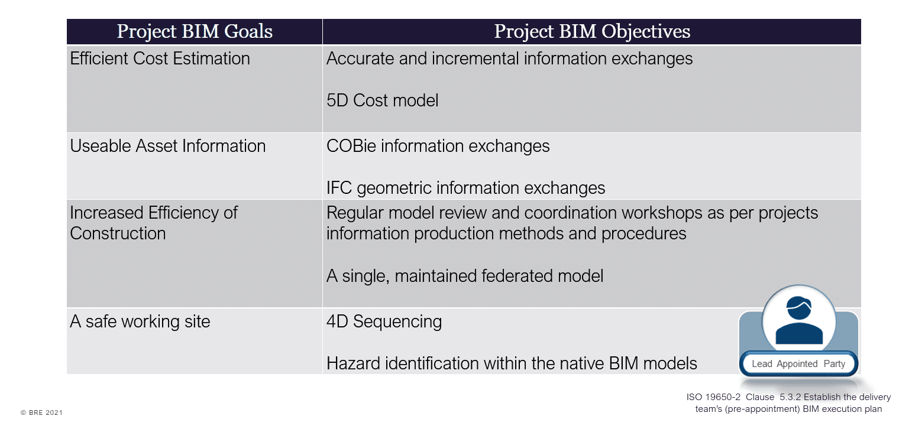

> [!note] Audio transcript (00:11)
> Project objectives and goals help to align to the requirements of the appointing party and demonstrate with the objectives how the lead appointed parties intend to achieve the proposed goals.

## Federation Strategy

The purpose of the federation strategy and information container breakdown structure is essential to help plan the production of information.

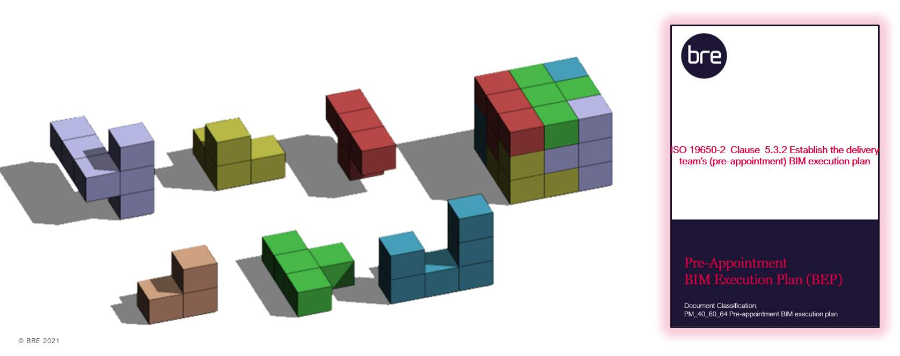

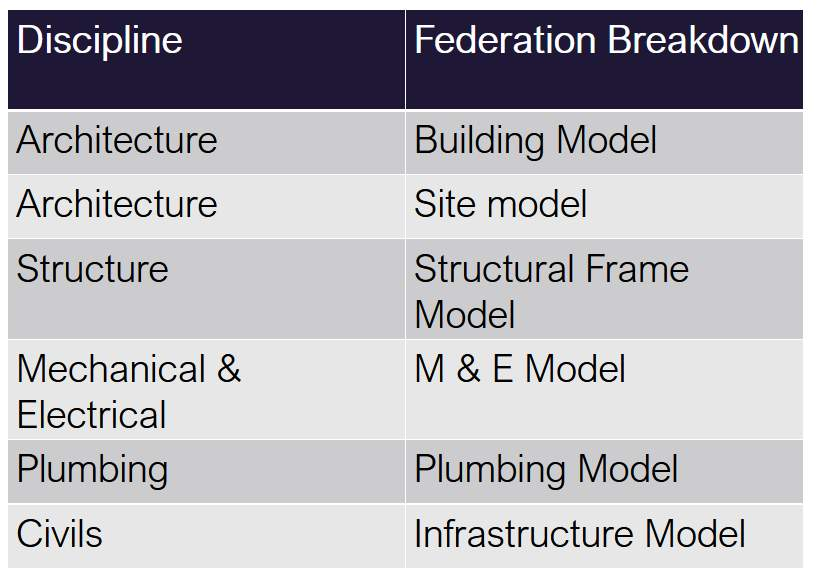

> [!note] Audio transcript (01:25)
> ISO19650 includes the concept of a federation strategy. This strategy is used to break down the information model into discrete information containers that can be worked on by task teams. The federation strategy and breakdown structure should explain how the information model is intended to be divided into sets of information containers. The responsibility for each set of information containers is allocated to individual task teams. The information model breakdown can be organised around functional, spatial or geometric aspects to improve the ability of task teams to perform efficiently across the whole model. The purpose of the breakdown should be to allow for simultaneous working, informational security, the reduction of file size and to define scopes of service. In practice there should be a brick wall broken down per level. To keep the models within a specified file size or even the structural engineers structural steel frame should be unlinked and then the steel fabricators model inserted. Spatially the federation strategy and breakdown structure can be thought of like a soma cube puzzle with each piece of the puzzle representing a set of information containers. By federating the pieces together a complete digital representation of the asset can be formed. The federation strategy and the information container breakdown structure should be communicated to all organisations involved in project or asset activities.
>
> Source: [Lesson 2 - Establish the Pre-Appointment BEP - BIM ISO 19650 12 (5).mp3](unit-6-lesson-2-establish-the-pre-appointment-bep/assets/Lesson 2 - Establish the Pre-Appointment BEP - BIM ISO 19650 12 (5).mp3)

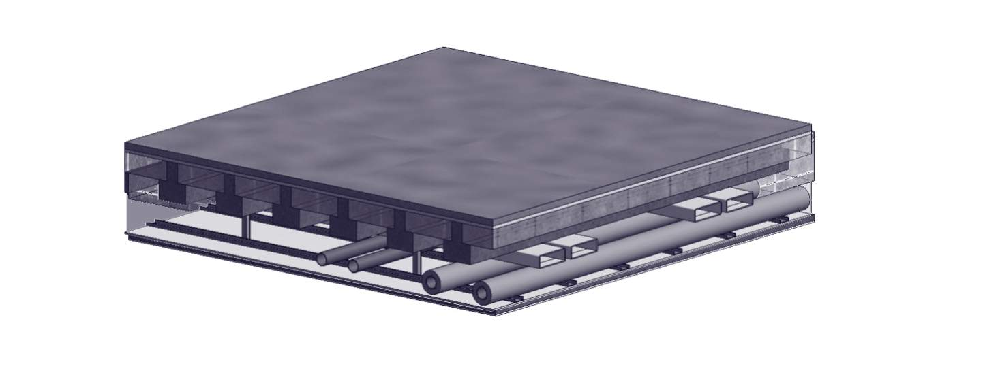

> [!note] Audio transcript (01:25)
> The image above looks at how the Federation strategy will progress through the design development of a project. You have a scenario in the concept design where there is a floor owned by the architect and below this they will allow a certain amount of space underneath it. This is all owned by the architectural team for the concept design stage. Then from initial discussions with the structural engineer, how thick the slab is and how much room is needed for any downstands or beams and also the architect will allow space for the finishes to the slab and a thick.
Can this force say a suspended sealing system? The architect will then check with the mechanical and electrical engineer what spaces are required for say, cable trays, pipe work and ductwork. Then, if each of these disciplines can keep their systems in these gaps, they can be allocated as volumes for each of them. Each of the disciplines can then go away and can detail up their pieces of work and then the models can be brought back together.
What was the coordination issue on this model? Well, the hangers for the suspended ceiling pass through the services zone. This is where the interface manager from the architectural team needs to liaise with the services interface manager to coordinate these items. So. If everyone works within their allocated volumes and contributes to ensure the correct sizes for volumes are used early on, then the amount of coordination issues are limited.

## High-level Responsibility Matrix

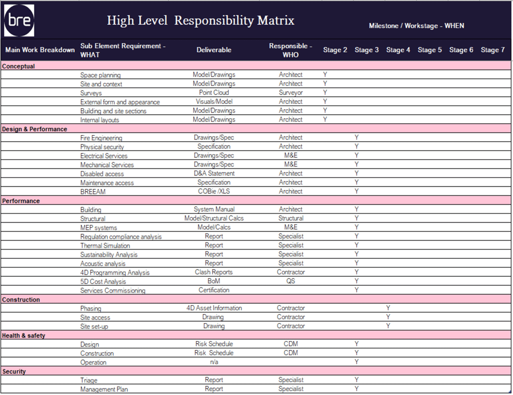

> [!note] Audio transcript (01:14)
> High level responsibility matrix this document, usually in the form of an Excel spreadsheet, however does not have to be allocated. The high level responsibility for each element of the project and asset information model as well as the key deliverables expected. The high level along with the detailed responsibility matrix to be discussed in the following units, matrices, a key components of the information delivery planning process, key considerations What plan of work applies to this project? How will design responsibilities to be categorized? How levels of detail and levels of information being defined.
A simple example may be that for a new building, the architect may be responsible for deliverables such as drawings for plans, sections, elevations, et cetera. Specification documents bream and building regulation compliance. Where is responsibility for tasks related to 5D cost analysis may be assigned to a quantity surveyor. For example in a Bill of Materials PDF deliverable within the tender response the prospective lead appointed party. Would define the anticipated deliverables required to satisfy the EIR. See the example with high level requirements such as BREAM and who will deliver the information at what project stage.

## Information Container Breakdown Structure

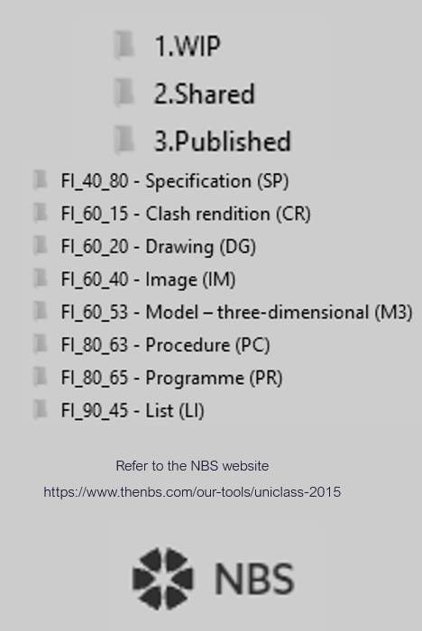

## Software, Hardware & IT Schedules

Parts e & f of  ISO 19650-2  Clause 5.3.2 are an opportunity for the L.A.P to propose any changes to the project’s information production methods and procedures or standards.

Part g relates to software, hardware and IT the delivery team intend to adopt. Common practice is to provide a schedule.

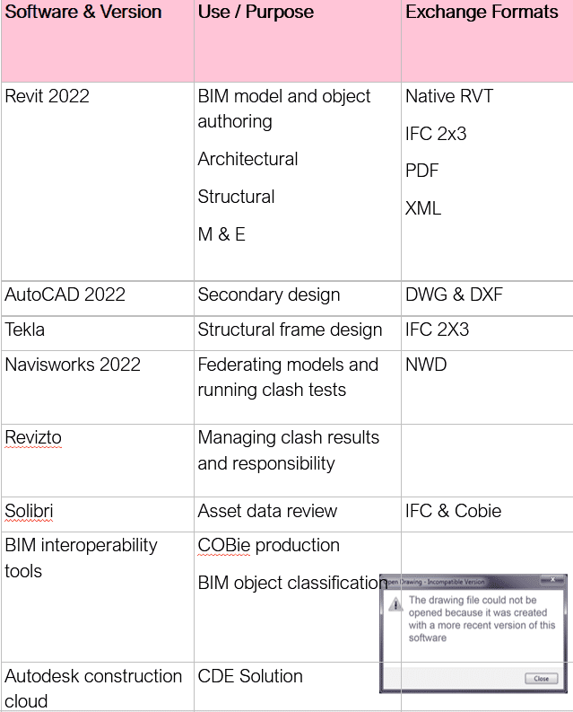

*This file was created in a later version of Revit!*

> [!note] Audio transcript (01:54)
> Parts ENF of ISO-19650-2 clause 5.3.2 established to the delivery team's pre-appointment BIM execution plan are an opportunity for the lead appointed party to propose a change to any of the project's information production methods and procedures, or to the project's information standard. G, a proposed schedule of software, including versions, hardware and IT infrastructure the delivery team intend to adopt. Due to the nature of BIM, the agreement of IT solutions is vital to the successful production and management of information. Software schedules help to promote interoperability. Therefore, it is vital to consider factors such as software versions, as some software does not provide backwards compatibility. The version of each software used should be agreed and recorded within the BIM execution plan. In addition, where updates are required, the updating of software should be coordinated between task teams. Change formats, depending on the software accessing the information, some exchange formats are more appropriate than others. For example, the building's smart open data format IFC may be preferred over a native proprietary file format. In addition, some file formats improve functionality with their version. For example, IFC 4 allows for more categories and properties than IFC 2x3, while Excel's 2017 workbook format is able to include more rows and columns than previous versions. And process management and data systems. If a process or data management system is intended to be used on a project, then additional configuration of produced information may be required. For example, some systems may require that properties and their values exclude special characters such as commas, periods and parentheses. Therefore, as with the project's standards, methods and procedures, care must be taken to ensure a workable solution is provided, and that these solutions are tested during the mobilization process.
>
> Source: [Lesson 2 - Establish the Pre-Appointment BEP - BIM ISO 19650 12.mp3](unit-6-lesson-2-establish-the-pre-appointment-bep/assets/Lesson 2 - Establish the Pre-Appointment BEP - BIM ISO 19650 12.mp3)

## Geo-Spacial Location

**Origin & Orientation**

Good practice in relation to setting out and agreeing origin and orientation are not covered as specifically in the ISO documents as they were in BS 1192.

Consideration should be given to the following:

- **Project base point (XYZ)**
- **Location points (XYZ)**
- **Angle from true north**
- **Building grids**
- **Party responsible for setting the coordinates**
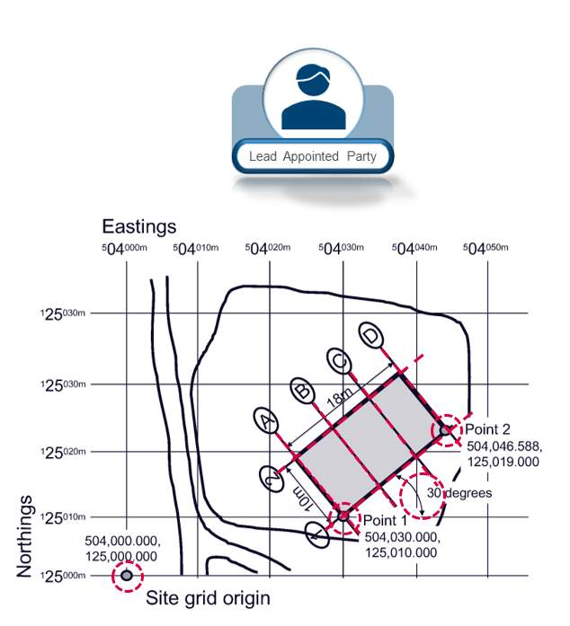

> [!note] Audio transcript (00:42)
> To make sure everything comes in the right location in models and physically when being constructed there are several parts of information which should be recorded and agreed. Project base point with XYZ coordinates. Project base point should be in the lower left so that all other points are in a relative position value. Location points with XYZ coordinates. Two location points to identify the location of the asset and angle from true north in order to orientate the asset correctly. Building grids can then be set out correctly from this information. From these pieces of information it can be practically guaranteed that the set out points are correct and everything is geospatially coordinated.
>
> Source: [Lesson 2 - Establish the Pre-Appointment BEP - BIM ISO 19650 12 (6).mp3](unit-6-lesson-2-establish-the-pre-appointment-bep/assets/Lesson 2 - Establish the Pre-Appointment BEP - BIM ISO 19650 12 (6).mp3)

A single shared coordinate system could be established by the L.A.P  and confirmed in the Delivery Team BEP.

> [!note] Audio transcript (00:17)
> A single shared coordinate system could be established by the lead appointed party and confirmed in the post appointment delivery team BEP as best practice. All task teams are typically responsible for acquiring the coordinate system to allow the accurate federation of models.

## Geo-Spacial Location Errors

*http://www.bbc.co.uk/news/uk-england-cambridgeshire-22540560(opens in a new tab)http://www.constructionenquirer.com/2013/07/30/blunder-cinema-built-in-wrong-place-again/(opens in a new tab)*

> [!note] Audio transcript (00:47)
> So what happens when it isn't done right? In 2013 a cinema in England that was built 75 centimetres out of place due to an error on the architect's setting out drawings. Due to this error the cinema was constructed too close to local residential buildings and violated its planning conditions. As a result the local planning authority instructed that the project be deconstructed and rebuilt in the correct position, setting the project back over 8 months and costing over £1 million. To make matters worse when rebuilt it was in the wrong place again, this time 30 centimetres from where it should have been. This new position was eventually accepted by the statutory authorities through an amendment to the planning permission. However this did impact on the project programme with financial implications.
>
> Source: [Lesson 2 - Establish the Pre-Appointment BEP - BIM ISO 19650 12 (1).mp3](unit-6-lesson-2-establish-the-pre-appointment-bep/assets/Lesson 2 - Establish the Pre-Appointment BEP - BIM ISO 19650 12 (1).mp3)

## Lesson Summary

Lesson complete! You are now able to:

Understand the contents and purpose of the pre-appointment BEP, produced by each prospective lead appointed party.

**[CONTINUE]**

---
*Extracted from `Lesson 2 -_ Establish the Pre-Appointment BEP_ - BIM ISO 19650 1&2 Project Delivery_ Unit 6 - Tender Response.html` via webpage-content-extractor.*
## Ten-Question Analysis Framework

### 1. Problem
How does a prospective [[delivery-team]] demonstrate its technical methodology, management approach, IT infrastructure, and capacity to deliver the client's EIR before contract award?

### 2. Applicability
- **Stage**: `tender-response` (ISO 19650-2 §5.3.2).
- **Roles**: Prospective [[lead-appointed-party]], prospective [[appointed-party]].
- **Key Documents**: [[pre-appointment-bep]], [[exchange-information-requirements]], Project Information Standard.

### 3. Process
1. Analyze Appointing Party EIR, Information Standard, and Information Delivery Milestones.
2. Define proposed information management approach, federation strategy, and CDE architecture.
3. Establish proposed delivery team organizational structure and task team assignments.
4. Define proposed milestones schedule and initial high-level responsibility matrix.
5. Document proposed hardware, software, and technical infrastructure solutions.
6. Compile into the formal Pre-appointment BEP submission.

### 4. Evidence
- Formatted Pre-appointment BIM Execution Plan document (§5.3.2).
- High-level Delivery Team Responsibility Matrix.
- Proposed software and schema compliance schedule (IFC, Uniclass, CDE).

### 5. Principles
- **Direct Alignment with EIR**: Every section of the Pre-BEP must answer a requirement specified in the client's EIR.
- **Collaborative Commitment**: The Pre-BEP represents a collective proposal from the lead appointed party and task teams.
- **Federation Strategy**: Proposing early how individual information containers will unite into a coherent model.

### 6. Risks & Anti-patterns
- Using boilerplate BEP templates without tailoring to client-specific EIR requirements.
- Committing to unfeasible software versions or unverified proprietary data exchanges.
- Failing to involve sub-consultants and trade contractors in pre-appointment commitments.

### 7. Operationalization
- Standard ISO 19650-2 Pre-Appointment BEP Template with clause-by-clause compliance cross-references.
- Tender BEP review scorecard for appointing party evaluation.

### 8. Skill Test
Can this become a Skill?
**Yes** — Candidate: `pre-bep-generator` / `pre-bep-compliance-auditor`. Generates and audits pre-contract BEPs against ISO 19650-2 §5.3.2.

### 9. Skill Design
- **Supported Role**: Bid Manager / Lead Appointed Party BIM Manager.
- **Trigger**: Tender preparation upon receipt of EIR.
- **Output**: Fully populated, compliant Pre-appointment BEP.

### 10. Validation Plan
Cross-check pre-BEP commitments against the finalized post-appointment BEP in Unit 7 Lesson 1.

---

## Knowledge Space Links
- **Entities**: [[pre-appointment-bep]], [[lead-appointed-party]], [[delivery-team]]
- **Concepts**: [[tender-response-requirements]], [[tender-evaluation-criteria]]
- **Methodologies**: [[establish-pre-appointment-bep-method]]
