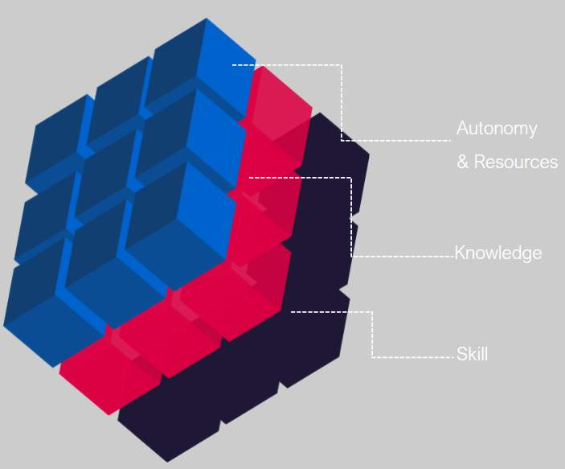
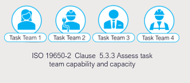
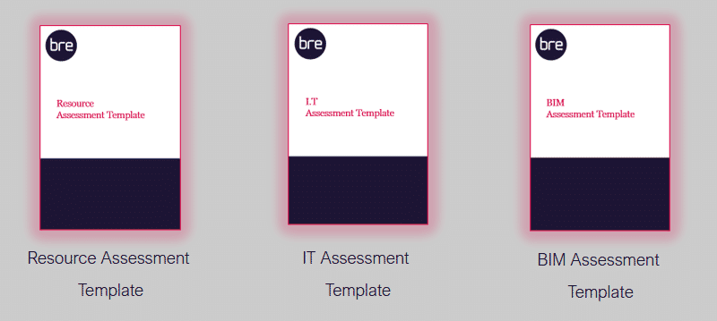
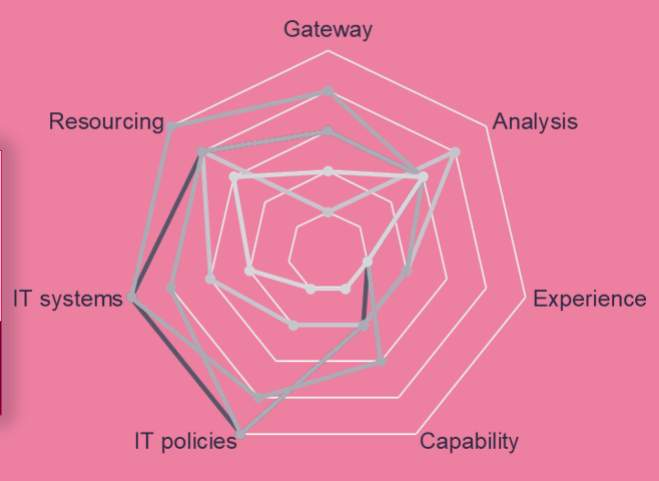
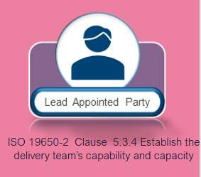
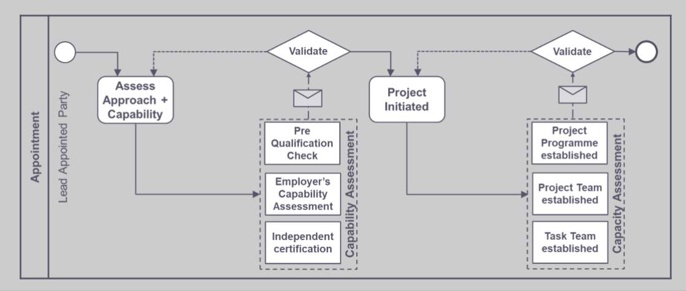

# Unit 6 - Lesson 3 - Assess & Establish Capability & Capacity

*Lesson 3 of 5*

## Lesson Objectives

At the end of this lesson, you will be able to:

Understand Capability and Capacity

> [!note] Audio transcript (00:19)
> It is important that the parties are assessed on their capability and capacity to meet the information requirements and be involved on the project. Capability and capacitor interchangeable terms. However, they have different meanings. This will be discussed in more detail in this unit. There is also more than one method of assessment.

## Capability & Capacity

- Capability refers to being able to perform a given activity
- Capacity refers to ability to complete an activity in the required time
Capability can generally be assessed at any point in time, but capacity is more fluid

> [!note] Audio transcript (00:39)
> Once the scale of the project is clear, the next stage is to assess the task team capability and capacity. Capability refers to being able to perform a given activity, while capacity refers to being able to complete an activity in the required time. The assessment of capability and capacity should be based on relevant experience within the task team, as well as the availability of education and training resources. Capability can generally be assessed at any point in time, but capacity is more fluid as it depends where individuals are on other projects, or where the company is in all their projects. Therefore, capacity needs to be assessed regularly.
>
> Source: [Lesson 3 - Assess Establish Capability Capacity - BIM ISO 19650 (2).mp3](unit-6-lesson-3-assess-establish-capability-capacity/assets/Lesson 3 - Assess Establish Capability Capacity - BIM ISO 19650 (2).mp3)

## Competency

We can define competency as the following 3 crucial aspects:

> [!note] Audio transcript (00:27)
> In simple terms, we can define competency as 1. whether an individual has the theory and facts needed 2. whether an individual has the cognition and tool proficiency needed and 3. whether an individual has sufficient autonomy and resources to apply their knowledge and skill. Depending on the size of the project there will be different depths of determining capability. Capability can be measured by professional qualifications and experience.
>
> Source: [Lesson 3 - Assess Establish Capability Capacity - BIM ISO 19650.mp3](unit-6-lesson-3-assess-establish-capability-capacity/assets/Lesson 3 - Assess Establish Capability Capacity - BIM ISO 19650.mp3)

## Assessment Types

It is important to understand that three types of assessment exist:

> [!note] Audio transcript (00:37)
> The appointing party set the tender response and evaluation criteria for which capability and capacity of the delivery teams forms part of and dictates how the delivery team will be assessed in terms of meeting the information requirements. As part of the invitation to tender, blank supplier assessment reports are typically sent out. During tender response the lead appointed party shall issue supplier assessment forms to each task team. Each task team must honestly assess themselves against the forms received, considering the tender pack of information and more importantly the deliverables expected of each task team.
>
> Source: [Lesson 3 - Assess Establish Capability Capacity - BIM ISO 19650 (1).mp3](unit-6-lesson-3-assess-establish-capability-capacity/assets/Lesson 3 - Assess Establish Capability Capacity - BIM ISO 19650 (1).mp3)

Assessments should confirm a commitment to comply to project documentation and an ability to work collaboratively.

## Assess & Establish Capability & Capacity

Supply Chain capability forms are the main methods used for assessment Typical Forms are:

> [!note] Audio transcript (00:19)
> Supply chain capability forms are the main methods used for assessment and these fall into two main types. Bespoke assessment questions written by the appointing party and industry template questions written by a 3rd party organization. The three forms are explained below.

- **The BIM Assessment form relates to your company maturity with BIM**
Typical questions may be:
-Do you work to the national standard ISO 19650-2: 2008?
-How do you carry out spatial coordination using CAD / BIM?

- **The IT Assessment form establishes your IT and resource capability, with consideration given to the security of the data **
Typical questions may be:
-Which project collaboration or web-enabled document management tools have you worked with?
- Please list in a table the types and formats of information that you are prepared to share electronically for certain output.

- **The Resource Assessment Form for assessing the relevant BIM experience of each of your team members assigned to the project **
Typical questions/ statements may be:
- Indicate proposed resource by profession, training, academic achievement, and years of experience
-State any proposed planned training and for who

The Lead Appointed Party shall aggregate the forms and submit a Delivery Team, Supply Chain Capability Summary Forms as part of the pre-BEP.

> [!note] Audio transcript (01:42)
> The prospective lead appointed party shall establish the delivery team's capability and capacity by aggregating the assessment forms listed, undertaken independently by each task team through self-assessment. The lead appointed party then produces a summary of the delivery team's capability to manage and produce information and the capacity for timely delivery of the information requirements. A review process takes place to establish the following, ability to meet the information requirements as previously discussed, experience of collaborative working processes, technology or software experience and availability, and the willingness or plan to undertake training where required, the individual skill and competency of the task teams. The three forms will feed into a delivery team capability and capacity summary, which is the responsibility of the lead appointed party to produce. The appointing party or third party then assesses this. This radar diagram shows the task team's capability and capacity summary. Each individual task team's capability and capacity assessment should be aggregated together to produce a summary of the entire delivery team's capability and capacity. The diagram is an example of the types of techniques that can be used to visually display an aggregated assessment. It is a simple geometric way of showing the information gathered from the CPIC assessment forms. It is important to note that if a business does not have the required capability at the time of tendering, then making training available and committing to hiring the right skills is a way of meeting the requirements.
>
> Source: [Lesson 3 - Assess Establish Capability Capacity - BIM ISO 19650 (3).mp3](unit-6-lesson-3-assess-establish-capability-capacity/assets/Lesson 3 - Assess Establish Capability Capacity - BIM ISO 19650 (3).mp3)

## BRE Certification

There are huge benefits and acclaim in the industry for achieving 3rd party certification! We will discuss the BRE global certification later in the course. The key features are as follows:

- Based on ISO 19650 Series
- Offer independent & third party assessment
- Evidence of relevant documentation review
- Evidence based with on-site auditing
- Ongoing maintenance

## Capability & Capacity

*Capability & Capacity process summary *

## Learning Summary 

Lesson complete! You are now able to:

Understand Capability and Capacity

**[CONTINUE]**

---
*Extracted from `Lesson 3_ - Assess & Establish Capability & Capacity_ - BIM ISO 19650 1&2 Project Delivery_ Unit 6 - Tender Response.html` via webpage-content-extractor.*
## Ten-Question Analysis Framework

### 1. Problem
How do prospective lead appointed parties verify that their internal workforce and proposed supply chain possess genuine competence, resources, IT equipment, and availability to fulfill the appointment?

### 2. Applicability
- **Stage**: `tender-response` (ISO 19650-2 §5.3.3).
- **Roles**: Prospective [[lead-appointed-party]], prospective [[appointed-party]].
- **Key Documents**: Capability & Capacity Assessment forms, CPIx / PAS 91 questionnaires, training records.

### 3. Process
1. Identify required skills, tools, software versions, and human resources required by the EIR.
2. Issue capability and capacity assessment questionnaires to internal teams and prospective task teams.
3. Evaluate past project experience, track record, and verified references.
4. Assess hardware, network bandwidth, IT infrastructure, and licensing availability.
5. Determine resource availability and identify training/upskilling gaps.
6. Compile findings into a consolidated Capability & Capacity Summary for tender submission.

### 4. Evidence
- Completed Task Team Capability and Capacity Assessments.
- Staff CVs, software certifications (BRE, Autodesk, buildingSMART), and resource loading charts.
- IT infrastructure audit reports (bandwidth, computing hardware, CDE compatibility).

### 5. Principles
- **Dual Assessment**: Competence (Capability) is worthless without available time and manpower (Capacity).
- **Whole Delivery Team Scope**: The assessment covers every task team within the prospective delivery team, not just the lead designer.
- **Honest Gap Identification**: Gaps identified early can be closed during the mobilization stage.

### 6. Risks & Anti-patterns
- Exaggerating capacity or claiming non-existent software proficiencies to win tenders.
- Over-committing key personnel across multiple overlapping projects.
- Ignoring sub-consultant IT deficiencies until production commences.

### 7. Operationalization
- Standardized ISO 19650 Capability & Capacity Assessment Matrix with weighted scoring.
- Resource loading tracker mapping individual staff hours against project delivery milestones.

### 8. Skill Test
Can this become a Skill?
**Yes** — Candidate: `capability-capacity-auditor`. Evaluates supply chain survey responses against EIR technical demands.

### 9. Skill Design
- **Supported Role**: Lead Appointed Party Procurement / BIM Director.
- **Trigger**: Supply chain tender response evaluation.
- **Output**: Capability & Capacity Risk Report with targeted training recommendations.

### 10. Validation Plan
Compare pre-tender capacity declarations with timesheets and model authoring output during delivery.

---

## Knowledge Space Links
- **Entities**: [[lead-appointed-party]], [[appointed-party]], [[delivery-team]]
- **Concepts**: [[capability-and-capacity-assessment]], [[tender-response-requirements]]
- **Methodologies**: [[assess-capability-capacity-method]]
