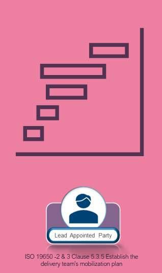

# Unit 6 - Lesson 4 - Establish The Mobilization Plan

*Lesson 4 of 5*

## Lesson Objectives

At the end of this lesson, you will be able to:

Understand the process associated with ISO 19650 -2 & 3 Clause 5.3.5 Establish the delivery team’s mobilization plan

> [!note] Audio transcript (00:57)
> This lesson will explain the process associated with ISO19650-2 and 3 clause 5.3.5 establish the delivery team's mobilization plan. The purpose of the mobilization plan is to test what was said would be done in the pre-contract BIM execution plan, can be delivered and that the right people with the right skills are available. 1. Mobileized resources may include developing educational material, developing training material, recruiting additional members or supporting individuals and organizations that join the delivery team. 2. Mobileized IT may include configuring the common data environment as well as procuring and configuring additional hardware, software and infrastructure. 3. Test methods and procedures may include testing and documentation as well as testing information exchanges between task teams and information delivery to the appointing party.
>
> Source: [Lesson 4 - Establish The Mobilization Plan - BIM ISO 19650 12 Pr.mp3](unit-6-lesson-4-establish-the-mobilization-plan/assets/Lesson 4 - Establish The Mobilization Plan - BIM ISO 19650 12 Pr.mp3)

## Establish The Mobilization Plan

The plan will demonstrate the prospective LAP approach to the indicative timescales and responsibilities for things such as:

- Testing Procedures, info exchange & delivery
- Configuring the CDE’s
- Implement software, hardware and IT
- Compile shared resources
- Train the task teams where required

## Learning Summary 

Lesson complete! You are now able to:

Understand the process associated with ISO 19650 -2 & 3 Clause 5.3.5 Establish the delivery team’s mobilization plan

**[CONTINUE]**

---
*Extracted from `Lesson 4 -_ Establish The Mobilization Plan_ - BIM ISO 19650 1&2 Project Delivery_ Unit 6 - Tender Response.html` via webpage-content-extractor.*
## Ten-Question Analysis Framework

### 1. Problem
How does a delivery team ensure that all resources, software, communications, and workflows are tested and ready before information generation begins?

### 2. Applicability
- **Stage**: `tender-response` (ISO 19650-2 §5.3.4).
- **Roles**: Prospective [[lead-appointed-party]], [[appointed-party]].
- **Key Documents**: [[mobilization-plan]], IT test schedules, training matrices.

### 3. Process
1. Review delivery milestones and identify mobilization duration between appointment and first deliverables.
2. Outline activities to mobilize human resources (onboarding, training, role confirmations).
3. Plan IT infrastructure rollout (software installation, licensing, CDE access, templates).
4. Define test procedures for information exchange protocols and federation checks.
5. Establish timeline and responsibilities for all mobilization activities.
6. Submit mobilization plan as part of the tender return package.

### 4. Evidence
- Documented Mobilization Plan schedule with clear ownership and completion criteria (§5.3.4).
- Software and hardware deployment checklist.
- Training and upskilling curriculum outline.

### 5. Principles
- **Mobilize Before Producing**: No project information containers should be generated until methods, software, and training are verified.
- **Collaborative Rehearsal**: Mobilization tests communication routes and CDE permissions before production deadlines create pressure.

### 6. Risks & Anti-patterns
- Treating mobilization as an afterthought or assuming teams can "learn on the fly".
- Failing to allow sufficient calendar time between contract signing and first model delivery.
- Omitting sub-contractors from software compatibility tests.

### 7. Operationalization
- Mobilization Gantt chart linked with CDE setup milestones and training sessions.
- Mobilization sign-off gateway prior to issuing information containers.

### 8. Skill Test
Can this become a Skill?
**Yes** — Candidate: `mobilization-plan-generator`. Constructs a tailored mobilization schedule based on identified project gaps.

### 9. Skill Design
- **Supported Role**: Lead Appointed Party Project Manager / BIM Lead.
- **Trigger**: Tender response assembly following capability assessment.
- **Output**: Fully scheduled Mobilization Plan and verification gates.

### 10. Validation Plan
Audit actual completion of mobilization milestones prior to Stage 2 information authoring kickoff.

---

## Knowledge Space Links
- **Entities**: [[mobilization-plan]], [[lead-appointed-party]], [[delivery-team]]
- **Concepts**: [[tender-response-requirements]], [[mobilization-testing-procedures]]
- **Methodologies**: [[establish-mobilization-plan-method]]
