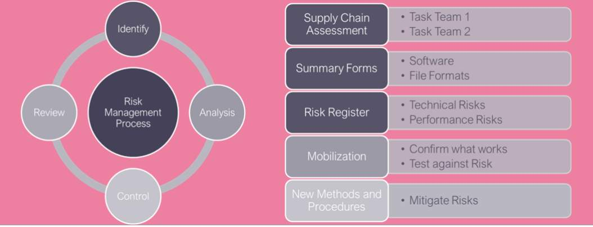
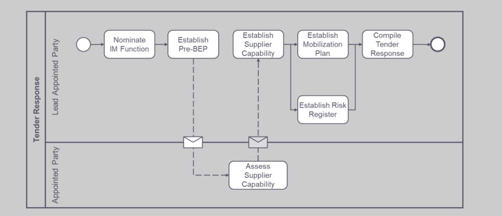

# Unit 6 - Lesson 5 - Establish Information Risk Register

*Lesson 5 of 5*

## Lesson Objectives

At the end of this lesson, you will be able to:

Explain the process associated with ISO 19650 -2 & 3 Clause 5.3.6 Establish the delivery team’s risk register

> [!note] Audio transcript (00:11)
> This lesson will explain the process associated with ISO 1965 -2 & 3 clause 5.3.6 established the delivery team’s risk register.

## Establish Information Risk Register

The Lead appointed party shall consider risks relating to the timely delivery of information associated with:

- Delivery teams EIR assumptions
- Project’s information delivery milestones
- Project’s information protocol
- The proposed Information delivery strategy
- The standards, methods and procedures
- Amendments to Project Information Standards
- Delivery team mobilization
> [!note] Audio transcript (00:35)
> One of the final activities in the tender response is the compilation of the Information Delivery Risk Register. This risk register may be incorporated into other project risk registers. Many of the information delivery risks are interlinked with project risks so the provision of a project risk register by the lead appointed party is essential. The defined risks need to have solutions for how they will be mitigated or managed. For example, if there is a tight planning timescale, 3D viewing software could enable stakeholders to understand the building and its impact very quickly.
>
> Source: [Lesson 5 - Establish Information Risk Register - BIM ISO 19650 1.mp3](unit-6-lesson-5-establish-information-risk-register/assets/Lesson 5 - Establish Information Risk Register - BIM ISO 19650 1.mp3)

Any risks that impact information delivery or information delivery milestones should be recorded.

*Risk Example: The Structural engineer has not used Revit or IFC before on a project*

> [!note] Audio transcript (00:46)
> A risk register may already be included within General Quality Assurance documentation, which could just be referenced from the BEP. Elements of risk management include Identify, Analyze, Control and Review of risk. Within the ISO process, the use of supply chain assessments, summary forms and risk registers helps you identify risks. Mobilization aids the risk analysis, and the methods and procedures aid the control of the risks. Risk deadlines, resource and competency issues, unrealistic milestone dates etc. are all examples for raising as an information risk. These should be recorded and monitored, a system could then be put into place to address the risk and mitigate.
>
> Source: [Lesson 5 - Establish Information Risk Register - BIM ISO 19650 1 (1).mp3](unit-6-lesson-5-establish-information-risk-register/assets/Lesson 5 - Establish Information Risk Register - BIM ISO 19650 1 (1).mp3)

**Establish a risk, the consequence, the level of risk, and ultimately the action to be taken!**

**Risk Example:** The Structural engineer has not used Revit or exported to IFC before on a project.

**Consequence:** Impact on deliverables and collaborative production of information.

**Action:** Revit training must be undertaken during mobilization.

Guidance on risk treatment options can be found within **ISO 31000:2018**

- Avoiding the risk
- Removing the risk source
- Changing the likelihood
- Changing the consequences
- Sharing the risk
- Retaining the risk by informed decision.
## Compile Tender Response

> [!note] Audio transcript (00:52)
> This image shows a tender response process. The lead appointed party needs to nominate the information management function and then establish the requirements of the pre-appointment BEP as a response to the EIRs. The information requirements are sent to the task teams and they provide information to demonstrate their capability. The lead appointed party then uses this information to establish the delivery team's capability. This information is also used to help define a working methodology. For example, the type of software use can help to determine common software use. This allows the lead appointed party to choose the most efficient way of working for the delivery team as software training may then need to be accounted for in the project time and costs. These assessments are to gather information as to how you're going to work together. This is then compiled into the tender response.
>
> Source: [Lesson 5 - Establish Information Risk Register - BIM ISO 19650 1 (2).mp3](unit-6-lesson-5-establish-information-risk-register/assets/Lesson 5 - Establish Information Risk Register - BIM ISO 19650 1 (2).mp3)

## Knowledge Check

Which of the following items is too soon to be considered when establishing the pre-appointment BIM Execution Plan:

## Learning Summary 

Lesson complete! You are now able to:

Explain the process associated with ISO 19650 -2 & 3 Clause 5.3.6 Establish the delivery team’s risk register

**Unit 6 Complete!
**

Module complete, you may now close this window and continue the course.

---
*Extracted from `Lesson 5 -_ Establish Information Risk Register_ - BIM ISO 19650 1&2 Project Delivery_ Unit 6 - Tender Response.html` via webpage-content-extractor.*
## Ten-Question Analysis Framework

### 1. Problem
How do delivery teams identify, quantify, and mitigate information-related risks (data loss, interoperability failures, milestone delays, security breaches) during tender response?

### 2. Applicability
- **Stage**: `tender-response` (ISO 19650-2 §5.3.5).
- **Roles**: Prospective [[lead-appointed-party]], [[appointed-party]], [[appointing-party]].
- **Key Documents**: [[information-risk-register]], tender response package.

### 3. Process
1. Identify potential risks relating to information production, exchange formats, CDE connectivity, and resource availability.
2. Assess the likelihood and impact of each identified information risk.
3. Propose concrete mitigation actions and assign risk owners within the delivery team.
4. Review residual risk ratings and document assumptions or dependencies on client shared resources.
5. Incorporate the Information Risk Register into the tender submission package.

### 4. Evidence
- Documented Information Risk Register with likelihood, impact, mitigation, and ownership (§5.3.5).
- Tender response package containing all 6 mandatory submission elements.

### 5. Principles
- **Specific Information Focus**: The information risk register addresses data, models, software, and exchanges, distinct from general construction health & safety risks.
- **Transparency in Tendering**: Communicating risks early enables collaborative mitigation with the appointing party.
- **Dynamic Living Document**: The register must be actively updated throughout the project lifecycle.

### 6. Risks & Anti-patterns
- Submitting a generic project risk register without information management specific risks.
- Failing to allocate clear personal ownership for risk mitigations.
- Ignoring client-side dependencies (e.g., delays in client CDE provisioning or EIR approvals).

### 7. Operationalization
- ISO 19650 Information Risk Register matrix with standard risk taxonomy (Format, CDE, Capability, Timeline, Security).
- Monthly risk review agenda item for delivery team IM coordination meetings.

### 8. Skill Test
Can this become a Skill?
**Yes** — Candidate: `information-risk-assessor`. Scans project parameters and flags probable information delivery vulnerabilities.

### 9. Skill Design
- **Supported Role**: Lead Appointed Party Risk Manager / BIM Lead.
- **Trigger**: Tender preparation and periodic delivery risk audits.
- **Output**: Prioritized Information Risk Register with action triggers.

### 10. Validation Plan
Track risk occurrence and mitigation effectiveness against the risk register during project delivery.

---

## Knowledge Space Links
- **Entities**: [[information-risk-register]], [[lead-appointed-party]], [[delivery-team]]
- **Concepts**: [[tender-response-requirements]], [[tender-evaluation-criteria]]
- **Methodologies**: [[establish-information-risk-register-method]]
