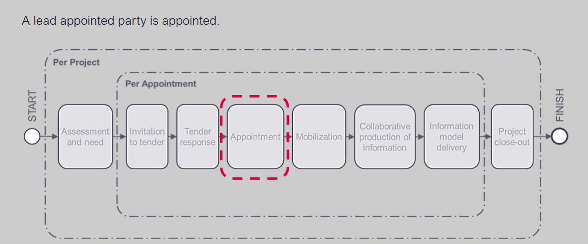
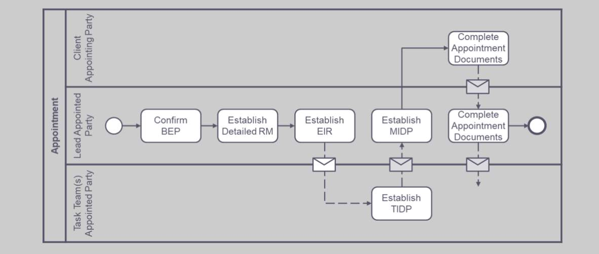
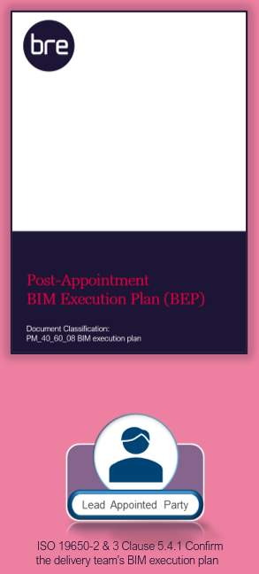
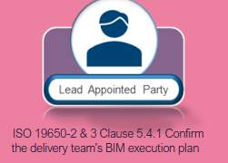
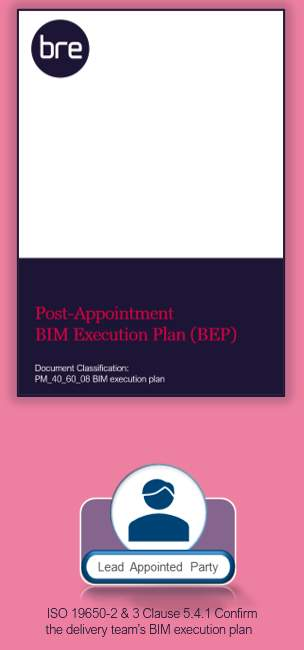
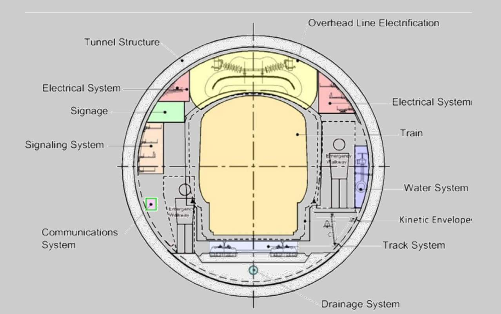

# Unit 7 - Lesson 1 - Confirm the Delivery Team BEP

*Lesson 1 of 6*

> [!note] Audio transcript (00:32)
> Following previous procurement stages is the planning stage of the information procurement process. Once an appointing party has received their tender response, the next step is to appoint a lead appointed party who will confirm the BIM execution plan and ensure delivery plans aggregated and established. A detailed responsibility matrix to identify the what in terms of information is to be produced. This unit will identify the key tasks associated with appointment to support the procurement of a lead appointed party and ensure completed appointment documents.
>
> Source: [Lesson 1 - Confirm the Delivery Team BEP - BIM ISO 19650 12 Proj (1).mp3](unit-7-lesson-1-confirm-the-delivery-team-bep/assets/Lesson 1 - Confirm the Delivery Team BEP - BIM ISO 19650 12 Proj (1).mp3)

## Lesson Objectives

At the end of this lesson, you will be able to:

- Understand the Confirmation of the Delivery Team BEP
> [!note] Audio transcript (00:09)
> The delivery team’s pre appointment BIM execution plan should be confirmed and as such becomes the delivery team BIM execution plan.

## Appointment

> [!note] Audio transcript (00:30)
> Let us imagine that our tender has been successful through the process so far and we've been appointed. We now need to get each of our task teams to do their task information delivery plans or TIDPs. These TIDPs then need to be brought together into the master information delivery plan. We then need to think about the delivery team BIM execution plan. We created a proposal of how we would do the work in the pre-BEP but now we need to confirm this and understand if there are any changes proposed.
>
> Source: [Lesson 1 - Confirm the Delivery Team BEP - BIM ISO 19650 12 Proj (3).mp3](unit-7-lesson-1-confirm-the-delivery-team-bep/assets/Lesson 1 - Confirm the Delivery Team BEP - BIM ISO 19650 12 Proj (3).mp3)

> [!note] Audio transcript (00:24)
> Now in this Information Delivery manual, we’re up to three swim lanes for 3 actors. We have the appointing party, the lead appointed party, and each of the task teams. We now need to confirm the BIM execution plan, establish the detailed responsibility matrix, establish the lead appointed parties, EIR, establish the TIDP and MIDP, and complete the appointment documents.

## Confirm the Delivery Team’s BIM execution plan

As discussed previously, the technical elements of the BEP in response to the EIR may include:

- Additions or Amendments
- Capture of existing Asset information
- Approvals and Authorization process
- Security and Information Distribution
- Information Delivery
- Information Technology Solutions and File Formats
- Delivery Team Capability and Capacity Summary
- Mobilization Plan

The Lead appointed party shall confirm and agree the delivery team’s BEP with regard to the following items:

- Confirm the individual(s) undertaking the I.M Function.
- Review the company skills matrix & training policy
- Confirm the Project Information Production Methods & Procedures
- Confirm software, hardware and infrastructure.
- Agree any proposed amendments and additions to the information standards

> [!note] Audio transcript (00:37)
> The delivery team must confirm the BIM execution plan which will include the following activities. Confirm who is or are the individual's undertaking information management function for or on behalf of the lead appointed party. Confirm the project information production methods and procedures required by the lead appointed party over and above the initial requirements. Confirm the proposed software, hardware and infrastructure the delivery team intend to adopt when producing and managing information. Agree the proposed amendments and additions to the information standards.
>
> Source: [Lesson 1 - Confirm the Delivery Team BEP - BIM ISO 19650 12 Proj.mp3](unit-7-lesson-1-confirm-the-delivery-team-bep/assets/Lesson 1 - Confirm the Delivery Team BEP - BIM ISO 19650 12 Proj.mp3)

## Update the BEP

> [!note] Audio transcript (00:45)
> The delivery team must confirm the BIM execution plan, which will include the following activities. 1. Update the proposed information delivery strategy outlining the approach to meeting the exchange information requirements, including an overview of the delivery team's organisational structure. 2. Update the proposed federation strategy outlining how information is indented to align with the proposed work breakdown structure. 3. Update the proposed high-level allocation of responsibility for each element of the information model to members of the delivery team. 4. Develop the detailed responsibility matrix from the high level going into greater detail for each element of the information model to members of the delivery team.
>
> Source: [Lesson 1 - Confirm the Delivery Team BEP - BIM ISO 19650 12 Proj (4).mp3](unit-7-lesson-1-confirm-the-delivery-team-bep/assets/Lesson 1 - Confirm the Delivery Team BEP - BIM ISO 19650 12 Proj (4).mp3)

## Federation Strategy

> [!note] Audio transcript (00:41)
> This slide shows a possible spatial organization of a federation strategy for a tunnel. The whole concept of spatial volumes is that individual spaces are defined for activities, and therefore task teams on a project. If all objects owned by task teams are contained within their respective breakdown structure volumes, then the information model is spatially coordinated. This is how clash avoidance works. The diagram is of an underground train tunnel, coloured as an example of a federation strategy for a linear asset. Each colour shows a volume for the respective systems to keep within. If they cannot then the tunnel needs to get bigger, and if it is already bored it becomes a massive problem.
>
> Source: [Lesson 1 - Confirm the Delivery Team BEP - BIM ISO 19650 12 Proj (2).mp3](unit-7-lesson-1-confirm-the-delivery-team-bep/assets/Lesson 1 - Confirm the Delivery Team BEP - BIM ISO 19650 12 Proj (2).mp3)

## Lesson Summary

Lesson complete! You are now able to:

Understand the Confirmation of the Delivery Team BEP

---

**[CONTINUE]**

---
*Extracted from `Lesson 1 -_ Confirm the Delivery Team BEP - BIM ISO 19650 1&2 Project Delivery_ Unit 7 - Appointment.html` via webpage-content-extractor.*
## Ten-Question Analysis Framework

### 1. Problem
How is the provisional Pre-appointment BEP formally updated, confirmed, and ratified into an operational, binding management plan once appointments are awarded?

### 2. Applicability
- **Stage**: `appointment` (ISO 19650-2 §5.4.1).
- **Roles**: [[lead-appointed-party]], [[appointed-party]], [[appointing-party]].
- **Key Documents**: [[delivery-team-bep]] (Confirmed BEP), [[detailed-responsibility-matrix]], [[master-information-delivery-plan]].

### 3. Process
1. Review pre-appointment commitments against final appointment terms and contract scope.
2. Update management information, named individuals, and exact software versions.
3. Confirm federation strategy, model breakdown structure, coordinate systems, and spatial boundaries.
4. Establish information container naming conventions in alignment with Project Information Standard.
5. Integrate confirmations from all appointed task teams.
6. Submit confirmed Delivery Team BEP to appointing party for formal approval.

### 4. Evidence
- Formatted, approved Delivery Team BIM Execution Plan document (§5.4.1).
- Documented Federation Strategy diagram with spatial breakdown and file volume limits.
- Formal client acceptance / approval record in CDE.

### 5. Principles
- **Contractual Baseline**: The confirmed BEP shifts from a promotional tender proposal to an operational contractual commitment.
- **Federation Integrity**: Clearly dividing the information model into manageable containers prevents file corruption, version collisions, and coordination bottlenecks.
- **Supply Chain Ratification**: All appointed parties must formally agree to the confirmed BEP.

### 6. Risks & Anti-patterns
- Continuing project delivery using the draft Pre-BEP without formal confirmation and updates.
- Failing to specify container volume limits or origin points, causing coordinate drift.
- Introducing proprietary software upgrades mid-project without updating the confirmed BEP.

### 7. Operationalization
- Post-appointment BEP confirmation review checklist.
- Federation strategy template defining coordinate origin, orientation, units, and tolerance.

### 8. Skill Test
Can this become a Skill?
**Yes** — Candidate: `delivery-bep-confirmer` / `bep-compliance-auditor`. Verifies that all tender commitments are properly converted into the confirmed Delivery Team BEP.

### 9. Skill Design
- **Supported Role**: Lead Appointed Party Information Manager.
- **Trigger**: Award of contract and appointment finalization.
- **Output**: Formally confirmed Delivery Team BEP package.

### 10. Validation Plan
Audit live models against confirmed BEP coordinate systems and naming rules during first delivery cycle.

---

## Knowledge Space Links
- **Entities**: [[delivery-team-bep]], [[lead-appointed-party]], [[appointing-party]], [[delivery-team]]
- **Concepts**: [[appointment-documents-structure]], [[cde-solution-architecture]]
- **Methodologies**: [[confirm-delivery-team-bep-method]]
