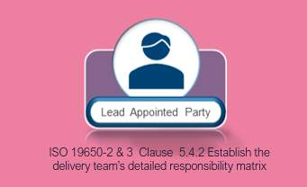
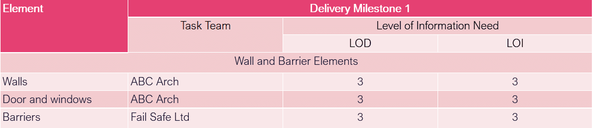
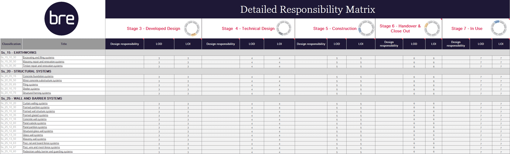

# Unit 7 - Lesson 2 - Establish the Detailed Responsibility Matrix

*Lesson 2 of 6*

> [!note] Audio transcript (00:09)
> Using the High-level responsibility matrix, a detailed responsibility matrix is produced to identify the what in terms of information that is to be produced.

## Lesson Objectives

In this lesson we aim to:

Understand the Establishment of the Detailed Responsibility Matrix

## Establish the Detailed Responsibility Matrix

> [!note] Audio transcript (00:50)
> The LAP take the high-level responsibility matrix and go into further detail to establish the detailed responsibility matrix which ascertains a detailed responsibility matrix shall identify what is being produced, when it is being exchanged and which task team is responsible. In doing so, the lead appointed party shall consider Information Delivery milestones, review EIR and ensure all milestones are included in the responsibility matrix. High-level responsibility matrix, review high-level responsibility matrix and ensure all elements or deliverables are transferred and included. Standards, methods and procedures, information container breakdown structure, volume strategy reviewed and volumes included in the responsibility matrix and information production process dependencies. Next we'll look at the responsibility matrix in more detail.
>
> Source: [Lesson 2 - Establish the Detailed Responsibility Matrix - BIM IS.mp3](unit-7-lesson-2-establish-the-detailed-responsibility-matrix/assets/Lesson 2 - Establish the Detailed Responsibility Matrix - BIM IS.mp3)

A detailed responsibility matrix shall identify what is being produced, when it is being exchanged, and which task team is responsible.

> [!note] Audio transcript (01:22)
> Note, Uniclass is the UK implementation of ISO 12006 Part 2, organization of information about construction works, Part 2, framework for classification. Against each element it is defined who is going to do what, when and to what level of information need. The use of geometry and information to express level of information need within this responsibility matrix is indicative only. This is typical of what was shown in the digital plan of work such as the NBS toolkit. Some people are using a schedule of elements as shown here, as Uniclass 2015 others have started generic where possible. At a high level it could be who is doing the architectural items, who is doing the structural etc. The level of information need is typically defined in numbers 1 to 5 with the number aligning to match the work stage in most cases. This matrix will usually be a spreadsheet with each milestone listed and each element broken down as shown. The responsibility matrix will initially set out high level tasks and who will undertake these. As the BEP is developed these will turn into a detailed responsibility establishing level of geometric and non geometric information requirements. Appropriate choice of plans of work and classification systems will aid in the development of the responsibility matrix. The detailed responsibility matrix is bridged between the high level responsibility matrix and the delivery plans.
>
> Source: [Lesson 2 - Establish the Detailed Responsibility Matrix - BIM IS (1).mp3](unit-7-lesson-2-establish-the-detailed-responsibility-matrix/assets/Lesson 2 - Establish the Detailed Responsibility Matrix - BIM IS (1).mp3)

*An Example Dataset*

## Lesson Summary

Lesson complete! You are now able to:

Understand the Establishment of the Detailed Responsibility Matrix

**[CONTINUE]**

---
*Extracted from `Lesson 2 -_ Establish the Detailed Responsibility Matrix - BIM ISO 19650 1&2 Project Delivery_ Unit 7 - Appointment.html` via webpage-content-extractor.*
## Ten-Question Analysis Framework

### 1. Problem
How do project teams eliminate ambiguity over who creates which information container, at what Level of Information Need, and for what specific delivery milestone?

### 2. Applicability
- **Stage**: `appointment` (ISO 19650-2 §5.4.2).
- **Roles**: [[lead-appointed-party]], [[appointed-party]], task teams.
- **Key Documents**: [[detailed-responsibility-matrix]], High-level Responsibility Matrix, [[exchange-information-requirements]].

### 3. Process
1. Break down the high-level responsibility matrix established during tender.
2. Allocate specific information containers or element breakdowns to named task teams.
3. Assign required [[level-of-information-need]] (LOIN) for each container across project milestones.
4. Define RACI roles (Responsible, Accountable, Consulted, Informed) for authoring, reviewing, and approving.
5. Reconcile matrix with the project work breakdown structure and information delivery milestones.
6. Publish matrix as an agreed schedule for delivery team execution.

### 4. Evidence
- Detailed Responsibility Matrix document/table linking information containers, LOIN, milestones, and task teams (§5.4.2).
- Agreement sign-offs from all contributing task team leads.

### 5. Principles
- **One Owner per Container**: Every information container must have a single responsible authoring task team.
- **Explicit LOIN at Milestones**: Requirements are calibrated to decision gates, avoiding premature detailing.
- **Foundation for Delivery Planning**: The Detailed Responsibility Matrix directly informs the creation of TIDPs and the MIDP.

### 6. Risks & Anti-patterns
- Overlapping authoring responsibilities leading to conflicting duplicate elements (e.g., MEP vs Structural slab penetrations).
- Omitting non-geometric alphanumeric requirements from the responsibility matrix.
- Failing to update the matrix when design responsibilities change between work stages.

### 7. Operationalization
- Tabular Detailed Responsibility Matrix template with dropdown validation for task teams and LOIN codes.
- Automated matrix-to-TIDP generator tool.

### 8. Skill Test
Can this become a Skill?
**Yes** — Candidate: `detailed-responsibility-matrix-generator`. Auto-generates container ownership schedules from EIR and BEP inputs.

### 9. Skill Design
- **Supported Role**: Lead Appointed Party Project BIM Coordinator.
- **Trigger**: Completion of confirmed BEP and appointment mobilization.
- **Output**: Fully mapped Detailed Responsibility Matrix.

### 10. Validation Plan
Verify that every container listed in the responsibility matrix appears in the TIDPs and MIDP.

---

## Knowledge Space Links
- **Entities**: [[detailed-responsibility-matrix]], [[lead-appointed-party]], [[appointed-party]], [[task-information-delivery-plan]]
- **Concepts**: [[level-of-information-need]], [[appointment-documents-structure]]
- **Methodologies**: [[establish-detailed-responsibility-matrix-method]]
