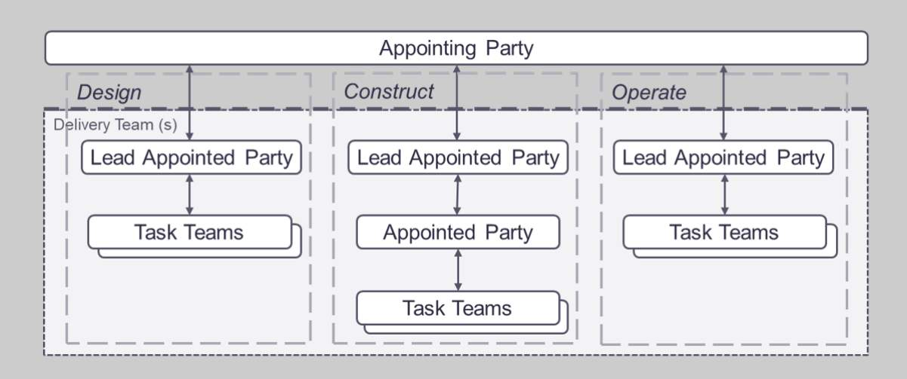
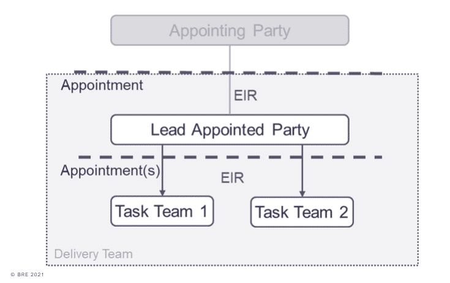
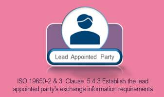
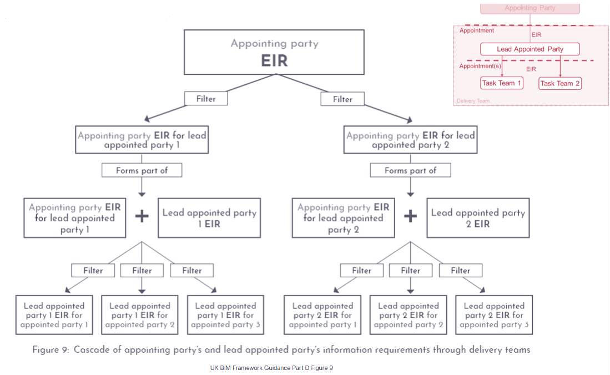

# Unit 7 - Lesson 3 - Establish the Lead Appointed Party EIR

*Lesson 3 of 6*

**Lesson Objectives**

> [!note] Audio transcript (00:36)
> At this stage we now have to start with the cascade of the exchange information requirements. In the information procurement phase the lead appointed party's exchange information requirements were delivered. Now the lead appointed party needs to develop their exchange information requirements. The lead appointed party needs to cascade relevant information requirements down to the task teams. A project may consist of multiple appointments. Each appointment by the appointing party shall establish exchange information requirements. Therefore as a project will consist of multiple exchange information requirements which need to be tailored to the party they're going to be issued to.
>
> Source: [Lesson 3 - Establish the Lead Appointed Party EIR - BIM ISO 1965.mp3](unit-7-lesson-3-establish-the-lead-appointed-party-eir/assets/Lesson 3 - Establish the Lead Appointed Party EIR - BIM ISO 1965.mp3)

## Staged Information Exchange

This diagram below shows that there will be multiple appointments during a project.

Each of these stages: **design, construct** and **operate**, is a new appointment and has to follow the whole appointment process.

*ISO 19650-2  Clause  5.3.7 Compile the delivery team’s tender response*

## Exchange Information Requirements per Work Stage

The lead appointed party shall establish their EIR for each appointed party (Task team) taking into account the appointing parties EIR.

A project may consist of multiple appointments.  Each appointment by the appointing party shall establish EIRs.

Therefore a project will consist of multiple EIRs and each to be tailored to the party they are being issued to. For example the people providing the reception desk, do not need everything passed down just certain parts of the higher level EIR.

> A project will most likely consist of multiple appointments. Internal work instructions are also treated as appointments. Where a delivery team in the operational phase includes other appointed parties, they too should receive an EIR.

## Cascaded Information Requirements

*Cascade of Information Requirements as defined in UK BIM Framework Guidance Part D Figure 9*

## Lead Appointed Party EIR

**So why do we have the separate EIR’s?**

Lead appointed parties may have their own requirements, defined in the L.A.P EIR.

Examples could be additional information requirements relating to:

- **Coordination**
- **Performance**
- **Analysis**
- **Exchange Formats **
> [!note] Audio transcript (00:48)
> So, why do we have separate EIRs? The appointing party defined their asset information requirements within the AIR and then the project information requirements that are defined in the PIR. Lead appointed parties may have their own requirements in addition, and this is the purpose of the LAP EIR. Examples could be additional information requirements relating to coordination, performance, analysis and exchange formats. The level of information need may be different to that of the appointing party EIR due to the increased coordination requirements, for example. The LAP must reaffirm and document the level of information need for each deliverable as required by the appointing party's EIR and document other metrics used to define the level of information need. For example, level of detail or level of information.
>
> Source: [Lesson 3 - Establish the Lead Appointed Party EIR - BIM ISO 1965 (1).mp3](unit-7-lesson-3-establish-the-lead-appointed-party-eir/assets/Lesson 3 - Establish the Lead Appointed Party EIR - BIM ISO 1965 (1).mp3)

## Lead Appointed Party EIR Considerations

It is also important to consider the appointed parties and the support they may need.

Perhaps the lead appointed party is competent in the delivery of IFC COBie exports for example, or experienced in using using a particular CDE solution.

These shared resources were maybe not provided by the appointing party as they may not be an expert in the BIM field, however the LAP could ensure resources are available to task teams such as:

- IFC Export, COBie deliverable, and a CDE set up guide
- Provide a sample IFC model and export for comparison
- Educational onboarding relating to BIM documentation

## Learning Summary 

Lesson complete! You are now able to:

Understand the Establishment of the Lead Appointed Party EIR

**[CONTINUE]**

---
*Extracted from `Lesson 3_ - Establish the Lead Appointed Party EIR - BIM ISO 19650 1&2 Project Delivery_ Unit 7 - Appointment.html` via webpage-content-extractor.*
## Ten-Question Analysis Framework

### 1. Problem
How does a [[lead-appointed-party]] cascade client information requirements down to tier-2/sub-contracted appointed parties with the appropriate technical specificity for their appointment?

### 2. Applicability
- **Stage**: `appointment` (ISO 19650-2 §5.4.3).
- **Roles**: [[lead-appointed-party]], [[appointed-party]] (sub-consultants, specialist subcontractors).
- **Key Documents**: [[lead-appointed-party-eir]], Appointing Party EIR, Project Information Standard.

### 3. Process
1. Review the Appointing Party's overall EIR, PIR, AIR, and Project Information Standard.
2. Determine specific information deliverables required from each sub-appointed party.
3. Formulate cascaded EIRs tailored to each specific appointment scope (e.g. Structural, MEP, Envelope).
4. Establish individual information exchange dates and interim delivery gates to allow lead party aggregation.
5. Define acceptance criteria, QA requirements, and shared resources provided to the appointed party.
6. Incorporate the Lead Appointed Party EIR into the formal sub-appointment contract documents.

### 4. Evidence
- Formal Lead Appointed Party EIR document for each sub-appointment (§5.4.3).
- Cascaded milestone schedule with review buffers prior to main client submission dates.
- Signed appointment schedules.

### 5. Principles
- **Cascaded Alignment**: Requirements must flow seamlessly from client to lead contractor to tier-2 sub-consultant without dilution or distortion.
- **Time Buffer for Aggregation**: Sub-appointment exchange milestones must precede client milestones to allow lead party coordination and authorization.
- **Proportionate Requirements**: Tailoring requirements so specialist trade contractors are not burdened with irrelevant disciplines.

### 6. Risks & Anti-patterns
- Merely copy-pasting the full client EIR into sub-contracts without filtering for relevant discipline scopes.
- Setting sub-contract delivery dates identical to client milestones, leaving zero time for lead coordination.
- Omitting project standards from sub-contract documentation.

### 7. Operationalization
- Cascaded EIR drafting wizard with modular discipline-specific annexes.
- Milestone alignment calendar showing tier-2 delivery deadlines vs client gateway dates.

### 8. Skill Test
Can this become a Skill?
**Yes** — Candidate: `cascaded-eir-generator`. Derives sub-appointment EIRs from the primary client EIR and responsibility matrix.

### 9. Skill Design
- **Supported Role**: Lead Appointed Party Procurement / BIM Manager.
- **Trigger**: Appointed party procurement and sub-contract drafting.
- **Output**: Tailored Lead Appointed Party EIR package.

### 10. Validation Plan
Audit sub-appointed party deliverables against cascaded EIR requirements during initial design sprints.

---

## Knowledge Space Links
- **Entities**: [[lead-appointed-party-eir]], [[lead-appointed-party]], [[appointed-party]], [[exchange-information-requirements]]
- **Concepts**: [[smart-information-requirements]], [[appointment-documents-structure]]
- **Methodologies**: [[establish-lead-appointed-party-eir-method]]
