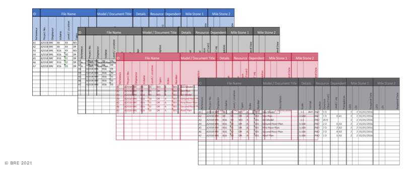
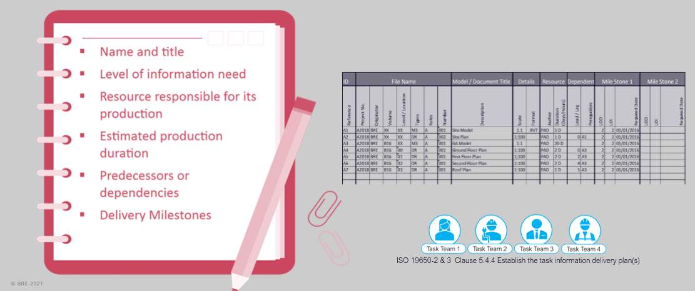
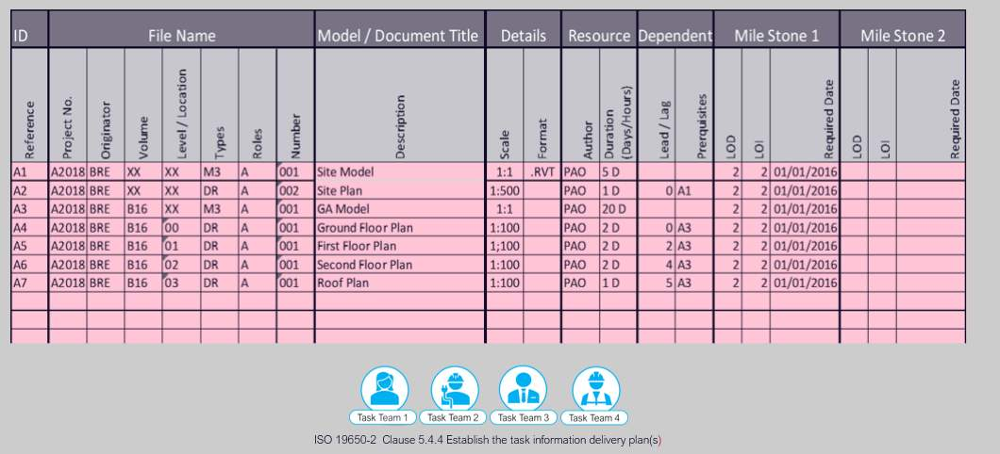

# Unit 7 - Lesson 4 - Establish the TIDPs

*Lesson 4 of 6*

**Lesson Objectives**

> [!note] Audio transcript (00:37)
> At this stage, we now have to start the cascade of the exchange information requirements. In the information procurement phase, the lead appointed party's exchange information requirements were delivered. Now, the lead appointed party needs to develop their exchange information requirements. The lead appointed party needs to cascade relevant information requirements down to the task teams. A project may consist of multiple appointments. Each appointment by the appointing party shall establish exchange information requirements. Therefore, as a project, a project will consist of multiple exchange information requirements which need to be tailored to the party they are being issued to.
>
> Source: [Lesson 4 - Establish the TIDPs - BIM ISO 19650 12 Project Delive (1).mp3](unit-7-lesson-4-establish-the-tidps/assets/Lesson 4 - Establish the TIDPs - BIM ISO 19650 12 Project Delive (1).mp3)

## Establish the TIDP’s

Task Information Delivery Plans are a  schedule of information containers and delivery dates, for a specific task team.

For each of the appointments in a project each appointed task team should produce a task information delivery plan.

> [!note] Audio transcript (00:20)
> Information Delivery Plan outlines a task team's responsibility to deliver specific information containers on a specific date. ISO 19650 uses the term container. This merely means what files are going to be delivered for each of the appointments in a project. Each appointed task team should produce a Task Information Delivery Plan.

The TIDP needs to contain the following detail:

> [!note] Audio transcript (00:54)
> Each task team shall establish their task information plan which identifies their deliverables, services or product against the responsibility matrix. The TIDP will establish the name and title of each deliverable, plus the following items, level of information need, resource responsible, production deliverable, any predecessors or dependents, and delivery milestones. Due to the overlap with document control procedures, it is recommended that a task information delivery plan be extended to also control the distribution of documentation through the addition of revision, status, date of issue, paper size and details of recipients. Each organisation's TIDPs will then be used to establish the Master Information Delivery Plan or MIDP. Depending on the national convention, there may not be an appropriate level of information need. If so, then this field should remain blank.
>
> Source: [Lesson 4 - Establish the TIDPs - BIM ISO 19650 12 Project Delive (2).mp3](unit-7-lesson-4-establish-the-tidps/assets/Lesson 4 - Establish the TIDPs - BIM ISO 19650 12 Project Delive (2).mp3)

> [!note] Audio transcript (00:34)
> This is an excerpt from a TIDP as described previously. Each container is given an ID and a file name. This will be taught in collaborative working in lesson 8.3. ISO does not ask for these, but the following may be useful. The file format and the scale if it is a drawing, the human resource allocated and how long it will take, if there is any lead or lag in any independencies. In this example only the tasks to deliver milestone one have been set and as the project moves forward it will be populated for other milestones. So this is an early stage TIDP.
>
> Source: [Lesson 4 - Establish the TIDPs - BIM ISO 19650 12 Project Delive.mp3](unit-7-lesson-4-establish-the-tidps/assets/Lesson 4 - Establish the TIDPs - BIM ISO 19650 12 Project Delive.mp3)

## Learning Summary 

Lesson complete! You are now able to:

Understand Establishing Task Information Delivery Plans

**[CONTINUE]**

---
*Extracted from `Lesson 4 -_ Establish the TIDPs - BIM ISO 19650 1&2 Project Delivery_ Unit 7 - Appointment.html` via webpage-content-extractor.*
## Ten-Question Analysis Framework

### 1. Problem
How does each individual task team plan, schedule, and commit to the production of its specific information containers across project milestones?

### 2. Applicability
- **Stage**: `appointment` (ISO 19650-2 §5.4.4).
- **Roles**: [[appointed-party]], Task Team Managers, [[lead-appointed-party]].
- **Key Documents**: [[task-information-delivery-plan]] (TIDP), [[detailed-responsibility-matrix]], EIR.

### 3. Process
1. Review the Detailed Responsibility Matrix and relevant EIR requirements for the task team.
2. List all information containers (models, drawings, schedules, calculation reports) to be generated.
3. Define metadata for each container: Container ID, title, format, Level of Information Need (LOIN).
4. Estimate production duration, allocate authoring resources, and assign start/completion dates.
5. Identify cross-discipline dependencies and required preceding information.
6. Submit TIDP to the Lead Appointed Party for compilation into the Master Information Delivery Plan (MIDP).

### 4. Evidence
- Completed Task Information Delivery Plan (TIDP) spreadsheet/database per task team (§5.4.4).
- Container register with assigned author, milestone dates, LOIN, and file format.

### 5. Principles
- **Task Team Ownership**: The TIDP is authored and owned directly by the task team producing the information, ensuring realistic scheduling.
- **Dependency Transparency**: Highlighting what input information is required from other disciplines prevents hidden project bottlenecks.
- **Standardized Container Metadata**: Using standard container identifiers from inception facilitates CDE automation.

### 6. Risks & Anti-patterns
- Lead contractor creating TIDPs in isolation without input from design specialists.
- Setting milestones based on arbitrary wishful thinking rather than calculated production capacity.
- Missing dependencies, resulting in cascading delays during collaborative production.

### 7. Operationalization
- Standardized ISO 19650 TIDP spreadsheet template with built-in validation for Uniclass codes and dates.
- Dependency tracking flag for cross-discipline information requests.

### 8. Skill Test
Can this become a Skill?
**Yes** — Candidate: `tidp-authoring-validator`. Validates task team container schedules and checks for missing dependencies.

### 9. Skill Design
- **Supported Role**: Task Team Manager / Discipline BIM Lead.
- **Trigger**: Sub-appointment execution and project delivery planning.
- **Output**: Validated, compliant Task Information Delivery Plan.

### 10. Validation Plan
Cross-reference individual TIDP entries against live CDE uploads during production.

---

## Knowledge Space Links
- **Entities**: [[task-information-delivery-plan]], [[master-information-delivery-plan]], [[appointed-party]], [[lead-appointed-party]]
- **Concepts**: [[information-delivery-milestones]], [[appointment-documents-structure]]
- **Methodologies**: [[establish-tidps-method]]
