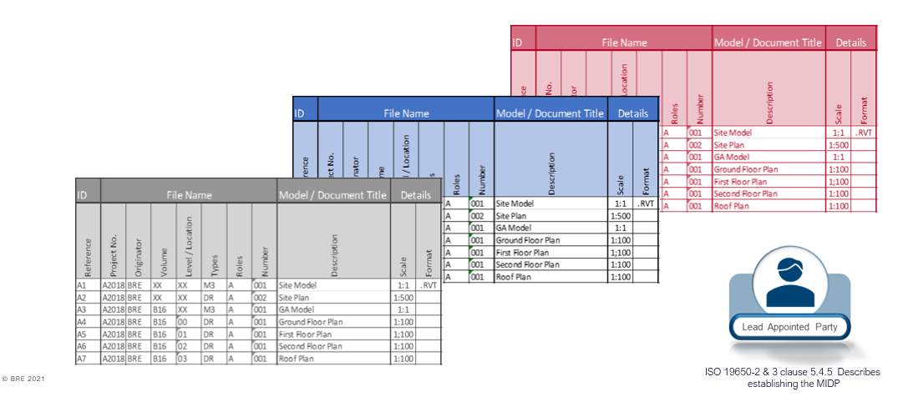
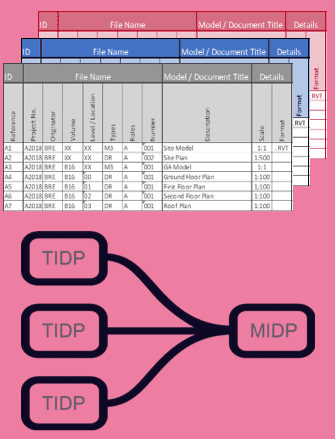
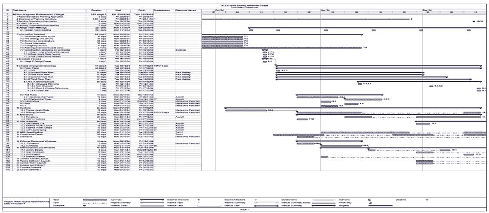
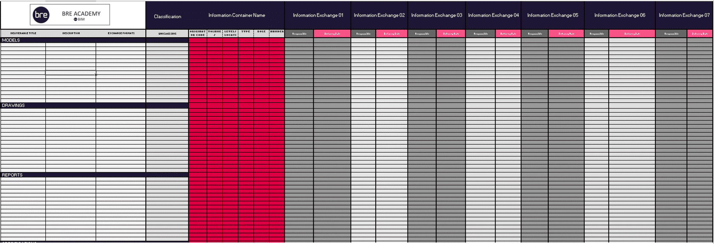
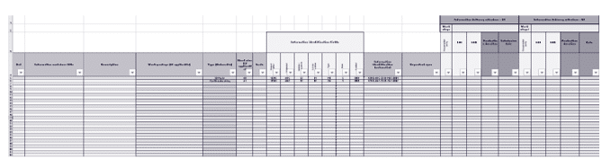

# Unit 7 - Lesson 5 - Establish the MIDP

*Lesson 5 of 6*

**Lesson Objectives**

> [!note] Audio transcript (00:09)
> Appointed party shall aggregate the from each task team to establish the delivery team's master information delivery plan MIDP.

## Establish the MIDP

The MIDP is a plan incorporating and all relevant task information delivery plans.

Each task team’s task information delivery plan should be aggregated into a single MIDP by the LAP.

> [!note] Audio transcript (00:36)
> The MIDP is a plan incorporating all relevant task information delivery plans. Each task team's task information delivery plan should be aggregated into a single MIDP by the LAP. As we have mentioned, if the templates are issued within the shared resources for the TIDPs, then the data can be transferred easily to the MIDP. Depending on the size of the project, this could be an Excel, MS project or another project planning solution. However, it is worth noting that ISO 9650 Part 2 does not specify a particular approach, format, software or template style.
>
> Source: [Lesson 5 - Establish the MIDP - BIM ISO 19650 12 Project Deliver (1).mp3](unit-7-lesson-5-establish-the-midp/assets/Lesson 5 - Establish the MIDP - BIM ISO 19650 12 Project Deliver (1).mp3)

## Aggregate the TIDP’s into a single MIDP

each task team’s task information delivery plan should be aggregated into a single MIDP by the LAP.

*Image for illustration purposes of layout only, the data is not intended to be visible.*

> [!note] Audio transcript (00:48)
> Here we have an example of an MIDP in a Gantt chart format, which helps to make overall information delivery process more integrated. These have been around for many years and were carried out well before the terms TIDP and MIDP were used. Now they have become part of the BIM process and helped to make the overall information delivery process more integrated. It is recommended to create templates for the TIDP due to the need to aggregate several task information delivery plans into the master information delivery plan. It will make life much easier. Some of the issues to take on board in the MIDPs are that every appointing party has specific delivery dates and a specific review and authorization process and they may have a particular time they need the information by. Therefore make sure you put these reviews and authorized processes into your program.
>
> Source: [Lesson 5 - Establish the MIDP - BIM ISO 19650 12 Project Deliver (2).mp3](unit-7-lesson-5-establish-the-midp/assets/Lesson 5 - Establish the MIDP - BIM ISO 19650 12 Project Deliver (2).mp3)

*Here we have an example of an MIDP in a Excel format which can sometimes be efficient if  similar TIDP template has been issued.*

## MIDP Considerations

When developing the MIDP, the lead appointed party should consider the following:

- Responsibilities defined in the detailed responsibility matrix
- Task Team dependency
- Review periods defined in the EIR & BEP
> [!note] Audio transcript (00:36)
> When developing the MIDP, the leader-pointed party should consider the following Responsibilities defined in the detailed responsibility matrix, whom, what, when, as defined in previous slides Task team dependency, for example an architectural drawing package for windows may require coordination and depend upon the structural framing layout being approved prior Review periods defined in the EIR and BEP, ensuring sufficient time is allowed for the check-review approved process The MIDP will then provide a clear representation with a visual program indication of what the task teams expect to deliver
>
> Source: [Lesson 5 - Establish the MIDP - BIM ISO 19650 12 Project Deliver.mp3](unit-7-lesson-5-establish-the-midp/assets/Lesson 5 - Establish the MIDP - BIM ISO 19650 12 Project Deliver.mp3)

## MIDP Process

Once the lead appointed party is happy with the MIDP, there are additional activities that must then take place:

- Set information container deliverables & dates
- Notify the task teams should there be any changes required. Update the TIDP’s where appropriate
- Inform the appointing party of any risks that may impact the project milestones.
> [!note] Audio transcript (01:22)
> Once the lead appointed party is happy with the MIDP, there are additional activities that must then take place. Set information container deliverables and dates. The milestone dates and project stages will typically be shown in the MIDP to plan and track the deliverable plan and the intended date. These should be shared between the delivery team and agreed as part of their obligations. Notify the task teams should there be any changes required. Update the TIDPs where appropriate. As the information management process develops there may be changes required or at a project level additional information requested from the task teams. Any changes no matter whether they be minor tweaks or major modifications on the deliverables they must be fed back from the TIDPs with an update into the aggregated MIDP to reflect this. These changes must be handled in a collaborative manner to avoid any risks. Inform the appointing party of any risks that may impact the project milestones. This relates to the information risk register as previously discussed. A risk that impacts the delivery milestones could very likely come from a change in deliverables or as part of an impact of TIDP modifications. The previous example of an architect's door package relying on a structural framing layout gives an idea of how any changes in delivery information can have a huge impact.
>
> Source: [Lesson 5 - Establish the MIDP - BIM ISO 19650 12 Project Deliver (3).mp3](unit-7-lesson-5-establish-the-midp/assets/Lesson 5 - Establish the MIDP - BIM ISO 19650 12 Project Deliver (3).mp3)

## MIDP Obligations

## Learning Summary 

Lesson complete! You are now able to:

Explain establishing Master Information Delivery Plans

**[CONTINUE]**

---
*Extracted from `Lesson 5 -_ Establish the MIDP - BIM ISO 19650 1&2 Project Delivery_ Unit 7 - Appointment.html` via webpage-content-extractor.*
## Ten-Question Analysis Framework

### 1. Problem
How does a lead appointed party consolidate, harmonize, and govern diverse task team delivery schedules into a single Master Information Delivery Plan (MIDP)?

### 2. Applicability
- **Stage**: `appointment` (ISO 19650-2 §5.4.5).
- **Roles**: [[lead-appointed-party]], [[appointed-party]], [[appointing-party]].
- **Key Documents**: [[master-information-delivery-plan]] (MIDP), [[task-information-delivery-plan]] (TIDPs), EIR.

### 3. Process
1. Collate all approved TIDPs from internal teams and sub-appointed task teams.
2. Aggregate container schedules and identify cross-discipline schedule conflicts or logic loops.
3. Align container delivery dates with project Information Delivery Milestones and client review windows.
4. Define review protocols, lead party authorization duration, and client acceptance periods.
5. Ratify the consolidated schedule as the project Master Information Delivery Plan.
6. Submit the MIDP to the Appointing Party for formal acceptance.

### 4. Evidence
- Master Information Delivery Plan (MIDP) document/schedule (§5.4.5).
- Formal Appointing Party acceptance notice.
- CDE-configured metadata tracking schedule aligned with MIDP container IDs.

### 5. Principles
- **Aggregation without Distortion**: The MIDP aggregates TIDPs without altering task team commitments without consultation.
- **Critical Path Integration**: Aligning information production with procurement and construction milestones.
- **Baseline for Earned Value**: The MIDP forms the definitive baseline against which progress and payment are measured.

### 6. Risks & Anti-patterns
- Treating the MIDP as a static document that is never updated when milestones shift.
- Failing to verify cross-team dependencies, leading to coordination gridlock.
- Omitting client review timescales, leading to disputed milestone deadlines.

### 7. Operationalization
- Automated MIDP compilation script merging multiple TIDP tables into a master schedule.
- Dashboard tracking planned vs actual CDE container submissions against the MIDP.

### 8. Skill Test
Can this become a Skill?
**Yes** — Candidate: `midp-aggregator-analyzer`. Automatically aggregates TIDPs, flags dependency conflicts, and verifies milestone alignment.

### 9. Skill Design
- **Supported Role**: Lead Appointed Party Information Manager.
- **Trigger**: Receipt of all task team TIDPs post-appointment.
- **Output**: Master Information Delivery Plan with identified critical path risks.

### 10. Validation Plan
Audit weekly CDE container releases against the MIDP delivery baseline throughout design stages.

---

## Knowledge Space Links
- **Entities**: [[master-information-delivery-plan]], [[task-information-delivery-plan]], [[lead-appointed-party]], [[appointing-party]]
- **Concepts**: [[information-delivery-milestones]], [[appointment-documents-structure]]
- **Methodologies**: [[establish-midp-method]]
