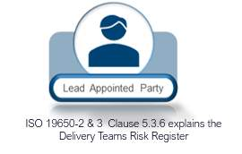
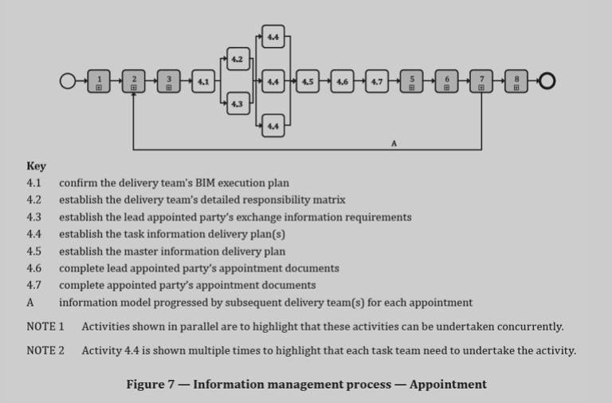

# Unit 7 - Lesson 6 - Complete Appointment Documents

*Lesson 6 of 6*

**Lesson Objectives**

> [!note] Audio transcript (00:05)
> The appointing party is responsible for ensuring the appointment documentation is complete.

## Complete Lead Appointed Party’s Appointment Documents

Now that the information management process has been agreed, the lead appointed party can be formally appointed, using the following documents:

- Appointing party’s (EIR)
- Project’s Information Standard
- Project's Information Protocol (including particulars)
- Delivery Team’s BEP
- Delivery Team’s MIDP.

> [!note] Audio transcript (01:25)
> Now, the lead appointed party can be formally appointed as the EIRs allow smart objectives to be used on the appointment, the information standard allows deliverables to be reviewed at exchange points by the appointing party, the information protocol ensures information delivery is incorporated into all contracts and appointments, the BEP ensures the responsibilities of the delivery team are included in their contract and the MIDP confirms all agreed deliverables and timescales. Even with the best planning projects can change, so it has to be remembered that these documents are all still live and can be changed. One, without these documents in place, a smart, specific, measurable, achievable, realistic and time-bound appointment cannot be completed. Two, this ensures that the deliverables can be reviewed in simple terms at exchange points by the appointing party. Three, this ensures that the information delivery is integrated into all contacts and appointments as well as the EIRs. Four, this ensures that the proposals for the delivery team to meet the BEP are included in their contract or appointment. Five, as the MIDP confirming the agreed list of deliverables and when they are planned to be delivered. These are all potentially changing documents that reflects the project's development and changes that may happen. This is separate so it can change. The appointment documents should include information and information particulars relevant to the specific appointment. This process is repeated for each separate appointment in the same manner.
>
> Source: [Lesson 6 - Complete Appointment Documents - BIM ISO 19650 12 Pro (1).mp3](unit-7-lesson-6-complete-appointment-documents/assets/Lesson 6 - Complete Appointment Documents - BIM ISO 19650 12 Pro (1).mp3)

Any risks that impact information delivery or information delivery milestones should be recorded.

## Complete Appointed Party’s Appointment Documents

Now that the lead appointed party has been formally appointed, the task teams can be formally appointed in a similar manner, using the following documents:

- Lead appointed party’s EIR
- Project’s Information Standard
- Project's Information Protocol (including particulars)
- Delivery Team’s BEP
- Delivery Team’s TIDP.
> [!note] Audio transcript (00:40)
> Now that the lead appointed party has been formally appointed, the task teams can be formally appointed in a similar manner using the following documents. Lead appointed parties EIR, Project Information Standard, Projects Information Protocol including particulars, Delivery Teams BEP, Delivery Teams TIDP. Having established these documents, the task teams can be appointed. Again, making sure documents like the Projects Information Protocol including particulars has been incorporated so the requirements have been cascaded down to the task teams. Changes to any of the documents on the previous slides should be managed via change control procedures throughout the duration of the appointments.
>
> Source: [Lesson 6 - Complete Appointment Documents - BIM ISO 19650 12 Pro.mp3](unit-7-lesson-6-complete-appointment-documents/assets/Lesson 6 - Complete Appointment Documents - BIM ISO 19650 12 Pro.mp3)

*ISO 19650-2 5.4.8 Activities for appointmentActivities for appointment are shown in Figure 7*

## Learning Summary 

Lesson complete! You are now able to:

Explain the Completion of Appointment Documents

**Unit 7 Complete!
**

You may now close the window and complete this module.

---
*Extracted from `Lesson 6 - Complete Appointment Documents - BIM ISO 19650 1&2 Project Delivery_ Unit 7 - Appointment.html` via webpage-content-extractor.*
## Ten-Question Analysis Framework

### 1. Problem
How are all technical, operational, and managerial information requirements legally incorporated into binding appointment contracts for lead and sub-appointed parties?

### 2. Applicability
- **Stage**: `appointment` (ISO 19650-2 §5.4.6).
- **Roles**: [[appointing-party]], [[lead-appointed-party]], [[appointed-party]], Legal Counsel.
- **Key Documents**: Appointment Documents, Information Protocol, confirmed BEP, MIDP, EIR.

### 3. Process
1. Assemble the mandatory information management appointment annexes for the Lead Appointed Party.
2. Include: Appointing Party EIR, Project Information Standard, Production Methods & Procedures, Information Protocol, confirmed Delivery Team BEP, and MIDP.
3. Assemble corresponding appointment documents for each Appointed Party (Lead EIR, TIDP, BEP).
4. Review contractual precedence between commercial terms and information protocol.
5. Execute formal appointment contracts across all delivery tiers.

### 4. Evidence
- Executed Lead Appointed Party appointment contract including information management annexes (§5.4.6).
- Executed Appointed Party contracts incorporating cascaded requirements.
- Signed Common Data Environment Information Protocol.

### 5. Principles
- **Contractual Enforceability**: Information requirements and standards must be legal obligations, not non-binding suggestions.
- **Hierarchy of Documents**: Resolving precedence between standard contract terms and ISO 19650 information protocols.
- **Comprehensive Cascade**: Back-to-back contracting ensures sub-consultants carry identical information obligations.

### 6. Risks & Anti-patterns
- Signing contracts without attaching the confirmed BEP or MIDP, leaving requirements legally toothless.
- Contradictions between standard legal clauses and the Information Protocol (e.g. copyright vs CDE licensing).
- Delaying contract execution while design work progresses in legal ambiguity.

### 7. Operationalization
- Information Management Appointment Checklist confirming all 6 mandatory annexes are attached.
- Legal precedence alignment template for contract integration.

### 8. Skill Test
Can this become a Skill?
**Yes** — Candidate: `appointment-documents-auditor`. Scans appointment contract packs to verify all required ISO 19650 annexes are complete.

### 9. Skill Design
- **Supported Role**: Commercial Director / Client Information Manager.
- **Trigger**: Contract formulation prior to financial close.
- **Output**: Appointment Document Verification Report.

### 10. Validation Plan
Legal and technical review of executed contract bundles across all project appointments.

---

## Knowledge Space Links
- **Entities**: [[delivery-team-bep]], [[master-information-delivery-plan]], [[common-data-environment-protocol]], [[appointing-party]], [[lead-appointed-party]]
- **Concepts**: [[appointment-documents-structure]]
- **Methodologies**: [[complete-appointment-documents-method]]
