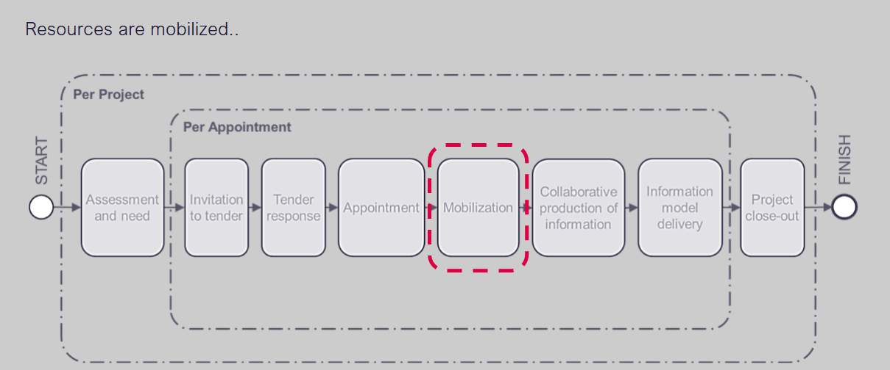
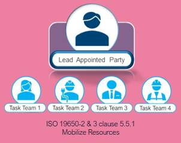
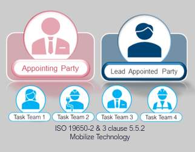
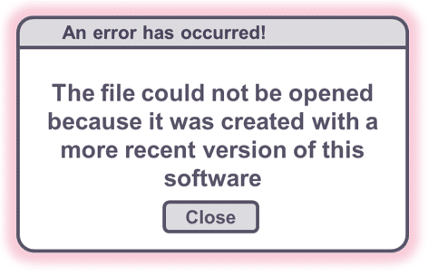
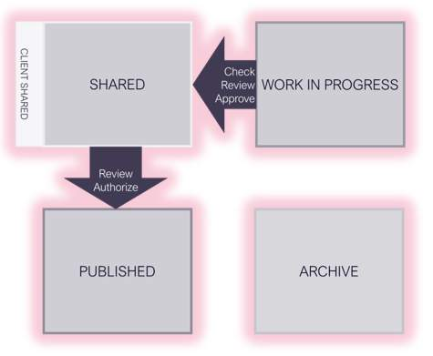
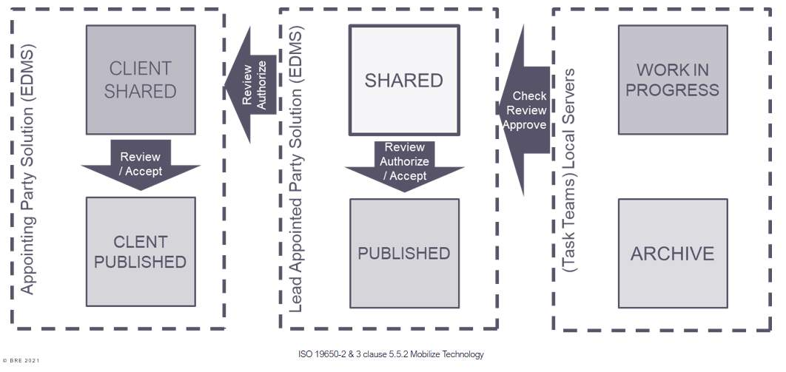
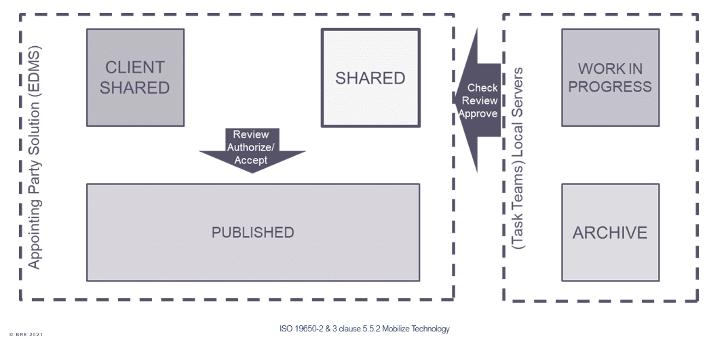

# Unit 8 - Lesson 1 - Mobilize Resources & I.T

*Lesson 1 of 2*

> [!note] Audio transcript (00:20)
> One of the requirements of the ISO is for the lead appointment. Entered party to create immobilization plan. Mobilization is one of the key areas which tends to get missed or overlooked as the overall program pushes the team straight into projects. Testing the project's information production methods and procedures is a crucial aspect of information planning and production.

> [!note] Audio transcript (01:01)
> Referring to the Lifecycle Diagram, you will see appointment followed by mobilisation. As discussed, at appointment stage, each task team needs to produce their Task Information Delivery Plan, which lists all of the documents, models and outputs required, and what their resources are, and how long it is going to take to produce. They get aggregated to form the Master Information Delivery Plan, and they become part of the Delivery Team BIM Execution Plan, the BEP. The next activity is mobilisation, which is the testing phase prior to commencing the production of information. Mobilisation is testing the practical implementation of the BEP. We need to check that the CDE has been set up and that it can be used. For example, we need to check, has everyone logged into the contractor's shared area? Can everyone access and see the parts they need? Can the client view the things they need to? Can you open information from other consultants? Do things come in the right geospatial locations? If any of the appropriate tests fail, it is imperative to resolve the issue in the mobilisation period.
>
> Source: [Lesson 1 - Mobilize Resources I.T - BIM ISO 19650 12 Project Del (5).mp3](unit-8-lesson-1-mobilize-resources-i-t/assets/Lesson 1 - Mobilize Resources I.T - BIM ISO 19650 12 Project Del (5).mp3)

## Lesson Objectives

At the end of this lesson, you will be able to:

Understand the Mobilization of Resources & I.T

> [!note] Audio transcript (00:07)
> The lead appointed party shall mobilize the resources and it as defined within the delivery team’s mobilization plan.

## Mobilize Resources

The lead appointed party is responsible for mobilizing the resources, as per the mobilization plan. They shall confirm and organise the following:

- Confirming the availability of task teams
Is the specialist listed within the tender response documents still available?

- Developing & delivering education or training on software skills
The information risk register flagged up that the Structural Engineer requires Revit training! Has this been mobilized?

Are there BIM awareness courses from the BRE for example available for the task teams?

## Project Induction Meeting

One of the initial tasks during the mobilization stage is to undertake a project induction meeting.

> [!note] Audio transcript (00:30)
> One of the initial tasks during the mobilisation stage is to undertake a project induction meeting. This enables the team to meet in person and discuss key elements, as mentioned in previous slides, whilst once again representing a chance to flag any potential information risks to be added to the register. It is recommended to use a meeting agenda and minute the discussions to assign accountability and check the status in the following meeting. This meeting may then take place at regular intervals along with BIM Coordination workshops for example.
>
> Source: [Lesson 1 - Mobilize Resources I.T - BIM ISO 19650 12 Project Del (2).mp3](unit-8-lesson-1-mobilize-resources-i-t/assets/Lesson 1 - Mobilize Resources I.T - BIM ISO 19650 12 Project Del (2).mp3)

![1.0    Programme Update (Lead Appointed Party)1.1    Milestone Dates Reaffirmed1.2    Workstage Confirmation2.0    Appointment Documentation (Appointing Party)     2.1    Information received to date2.2    outstanding information2.3    Detailed Responsibility Matrix3.0    Supply Chain Capability (Lead Appointed Party)    3.1    Confirm contacts3.2    Any additional training required 4.0    I.M Function (Appointing Party / Lead Appointed Party)4.1    Ensure all activities are assigned4.2    Update BEP accordingly5.0    Volume Strategy (Lead Appointed Party)5.1    BIM Mock-up5.2    Naming conventions and codes 5.3    Confirm Coordinates6.0    Clash Avoidance Process (Lead Appointed Party)6.1    Discussion on Coordination strategy, tolerances, clash lists7.0    CDE – Process (Appointing Party)  7.1    Setup and configuration7.2    Training dates7.3    Access](unit-8-lesson-1-mobilize-resources-i-t/assets/hH6PxdU1Hy8GYwPz_QbIb-s8jQ8pEWCyh.png)

*1.0    Programme Update (Lead Appointed Party)1.1    Milestone Dates Reaffirmed1.2    Workstage Confirmation2.0    Appointment Documentation (Appointing Party)     2.1    Information received to date2.2    outstanding information2.3    Detailed Responsibility Matrix3.0    Supply Chain Capability (Lead Appointed Party)    3.1    Confirm contacts3.2    Any additional training required 4.0    I.M Function (Appointing Party / Lead Appointed Party)4.1    Ensure all activities are assigned4.2    Update BEP accordingly5.0    Volume Strategy (Lead Appointed Party)5.1    BIM Mock-up5.2    Naming conventions and codes 5.3    Confirm Coordinates6.0    Clash Avoidance Process (Lead Appointed Party)6.1    Discussion on Coordination strategy, tolerances, clash lists7.0    CDE – Process (Appointing Party)  7.1    Setup and configuration7.2    Training dates7.3    Access*

## Test Information Technology

> [!note] Audio transcript (01:38)
> During the project induction meeting, the team may check the workings of the project's CDE, test software, hardware and information exchanges. Software, hardware and IT infrastructure. Review delivery team IT and check software versions and licensing are current and operable. This is to ensure that the software, hardware and IT infrastructure used align with the IT schedule within the bin execution plan. Typical problems are connectivity for people on sites, particularly in remote locations. This is essential that connections are in place as early as possible. Also, you get the suggestion that a new version of software will resolve a problem. However, the software has not been tested and when you try it does not work the way you thought it would. Project CDE, appointing party responsibility. Configure the CDE to comply with project standards. Check access rights, version control, status and classification as defined in the mobilization plan. This is to ensure that information being shared meet the project information standards and information production methods and procedures. Delivery teams, distributed CDE connectivity to project CDE. Upload sample file and test control access slash distribution to the appointing party or delivery team as defined in the mobilization plan. This is to ensure that information can be successfully exchanged and delivered. Information exchanges between task teams. Test access and upload or download capability of each task team as defined in the mobilization plan. Information delivery to the appointing party. Test upload approval and publishing process as defined in the mobilization plan. Check the appointing party can download all published information.
>
> Source: [Lesson 1 - Mobilize Resources I.T - BIM ISO 19650 12 Project Del (3).mp3](unit-8-lesson-1-mobilize-resources-i-t/assets/Lesson 1 - Mobilize Resources I.T - BIM ISO 19650 12 Project Del (3).mp3)

You do not want to leave testing until too late, as any issues could have an impact on the exchange of information or delays could affect project milestones.

This is something to avoid ….

> [!note] Audio transcript (00:29)
> It is essential that software is set up consistently in order that one, information can be successfully exchanged and referenced before the production of information can begin. Having to procure new software, hardware or IT infrastructure could lead to significant project delays. Two, for example with Revit you cannot back save, therefore if one member of the team is using a newer version of Revit it may cause problems. Three, it is therefore very important to align software version on the project.
>
> Source: [Lesson 1 - Mobilize Resources I.T - BIM ISO 19650 12 Project Del (1).mp3](unit-8-lesson-1-mobilize-resources-i-t/assets/Lesson 1 - Mobilize Resources I.T - BIM ISO 19650 12 Project Del (1).mp3)

## Project & Distributed CDE

When configuring a CDE, the procedure may involve multiple solutions.  For example, the Appointing Party and Lead Appointed Party have preferred solutions.

> [!note] Audio transcript (00:41)
> Next, the common data environment needs to be configured. However, when configuring a CDE, the procedure may involve multiple solutions. For example, when both the Appointing Party and Lead Appointed Party have preferred solutions. These different systems have different terms, project and distributed CDE. Appointing parties, Lead Appointed parties and All Appointed parties could all have their own CDE solutions that collectively make up the project CDE. It is important to note that the Appointed Party's distributed CDE is not in place on the Appointing Party's project CDE, but in addition to. These may be in the form of electronic document management systems, EDMS.
>
> Source: [Lesson 1 - Mobilize Resources I.T - BIM ISO 19650 12 Project Del.mp3](unit-8-lesson-1-mobilize-resources-i-t/assets/Lesson 1 - Mobilize Resources I.T - BIM ISO 19650 12 Project Del.mp3)

## Project & Distributed CDE

> [!note] Audio transcript (01:24)
> This is a simple example, there may be others. One, each task team likes to have their own WIP area on a network server. The work in progress state is used for information while it is being developed by its task team. An information container in this state should not be visible or accessible to any other task team. This is particularly important if the CDE solution is implemented through a shared system, for example a shared server or web portal. Two, you're going to then get the lead appointed party solution which will deal with the shared and the published. Three, the shared area is where the task teams would share information back and forth to the work in progress area. Four, when that is coordinated it will be authorised and moved to published. Five, you may get the client shared area, they may just be viewing the shared area or they may have their own solution. It then just needs to be worked out how information is transferred from shared to client shared in a seamless manner. Six, you could end up with multiple local servers with different solutions for each task team. Seven, you need some way of ensuring the check review approved process is being carried out in between work in progress and shared. Eight, also to ensure the review and authorisation of data is taken place which may just be a change in state, location or even metadata depending on what the software solutions are. Nine, other solutions could even be that everything is all on one platform.
>
> Source: [Lesson 1 - Mobilize Resources I.T - BIM ISO 19650 12 Project Del (6).mp3](unit-8-lesson-1-mobilize-resources-i-t/assets/Lesson 1 - Mobilize Resources I.T - BIM ISO 19650 12 Project Del (6).mp3)

> [!note] Audio transcript (00:30)
> Obviously, the perfect common data environment would exist on a single system that would allow all the stages required. However, another common example may have the task teams managing their own work in progress and archive. The lead appointed party managing shared and published work on a document management system, and the appointing party using their own document management system for work shared with them. It is essential that whatever the system, both the check review approved process and the review authorised process are followed.
>
> Source: [Lesson 1 - Mobilize Resources I.T - BIM ISO 19650 12 Project Del (4).mp3](unit-8-lesson-1-mobilize-resources-i-t/assets/Lesson 1 - Mobilize Resources I.T - BIM ISO 19650 12 Project Del (4).mp3)

## Lesson Summary

Lesson complete! You are now able to:

Understand the Mobilization of Resources & I.T

---

**[CONTINUE]**

---
*Extracted from `Lesson 1 -_ Mobilize Resources & I.T - BIM ISO 19650 1&2 Project Delivery_ Unit 8 - Mobilization.html` via webpage-content-extractor.*
## Ten-Question Analysis Framework

### 1. Problem
How does a delivery team ensure that all human teams, software tools, hardware systems, and CDE connections are fully configured, trained, and tested before project information authoring commences?

### 2. Applicability
- **Stage**: `mobilization` (ISO 19650-2 §5.5.1).
- **Roles**: [[lead-appointed-party]], [[appointed-party]], IT Managers, CDE Admins.
- **Key Documents**: [[mobilization-plan]], Project Induction Packs, CDE Access Schedules.

### 3. Process
1. Mobilize human resources: confirm staffing, assign roles, and conduct project BIM induction meetings.
2. Mobilize information technology: procure, configure, and install required software versions and hardware.
3. Set up and test the project Common Data Environment (CDE) and distributed CDE platforms.
4. Establish user access permissions, security groups, and folder/container metadata schemas.
5. Conduct technical training on project-specific standards, templates, and collaboration workflows.
6. Verify team readiness before authorizing work-in-progress modeling.

### 4. Evidence
- Project BIM Induction attendance records and sign-off sheets.
- IT infrastructure readiness audit (workstation specs, software build versions, bandwidth).
- Active CDE user register with verified permission levels and test container uploads (§5.5.1).

### 5. Principles
- **No Production Without Mobilization**: Unchecked systems and untrained personnel inevitably produce defective data that requires costly rework.
- **Distributed CDE Governance**: When delivery teams use local internal CDEs, automated synchronization and status rules must be verified.
- **Shared Common Language**: Inductions ensure all parties understand project classification, naming, and approval gates.

### 6. Risks & Anti-patterns
- Skipping induction meetings under the assumption that "experienced consultants know what to do".
- Working in divergent software point-releases, leading to file corruption or backward-incompatibility.
- Delaying CDE permission assignments, forcing teams to share models via unsecured email/cloud links.

### 7. Operationalization
- Project BIM Induction slide deck and knowledge check questionnaire.
- IT & CDE Mobilization Verification Gate with pass/fail sign-off.

### 8. Skill Test
Can this become a Skill?
**Yes** — Candidate: `it-mobilization-validator`. Audits delivery team software setups and CDE permissions against project specifications.

### 9. Skill Design
- **Supported Role**: Lead Appointed Party IT/BIM Lead.
- **Trigger**: Project kickoff following contract execution.
- **Output**: Mobilization Readiness Certificate.

### 10. Validation Plan
Simulate a sample information exchange between all task teams in the project CDE environment.

---

## Knowledge Space Links
- **Entities**: [[mobilization-plan]], [[lead-appointed-party]], [[appointed-party]], [[common-data-environment-protocol]]
- **Concepts**: [[mobilization-testing-procedures]], [[cde-solution-architecture]]
- **Methodologies**: [[mobilize-resources-it-method]]
