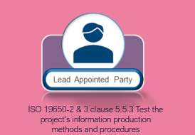
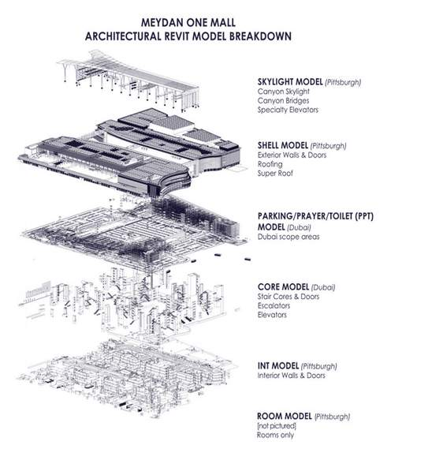
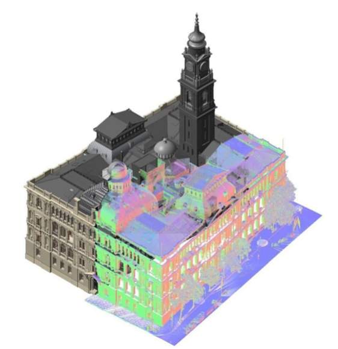
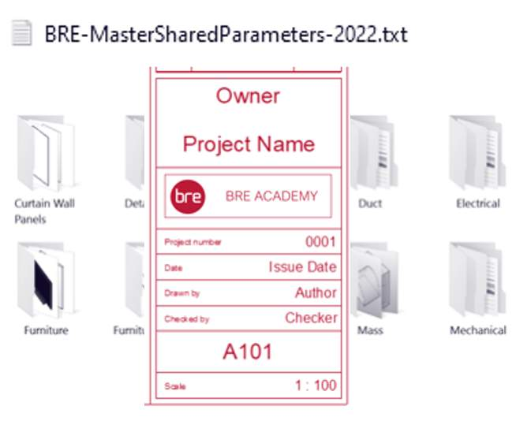
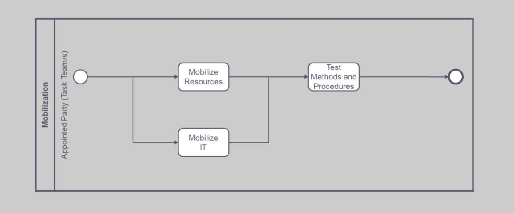
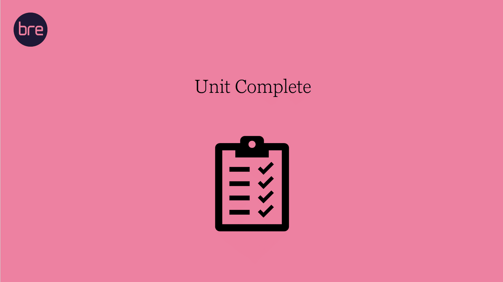

# Unit 8 - Lesson 2 - Test Project’s Information Production Methods & Procedures

*Lesson 2 of 2*

**Lesson Objectives**

> [!note] Audio transcript (00:08)
> The lead appointed party should test the project's information, production methods and procedures as defined within the delivery team's mobilization plan.

## Test Project’s Information Production 
Methods & Procedures

This may include the following tasks undertaken by the lead appointed party:

- Test & document - Author the test / mock-up project Update the BEP if any updates are required.
- Communicate - Ensure Project’s Information Production Methods and Procedures are current in the Delivery Team BEP, and all task teams have reviewed/ agreed.

> [!note] Audio transcript (00:44)
> The project information methods and procedures must also be configured and tested during mobilisation to enable the smooth transfer of information during the next phases. This may include the following tasks undertaken by the lead appointed party. The project's information production methods and procedures have been tested and documented. Author the test project, mock-up files utilising the project methods and procedures. Update project's information production methods and procedures within the BEP if any updates are required. The project's information production methods and procedures have been communicated to all task teams. Ensure project's information production methods and procedures is current in the delivery team BEP and all task teams have reviewed and agreed the delivery team BEP.
>
> Source: [Lesson 2 - Test Projects Information Production Methods Procedur (1).mp3](unit-8-lesson-2-test-projects-information-production-methods-procedures/assets/Lesson 2 - Test Projects Information Production Methods Procedur (1).mp3)

## Federation Strategy

*https://archsmarter.com/large-projects-in-revit-1/(opens in a new tab)*

> [!note] Audio transcript (00:18)
> The lead appointed party should test that the proposed information container breakdown structure is workable and has been verified and refined. You'll typically review the Federation strategy at induction meeting. See an example from Arch Smarter for a typical large Revit project model breakdown strategy.

## Develop Shared Resources 

Develop shared resources to be used by the delivery team, including title blocks, shared parameters, document templates, existing surveys etc identified at the project induction meeting.

*https://measuredsurvey365.co.uk/services/point-cloud-surveys/(opens in a new tab)*

> [!note] Audio transcript (00:30)
> Develop shared resources to be used by the delivery team, including title blocks, shared parameters, document templates, existing surveys, etc., identified at the project induction meeting. The last item to consider is ensuring unresolved issues have been documented in the project risk register. To ensure that the project's information production methods and procedures are communicated to all task teams, it is recommended that any changes are incorporated into the BIM execution plan.
>
> Source: [Lesson 2 - Test Projects Information Production Methods Procedur.mp3](unit-8-lesson-2-test-projects-information-production-methods-procedures/assets/Lesson 2 - Test Projects Information Production Methods Procedur.mp3)

## Mobilization Activities 

*5.1 mobilize resources
5.2 mobilize information technology
5.3 test the project’s information production methods and procedures*

## Knowledge Check

Take a moment to identify what you consider as the benefits of applying **Information Management** to a project. Consider the following:

- What benefits do project documents (such as the BIM execution plan) provide, and;
- What benefits do agreed project information standards, methods and procedures provide.
## Learning Summary 

Lesson complete! You are now able to:

Understand the testing of the project’s information production methods and procedures, as defined within the delivery team’s mobilization plan

**Unit 8 Complete!
**

You may now close the window and complete this module.

---
*Extracted from `Lesson 2 -_ Test Project’s Information Production Methods & Procedures - BIM ISO 19650 1&2 Project Delivery_ Unit 8 - Mobilization.html` via webpage-content-extractor.*
## Ten-Question Analysis Framework

### 1. Problem
How do delivery teams prove that their proposed information authoring, federation, clash-detection, and data-export workflows work in practice before producing live deliverables?

### 2. Applicability
- **Stage**: `mobilization` (ISO 19650-2 §5.5.2).
- **Roles**: [[lead-appointed-party]], [[appointed-party]], BIM Coordinators.
- **Key Documents**: Project Information Production Methods & Procedures, Shared Resources, Test Models.

### 3. Process
1. Develop and distribute shared project templates, title blocks, seed files, and library objects.
2. Establish sample test information containers representing architectural, structural, and MEP disciplines.
3. Conduct end-to-end exchange tests: export IFC models, test coordinate alignment, and perform clash detection.
4. Verify non-geometric data extraction (e.g. COBie / Excel exports) from native models.
5. Test the CDE approval workflow: transition sample files from WIP to Shared.
6. Document lessons learned from testing and refine methods and procedures before production launch.

### 4. Evidence
- Documented Test Exchange Report detailing coordinate checks, clash results, and data exports (§5.5.2).
- Approved project seed files, classification tables, and family libraries in CDE Shared Resources.
- Signed Mobilization Testing Acceptance protocol.

### 5. Principles
- **Dry-Run Validation**: Discovering workflow errors during mobilization costs a fraction of discovering them during a high-stakes delivery milestone.
- **OpenBIM Interoperability Verification**: Verifying IFC schema mapping before large-scale modeling prevents proprietary lock-in failures.
- **Continuous Refinement**: Production procedures should be updated based on empirical test results.

### 6. Risks & Anti-patterns
- Commencing full-scale modeling without testing coordinate origins, resulting in misaligned multi-disciplinary models.
- Assuming software exporters will automatically populate COBie/IFC properties without configuration.
- Failing to document test results, leaving repeating errors unaddressed.

### 7. Operationalization
- Mobilization Exchange Test Protocol with standardized clash matrix and COBie schema validator.
- Approved Shared Resource Library folder in CDE.

### 8. Skill Test
Can this become a Skill?
**Yes** — Candidate: `information-method-tester`. Automates IFC coordinate validation and test container QA audits.

### 9. Skill Design
- **Supported Role**: Lead Information Coordinator / BIM Manager.
- **Trigger**: Mobilization phase prior to Stage 2 information authoring kickoff.
- **Output**: Information Production Methods & Procedures Test Report.

### 10. Validation Plan
Run collision checks and schema validation scripts on test models from each authoring tool.

---

## Knowledge Space Links
- **Entities**: [[project-information-production-methods-and-procedures]], [[shared-resources]], [[lead-appointed-party]], [[appointed-party]]
- **Concepts**: [[mobilization-testing-procedures]], [[openbim-information-exchange]]
- **Methodologies**: [[test-information-methods-procedures-method]]
