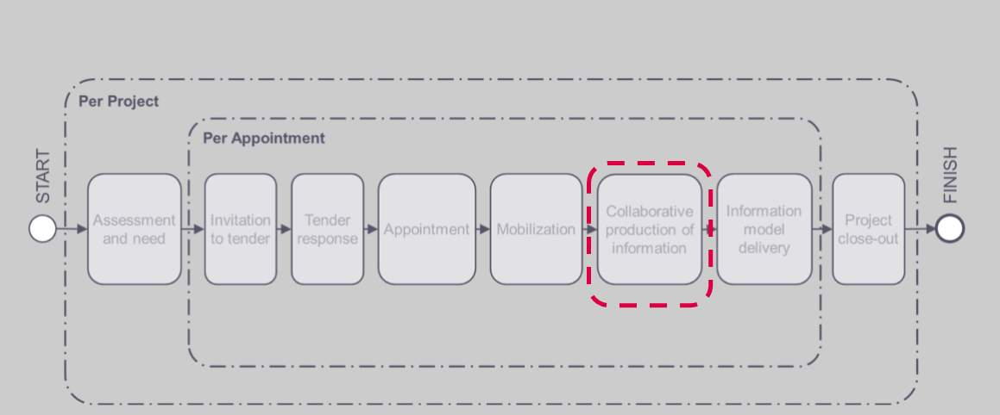
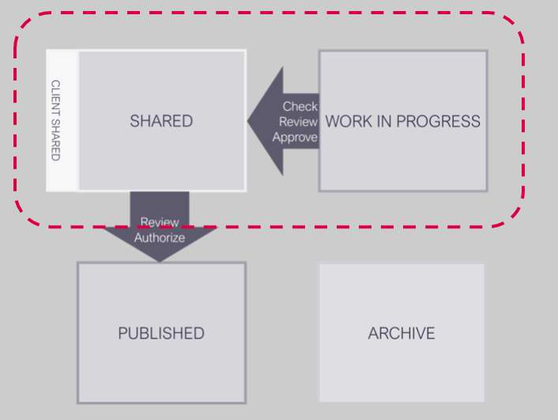
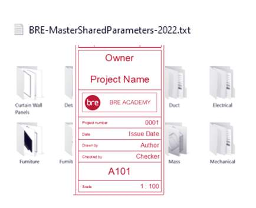
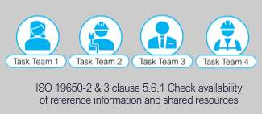
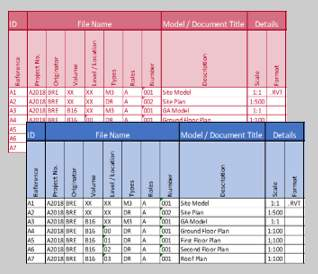
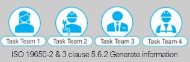
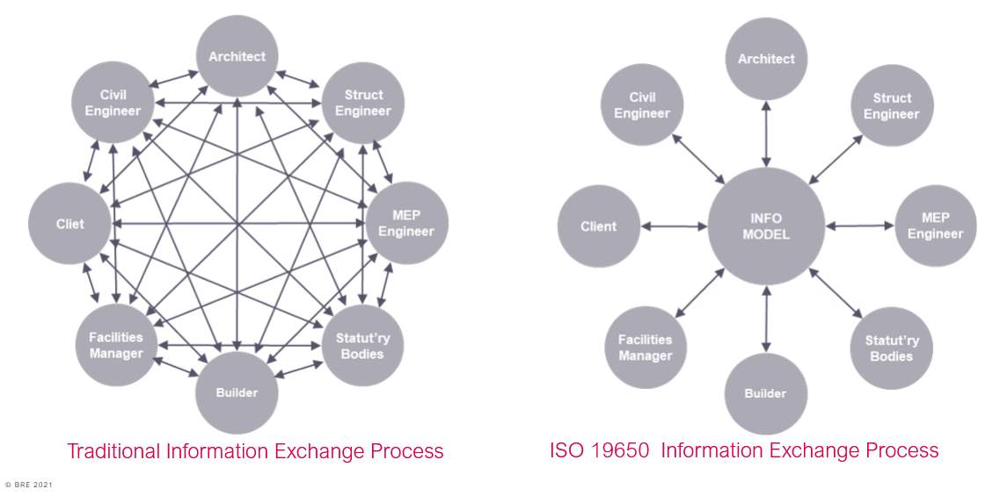
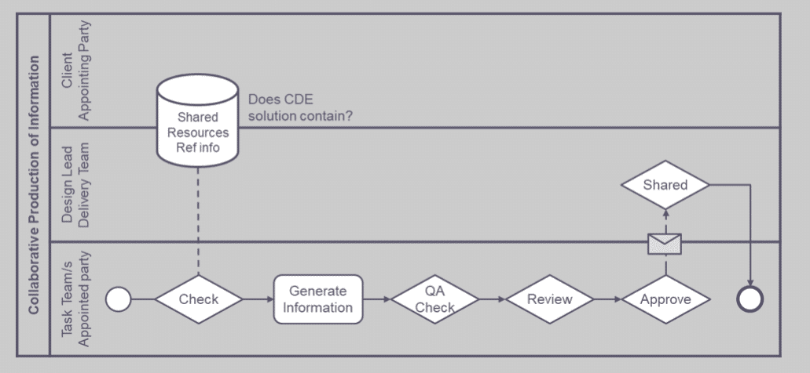

# Unit 9 - Lesson 1 - Generate Information

*Lesson 1 of 3*

> [!note] Audio transcript (00:28)
> After appointing the lead appointed party, the next step is for the lead appointed party's delivery team to generate information as specified within the project's documentation, such as the BIM execution plan and master information delivery plan. This unit will identify the key tasks associated with the collaborative production of information and information delivery, ensuring that the lead appointed party's delivery team's information meets the requirements of the appointing party through quality assurance processes.
>
> Source: [Lesson 1 - Generate Information - BIM ISO 19650 12 Project Deliv (1).mp3](unit-9-lesson-1-generate-information/assets/Lesson 1 - Generate Information - BIM ISO 19650 12 Project Deliv (1).mp3)

> [!note] Audio transcript (00:10)
> Information Production we have now completed all of the mobilization tasks and can now start on collaborative production in the task teams and information model delivery.

## Lesson Objectives

At the end of this lesson, you will be able to:

Understand how Information is Generated

> [!note] Audio transcript (00:07)
> The lead appointed party shall mobilize the resources and it as defined within the delivery team’s mobilization plan.

## Generate Information

> [!note] Audio transcript (00:08)
> Collaborative production of information deals with the processes for data to be developed and transferred from work in progress to the shared state.

## Check Availability of Reference Information 
& Shared Resources

Prior to generating information, each task team shall check that the following are available within the projects common data environment:

- Reference Information
- Shared Resources
If access is not available for any reason the task teams must assess the TIDP’s for any potential impact, and immediately inform the lead appointed party.

## Generate Information Process – Geometric 

Each task team shall generate geometric information in accordance with their TIDP & respective work stage.

- Check against the Project Information Standard, Project Information Production Methods & Procedures & detailed responsibility matrix
- Link in task team geometry to avoid duplication
- Regular spatial coordination through a federated model
- clashes identified and managed through regular coordination workshops
- Ensure the agreed level of information need as established within the detailed R.M is met, and not under or over provided for.

> [!note] Audio transcript (01:05)
> Each task team shall generate information in accordance with their task information delivery plan and respective work stage. The information that is generated we have touched on before, namely geometric models and non-geometric structured information and documentation, each of which need to be managed through a common data environment workflow. Geometric information shall be authored using specified software in accordance with the project information production methods and procedures and detailed responsibility matrix. Link in task team geometry to avoid duplication of model geometry and information containers and avoid extending beyond the allocated elements. Regularly coordinated through shared models in terms of spatial coordination through a federated model and clashes identified and managed through a regular coordination workshop. Ensure the agreed level of information needed as established within the detailed RM is met and not under or over provided for. It is important to note that the overproduction of information can be detrimental to a project and therefore creation of information should be in accordance with the project's information methods and procedures.
>
> Source: [Lesson 1 - Generate Information - BIM ISO 19650 12 Project Deliv.mp3](unit-9-lesson-1-generate-information/assets/Lesson 1 - Generate Information - BIM ISO 19650 12 Project Deliv.mp3)

*Link in task team geometry to avoid duplication of model geometry and information containers and avoid extending beyond the allocated elementsRegularly coordinated through shared models  in terms of spatial coordination through a federated modeland clashes identified and managed through regular coordination workshopsIssues are tracked and managed. Issues that are a high risk should be logged in the Information Risk Register 
*

## Generate Information Process - Alphanumeric

- COBie meta data provided by the task teams at the appropriate information exchanges defined within the milestones
- The information within the PIM should be regularly checked against project documentation
- Exports are in the formats and versions agreed within the Delivery Teams BEP
- Again, Ensure the agreed level of information need as established within the detailed R.M is met, and not under or over provided for.
> [!note] Audio transcript (00:50)
> Non-geometric information. Coby metadata and any other asset information requirements defined within the detailed responsibility matrix are to be provided by the task teams at the appropriate information exchanges defined within the milestones. The information within the PIM should be regularly checked against project documentation for compliance as part of the information management function. Once the checks are complete and non-geometric data such as Coby or IFC are exported, the formats and versions agreed within the delivery team BEP should be adhered to. Again, ensure the agreed level of information need as established within the detailed RM is met and not under or over provided for. By meeting the level of information need there is objective evidence that the intended use has been achieved. This needs to be tested and then approved for its required use to be fulfilled.
>
> Source: [Lesson 1 - Generate Information - BIM ISO 19650 12 Project Deliv (2).mp3](unit-9-lesson-1-generate-information/assets/Lesson 1 - Generate Information - BIM ISO 19650 12 Project Deliv (2).mp3)

Video courtesy of Revizto

Revizto Navisworks Clash Detection

## Information Exchange

> [!note] Audio transcript (01:06)
> Traditionally, this information management process is as this diagram on the left, and if any member of the team does not share their information to the right parties, then it becomes disjointed. Exchanges occur between project team members at different points in the project. This can result in different project team members having conflicting information. The process has historically not been well managed. Despite this, projects can still succeed following this process, but any poor information management lead to inefficiencies, increasing the necessary time and effort required to complete tasks. This diagram on the right shows what we have with a single shared area or container that holds all the information that should be used at that current time for a particular purpose. Following the information management process, the exchange of information is shared through a managed location where files are held for anyone to access. This means that there is a single copy of each file which needs to be updated, a single location to find this file, a single source of the truth drastically reducing the time and effort to complete tasks.
>
> Source: [Lesson 1 - Generate Information - BIM ISO 19650 12 Project Deliv (3).mp3](unit-9-lesson-1-generate-information/assets/Lesson 1 - Generate Information - BIM ISO 19650 12 Project Deliv (3).mp3)

## Collaborative Production of Information Activities

> [!note] Audio transcript (00:28)
> This information delivery manual takes us through the essentials of delivery to the shared area. We're going to cover each stage in detail, but in summary, 1. Firstly the task teams check that the appropriate shared resources and reference information is in the CDE and base their information on this. 2. Then the task team will generate their information and go through their internal QA check review and approval process. And 3. Then there is a review process by the delivery team.
>
> Source: [Lesson 1 - Generate Information - BIM ISO 19650 12 Project Deliv (4).mp3](unit-9-lesson-1-generate-information/assets/Lesson 1 - Generate Information - BIM ISO 19650 12 Project Deliv (4).mp3)

## Lesson Summary

Lesson complete! You are now able to:

Understand how Information is Generated

---

**[CONTINUE]**

---
*Extracted from `Lesson 1 -_ Generate Information - BIM ISO 19650 1&2 Project Delivery_ Unit 9 - Collaborative Production of Information.html` via webpage-content-extractor.*
## Ten-Question Analysis Framework

### 1. Problem
How do task teams generate and coordinate geometric models, alphanumeric data, and documentation containers in compliance with project standards without contaminating shared environments?

### 2. Applicability
- **Stage**: `collaborative-production` (ISO 19650-2 §5.6.1).
- **Roles**: [[appointed-party]], Task Teams, Authors.
- **Key Documents**: TIDP, Project Information Standard, Reference Information, Native Authoring Files.

### 3. Process
1. Check availability and validity of reference information and shared resources in the CDE before authoring.
2. Generate information containers strictly within the **Work In Progress (WIP)** state.
3. Author geometric representations in accordance with the Level of Information Need and project spatial boundaries.
4. Populate alphanumeric properties and classification tokens (Uniclass 2015) in native models.
5. Generate associated documentation (drawings, schedules, specifications) linked to model geometry.
6. Apply standard container naming conventions and container metadata.

### 4. Evidence
- Authoring containers in CDE WIP area (§5.6.1).
- Native models adhering to agreed coordinate systems and container naming standard.
- Embedded alphanumeric properties matching LOIN requirements.

### 5. Principles
- **WIP Isolation**: Work In Progress information is visible only to the authoring task team and must not be referenced by other teams until checked and approved.
- **Single Source of Truth**: Documentation should be derived directly from model geometry and databases wherever possible.
- **Reference Integrity**: Always verify that external links point to the latest approved Shared containers.

### 6. Risks & Anti-patterns
- Using unverified or obsolete reference models from outside the CDE Shared state.
- Over-modeling minor elements beyond the agreed LOIN, degrading software performance.
- Authoring geometry off-grid or disregarding project origin points.

### 7. Operationalization
- Native CAD/BIM model authoring template with pre-configured project coordinates and classification tables.
- Daily modeling checklist for task team authors.

### 8. Skill Test
Can this become a Skill?
**Yes** — Candidate: `information-container-authoring-checker`. Verifies that authoring files satisfy naming rules and container metadata before checking.

### 9. Skill Design
- **Supported Role**: Task Team Information Author / Modeler.
- **Trigger**: Routine information generation within WIP.
- **Output**: Compliant, correctly named WIP container ready for task QA.

### 10. Validation Plan
Automated pre-flight checks on file name syntax, coordinate origin, and element classification codes.

---

## Knowledge Space Links
- **Entities**: [[appointed-party]], [[task-information-delivery-plan]], [[project-information-standard]]
- **Concepts**: [[information-container-generation]], [[cde-solution-architecture]]
- **Methodologies**: [[generate-information-container-method]]
