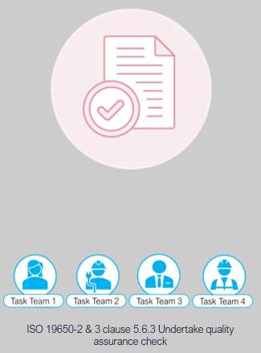

# Unit 9 - Lesson 2 - Undertake Quality Assurance Checks

*Lesson 2 of 3*

**Lesson Objectives**

> [!note] Audio transcript (00:15)
> Each task team shall undertake quality assurance check of each information container. Prior to review. Task teams should check information containers are in accordance with the project’s information production methods and procedures and also against the project's information standards.

## Undertake Quality Assurance Check

Both The information within the container and the container must be reviewed. The processes will satisfy clause 5.6.3:

- Check the TIDP for files to be produced at the work stage in question
- Check the information container aligns with the Project Information Standard
- Has the information container been produced in line with the Project Information Production Methods & Procedures
**Reject or Accept & proceed to 5.6.4**

> [!note] Audio transcript (01:16)
> Now, we move on to the check review approved process. The standards, methods and procedures dictate how elements of the quality assurance check should be undertaken. It does not check for accuracy but for compliance to the project's information standards, project information production methods and procedures etc. Both the information within the container and the container must be reviewed. The processes will satisfy clause 5.6.3, check the TIDP for files to be produced at the work stage in question, check the information container aligns with the project information standard with consideration given to naming, classification, status and revision codes. Has the information container been produced in line with the project information production methods and procedures? If OK, then mark is checked and accepted and proceed to 5.6.4. If not OK, reject and inform the author to undertake corrections. If documents are delivered in a structured format, checks can be automated. However, most are written in Word and delivered in PDF so automation is not possible. At the moment, most EIR documents are written in Word and delivered in PDF so they are not available as a structured data format. If they were, software would then be able to be checked more efficiently.
>
> Source: [Lesson 2 - Undertake Quality Assurance Checks - BIM ISO 19650 12 (1).mp3](unit-9-lesson-2-undertake-quality-assurance-checks/assets/Lesson 2 - Undertake Quality Assurance Checks - BIM ISO 19650 12 (1).mp3)

## Information Quality 

The check on the information is to ensure it meets the required quality, and typically  includes the following:

- Information formats
- Delivery formats
- Structure & Classification;
- Parameter Naming.

*(opens in a new tab)*

> [!note] Audio transcript (00:59)
> During the checking stage, the following things will be checked against. This activity will typically align with the appointed party's ISO 9001 quality management system. 1. Information formats, for example, IFC, will generally be used as it is the exchange format rather than a file type. 2. Delivery formats, for example, PDF, will generally be used as the record of documents issued because it is generally in a fixed format. 3. How the information model is broken down, as included with the BIM execution plan. 4. The classification which should be included within the project's information standards. 5. That the required properties, attributes and parameters are used. These should be listed within the project's information standards, that is, what are the naming conventions of these properties to deliver the structured information. 6. Celebrity model checker, for example, is great for this type of task.
>
> Source: [Lesson 2 - Undertake Quality Assurance Checks - BIM ISO 19650 12.mp3](unit-9-lesson-2-undertake-quality-assurance-checks/assets/Lesson 2 - Undertake Quality Assurance Checks - BIM ISO 19650 12.mp3)

Video Player is loading.Loaded: 59.67%1:160:48Remaining Time -0:301x2x1.75x1.5x1.25x1x, selected0.75x0.5x0.25xcaptions off, selectedThis is a modal window.

Video Player is loading.Loaded: 28.03%0:32Remaining Time -1:591x2x1.75x1.5x1.25x1x, selected0.75x0.5x0.25xcaptions off, selectedThis is a modal window.

## Learning Summary 

Lesson complete! You are now able to:

Understand the Undertaking of Quality Assurance Checks

**[CONTINUE]**

---
*Extracted from `Lesson 2 -_ Undertake Quality Assurance Checks - BIM ISO 19650 1&2 Project Delivery_ Unit 9 - Collaborative Production of Information.html` via webpage-content-extractor.*
## Ten-Question Analysis Framework

### 1. Problem
How does a task team perform rigorous internal verification of information containers to guarantee accuracy, coordination, and compliance before releasing them for sharing?

### 2. Applicability
- **Stage**: `collaborative-production` (ISO 19650-2 §5.6.2).
- **Roles**: Task Team Manager, [[appointed-party]], Quality Reviewer.
- **Key Documents**: QA/QC Checklists, Clash Detection Reports, Task QA Audit Records.

### 1. Process
1. Perform technical content checks: verify design calculations, spatial dimensions, and regulatory compliance.
2. Perform BIM standards checks: verify container naming, layer/category standards, and Uniclass classification.
3. Perform Level of Information Need (LOIN) verification against the TIDP requirements.
4. Execute automated internal clash detection and spatial coordination against recent Shared containers.
5. Verify alphanumeric data completeness (COBie parameters, manufacturer data).
6. Record QA check outcomes: if passed, authorize transition to Shared; if failed, issue corrective tasks within WIP.

### 4. Evidence
- Completed and signed Task Team QA Checklist (§5.6.2).
- Internal clash detection clearance report.
- Automated model check validation log (e.g. Solibri / Revizto report).

### 5. Principles
- **Author Accountability**: The task team that authors the information container is solely responsible for its internal quality and accuracy.
- **No Unchecked Sharing**: No container may transition from WIP to Shared without passing formal internal QA checks.
- **Defect Prevention**: Identifying and rectifying errors within WIP prevents pollution of the multidisciplinary shared environment.

### 6. Risks & Anti-patterns
- Treating QA checks as a rubber-stamping exercise without thorough inspection.
- Relying on the lead appointed party or client to find basic modeling defects.
- Skipping alphanumeric data validation and focusing solely on 3D visuals.

### 7. Operationalization
- Standardized Task Team QA Checklist with mandatory pass/fail gates.
- Rule-based automated model checking profiles (Solibri / Navisworks / Autodesk Construction Cloud).

### 8. Skill Test
Can this become a Skill?
**Yes** — Candidate: `task-qa-checker` / `model-qaqc-checklist-skill`. Audits model health, classification completeness, and geometric clashes against TIDP criteria.

### 9. Skill Design
- **Supported Role**: Task Team Lead / Discipline BIM Coordinator.
- **Trigger**: Completion of information generation prior to CDE state transition.
- **Output**: Task QA Inspection Certificate and Action Item Register.

### 10. Validation Plan
Run automated QA rule sets against delivery milestone sample files; measure rejected containers.

---

## Knowledge Space Links
- **Entities**: [[appointed-party]], [[task-information-delivery-plan]], [[project-information-standard]]
- **Concepts**: [[qa-qc-review-checks]], [[level-of-information-need]]
- **Methodologies**: [[undertake-qa-checks-method]]
