# Unit 9 - Lesson 3 - Submit, Review & Approve for Sharing

*Lesson 3 of 3*

**Lesson Objectives**

> [!note] Audio transcript (00:27)
> Following the successful quality assurance check of an information container, the task team undertakes a review of the information within the container. Moving along the cycle and whilst generating information, each task team are responsible for their respective TIDP and compliance with the project information production methods and procedures in mind. Once generated, the information will be checked, reviewed and approved against the expected deliverables.
>
> Source: [Lesson 3 - Submit Review Approve for Sharing - BIM ISO 19650 12 (1).mp3](unit-9-lesson-3-submit-review-approve-for-sharing/assets/Lesson 3 - Submit Review Approve for Sharing - BIM ISO 19650 12 (1).mp3)

## Information Review & Approval

Following the QA check and before approval each Task Team shall review the information generated considering the following:

- EIR, including Methods & Procedures
- Level of Information Need
- Other task team’s information requirements for coordination
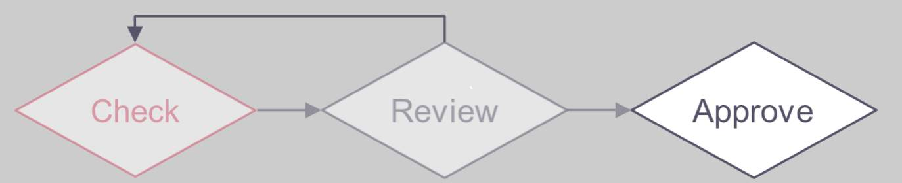

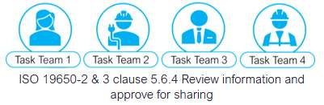

> [!note] Audio transcript (01:09)
> Following the checks, the next stage is to review and approve the information for sharing within the project's CDE. One, the Project Information Production Methods and Procedures should dictate how elements of the approval process should be undertaken. Each task team to check against the Revit, EIRs, BEP, Project Information Production Methods and Procedures, ensuring metadata integrity, coordination and file formats. Two, review level of information need against the requirements of the detailed responsibility matrix. While information will be considered verified if it meets the lead appointed party's EIR, if it is intended to be used by other task teams, then additional information may be required for coordination. Three, ensure any outstanding issues or information requirements raised have been addressed. Four, visual checks whilst working on the project on a day to day basis should be carried out and any coordination issues recorded and escalated accordingly. The QA checks should take place on the information container itself, as well as the information within it, in terms of naming, status, revision, classification.
>
> Source: [Lesson 3 - Submit Review Approve for Sharing - BIM ISO 19650 12 (5).mp3](unit-9-lesson-3-submit-review-approve-for-sharing/assets/Lesson 3 - Submit Review Approve for Sharing - BIM ISO 19650 12 (5).mp3)

## Information Approval

If the review is successful, the Task team shall:

- **Assign an appropriate suitability code**
defining the information container use. Status codes the U.K are typically applied according to **Table NA.2** (If specified in the Projects Information Standards)

- **Approve for sharing**
Move from WIP and Upload into the Shared area of the CDE

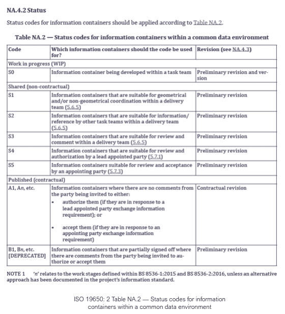

## Status Codes

ISO 19650: 2 Table NA.2 — Status codes for information containers within a CDE

The Status code defines the ‘suitability’ of information

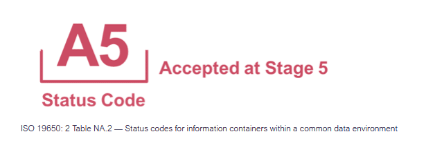

> [!note] Audio transcript (01:51)
> Status codes are used with the revision code to identify the suitability of deliverables. The reason for these codes was that people would not issue information because they were worried that it would be used for the wrong purposes and that they would be liable for a particular use. For example, an architect reluctant to issue a drawing to contractors in fear of them being built from when they were not ready. This use of suitability is key to removing this blocker. When deliverables are exchanged, they are done so to provide a particular set of information to complete a task. For example, deliverables that are exchanged for others to reference their geometry are done so as S1, suitable for coordination. An important status code is S0, which is for work in progress. If there is a file with an S0 code in an organization's work in progress area from another organization in the project team, there is a massive problem. These deliverables are likely to be used as a reference file. This deliverable will have the correct geometry, but may not have any performance or other information attached, so it will not be suitable for uses that require this information. By issuing this file at S1, it is telling the other members of the project team that the information contained within is only suitable for that function. Status codes are structured as a single digit number with a prefix letter. When files are accepted, they are given an A for accepted and are given the number of the stage they were accepted at. For example, deliverables created during stage 5 to be used for the construction of the asset should be issued as A5. A for accepted and 5 for stage 5, build and commission. This convention follows the contractual requirement developed in JCT contracts of using A, B and C to indicate whether a deliverable has been accepted or rejected.
>
> Source: [Lesson 3 - Submit Review Approve for Sharing - BIM ISO 19650 12 (2).mp3](unit-9-lesson-3-submit-review-approve-for-sharing/assets/Lesson 3 - Submit Review Approve for Sharing - BIM ISO 19650 12 (2).mp3)

## CDE Status Codes

![S0 these status codes relate to each shared state and specific codes only apply to certain states:S0 in Work in ProgressCheck, Review, Approve processS1, S2, S3 and S4 in SharedReview, Authorize and AcceptThis is then archivedAn in PublishedThis is then archived, so all status except S0 will be in the archive.The National Annex within ISO 19650-2 provides standardised status codes for the UK. They are as follows:Work In Progress (WIP)S0: initial statusShared (non-contractual)S1: suitable for coordinationS2: suitable for informationS3: suitable for review and commentS4: suitable for stage approvalS5: currently withdrawn and not in useS6: suitable for PIM authorisationS7: suitable for AIM authorisationPublished (contractual)A1, A2, An, etc.: authorised and accepted (contractual revision)B1, B2, Bn, etc.: partial sign-off with comments (preliminary revision)Published (for AIM acceptance)CR: as constructed record document (contractual revision)](unit-9-lesson-3-submit-review-approve-for-sharing/assets/XWWkJy26Gb-Vjgqz_lFHFMOvzBtNp-snI.png)

*S0 these status codes relate to each shared state and specific codes only apply to certain states:
S0 in Work in Progress
Check, Review, Approve process
S1, S2, S3 and S4 in Shared
Review, Authorize and Accept
This is then archived
An in Published
This is then archived, so all status except S0 will be in the archive.
The National Annex within ISO 19650-2 provides standardised status codes for the UK. They are as follows:
Work In Progress (WIP)S0: initial status
Shared (non-contractual)S1: suitable for coordinationS2: suitable for informationS3: suitable for review and commentS4: suitable for stage approvalS5: currently withdrawn and not in useS6: suitable for PIM authorisationS7: suitable for AIM authorisation
Published (contractual)A1, A2, An, etc.: authorised and accepted (contractual revision)B1, B2, Bn, etc.: partial sign-off with comments (preliminary revision)
Published (for AIM acceptance)
CR: as constructed record document (contractual revision)*

## Revision Codes

**ISO 19650: 2 NA.4.3** Revision Codes for information containers within a CDE

**Revision:** Used to identify revisions container
**Sub-indexing:** Used to show the development of the information container

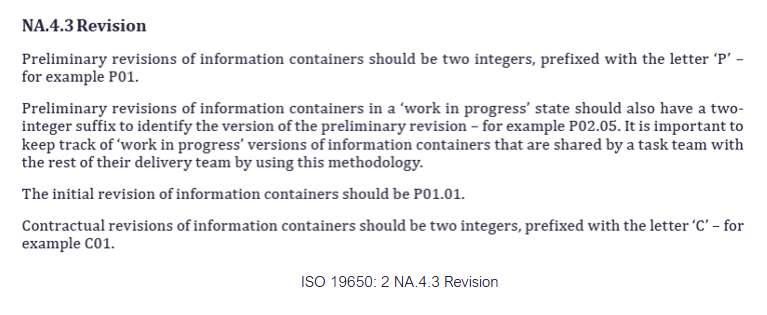

> [!note] Audio transcript (00:45)
> Revision codes are used to identify revisions of documents, drawing and model files. To comply with ISO 9650, all revisions shall be a two-digit number, prefixed with a P if it is a preliminary issue, and C if it is a contractual issue. For example, shown is the revision code used for the first preliminary issue of a deliverable. All deliverables begin at revision P01. In addition, while deliverables are within the work-in-progress state, they are also given a version represented as a decimal. For example, shown is the first version. Versions are removed when deliverables are approved for issue. This means that if any deliverables have a version in the common data environment, they should be used at risk as they have not been formally checked, reviewed and approved.
>
> Source: [Lesson 3 - Submit Review Approve for Sharing - BIM ISO 19650 12.mp3](unit-9-lesson-3-submit-review-approve-for-sharing/assets/Lesson 3 - Submit Review Approve for Sharing - BIM ISO 19650 12.mp3)

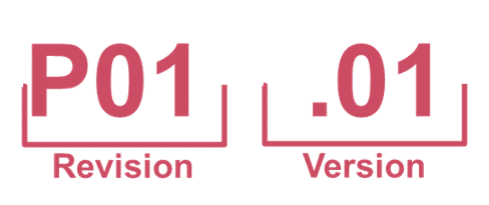

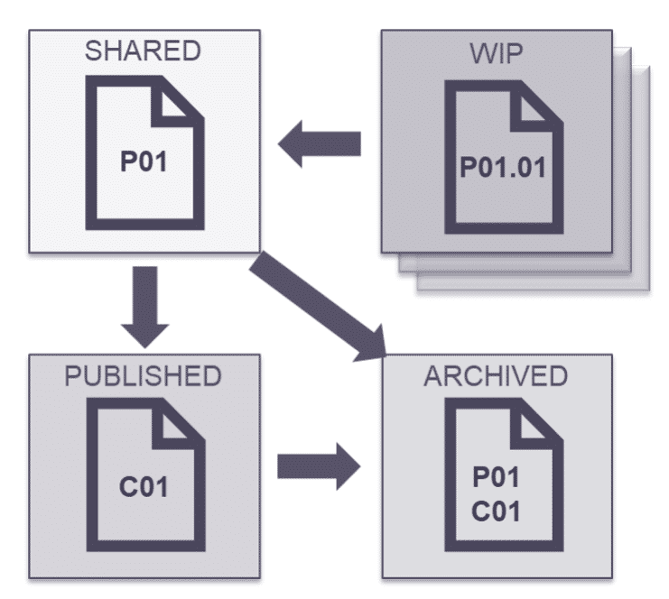

> [!note] Audio transcript (00:24)
> Here we can see where in the CDE states each type of revision code can be used, and where specific codes only apply to certain states. 0101 revision with a version in Work in progress, preliminary or POI, etc. In shared, contractual or COI, etc. In published, and then any would be in archive state with the exception of versions.

## Information Rejection

If the information is not approved, and the review is unsuccessful the task team shall do the following:

- **List reasons why**
- **List amendments required**
- **Reject the container**
A record should be made of why the review was unsuccessful plus any amendments that need to be made to the information by the task team.

**It is recommended to use a digital project issue tracker for this .**

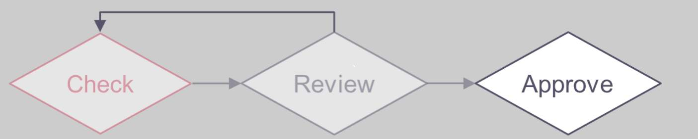

## Information Model Review

Once shared, a project level, delivery team review shall be carried out to facilitate the continuous coordination, including:

- The relevant Exchange Information Requirements (EIR) and acceptance criteria
- The Master Information Delivery Plan (MIDP)
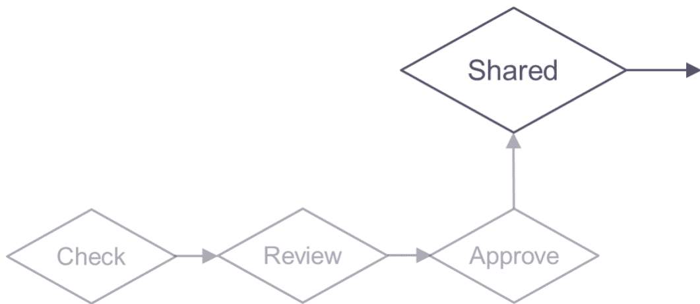

> [!note] Audio transcript (01:08)
> The lead appointed party shall facilitate regular information model reviews, with the delivery team checking against the TIDP and MIDP, and typically federating the models and undertaking clash detection during regular coordination workshops. Once shared, a project level review should be carried out, depending on suitability, to facilitate the continuous coordination of information across the informational model, including the relevant exchange information requirements, EIR, the lead appointed party exchange information requirements document the frequency of information exchange necessary at the various work stages, defined within milestone dates. Also, a review should be based on the appointing party's acceptance criteria. The master information delivery plan, MIDP. The lead appointed party shall check the information containers against the MIDP and respective TIDPs for compliance. Any missing information will be documented in the risk register. As with the information model, each information container is being reviewed in a holistic manner. The information production methods and procedures may dictate how elements of the review process should be undertaken.
>
> Source: [Lesson 3 - Submit Review Approve for Sharing - BIM ISO 19650 12 (3).mp3](unit-9-lesson-3-submit-review-approve-for-sharing/assets/Lesson 3 - Submit Review Approve for Sharing - BIM ISO 19650 12 (3).mp3)

## Coordination Reviews

Delivery teams should undertake regular BIM coordination workshops and also consider wider aspects of project processes.

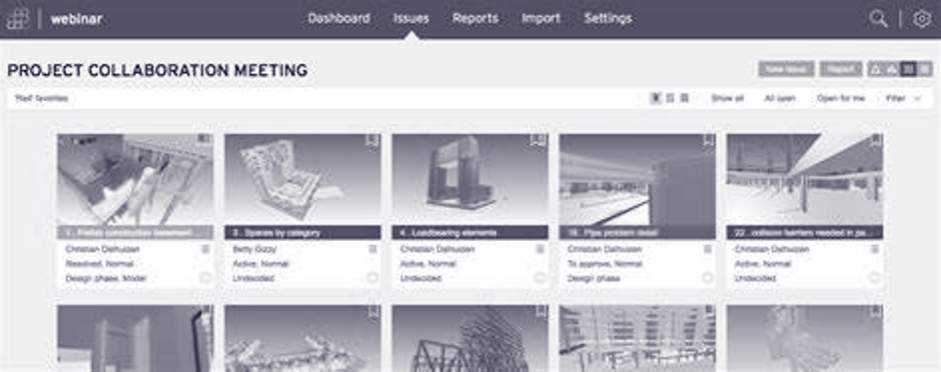

> [!note] Audio transcript (01:28)
> Delivery teams should plan and undertake regular information model reviews, often called BIM Coordination Workshops, to ensure coordination of the delivery team's information model. The lead appointed party will typically be responsible for downloading shared models and federating into a single clash model in software such as Navisworks, Revitso, Celebri or BIM CoLab to name just a few. Once the models have been federated, the lead appointed party shall use the agreed clash list to define the clash type and tolerances to undertake the clash detection process. Tolerances typically become more accurate as the project stage is developed and should be defined in the delivery team BEP. Typical standard clashes that take place on the majority of projects include architectural windows and doors versus steelwork, structural framing versus MEP, structure versus roof, ceilings versus ducts. Clashes can be distributed via traditional report format or web-based collaboration platforms as previously shown. Clashes are typically grouped and assigned a responsibility to a task team member to resolve. Some platforms offer the ability to assign a priority also. Regular coordination should take place to resolve the issues, typically every two weeks for example. The frequency of these meetings is typically set within the BIM execution plan. Any clashes that are not resolved should be logged in the information risk register.
>
> Source: [Lesson 3 - Submit Review Approve for Sharing - BIM ISO 19650 12 (4).mp3](unit-9-lesson-3-submit-review-approve-for-sharing/assets/Lesson 3 - Submit Review Approve for Sharing - BIM ISO 19650 12 (4).mp3)

Video courtesy of BIM Collab.

BIM Collab Zoom is a great piece of cloud based software for BIM coordination and clash issue management via BCF.

Video courtesy of Autodesk Building Solutions.

Model Coordination with Navisworks and BIM 360

Other popular software such as Navisworks and BIM 360 have now combined to create BIM 360 Model coordination within the cloud based CDE that hosts the BIM models. This means the coordination workshops can effectively take place virtually and constantly via the web.

## Collaborative Production of Information Activities 

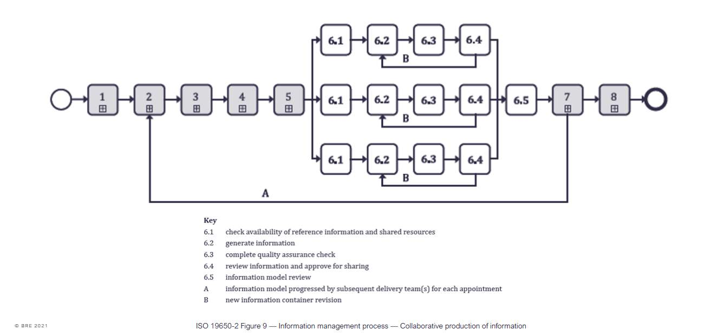

*ISO 19650-2 Figure 9 — Information management process — Collaborative production of information*

## Learning Summary 

Lesson complete! You are now able to:

Understand the review of the information within the container.

**Unit 9 Complete!
**

You may now close the window and complete this module.

---
*Extracted from `Lesson 3 -_ Submit, Review & Approve for Sharing - BIM ISO 19650 1&2 Project Delivery_ Unit 9 - Collaborative Production of Information.html` via webpage-content-extractor.*
## Ten-Question Analysis Framework

### 1. Problem
How does a delivery team govern the formal transition of information containers through CDE states (WIP -> Shared -> Published), tracking revisions and assigning suitability status codes?

### 2. Applicability
- **Stage**: `collaborative-production` (ISO 19650-2 §5.6.3, §5.6.4, §5.6.5).
- **Roles**: Task Team Manager, [[lead-appointed-party]], CDE Administrator.
- **Key Documents**: CDE Status Codes Table (S0-S7, A1-A4, B1-B4), National Annex Revision Codes (P01.01 -> P01 -> C01).

### 3. Process
1. Upon successful internal QA, assign appropriate **Suitability / Status Code** (e.g., `S1` - Suitable for Coordination, `S2` - Suitable for Information).
2. Update metadata revision code from preliminary internal draft (`P01.01`) to preliminary shared (`P01`).
3. Submit information container into the CDE **Shared** state.
4. Lead Appointed Party coordinates and reviews shared containers across disciplines (coordination checks, federated model review).
5. Appointing party / lead party conducts authorization review for client decision points or regulatory submissions.
6. Upon formal authorization, container is assigned contractual status code (e.g. `A1`) and transitions to **Published** state.

### 4. Evidence
- CDE container audit history showing state transitions (WIP -> Shared -> Published) with timestamps (§5.6.3).
- Assigned standard status codes (`S1`, `S2`, `S3`, `S4`, etc.) and revision identifiers (`P01`, `C01`).
- Multi-disciplinary clash coordination sign-off notes in CDE/BCF platform.

### 5. Principles
- **Suitability Governs Use**: Information must only be used in accordance with its declared status code (e.g., do not build from an `S1` container).
- **Strict Revision Discipline**: Decimal revisions (`P01.01`) for unshared WIP work; integer revisions (`P01`) for Shared; contractual revisions (`C01`) for Published.
- **Collaborative Federation**: The Shared state exists specifically for interdisciplinary coordination and development.

### 6. Risks & Anti-patterns
- Using arbitrary, non-standard status codes (e.g. "Draft", "Final", "For Review") violating ISO 19650 National Annex conventions.
- Constructing physical works using containers in the Shared state rather than Published state.
- Bypassing the CDE and sharing unapproved models via email or file transfers.

### 7. Operationalization
- Automated CDE workflow rule engine enforcing status codes and revision increments upon upload.
- Container metadata validation script rejecting non-compliant file uploads.

### 8. Skill Test
Can this become a Skill?
**Yes** — Candidate: `cde-status-revision-validator`. Evaluates container filenames, metadata tags, suitability codes, and revision syntax.

### 9. Skill Design
- **Supported Role**: CDE Administrator / Information Manager.
- **Trigger**: Container submission to CDE Shared or Published gates.
- **Output**: CDE Transition Verification Log with rejection reasons if non-compliant.

### 10. Validation Plan
Audit CDE repository logs to ensure 100% compliance with ISO 19650 status and revision conventions.

---

## Knowledge Space Links
- **Entities**: [[common-data-environment-protocol]], [[lead-appointed-party]], [[appointed-party]]
- **Concepts**: [[cde-sharing-approval-workflow]], [[cde-solution-architecture]]
- **Methodologies**: [[submit-review-approve-sharing-method]]
